# 用 Python 建模新冠肺炎疫情

> 原文：<https://towardsdatascience.com/modeling-covid-19-epidemic-with-python-bed21b8f6baf?source=collection_archive---------9----------------------->


由于意大利目前实行的国家封锁，这个周末我不得不呆在家里，就像世界上数十亿其他人一样。所以，我决定利用这段时间来研究意大利新冠肺炎大流行的数据，这些数据是由意大利民防部门每天发布的。

在这篇文章中，我将展示如何检查数据，在图表上表示数据，并用 Python 建模未来趋势，使用一些开源数据科学库，如`Pandas`、`Matplotlib`和`Scikit-learn`。

我真的很感谢民防部门在不同规模(国家、地区和省级)发布每日数据所做的努力，特别是通过他们的官方 [GitHub 知识库](https://github.com/pcm-dpc/COVID-19)以机器可读的格式发布这些数据。像往常一样，开放数据方法促进了科学合作，丰富了合作研究，并可以提高集体分析能力，最终为决策提供信息。

这项工作是在 macOS 上用 Python-3.7.1 开发的，它受到了我在网上找到的类似论文的启发。完整版本的代码可以在我的 [GitHub 库](https://github.com/Andrampa/covid_analysis/blob/master/Modeling_COVID19_epidemic_with_Python.ipynb)上找到。

将提议的方法应用于与其他受 COVID 影响的国家相关的数据集将是有趣的，例如[西班牙](https://github.com/datadista/datasets/tree/master/COVID%2019)或[法国](https://github.com/opencovid19-fr/data)。

## 安装必要的库

本教程中使用的模块没有附带标准的 Python 发行版。要使用这些第三方模块，我们必须安装它们。

```
pip install pandas matplotlib scikit-learn
or
conda install -c anaconda pandas matplotlib scikit-learn
```

## 导入数据和提取字段

首先，我们导入所有必要的库，然后我们从 Civil Protection GitHub 帐户导入最新版本的意大利 COVID 数据集，并将其存储在一个 *Pandas* *数据框*中。然后，我们探索该表的结构，以便对变量有一个更清晰的看法，并最终确定我们应该考虑的流行病建模。

```
import pandas as pd
from datetime import datetime, timedelta
import matplotlib.pyplot as plt
from matplotlib.dates import DateFormatter
import matplotlib.dates as mdatesdata = pd.read_csv(“[https://raw.githubusercontent.com/pcm-dpc/COVID-19/master/dati-andamento-nazionale/dpc-covid19-ita-andamento-nazionale.csv](https://raw.githubusercontent.com/pcm-dpc/COVID-19/master/dati-andamento-nazionale/dpc-covid19-ita-andamento-nazionale.csv)")print (data.columns)
```

我们获得了数据帧中包含的所有字段的列表。

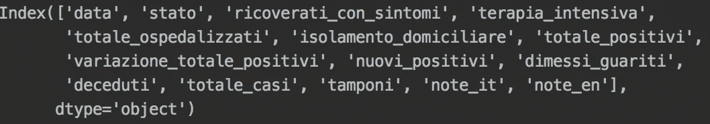

特别是，`deceduti`和`tamponi`分别报告了自危机开始以来记录的死亡和医学拭子(检验)的累计人数。为了计算这两个变量的每日增量，我们运行一个简单的 pandas 函数，并将输出保存到两个新字段中:`diff_deceduti`和`diff_tamponi`。然后，我们创建一个包含所有日期的列表，并将它们从`string` 转换成更合适的`datetime`格式。

```
data[‘diff_deceduti’] = data[‘deceduti’].diff()
data[‘diff_tamponi’] = data[‘tamponi’].diff()
dates = data[‘data’]
date_format = [pd.to_datetime(d) for d in dates]
```

## 可视化数据

我们现在准备创建我们的第一个散点图，并显示直观上看起来似乎对估计疫情进展最重要的变量:每日新增阳性病例数(`nuovi_positivi`)。

```
variable = ‘nuovi_positivi’
fig, ax = plt.subplots(figsize=(12, 5))
ax.grid()
ax.scatter(date_format,data[variable])
ax.set(xlabel=”Date”,ylabel=variable,title=variable)
date_form = DateFormatter(“%d-%m”)
ax.xaxis.set_major_formatter(date_form)
ax.xaxis.set_major_locator(mdates.DayLocator(interval = 3))
fig.savefig(variable + ‘.png’)
plt.show()
```

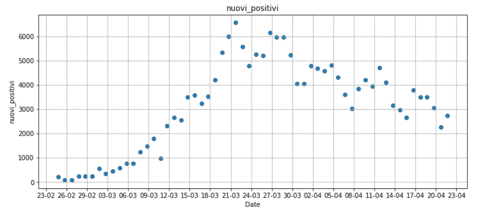

上面的图中有一个重复出现的模式，这是由每个周末后发生的异常现象给出的:似乎疫情在周一和周二放缓。这是因为在周末(以及一般的公共假日，如复活节后的星期一)处理的拭子数量要少得多。

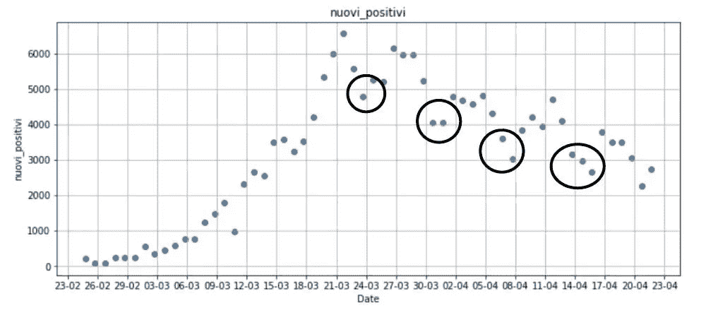

## 纠正偏见

纠正这种系统性偏差的一种可能方法是计算移动平均值，这种方法通常用于通过计算整个数据集不同子集的平均值来分析时间序列，在我们的例子中是 7 天。

通过对第一个 7 天的子集进行平均来计算第一个移动平均值，然后通过向前移动**到下一个固定子集来改变子集，以此类推。总的来说，移动平均线平滑了数据，减少了像周末偏差这样的异常。**

```
rolling_average_days = 7data[‘nuovi_positivi_moving’] = data[‘nuovi_positivi’].rolling(window=rolling_average_days).mean() variable = ‘nuovi_positivi_moving’
fig, ax = plt.subplots(figsize=(12, 5))
ax.grid()
ax.scatter(date_format,data[variable])
ax.set(xlabel=”Date”,ylabel=variable,title=variable)
date_form = DateFormatter(“%d-%m”)
ax.xaxis.set_major_formatter(date_form)
ax.xaxis.set_major_locator(mdates.DayLocator(interval = 3))
fig.savefig(variable + ‘.png’)
plt.show()
```

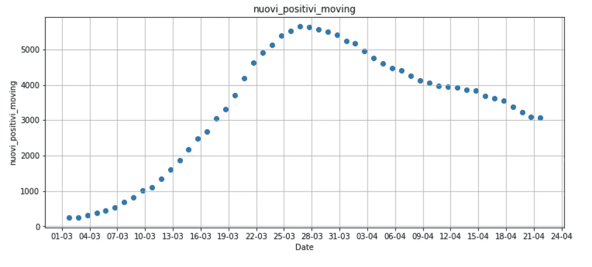

上图显示了 7 天内新病例的平均趋势，掩盖了周末的异常情况。然而，每天检测的拭子数量的影响还没有完全补偿。显然，阳性病例的数量与所进行的检测数量密切相关。让我们来看看在意大利进行的日常测试的趋势(`tamponi`):

```
data['diff_tamponi_moving'] = data['tamponi'].diff().rolling(window=rolling_average_days).mean()variable = 'diff_tamponi_moving'
fig, ax = plt.subplots(figsize=(12, 5))
ax.grid()
ax.scatter(date_format,data[variable])
ax.set(xlabel="Date",ylabel=variable,title=variable)
date_form = DateFormatter("%d-%m")
ax.xaxis.set_major_formatter(date_form)
ax.xaxis.set_major_locator(mdates.DayLocator(interval = 3))
fig.savefig(variable + '.png')
plt.show()
```

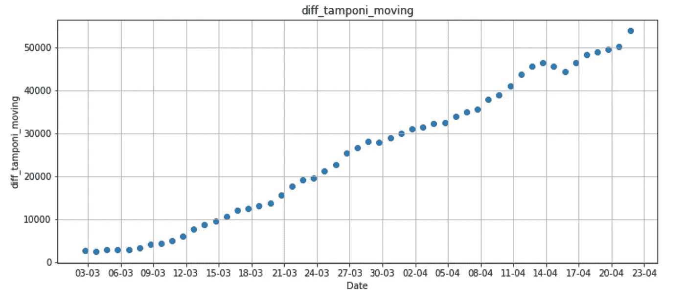

我们的怀疑得到了证实:在我们的时间序列结束时，每日拭子的数量比开始时高出约 20 倍，因此变量`nuovi_positivi`正遭受这一重要偏差。为了找到一个更有代表性的趋势，我们现在计算新阳性在总的每日测试中的百分比，并检查随时间的变化。

```
data[‘perc_positive’] = ((data[‘nuovi_positivi_moving’])/(data[‘diff_tamponi_moving’])*100)variable = ‘perc_positive’
fig, ax = plt.subplots(figsize=(12, 5))
ax.grid()
ax.scatter(date_format,data[variable])
ax.set(xlabel=”Date”,ylabel=variable,title=variable)
date_form = DateFormatter(“%d-%m”)
ax.xaxis.set_major_formatter(date_form)
ax.xaxis.set_major_locator(mdates.DayLocator(interval = 3))
fig.savefig(variable + ‘.png’)
plt.show()
```

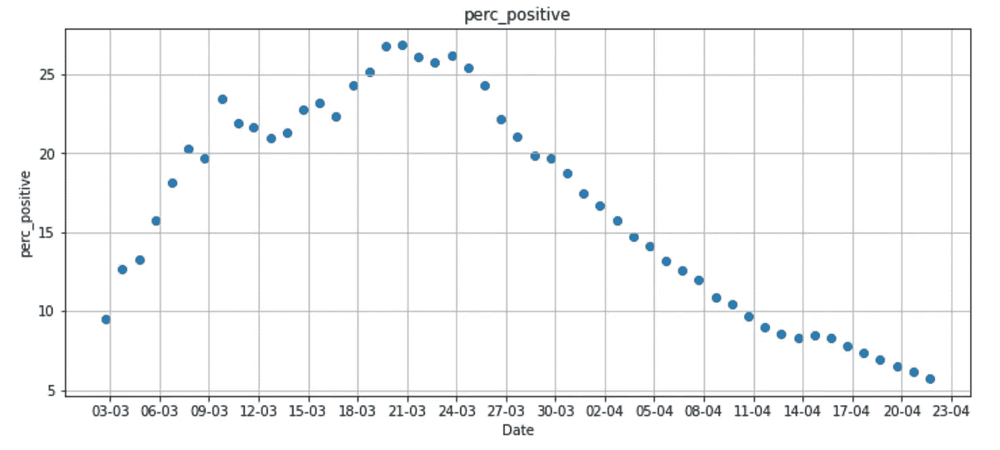

衍生变量`perc_positive`提供了更可靠的疫情进展表示，因为它修正了之前确定的两个系统性偏差:周末波动和测试总数。不幸的是，仍然有几个未考虑的因素破坏了这一分析的有效性。仅提及其中的一些:随着时间的推移，检测程序发生了相当大的变化，从仅检测严重症状的患者到在特定地区对整个人群进行大规模检测，并且拭子方法因地区而异。此外，关于新阳性病例的数据可以参考前几天进行的测试，从 1 天到 7 天。让事情变得更加复杂的是，一些患者也可以进行多次测试，但我们无法从数据集中检测到这一点。由于这些和其他原因，`perc_positive`还不是我们建模流行趋势和最终预测其演变所需的变量。

我们还应该进一步检查其他重要的领域:特别是，让我们仔细看看`terapia_intensiva` 和`diff_deceduti`(分别是重症监护和每日死亡)。

```
variable = ‘terapia_intensiva’
fig, ax = plt.subplots(figsize=(12, 5))
ax.grid()
ax.scatter(date_format,data[variable])
ax.set(xlabel=”Date”,ylabel=variable,title=variable)
date_form = DateFormatter(“%d-%m”)
ax.xaxis.set_major_formatter(date_form)
ax.xaxis.set_major_locator(mdates.DayLocator(interval = 3))
fig.savefig(variable + ‘.png’)
plt.show()variable = ‘diff_deceduti’
fig, ax = plt.subplots(figsize=(12, 5))
ax.grid()
ax.scatter(date_format,data[variable])
ax.set(xlabel=”Date”,ylabel=variable,title=variable)
date_form = DateFormatter(“%d-%m”)
ax.xaxis.set_major_formatter(date_form)
ax.xaxis.set_major_locator(mdates.DayLocator(interval = 3))
fig.savefig(variable + ‘.png’)
plt.show()
```

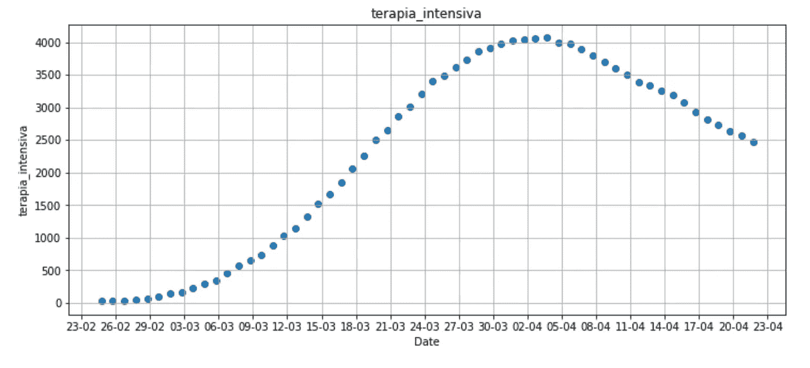

如上图所示，目前接受重症监护的患者数量似乎遵循一个更有规律的趋势。事实上，它指的是一个容易衡量的信息，不受抽样方法或每周波动的影响。当然，它并不完美，因为它也容易被低估，尤其是在危机最严重的时候，那时医疗系统压力很大，医院已经饱和。但是在这个关键阶段之后，它应该能很好地反映出受病毒影响最严重的患者人数。然而，我们可能还遗漏了一些东西:我们能肯定重症监护数量的减少总是与情况的改善相对应吗？事实上，由于每天死亡人数的增加，这一数字可能正在下降。

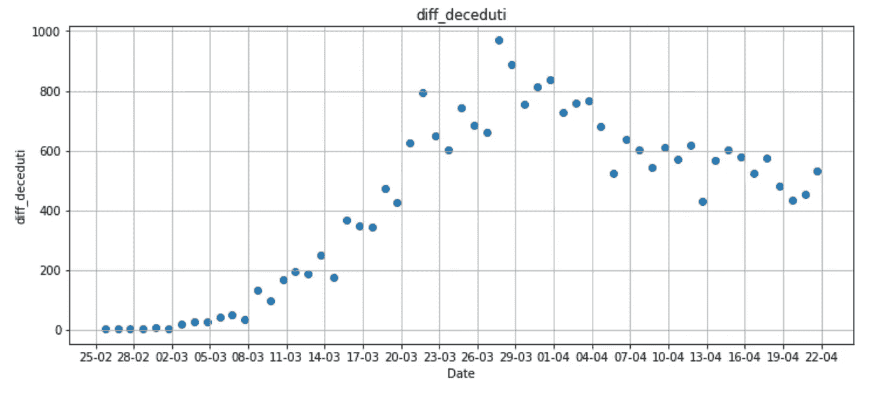

上面的图表显示，每天的死亡人数一直在增加，直到 3 月 28 日，然后它开始以较慢的速度下降。

## 为模型创建派生变量

本文的主要假设是重症监护和每日死亡的综合价值可以作为估计当前流行病进展和模拟未来趋势的可靠变量。让我们创建一个新的字段`gravi_deceduti`，计算每天死亡的重度抑郁患者的总数，并绘制结果值。

```
data[‘gravi_deceduti’] = data[‘diff_deceduti’] + data[‘terapia_intensiva’]variable = 'gravi_deceduti'
fig, ax = plt.subplots(figsize=(12, 5))
ax.grid()
ax.scatter(date_format,data[variable])
ax.set(xlabel="Date",ylabel=variable,title=variable)
date_form = DateFormatter("%d-%m")
ax.xaxis.set_major_formatter(date_form)
ax.xaxis.set_major_locator(mdates.DayLocator(interval = 3))
ax.axvline(datetime(2020, 4, 1), c="green", zorder=0)
fig.savefig(variable + '.png')
plt.show()
```

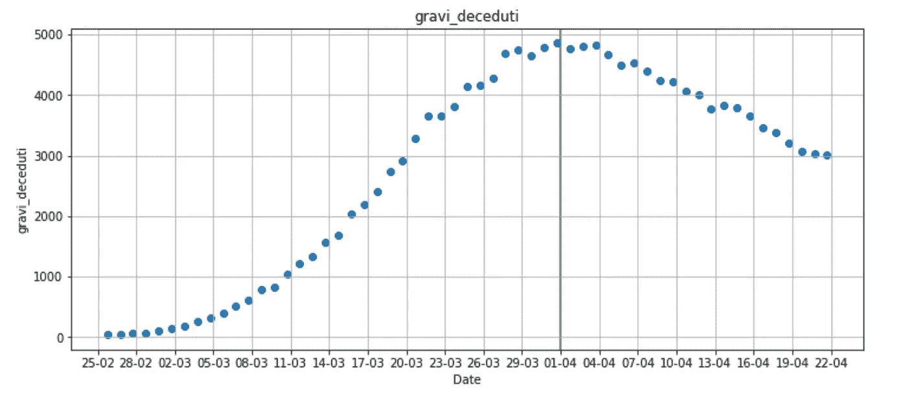

我们解释了`terapia_intensiva` 和`diff_deceduti`如何不遭受重大系统偏倚，以及后者如何在每日死亡增加的情况下补偿前者。这两个变量的组合现在可以用于模拟意大利的疫情趋势，因为这一得出的数字较少受到系统性偏差的影响。我们在图表上添加了一条绿线，以突出显示高峰日，这是下降趋势开始的点。

## 流行病趋势建模

我们现在可以建立一个线性回归模型，并用从 4 月 1 日开始的`gravi_deceduti`的数据对其进行训练。

线性回归是监督学习中最流行的经典机器学习算法之一。当协变量和响应变量之间的关系是线性的(在我们的例子中:date VS `gravi_deceduti`)时，这种算法相对容易实现并且工作良好。一个明显的缺点是线性回归简化了许多现实世界的问题。

下面的代码改编自安婕莉卡·洛·杜卡在 3 月 31 日所做的部分工作，她试图用阳性病例的数量来模拟疫情。

首先我们从`sklearn`模块导入`linear_model`。然后，我们从`X`和`y`中排除 4 月 1 日记录的流行高峰之前的所有数据，并用`X`和`y`拟合`LinearRegression`模型。最后，我们通过运行函数`score()`来评估模型，该函数返回预测的决定系数 R(从自变量可预测的因变量中方差的比例)。r 会给出一些关于模型的[拟合优度](https://en.wikipedia.org/wiki/Goodness_of_fit)的信息。在回归中，R 决定系数是回归预测与真实数据点接近程度的统计度量。R 为 1 表示回归预测完全符合数据，因此值越接近 1，我们就越信任我们的模型。

```
import numpy as np
from sklearn import linear_model
# prepare the lists for the model
X = date_format
y = data['gravi_deceduti'].tolist()[1:]
# date format is not suitable for modeling, let's transform the date into incrementals number starting from April 1st
starting_date = 37  # April 1st is the 37th day of the series
day_numbers = []
for i in range(1, len(X)):
    day_numbers.append([i])
X = day_numbers
# # let's train our model only with data after the peak
X = X[starting_date:]
y = y[starting_date:]
# Instantiate Linear Regression
linear_regr = linear_model.LinearRegression()
# Train the model using the training sets
linear_regr.fit(X, y)
print ("Linear Regression Model Score: %s" % (linear_regr.score(X, y)))
```

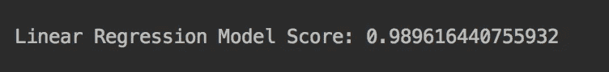

## 预测未来趋势

既然我们已经拟合了模型并积极评估了它的 R 值，我们就可以预测`gravi_deceduti`未来的演化了。为了做到这一点，我们调用函数`predict()`，并且我们用函数`max_error()`跟踪模型的最大误差。使用该值，我们将创建两条线来描述容差缓冲区，包括模型预测的最小和最大误差。

```
# Predict future trend
from sklearn.metrics import max_error
import math
y_pred = linear_regr.predict(X)
error = max_error(y, y_pred)
```

这个模型现在已经可以预测接下来几天的`gravi_deceduti`了。我们定义了一个变量`X_test`，它包含了过去和未来的日子。我们还创建了变量`future_days`,它包含我们想要估计流行趋势的天数。然后我们将我们的模型应用到`X_test`。

```
X_test = []
future_days = 55
for i in range(starting_date, starting_date + future_days):
    X_test.append([i])
y_pred_linear = linear_regr.predict(X_test)
```

变量`y_pred_linear`包含未来 55 天的预测`gravi_deceduti`。为了考虑模型产生的误差，我们分别定义包含`y_pred + error`和`y_pred - error`的`y_pred_max`和`y_pred_min`。

```
y_pred_max = []
y_pred_min = []
for i in range(0, len(y_pred_linear)):
    y_pred_max.append(y_pred_linear[i] + error)
    y_pred_min.append(y_pred_linear[i] - error)
```

## 绘制预测图

我们有三个输出变量准备显示在图表上:`y_pred`、`y_pred_max`和`y_pred_min`，分别包含预测、最大误差和最小误差。为了让情节更吸引人，我们应该将数字(由`X_test`变量表示)转换成日期。

```
# convert date of the epidemic peak into datetime format
from datetime import datetime, timedelta
date_zero = datetime.strptime(data['data'][starting_date], '%Y-%m-%dT%H:%M:%S')
# creating x_ticks for making the plot more appealing
date_prev = []
x_ticks = []
step = 5
data_curr = date_zero
x_current = starting_date
n = int(future_days / step)
for i in range(0, n):
    date_prev.append(str(data_curr.day) + "/" + str(data_curr.month))
    x_ticks.append(x_current)
    data_curr = data_curr + timedelta(days=step)
    x_current = x_current + step
```

现在，我们可以将已知数据与预测和误差线一起绘制出来

```
# plot known data
plt.grid()
plt.scatter(X, y)
# plot linear regression prediction
plt.plot(X_test, y_pred_linear, color='green', linewidth=2)
# plot maximum error
plt.plot(X_test, y_pred_max, color='red', linewidth=1, linestyle='dashed')
#plot minimum error
plt.plot(X_test, y_pred_min, color='red', linewidth=1, linestyle='dashed')
plt.xlabel('Days')
plt.xlim(starting_date, starting_date + future_days)
plt.xticks(x_ticks, date_prev)
plt.ylabel('gravi_deceduti')
plt.yscale("log")
plt.savefig("prediction.png")
plt.show()
```

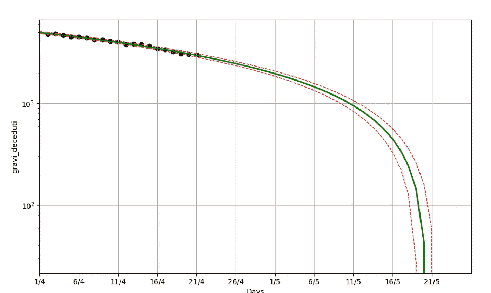

## 区域趋势

上述分析是在国家基础上处理意大利新冠肺炎疫情，但众所周知，*伦巴第*、*皮埃蒙特*、*威尼托*和*艾米利亚-罗马涅*地区受到的影响比其他地区更严重。为了对此进行量化，我们可以检查由民事保护局提供的区域新冠肺炎数据集，并计算这些区域(我们称之为*区域 1* )中登记的死亡比例

```
data = pd.read_csv("https://raw.githubusercontent.com/pcm-dpc/COVID-19/master/dati-regioni/dpc-covid19-ita-regioni.csv")
zone1_df = data[data.denominazione_regione.isin(['Piemonte','Emilia-Romagna','Veneto','Lombardia'])]
zone1_df['deceduti'].sum()
print("Zone 1 accounts for %s percent of the total deaths" % (round(zone1_df['deceduti'].sum() / data['deceduti'].sum() * 100,2)))
```

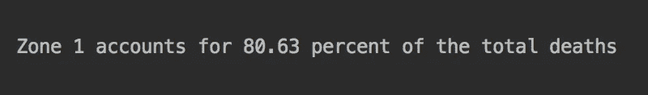

如果仅仅这 4 个地区(20 个地区中的)就占了总死亡人数的 80%以上，那么用一个单一的模型来预测整个国家的趋势就是一种严重的过度简化。事实上，不同地区的情况差异很大，如下图所示。

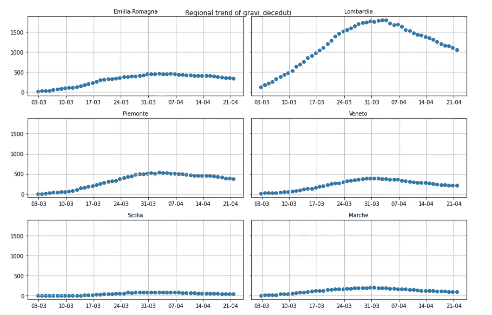

对于每个地区，应采用不同的模型，以便更好地了解该国不同地区的流行趋势。考虑到民防部门也提供省级的[数据，有可能对情况进行更好的建模。](https://github.com/pcm-dpc/COVID-19/tree/master/dati-province)

## 结论

我们的模型告诉我们，如果目前的趋势持续下去，新冠肺炎疫情将于 2020 年 5 月 19 日至 22 日在 T2 结束。

除了地区差异，我们还必须考虑到任何新的外部因素都可能改变疫情的有效趋势。目前的模型无法考虑系统中的意外变化，如封锁限制的逐渐放松，或温度上升对病毒传播的影响。

[在我的下一篇文章](/modeling-and-mapping-regional-covid-19-trends-with-python-89f4415300f7)中，我将分别为每个地区创建不同的模型，并将代码上传到我的 GitHub 库[上](https://github.com/Andrampa/covid_analysis/blob/master/Modeling_COVID19_epidemic_with_Python.ipynb)。