# 作物保险索赔建模

> 原文：<https://towardsdatascience.com/modeling-crop-insurance-claims-5c8d8a99b126?source=collection_archive---------36----------------------->

## 作物保险概述和损失率建模

这篇文章概述了美国联邦农作物保险公司通过私人公司网络提供的农作物保险项目。我们回顾了该计划在过去二十年中的演变，并提出了一种模拟损失负债比的方法。我们表明，威布尔分布提供了一个合理的选择，以模拟 0%至 100%的责任水平之间的损失支付，这一发现与先前对保险索赔建模的研究相一致。

塞尔吉奥·索萨在 [Unsplash](https://unsplash.com?utm_source=medium&utm_medium=referral) 上的照片

# 一.导言

美国的农作物保险由联邦农作物保险公司(FCIC)通过一个私人公司网络提供。FCIC 由美国农业部风险管理局(RMA)管理[1]。本文介绍了美国的农作物保险项目，并概述了 2000-2020 年期间的政策、责任和索赔。我们还研究了保险损失，并提出了一种模拟这些损失的方法。

虽然本文中提供的示例和网站参考是以美国为中心的，但这里提出的想法是通用的，可以应用于所有地方。在其他地区和国家，分析师需要用适当的地区数据源替代作物保险索赔数据。

# 二。数据源

RMA 在其网站上提供了优秀的汇总级数据集[2]。本文中的分析主要基于作者在 2020 年 10 月从该网站下载的州/县/作物/覆盖水平数据。这些数据文件是按年份组织的，并且是以*文本*文件格式，可以很容易地被标准统计软件处理。

请注意，来自 RMA 网站的数据不是分散的数据。在州、县、作物和覆盖水平上进行总结。因此，我们无法在单个保单或单个索赔级别进行分析。我们确实通过《信息自由法》请求向美国农业部请求了政策层面的数据，但由于管理数据的现行法律法规，这一请求被拒绝。

# 三。概述

美国农作物保险计划覆盖了 100 多种农作物，全国各地的农民都可以投保。FCIC 利用几家私人公司(*认可的保险提供商*)来销售和服务个人保单。在过去二十年中，该计划有 110 万至 130 万份保费支付保单(见图 1。)

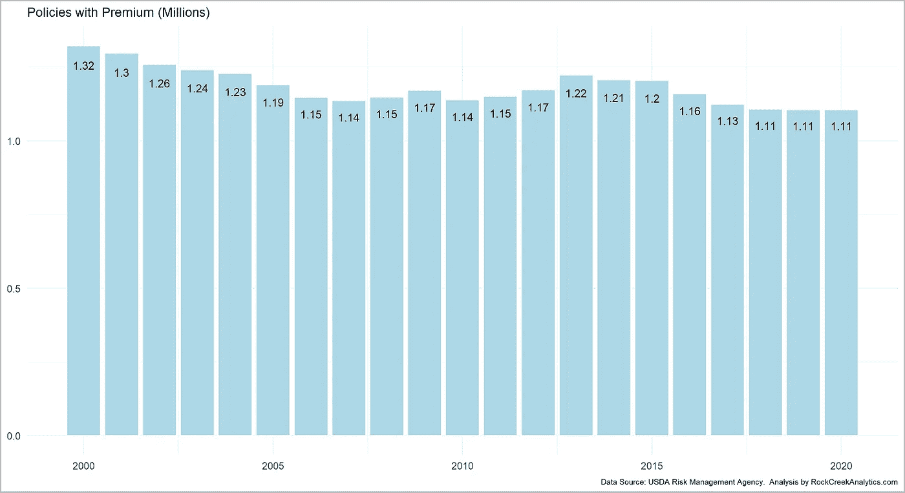

图 1:有保费的农作物保险单。

## 3.1 保险费和补贴

与这些政策相关的保费约为。在过去的几年里增加了 100 亿美元(见图 2 的上图)。附录中提供了通货膨胀调整后的保险费。

如图 2 下图所示，该计划获得了大量补贴。过去几年，补贴占保费的 60%以上。请注意，图 2 显示了联邦补贴。各州、私人和其他计划提供额外补贴，但这些补贴与联邦补贴相比相当低(补贴水平的详细情况见附录)。在我们的分析中，我们将忽略这些国家、私人和其他补贴。保费和联邦补贴之间的差额可以被认为是保单持有人获得的“净保费”。

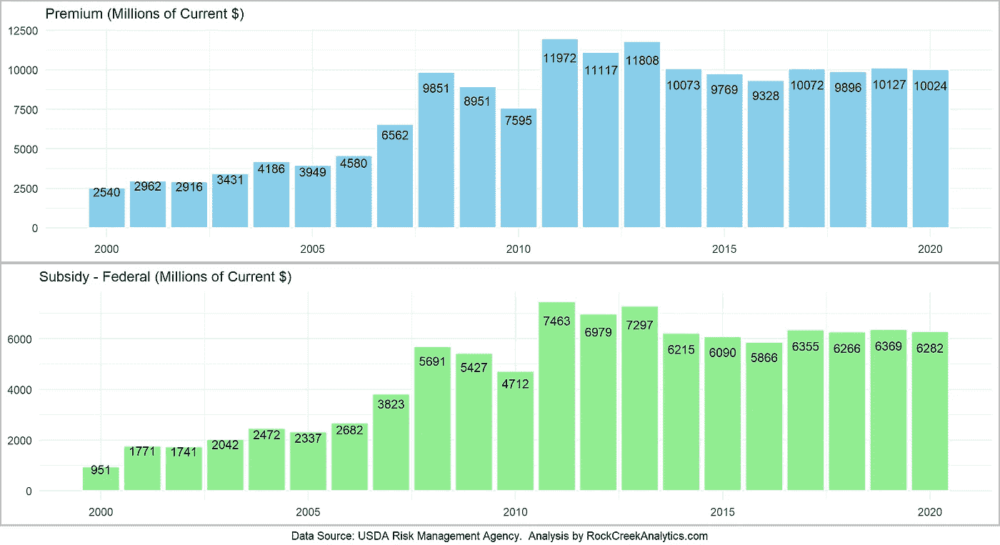

图 2:农作物保险费和补贴。

FCIC 保险的 100 多种作物中的四种——玉米、大豆、棉花和小麦——占了该计划收到的保险费的 70%以上。在过去二十年中，其他作物的份额一直在稳步增长(见图 3。)

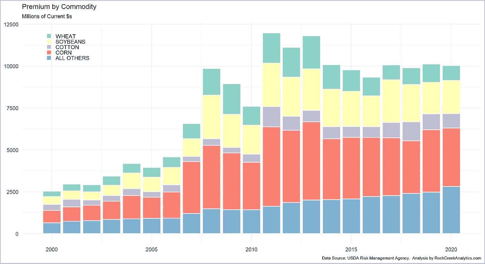

图 3:按商品分列的农作物保险费。

该计划在全国广泛传播；图 4 显示了 2020 年各县的保费分布情况(附录中提供了前几年的类似图表)。

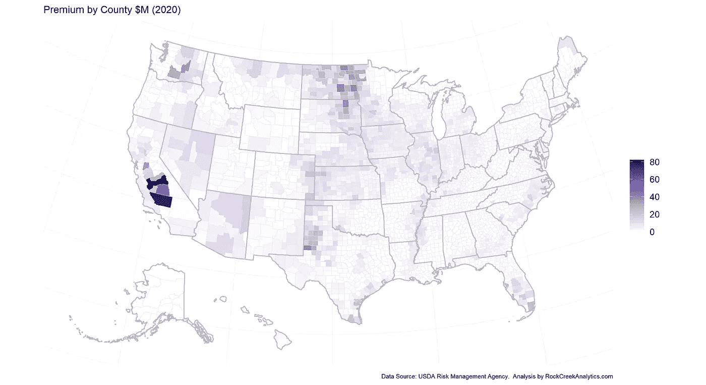

图 4:各县农作物保险费(2020 年)。

## 3.2 损失

作为典型的保险政策，每年都有一些保单持有人提出索赔，以获得对他们当年损失的赔偿。这些损失金额(RMA 称之为“赔偿金额”)按主要作物显示在图 5 中，2020 年损失的地理分布显示在图 6 中(前一年的图在附录中提供)。

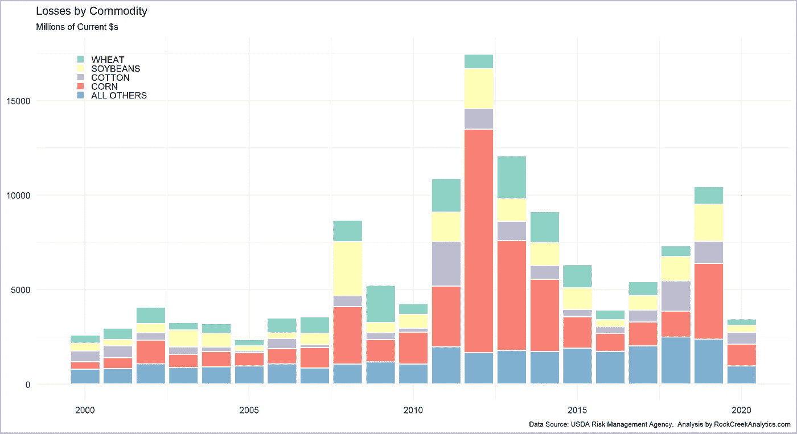

图 5:按商品分列的农作物保险损失。

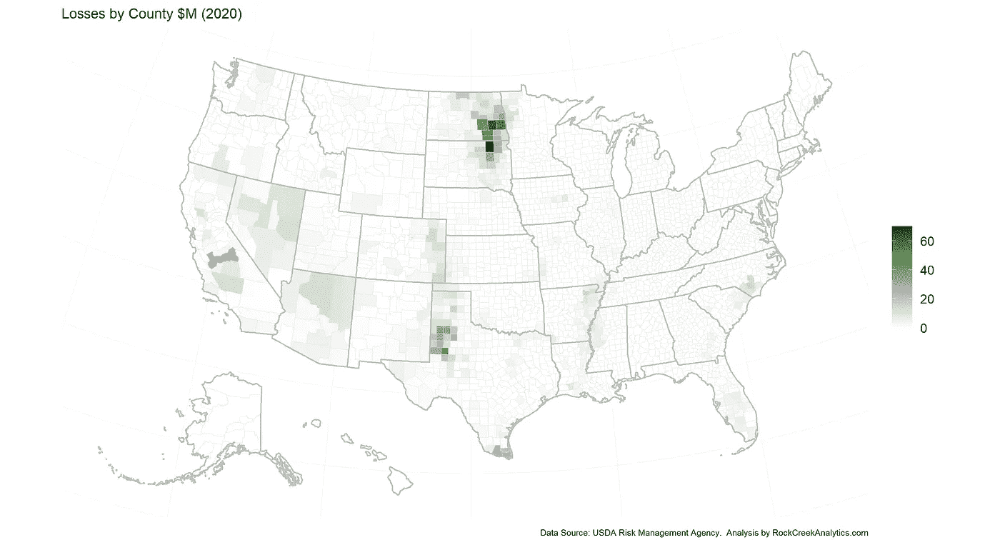

图 6:各县的农作物保险损失(2020 年)。

图 7 显示了这一年的净保费的亏损情况。这个数字清楚地表明，在大多数年份里，该计划支付的损失要多于它获得的净保费。

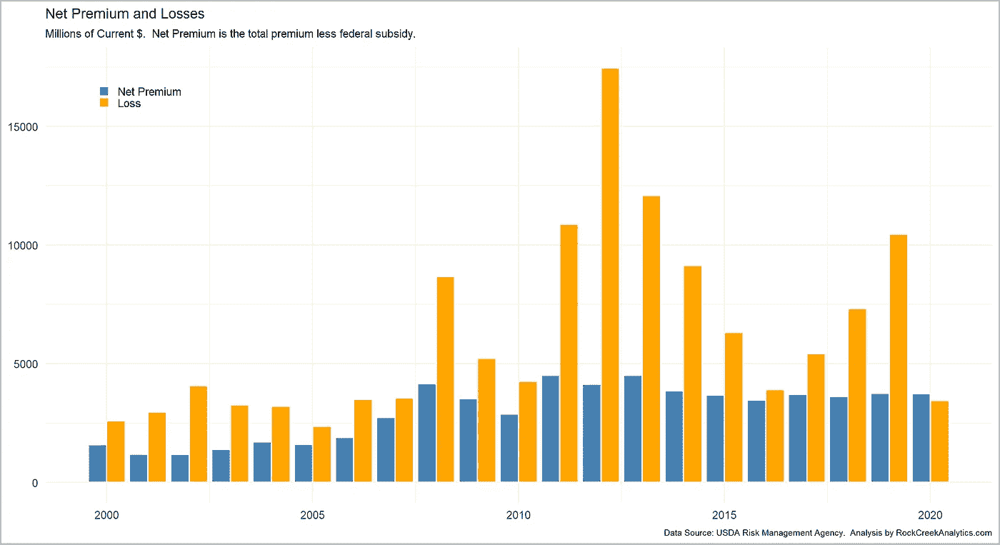

图 7:农作物保险净保费和损失。

# 四。损失率建模

对于预测损失(索赔支付)，总损失与总保险或总保费的比率是一个关键组成部分，因为它定义了索赔人可能从其索赔中获得的金额。使用一个比率而不是绝对数量，可以让分析师将来自多个地理区域和不同时间段的数据结合起来，使覆盖水平和通货膨胀的影响正常化。

图 8 显示了损失在保费(上图)和负债(下图)中所占份额的变化，图 9 显示了 2020 年这些比率的地理分布。过去二十年的数据表明，平均而言，损失占已付保费的 82%或负债额的 7.5%。

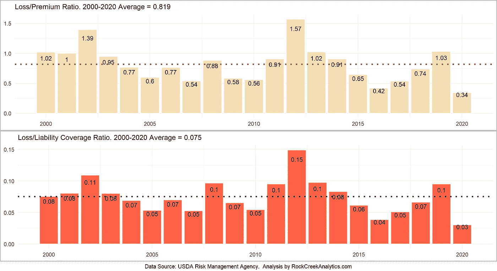

图 8:损失率演变。

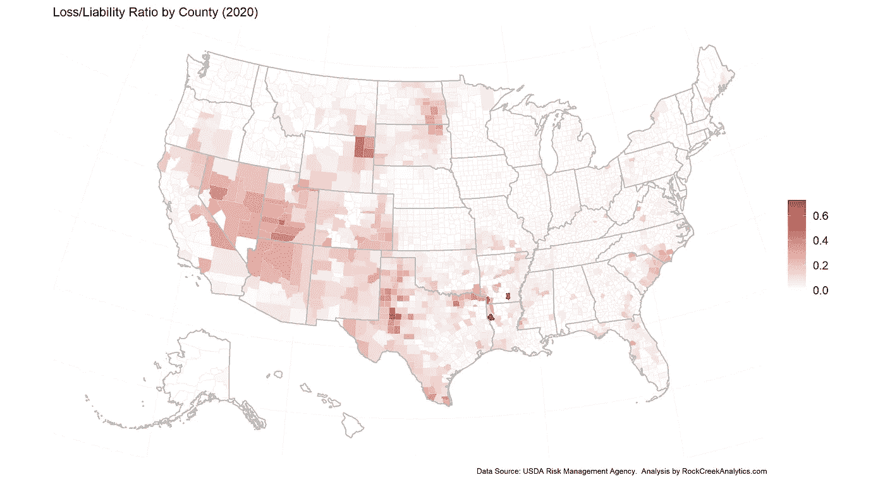

图 9:各县的损失率(2020 年)。

对于损失比率的建模，我们认为损失与负债比率是比损失与保费比率更好的衡量标准，因为从理论上讲，损失可以达到保单承保的责任范围金额，实际上在个别情况下，保单持有人在索赔中获得 100%的责任范围。

如前所述，我们无法访问建模任务的单个保单或索赔数据。相反，我们使用聚合数据集，其中每个数据点反映了州、县、作物、保险计划名称、保险类型和交付类型的组合。例如，对于 2020 年，大约有。140，000 个数据点反映了大约。110 万份保费支付保单和大约。187，000 份可赔偿保单(即损失)。

图 10 显示了 2000-2020 年期间的损失负债比率。有大量数据点的索赔与负债比率为 0.0，反映了未提交索赔或索赔被拒绝的保单。有几个索赔负债比率为 1.0 的数据点反映了保单获得了 100%的保险金额。

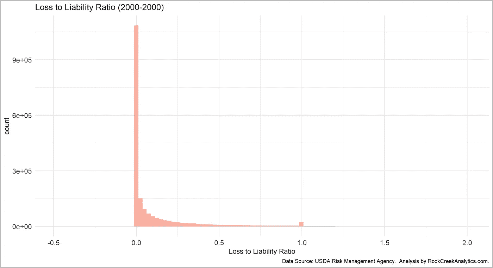

图 10:损失负债比分布(2000-2020)。

考虑到总数据的特殊情况，其中 0%的责任损失结合了未提交索赔的保单和被拒绝索赔的保单，以及 100%水平的*局部*峰值，将标准统计分布之一拟合到数据是不合适的。解决这个问题的一种方法是只考虑损失负债比在 0 和 1 之间的数据点。图 11 所示的结果数据遵循一种更易识别的统计分布模式，类似于对数正态分布、威布尔分布或伽马分布。

在测试了一些不同的选项后，我们发现威布尔分布相当好地拟合了数据(见图 11 和图 12)。威布尔分布是经过充分研究的统计分布，广泛用于索赔建模、可靠性分析、部件寿命分析、天气预报、水文(降雨量、河流流量)等一般保险分析。

这一发现与保险索赔模型的研究是一致的。Hewitt 和 Lefkowitz [3]描述了使用五种不同的分布(伽玛、对数伽玛、对数正态、伽玛+对数伽玛和伽玛+对数正态)来拟合保险损失数据。祖阿内蒂*等人*【4】描述了保险索赔数据的对数正态模型的统计细节。Tiwari [5]提供了使用广义线性模型对索赔频率建模的概述。David 和 Jemna [6]展示了泊松和负二项分布如何用于汽车保险索赔建模。常*等人*【7】建议使用泊松分布来模拟单个台风/洪水事件的发生。

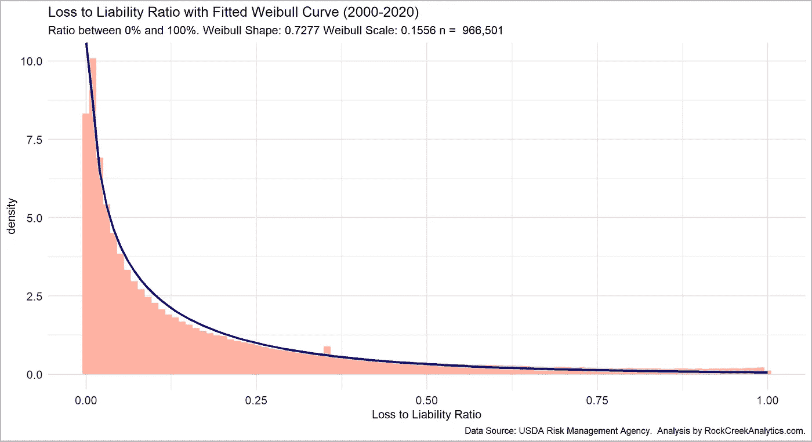

图 11:使用汇总数据的损失负债比率模型。

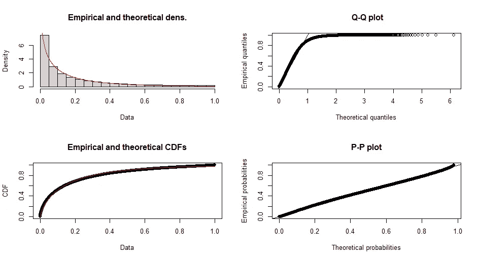

图 12:损失责任模型的威布尔分布拟合结果。

# 动词 （verb 的缩写）关闭

这篇文章概述了美国的农作物保险项目。我们已经提出了一种方法来模拟索赔覆盖率，并表明威布尔分布提供了一种合理的选择来模拟 0%和 100%之间的保单责任水平的索赔支付。虽然分析是基于聚合数据集，但我们相信结果也适用于个人保单和索赔级别的数据。

# 参考

联邦农作物保险公司。美国农业部-风险管理署。https://www.rma.usda.gov/FCIC/[。
【2】*州/县/作物业务汇总*。美国农业部-风险管理署。](https://www.rma.usda.gov/FCIC/)[https://www . RMA . USDA . gov/en/Information-Tools/Summary-of-Business/State-County-Crop-Summary-of-Business](https://www.rma.usda.gov/en/Information-Tools/Summary-of-Business/State-County-Crop-Summary-of-Business)。2020 年 10 月接入。
[3]小查尔斯·c·休伊特和本杰明·莱夫科维茨。*保险损失数据的分布拟合方法*。在 1979 年 11 月的伤亡保险精算学会会议上发表的论文。[https://www.casact.org/pubs/proceed/proceed79/79139.pdf](https://www.casact.org/pubs/proceed/proceed79/79139.pdf)
[4]祖阿内蒂、迪尼茨和莱特。保险索赔数据的对数正态模型。统计杂志。第 4 卷第 2 期，2006 年 6 月。https://www.ine.pt/revstat/pdf/rs060203.pdf。
【5】阿贾提瓦里。*建模保险索赔频率*。[https://medium . com/swlh/modeling-insurance-claim-frequency-a 776 F3 BF 41 DC](https://medium.com/swlh/modeling-insurance-claim-frequency-a776f3bf41dc)。2020 年 9 月接入。
[6]m .大卫和 d .杰姆纳。*通过泊松和负二项式模型对汽车保险索赔频率进行建模*。经济和商业科学年鉴 62(2):151–168。2015 年 7 月。[https://content . science do . com/view/journals/ai cue/62/2/article-p151 . XML](https://content.sciendo.com/view/journals/aicue/62/2/article-p151.xml)。
[7]清、许文子和苏明道。*台湾洪水风险和洪水保险项目建模*。农业与应用经济学协会 2008 年年会。[https://ideas.repec.org/p/ags/aaea08/6141.html](https://ideas.repec.org/p/ags/aaea08/6141.html)。

在此下载论文副本(包括附录):[http://www . rockcreekanalytics . com/modeling-crop-insurance-claims/](http://www.rockcreekanalytics.com/modeling-crop-insurance-claims/)