# 模拟指数增长

> 原文：<https://towardsdatascience.com/modeling-exponential-growth-49a2b6f22e1f?source=collection_archive---------2----------------------->

[疾控中心](https://unsplash.com/@cdc?utm_source=unsplash&utm_medium=referral&utm_content=creditCopyText)在 [Unsplash](https://unsplash.com/photos/k0KRNtqcjfw?utm_source=unsplash&utm_medium=referral&utm_content=creditCopyText) 拍摄的照片

## 使用对数变换、指数增长和线性回归预测冠状病毒传播

随着当前冠状病毒的爆发，我们听到了很多关于指数增长的说法。在本文中，我展示了如何理解和分析指数增长。如果你想跟随，你可以使用那些[示例数据](http://jooskorstanje.com/full_data_2.csv)和[一个简短的 Python 笔记本](https://jooskorstanje.com/modeling-exponential-growth-corona.html)。

# 为什么是指数增长？

指数增长是一个数学函数，可用于多种情况。这个公式告诉我们某一时刻的病例数，对于冠状病毒来说，这是被感染的人数。

在指数增长的其他用例中，这个数字可能是动物数量的大小，也可能是你银行账户上的金额(如果你足够幸运有好的利率)。

使用指数增长来模拟冠状病毒爆发的原因是，流行病学家已经研究了这些类型的爆发，众所周知，流行病的第一阶段遵循指数增长。

# 指数增长公式

指数增长的特征在于以下公式:

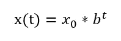

指数增长函数

其中:

*   *x(t)* 是任意给定*时间 t* 的病例数
*   *x0* 是案例开始时的数量，也叫*初始值*
*   *b* 是每个病人感染的人数，即*增长系数*

## 指数增长的一个简单例子:基数 2

为了更清楚地说明这一点，我将举一个假设的例子:

*   我们从 1 个感染者的*初始值*开始，所以 *x0* = 1
*   每个病人会感染另外两个人，所以增长率 b = 2
*   我们将考察从时间 0 到时间 14 的疫情发展

我们首先需要将 a 和 b 的值代入公式，以获得特定流行病的公式:

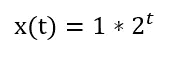

然后我们可以用这个公式来计算从 0 到 14 的每个 t 值的 y 值。当我们这样做时，我们在每个时间点获得了以下感染人数，如下表所示。这表明，从 1 个人开始，每个人的增长因子为 2，我们在 14 天后获得了超过 16000 个案例。

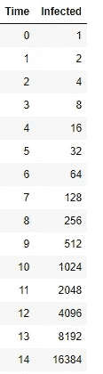

如果我们想用图表来表示，我们开始看到一个图表，看起来很像我们看到的关于冠状病毒的非常惊人的曲线:

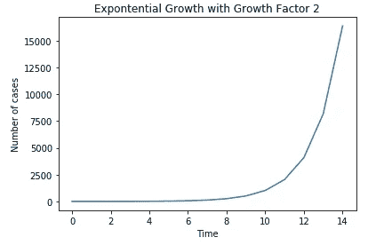

生长因子为 2 的指数生长图

# 找到冠状病毒的确切分子式

现在，我们知道这个图或多或少有正确的形状，但我们需要做一个额外的步骤，使我们的分析有用。我们需要通过查看疫情传播的数据，找到*电晕疫情*的真正增长因素。

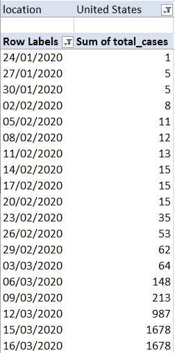

冠状病毒数据的摘录。来源:https://covid.ourworldindata.org/data/full_data.csv

## 寻找生长因子的线性回归

在查看数据时，我们只有每天的病例数，而没有增长因素。从每日的经验观察中找到生长因子的最好方法是使用一个叫做线性回归的统计模型。

给定 y 和 x 的经验观察值，线性回归允许我们在下面的公式中估计 a 和 b 的最佳值。在该公式中，y 是病例数，x 是时间。但是我们需要对指数增长函数进行一些重写，因为线性回归只能估计如下所示的公式:

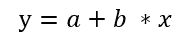

线性回归所需的公式类型

## 重写线性回归的指数公式

首先，我们需要以线性回归的形式重写公式。我们需要的工具是对数。对数允许以正确的形式重写函数:

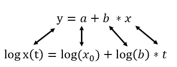

*   我们使用感染数量的**记录**而不是**感染数量**
*   我们使用生长因子的**对数，而不是**生长因子****

## 将线性回归应用于数据

**步骤 1—**Python 记事本的第一步是导入数据并应用日志转换:

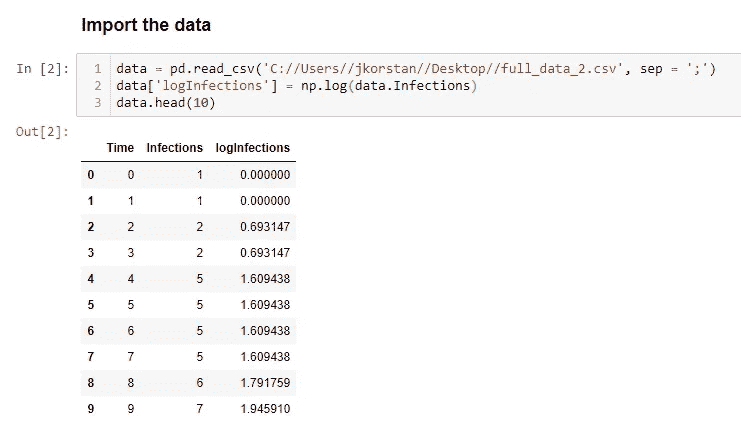

**步骤 2 —** 然后我们使用 statsmodels 库来估计线性回归函数:

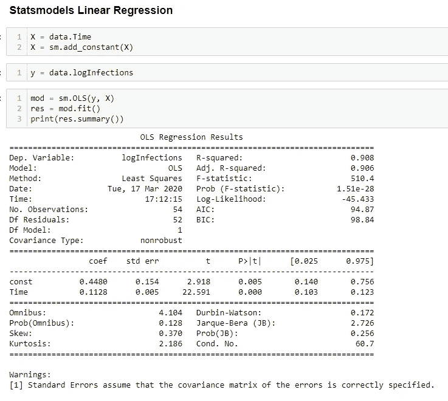

**步骤 3** —根据表格制作预测函数

让我们回到线性回归的公式:

线性回归所需的公式类型

statsmodels 表给出了 **coef** (中间) **:** 下 **a** 和 **b** 的值

*   值 **const** 是我们线性回归中 **a** 的值: **0.4480**
*   值**时间**是我们的线性回归**中 **b** 的值:0.1128**

因此，我们现在可以填写线性回归函数。

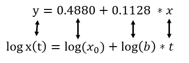

请记住:

*   我们说**线性回归的一个** 就是**的对数的初始值**
*   我们说**线性回归的 b** 是**的对数增长因子**

因此，我们知道:

*   初始值的对数等于 0.4480
*   生长因子的对数是 0.1128

为了找到实际的值，我们需要通过应用指数来“解开”它们。

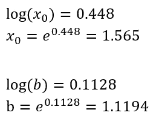

现在，我们可以回到指数增长的原始公式，并填入这些值，以找出冠状病毒案例的实际值:

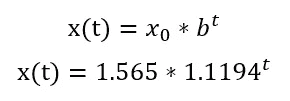

冠状病毒流行的实际公式！

# 对两周以后做预测！

现在我们已经估算了这个新公式，我们可以用它来预测任何我们想要的日期。值得注意的是，这里的预测只是一个例子，说明数学和统计学如何应用于流行病学。现实生活中的流行病学家将测试除指数增长之外的不同类型的模型，并在模型验证方面做大量工作，而目前的例子还没有这样做。

一旦找到最佳模型，就可以用它来进行预测。使用我们使用指数增长曲线估计的函数，如果我们想预测数据集最后一天(第 68 天)后的 2 周，我们只需将 t= 68 放入公式中，模型就预测当天有 3355 例感染。

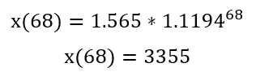

# 进一步发展的可能性:

我已经展示了如何应用线性模型来预测指数增长过程。需要采取一些预防措施:

*   线性模型只是指数增长函数的最佳估计，它有一定的误差，我们可以在进一步的研究中检验
*   指数增长函数不一定是流行病的完美代表。我已经找到了最合适的指数增长函数，但是下一步要研究的可能是逻辑增长
*   指数级的增长只会在一开始符合流行病。在某种程度上，治愈的人将不再传播病毒，当(几乎)每个人都被感染或已经被感染时，增长将停止。

[**在这里，你可以找到一篇关于冠状病毒的逻辑增长的文章**](/modeling-logistic-growth-1367dc971de2) **，它也考虑到了疫情的最后阶段。**

*感谢您阅读本文。我希望你喜欢它。不要犹豫，继续关注更多！*