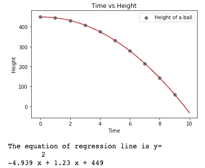
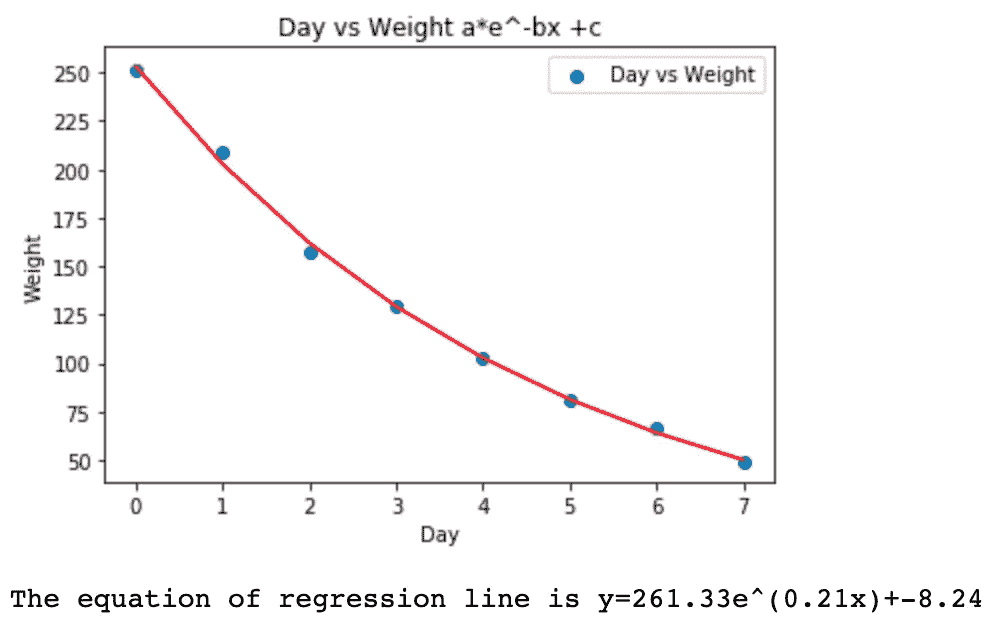
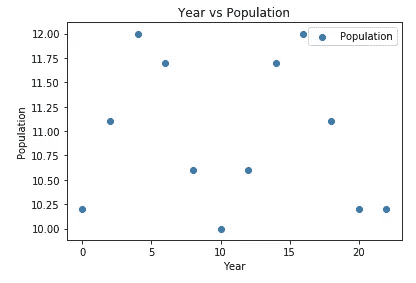

# 建模功能

> 原文：<https://towardsdatascience.com/modeling-functions-78704936477a?source=collection_archive---------13----------------------->

## 从线性回归到逻辑回归


Clem Onojeghuo 在 [Unsplash](https://unsplash.com?utm_source=medium&utm_medium=referral) 上拍摄的照片

```
**Table of Contents**[**Introduction**](#3846)1\. [Linear models](#e296)
2\. [Quadratic models](#005e)
3\. [Cubic models](#35bc)
4\. [Exponential models](#7b2b)
5\. [Logarithmic models](#ec20)
6\. [Sinusoidal models](#48d3)
7\. [Logistic models](#8108)[**Conclusion**](#9ef6)
```

# 介绍

我们将使用 Jupyter Notebook 绘制一个散点图，并建立一个从线性到逻辑的回归线模型。

# 线性模型


第一个是线性模型。线性模型被表示为𝑦=𝑚𝑥+𝑐.我们将使用 [numpy.array](https://docs.scipy.org/doc/numpy/reference/generated/numpy.array.html) 或 [numpy.arange](https://docs.scipy.org/doc/numpy/reference/generated/numpy.arange.html?highlight=arange#numpy.arange) 来创建数据。如果你想了解更多关于线性关系的内容，请阅读[线性关系的衡量标准](/a-measure-of-linear-relationship-5dd4a995ee7e?source=friends_link&sk=a68b5bc35334e5a501ead9900f0ea5db)。我们导入 Python 库 numpy 和 matplotlib。我们创建了一个年份和一个二氧化碳阵列。

```
import numpy as np
import matplotlib.pyplot as plt
%matplotlib inlineyear=np.array([1980,1982,1984,1986,1988,1990,1992,1994,1996,1998,2000])
co2=np.array([338.7,341.1,344.4,347.2,351.5,354.2,356.4,358.9,362.6,366.6,369.4])
```

首先，我们使用 matplotlib 创建一个散点图。添加标题、标签、x 轴和 y 轴标签。你需要使用`show()`方法。您可以在没有它的情况下进行打印，但这将删除不必要的输出。

```
plt.scatter(year,co2,label='CO2')
plt.title("Year vs CO2")
plt.xlabel('Year')
plt.ylabel('CO2')
plt.legend()
plt.show()
```


## x 轴上的整数

如上图所示，x 轴上有小数。在下面的代码中，我们使用前三行使它们成为整数。

```
from matplotlib.ticker import MaxNLocatorax = plt.figure().gca()
ax.xaxis.set_major_locator(MaxNLocator(integer=True))plt.scatter(year,co2,label='CO2')
plt.title("Year vs CO2")
plt.xlabel('Year')
plt.ylabel('CO2')
plt.legend()
plt.show()
```


x 轴上的整数

## 用`numpy.polyfit`和`numpy.poly1d`寻找线性模型

最简单的方法就是用`numpy.polyfit`。通过将 order 设置为 1，它将返回一个线性系数数组。在`numpy.poly1d`中使用它会返回一个使用系数的等式。

```
import numpy as np
import matplotlib.pyplot as plt
from matplotlib.ticker import MaxNLocator
from sklearn.linear_model import LinearRegression
%matplotlib inlineax = plt.figure().gca()
ax.xaxis.set_major_locator(MaxNLocator(integer=True))year=np.array([1980,1982,1984,1986,1988,1990,1992,1994,1996,1998,2000])
co2=np.array([338.7,341.1,344.4,347.2,351.5,354.2,356.4,358.9,362.6,366.6,369.4])coef = np.polyfit(year, co2, 1)
equ = np.poly1d(coef)x_plot = np.linspace(1975,2005,100)
y_plot = equ(x_plot)
plt.plot(x_plot, y_plot, color='r')plt.scatter(year,co2,label='CO2')
plt.title("Year vs CO2")
plt.xlabel('Year')
plt.ylabel('CO2')
plt.legend()
plt.show()
```


散点图和线性回归线

## 使用 scikit-learn 查找线性模型

求回归斜率和截距的第二种方法是使用`[sklearn.linear_model.LinearRegression](https://scikit-learn.org/stable/modules/generated/sklearn.linear_model.LinearRegression.html)`。该类要求 x 值为一列。我们使用`reshape(-1,1)`修改年份数据。原始年份数据具有 1x 11 形状。您需要将年份数据调整为 11 乘 1。

```
year1=year.reshape((-1,1))
print(np.shape(year))
print(np.shape(year1))
```


我们导入`[sklearn.linear_model.LinearRegression](https://scikit-learn.org/stable/modules/generated/sklearn.linear_model.LinearRegression.html)`，重塑年份数据，使用`LinearRegression().fit()`拟合我们的数据。这将返回斜率`coef_`和 y 轴截距`intercept_`。`coef_`返回一个数组，所以我们用`reg.coef_[0]`取第一项。让我们打印出我们的回归线方程。


线性方程

```
from sklearn.linear_model import LinearRegressionyear1=year.reshape((-1,1))reg = LinearRegression().fit(year1,co2)slope=reg.coef_[0]
intercept=reg.intercept_print(f'The equation of regression line is y={slope:.3f}x+{intercept:.3f}.')
```


## 一起

我们一起画一个散点图和我们的线性回归线。我们使用从 1975 年到 2005 年的新 x 域，取 100 个样本作为回归线，`np.linspace(1975,2005,100)`。然后使用 x 域、斜率和 y 截距绘制回归线。

```
import numpy as np
import matplotlib.pyplot as plt
from matplotlib.ticker import MaxNLocator
from sklearn.linear_model import LinearRegression
%matplotlib inlineax = plt.figure().gca()
ax.xaxis.set_major_locator(MaxNLocator(integer=True))year=np.array([1980,1982,1984,1986,1988,1990,1992,1994,1996,1998,2000])
co2=np.array([338.7,341.1,344.4,347.2,351.5,354.2,356.4,358.9,362.6,366.6,369.4])year1=year.reshape((-1,1))reg = LinearRegression().fit(year1,co2) 
slope=reg.coef_[0]
intercept=reg.intercept_plt.scatter(year,co2,label='CO2')
X_plot = np.linspace(1975,2005,100)
Y_plot = slope*X_plot+intercept
plt.plot(X_plot, Y_plot, color='r')
plt.title("Year vs CO2")
plt.xlabel('Year')
plt.ylabel('CO2')
plt.legend()
plt.show()print(f'The equation of regression line is y={slope:.3f}x+{intercept:.3f}.')
```


## 用 scipy 寻找线性模型

另一种寻找回归斜率和截距的方法是使用`[scipy.stats.linregress](https://docs.scipy.org/doc/scipy/reference/generated/scipy.stats.linregress.html)`。这将返回`slope, intercept, rvalue, pvalue, stderr`。

```
from scipy.stats import linregressslope, intercept, r_value, p_value, std_err = linregress(year,co2)
print(f'The equation of regression line is y={slope:.3f}x+{intercept:.3f}.')
```


## 线性回归图

为了画一条线，我们需要 x 个点。我们使用`np.linspace`，它是`numpy.linspace`，因为我们使用了`import numpy as np`。我们的数据是从 1975 年到 2000 年。所以我们用 1960 代表`start`，2005 代表`stop`，100 代表样本数。

```
import numpy as np
import matplotlib.pyplot as plt
from scipy.stats import linregress
%matplotlib inlineyear=np.array([1980,1982,1984,1986,1988,1990,1992,1994,1996,1998,2000])
co2=np.array([338.7,341.1,344.4,347.2,351.5,354.2,356.4,358.9,362.6,366.6,369.4])X_plot = np.linspace(1975,2005,100)
Y_plot = slope*X_plot+intercept
plt.plot(X_plot, Y_plot, color='r')
plt.show()
```


使用 scipy . Lin regression 的线性回归线

现在我们把散点图、回归线和回归方程放在一起。

```
import numpy as np
import matplotlib.pyplot as plt
from matplotlib.ticker import MaxNLocator
from scipy.stats import linregress%matplotlib inlineax = plt.figure().gca()
ax.xaxis.set_major_locator(MaxNLocator(integer=True))
slope, intercept, r_value, p_value, std_err = linregress(year,co2)
X_plot = np.linspace(1975,2005,100)
Y_plot = slope*X_plot+intercept
plt.plot(X_plot, Y_plot, color='r')
plt.scatter(year,co2,label='CO2')
plt.title("Year vs CO2")
plt.xlabel('Year')
plt.ylabel('CO2')
plt.legend()
plt.show()print(f'The equation of regression line is y={slope:.3f}x+{intercept:.3f}.')
```


散点图和线性回归线

## 练习 1

使用以下数据绘制散点图和回归线。求一个线性回归方程。

```
import numpy as np
import matplotlib.pyplot as plt
%matplotlib inlinetemp = np.array([55,60,65,70,75,80,85,90])
rate = np.array([45,80,92,114,141,174,202,226])
```

## 回答

你画了散点图和回归图吗？回归线应该是*𝑦*= 5.119*𝑥*—236.88。

[](/the-subtlety-of-spearmans-rank-correlation-coefficient-29478653bbb9) [## 斯皮尔曼等级相关系数的微妙性

### 单调关系的未知部分

towardsdatascience.com](/the-subtlety-of-spearmans-rank-correlation-coefficient-29478653bbb9) 

# 二次模型


我们使用 Numpy 的`arange`来创建从 0 到 9 的 10 个整数。

```
import numpy as np
import matplotlib.pyplot as plt
%matplotlib inlinetime = np.arange(10)
height = np.array([450,445,430,409,375,331,280,215,144,59])
```

我们来绘制上面的数据。

```
import numpy as np
import matplotlib.pyplot as plt
%matplotlib inlineplt.scatter(time,height,label='Height of a ball')
plt.title("Time vs Height")
plt.xlabel('Time')
plt.ylabel('Height')
plt.legend()
plt.show()
```


二次回归图

`numpy.polyfit`拟合多项式。它需要 x，y 和拟合多项式的次数。二次为 2，三次为 3，以此类推。它返回一个数组，该数组的多项式系数为常数的高次幂。对于二次函数，它们是 a、b 和 c:


```
coef = np.polyfit(time, height, 2)
coef
```


让我们打印出二次回归线。

```
print(f'The equation of regression line is y=')
print(equ)
```


或者使用系数，回归线是:

```
print(f'The equation of regression line is y={coef[0]:.3f}x^2+{coef[1]:.3f}x+{coef[2]:.3f}.')
```


二次回归方程

我们再次使用 NumPy 的`poly1d`和`polyfit`。`np.poly1d(coefficients)`将使用我们的系数返回一个多项式方程。

```
equ = np.poly1d(coef)
```

我们可以找到任意 x 的值。例如，如果您想在 x=1 时找到 y 值:

```
equ(1)
```


x=1 时的 y 值

我们用这个来画回归线。我们使用`numpy.linspace`为 100 个样本定义从 0 到 10 的 x 值。并在`equ`中使用它作为 y 值。

```
import numpy as np
import matplotlib.pyplot as plt
%matplotlib inlinex_plot = np.linspace(0,10,100)
y_plot = equ(x_plot)
plt.plot(x_plot, y_plot, color='r')
plt.show()
```


我们把它们放在一起。

```
import numpy as np
import matplotlib.pyplot as plt
%matplotlib inlinetime = np.arange(10)
height = np.array([450,445,430,409,375,331,280,215,144,59])coef = np.polyfit(time, height, 2)
equ = np.poly1d(coef)x_plot = np.linspace(0,10,100)
y_plot = equ(x_plot)
plt.plot(x_plot, y_plot, color='r')plt.scatter(time,height,label='Height of a ball')
plt.title("Time vs Height")
plt.xlabel('Time')
plt.ylabel('Height')
plt.legend()
plt.show()print(f'The equation of regression line is y=')
print(equ)
```



## 练习 2

通过使用以下数据，在图表中绘制散点图和回归线。求二次回归方程。

```
import numpy as np
import matplotlib.pyplot as plt
%matplotlib inlineangle = np.arange(20,80,10)
distance = np.array([371,465,511,498,439,325])
```

## 回答

你能画一条散点线和回归线吗？二次方程应该是:


二次回归练习答案

[](/gentle-introduction-to-chi-square-test-for-independence-7182a7414a95) [## 卡方独立性检验简介

### 使用 Jupyter 笔记本的卡方初学者指南

towardsdatascience.com](/gentle-introduction-to-chi-square-test-for-independence-7182a7414a95) 

# 立方模型


可以用和上面二次函数一样的方法。我们要用`plyfit`和`poly1d`。首先，我们准备数据。让我们画一个散点图。

```
import numpy as np
import matplotlib.pyplot as plt
%matplotlib inlineengspeed = np.arange(9,23,2)
avespeed = np.array([6.45,7.44,8.88,9.66,10.98,12.56,15.44])plt.scatter(engspeed,avespeed,label='Speed of different boat engine')plt.title("Average speed of different boat engine")
plt.xlabel('Engine speed')
plt.ylabel('Boad speed')
plt.ylim(0,20)
plt.legend()
plt.show()
```


使用`polyfit`返回系数。对于三次函数，a、b、c 和 d 在:


立方函数

```
coef = np.polyfit(engspeed, avespeed, 3)
print(coef)
```


三次函数的系数

我们把所有的放在一起。

```
import numpy as np
import matplotlib.pyplot as plt
%matplotlib inlineengspeed = np.arange(9,23,2)
avespeed = np.array([6.45,7.44,8.88,9.66,10.98,12.56,15.44])plt.scatter(engspeed,avespeed,label='Speed of different boat engine')coef = np.polyfit(engspeed, avespeed, 3)
equ = np.poly1d(coef)x_plot = np.linspace(8,25,100)
y_plot = equ(x_plot)
plt.plot(x_plot, y_plot, color='r')plt.title("Average speed of different boat engine")
plt.xlabel('Engine speed')
plt.ylabel('Boad speed')
plt.ylim(0,20)
plt.legend()
plt.show()a, b, c, d = coef
print(f'The equation of regression line is y={a:.3f}x^3+{b:.3f}x^2+{c:.3f}x+{d}.')
```


散点图和三次回归线

## 练习 3

使用以下数据绘制散点图和三次回归线。打印三次方程。

```
import numpy as np
import matplotlib.pyplot as plt
%matplotlib inlinex=np.arange(1,8)
y=np.array([0,0.012,0.06,0.162,0.336,0.6,0.972])
```

## 回答

你能画出散点图和回归线吗？回归线方程应为:


系数为[3.000000000 e-03，-1.16796094e-16，-9.000000000 e-03，6.00000000e-03]。这些意味着:


第二个实际上是 0。尝试以下方法，看看两者是否都是相同的 0.3。

```
print(300e-03)
print(300*10**(-3))
```

# 指数模型

我们将探索三种指数模型。


让我们设置数据。画一个散点图。

```
import numpy as np
import matplotlib.pyplot as plt
%matplotlib inlineday = np.arange(0,8)
weight = np.array([251,209,157,129,103,81,66,49])plt.scatter(day,weight,label='Weight change')
plt.title("Day vs Weight")
plt.xlabel('Day')
plt.ylabel('Weight')
plt.legend()
plt.show()
```


我们要用`[scipy.optimize.curve_fit](https://docs.scipy.org/doc/scipy/reference/generated/scipy.optimize.curve_fit.html)`。这需要一个函数，x 和 y 值，和初始值，`p0`以数组的形式。找到合适的`p0`需要一点反复试验。你必须测试不同的价值观。我们用`p0=(1, 1e-6, 1)`。它返回参数的最优值和 popt 的估计协方差。

# 𝑎⋅𝑒^−𝑏𝑥+𝑐


我们的第一个指数函数使用 a、b 和 c。我们将首先定义一个函数。这在`curve_fit`方法中使用。对于平滑曲线，我们用 100 个样本使用`numpy.linspace`从 0 到 7 设置 x 值。

```
import numpy as np
import matplotlib.pyplot as plt
from scipy.optimize import curve_fit
%matplotlib inlinedef func(x, a, b, c):
    return a * np.exp(-b * x) + cpopt, pcov = curve_fit(func, day, weight, p0=[1, 1e-6, 1])x_plot=np.linspace(0,7,100)
plt.plot(x_plot, func(x_plot, *popt), 'r-')plt.scatter(day,weight,label='Day vs Weight')
plt.title("Day vs Weight a*e^-bx +c")
plt.xlabel('Day')
plt.ylabel('Weight')
plt.legend()
plt.show()# equation
a=popt[0].round(2)
b=popt[1].round(2)
c=popt[2].round(2)print(f'The equation of regression line is y={a}e^({b}x)+{c}')
```



散点图和指数回归线

# 𝑎⋅𝑒^−𝑏𝑥


第二个函数使用 a 和 b。我们相应地定义函数。

```
import numpy as np
import matplotlib.pyplot as plt
from scipy.optimize import curve_fit
%matplotlib inlinedef func2(x, a, b):
    return a * np.exp(-b * x)popt, pcov = curve_fit(func2, day, weight, p0=[1, 1e-6])x_plot=np.linspace(0,7,100)
plt.plot(x_plot, func2(x_plot, *popt), 'r-')plt.scatter(day,weight,label='Day vs Weight')
plt.title("Day vs Weight a*e^-bx")
plt.xlabel('Day')
plt.ylabel('Weight')
plt.legend()
plt.show()# equation
a=popt[0].round(2)
b=popt[1].round(2)print(f'The equation of regression line is y={a}e^({b}x)')
```


指数回归线的第二个例子

# 𝑎⋅𝑏^𝑥


最后一个指数函数使用 a 和 b，我们相应地修改函数。

```
import numpy as np
import matplotlib.pyplot as plt
from scipy.optimize import curve_fit
%matplotlib inlinedef func3(x, a, b):
    return a * b ** xpopt, pcov = curve_fit(func3, day, weight, p0=[1, 1e-6])
x_plot=np.linspace(0,7,100)
plt.plot(x_plot, func3(x_plot, *popt), 'r-')plt.scatter(day,weight,label='Day vs Weight')
plt.title("Day vs Weight a*b^x")
plt.xlabel('Day')
plt.ylabel('Weight')
plt.legend()
plt.show()# equation
a=popt[0].round(4)
b=popt[1].round(4)print(f'The equation of regression line is y={a}*{b}^x')
```


## 与 TI Nspire 结果比较

TI Nspire 的指数回归使用转换值 x 和𝑙𝑛的最小二乘拟合，将模型方程 *𝑦* = *𝑎𝑏^𝑥* 拟合到数据上*(*𝑦*)。它返回不同的值。*


## 实践

使用下列数据找出 ab^x.形式的指数函数，绘制散点图并绘制回归线。

```
import numpy as npweek = np.arange(1,21)
views = np.array([102365, 38716,21617,24305,9321,14148,2103,8285,5098,3777,831,1007,834,34,378,204,6,42,54,31])
```

## 回答


# 对数模型

## 半对数模型

通常，我们对指数函数使用半对数模型:


我们设置了模拟数据并绘制了散点图。

```
import numpy as np
import matplotlib.pyplot as plt
%matplotlib inlinetime = np.arange(0,30,4)
bacteria = np.array([20,150,453,920,1820,9765,15487,19450])plt.scatter(time,bacteria,label='Bacteria')
plt.title("Time vs Bacteria")
plt.xlabel('time')
plt.ylabel('bacteria')
plt.legend()
plt.show()
```


时间对细菌图

我们将使用`[numpy.log](https://docs.scipy.org/doc/numpy/reference/generated/numpy.log.html)`对细菌值进行自然记录。`numpy.log`是自然对数。这应该显示一个线性趋势。我们需要用`ln(bacteria)`修改标题和 y 标签。

```
import numpy as np
import matplotlib.pyplot as plt
%matplotlib inlinetime = np.arange(0,30,4)
bacteria = np.array([20,150,453,920,1820,9765,15487,19450])plt.scatter(time,np.log(bacteria),label='Bacteria')
plt.title("Time vs ln(Bacteria)")
plt.xlabel('time')
plt.ylabel('ln(bacteria)')
plt.legend()
plt.show()
```


我们使用在二次和三次函数中使用的`numpy.polyfit`。我们在`numpy.polyfit()`中使用`1`，这样它将返回一个线性回归。`numpy.polyfit`返回等式的所有系数。

```
import numpy as np
import matplotlib.pyplot as plt
%matplotlib inlinetime = np.arange(0,30,4)
bacteria = np.array([20,150,453,920,1820,9765,15487,19450])p = np.polyfit(time, np.log(bacteria), 1)
plt.plot(time, p[0] * time + p[1], 'g--', label='Semi-log graph')plt.scatter(time,np.log(bacteria),label='Bacteria')
plt.title("Time vs Bacteria")
plt.xlabel('time')
plt.ylabel('bacteria')
plt.legend()
plt.show()print(f'The equation of regression line is y={p[0]:.3f} * x + {p[1]:.3f}')
```


## 双对数模型

双对数模型用于幂函数。


让我们设置数据并绘制散点图。

```
import numpy as np
import matplotlib.pyplot as plt
%matplotlib inlinex=np.array([2,30,70,100,150])
y=np.array([4.24,16.4,25.1,30,36.7])plt.scatter(x,y,label='Log-log')
plt.title("Log-Log model")
plt.xlabel('x')
plt.ylabel('y')
plt.legend()
plt.show()
```


我们使用`[numpy.log](https://docs.scipy.org/doc/numpy/reference/generated/numpy.log.html)`获取 x 和 y 值的自然对数。我们需要将 x 和 y 标签修改为 ln(x)和 ln(y)。

```
import numpy as np
import matplotlib.pyplot as plt
%matplotlib inlinex=np.array([2,30,70,100,150])
y=np.array([4.24,16.4,25.1,30,36.7])p = np.polyfit(np.log(x), np.log(y), 1)
plt.plot(np.log(x), p[0] * np.log(x) + p[1], 'r--', label='Regression line')plt.scatter(np.log(x),np.log(y),label='log-log')
plt.title("Log-log regression")
plt.xlabel('ln(x)')
plt.ylabel('ln(y)')
plt.legend()
plt.show()print(f'The equation of regression line is ln(y)={p[0]:.3f} * ln(x) + {p[1]:.3f}')
```


# 正弦模型

让我们试试正弦函数。我们设置数据并绘制散点图。既然要用`scipy.optimize.curve_fit`，那我们也导入一下吧。我们在指数模型中使用了它。我们建立了数据并绘制了散点图。

```
import numpy as np
import matplotlib.pyplot as plt
from scipy.optimize import curve_fit
%matplotlib inlineyear=np.arange(0,24,2)
population=np.array([10.2,11.1,12,11.7,10.6,10,10.6,11.7,12,11.1,10.2,10.2])plt.scatter(year,population,label='Population')
plt.title("Year vs Population")
plt.xlabel('Year')
plt.ylabel('Population')
plt.legend()
plt.show()
```



我们定义一个叫做`sinfunc`的函数。这需要参数`x, a, b, c, d`。我们用`[numpy.radians](https://docs.scipy.org/doc/numpy/reference/generated/numpy.radians.html)`表示`c`。


```
import numpy as np
import matplotlib.pyplot as plt
from scipy.optimize import curve_fit
%matplotlib inlineyear=np.arange(0,24,2)
population=np.array([10.2,11.1,12,11.7,10.6,10,10.6,11.7,12,11.1,10.2,10.2])def sinfunc(x, a, b, c, d):
    return a * np.sin(b * (x - np.radians(c)))+dpopt, pcov = curve_fit(sinfunc, year, population, p0=[1,0.4,1,5])
x_data = np.linspace(0, 25, num=100)plt.scatter(year,population,label='Population')
plt.plot(x_data, sinfunc(x_data, *popt), 'r-',label='Fitted function')
plt.title("Year vs Population")
plt.xlabel('Year')
plt.ylabel('Population')
plt.legend()
plt.show()a, b, c, d = poptprint(f'The equation of regression line is y={a:.3f} * sin({b:.3f}(x-{np.radians(c):.3f}))+{d:.3f}')
```


## 实践

使用[下面的表格](https://niwa.co.nz/education-and-training/schools/resources/climate/modelling)，画一个散点图并找到一个余弦回归函数。


## 回答


你可能有不同的系数。我用过

# 逻辑模型


我们收集数据并绘制散点图。我们使用`plt.xlim`和`plt.ylim`设置域从-10 到 10，范围从 0 到 250。我们将使用`scipy.optimize.curve_fit`进行逻辑回归。

```
import numpy as np
import matplotlib.pyplot as plt
from scipy.optimize import curve_fit
%matplotlib inlinex=np.arange(0,10)
y=np.array([52,133,203,230,237,239.5,239.8,239.9,240,240])plt.scatter(x, y, label='Regression line')
plt.title("Logistic regression")
plt.xlabel('x')
plt.ylabel('y')
plt.xlim(-10,10)
plt.ylim(0,250)
plt.legend()
plt.show()
```


我们使用`logifunc`来定义我们的逻辑功能。我们用`curve_fit`找到`popt`中的函数参数。对于回归线，我们为函数设置一个新的域，`x_data`从-10 到 10。我们使用`plt.plot`绘制这条线。

```
import numpy as np
import matplotlib.pyplot as plt
from scipy.optimize import curve_fit
%matplotlib inlinex=np.arange(0,10.0)
y=np.array([52,133,203,230,237,239.5,239.8,239.9,240,240])def logifunc(x,L,c,k):
    return L/ (1 + c*np.exp(-k*x))popt, pcov = curve_fit(logifunc, x, y, p0=[200,1,1])
x_data = np.linspace(-10, 10, num=100)plt.scatter(x,y,label='Logistic function')
plt.plot(x_data, logifunc(x_data, *popt), 'r-',label='Fitted function')
plt.title("Logistic")
plt.xlabel('x')
plt.ylabel('y')
plt.xlim(-10,10)
plt.ylim(0,250)
plt.legend()
plt.show()
```


## 当 y 数据点为负时

有时，您的数据在 y 坐标中可能有负值。

```
import pandas as pddf = pd.read_csv('[http://bit.ly/2tUIZjK'](http://bit.ly/2tUIZjK'))df.head()
```


数据的最小值必须为零。理想情况下，乙状结肠中点也为零。但是上面的数据集两者都不满足。使用等式(1–2)，并添加`offset`值适用于该数据集。

```
x=df.T.iloc[0]
y=df.T.iloc[1]def logifunc(x,L,x0,k,off):
    return L / (1 + np.exp(-k*(x-x0)))+offplt.scatter(x,y,label='Logistic function')popt, pcov = curve_fit(logifunc, x, y, p0=[50,185,0.1,-222])
plt.scatter(x,y,label='Logistic function')x_data = np.linspace(170,205,num=100)
plt.plot(x_data, logifunc(x_data, *popt), 'r-',label='Fitted function')
plt.legend()plt.show()
print(popt)
```


# 结论

`scipy.optimize.curve_fit`对许多功能都有用。唯一的问题是在`p0`中找到好的初始值。有时不同的`p0`值会返回不同的`popt`。可以试试 [LMFIT](https://lmfit.github.io/lmfit-py/) 。

**通过** [**成为**](https://blog.codewithshin.com/membership) **的会员，可以完全访问媒体上的每一个故事。**


[https://blog.codewithshin.com/subscribe](https://blog.codewithshin.com/subscribe)

# 参考

*   [https://realpython.com/linear-regression-in-python/](https://realpython.com/linear-regression-in-python/)
*   [https://stack overflow . com/questions/41925157/logisticregression-unknown-label-type-continuous-using-sk learn-in-python](https://stackoverflow.com/questions/41925157/logisticregression-unknown-label-type-continuous-using-sklearn-in-python)