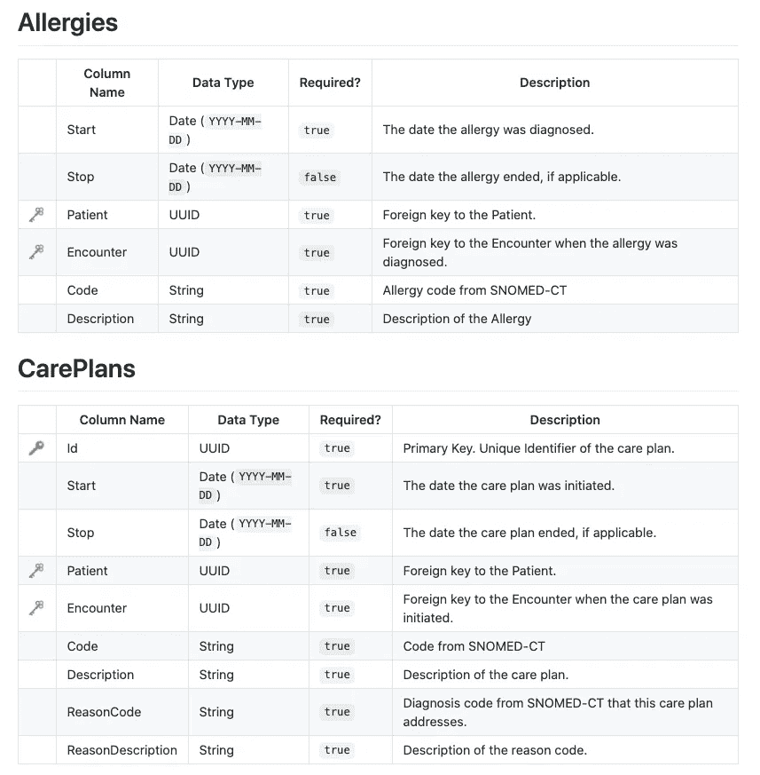
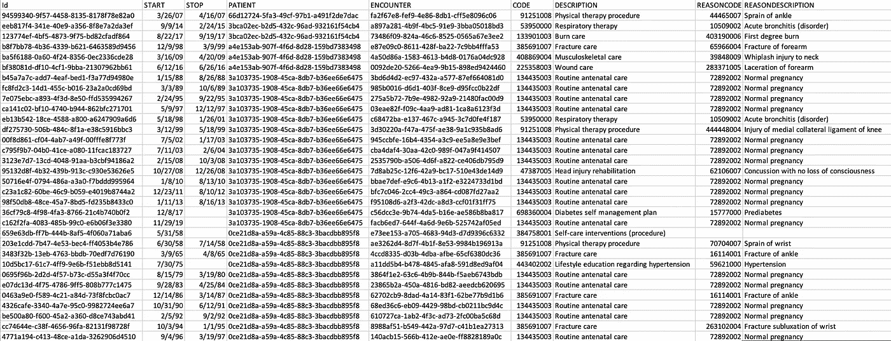
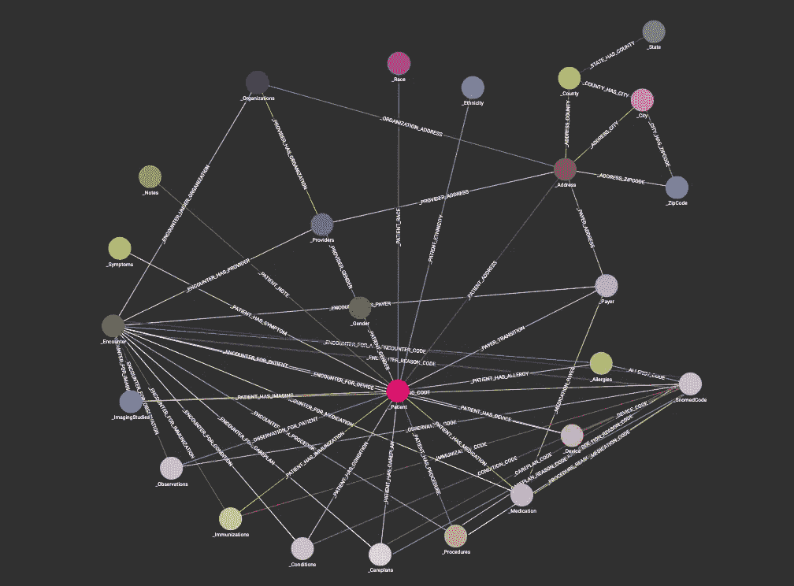

# 用图形数据库对医疗保健数据建模

> 原文：<https://towardsdatascience.com/modeling-healthcare-data-with-graph-databases-3e3695bcae3c?source=collection_archive---------27----------------------->

## 使用 TigerGraph 和 Synthea 创建合成医疗保健系统

弗兰基·查马基在 [Unsplash](https://unsplash.com/?utm_source=unsplash&utm_medium=referral&utm_content=creditCopyText) 上拍摄的照片

# 介绍

自从从纸质记录过渡到虚拟记录以来，医院一直在堆积数据。医疗保健系统的每个接触点、每个处方、手术和免疫都记录并存储在医院的电子健康记录中(EHR)。现在已经到了医院数据多到不知如何处理的地步。更糟糕的是，这种复杂数据的过饱和使得访问和分析数据的效率非常低。

那么，这场危机的解决方案是什么？

图形数据库！

图表非常适合存储和可视化医疗保健数据。它们旨在处理高度关联的信息，如病历。如果你对图形不熟悉，看看这篇[的精彩文章](https://medium.com/basecs/a-gentle-introduction-to-graph-theory-77969829ead8)，它介绍了一些图论的基础知识。

我将通过一个例子展示我们如何使用一个 [TigerGraph](https://medium.com/u/4ba88d6cae61?source=post_page-----3e3695bcae3c--------------------------------) 图形数据库来表示复杂的医疗保健数据。我们开始吧！

# 生成数据

在一个理想的世界里，我们可以用真实的病人数据来创建这个图表；然而，有许多规则和条例使得处理患者数据相当困难。而是可以用退而求其次的东西:**合成数据**。

使用 [Synthea](https://synthetichealth.github.io/synthea/) ，一个开源的合成病人生成器，我们可以创建一个完整的医疗保健生态系统，其中充满了病人、医院访问、保险提供商以及你能想到的一切。如果你以前从未遇到过 Synthea，看看我写的这篇解释其工作原理的简短文章。

Synthea 的输出数据分为几个 CSV 文件，如过敏、药物、遭遇、供应商等。

有些 CSV 文件的列标题不是列数据的明显指示器。查看 [Synthea Wiki](https://github.com/synthetichealth/synthea/wiki/CSV-File-Data-Dictionary) 有助于了解每个文件的内容。

样本输出数据格式

实际 CSV 文件的列与文档完全对应。

护理计划的 CSV 输出示例

对于这个医疗保健系统的例子，我生成了来自美国各地的 500 名患者的样本。

# 创建图表模式

完整的医疗保健模式

这个图表的模式非常复杂(正如您从图片中看到的)。我这样说并不是为了恐吓你，而是为了强调我已经说过的话。

**医疗保健数据很复杂！**

每个患者都与医疗保健系统有如此多的交互，一个简单的模式肯定无法捕获所有可用的数据和信息。**我们的模式必须和我们的数据一样详细。**

我们可以使用 TigerGraph 本地语言 GSQL 来创建我们的模式。整个脚本如下所示:

图形模式的 GSQL 脚本

光是这个脚本，我就可以写一整个博客。但是，为了使你免于阅读肯定会非常无聊的读物，我将只注意一些要点。

*   每个 CSV 文件主题都成为具有适当边的顶点。
*   所有的边都是无向的**,因为所有的关系都是双向的(即，一个病人有一种药物，但是该药物对应于该病人。)**
*   **像**性别**、**种族**和**地址**这样的属性可以是内部属性，但是我选择将它们分离出来以优化围绕这些属性的搜索。**
*   **顶点 **SnomedCode** 存储使用的每一个医疗代码，这也有助于优化搜索**

# **加载数据**

**我们可以编写 GSQL 加载脚本来加载我们的数据。让我们看看 **CarePlans** CSV 文件的加载脚本示例。**

**GSQL 加载脚本示例**

**同样，让我们简单地看一下这段代码的重要部分。**

*   **我们首先定义用来加载数据的文件。**
*   **然后，我们指定哪些列对应于模式中定义的顶点 id、顶点属性或边属性。**
*   **最后，我们声明我们的文件有一个头，分隔符是逗号**

**使用相同的格式，我们可以为其余的数据文件编写类似的加载作业。**

**对于我们 500 名患者的样本，加载我们所有的数据会产生大约 **80 万个顶点**和**近****200 万条边**。**

# **示例查询**

**关于 GSQL 查询，我不会讲太多细节。我不想把重点放在实际编写查询上，而是放在查询运行的速度上——毕竟，这个博客旨在展示图形数据库的效率。如果你感兴趣的话，我有[的另一个博客](/graph-query-searches-part-3-a8bff845c3f1)，里面有很多查询示例。和往常一样， [TigerGraph 文档网站](https://docs.tigergraph.com/dev/gsql-ref/querying)是寻找更多信息的好地方。**

**让我们运行一个简单的查询，获取与给定患者直接相关的所有顶点和边。**

**示例查询**

**该查询返回大量信息。它基本上调用了给定患者与医疗保健系统的每个接触点。通常，这对于数据库来说是一项艰巨的工作。但是有了我们的图形数据库，信息在几毫秒内就被检索出来了！真是快得不可思议！**

**这个速度也适用于大于 500 名患者的数据集。在一个拥有 **1 亿患者**(哇，这么多数据 **)** 的样本系统中，收集相同信息的时间**只有几秒钟**。**

**使用图表进行查询非常高效，并且显示出比用于查询医疗保健数据的标准技术有了巨大的改进。**

# **进一步探索**

**虽然图形数据库确实是保存数据的有效且高效的方式，但它们的好处不仅限于存储。我们已经看到了在大型数据集上执行查询有多快。但是，我们也可以利用图表进行可视化。例如，使用相同的数据库和稍微不同的查询，我们可以很容易地创建这个 3D 网络图，只需要几秒钟的渲染时间。**

****

**演示三维网络图**

**除了看起来很酷之外，这种 3D 视觉效果非常有用。虽然相同信息的 2D 表示会很混乱，无法阅读，但这个 3D 模型提供了一种开放而清晰的方法来查看我们大量相互关联的数据。此外，虽然美学部分是由 HTML 和 JavaScript 组成的，但数据是整个可视化的关键，它存在于图形数据库和查询中。**

****如果你想知道我是如何实现这个可视化的，看看我的另一篇博文** [**这里**](/designing-a-3d-healthcare-network-graph-291e4f75e9a5?source=friends_link&sk=cf9b85fba71fb93e72085830490d01e9) **！****

# **结论**

**与普通的关系数据库相比，图形是一个很好的选择，尤其是在表示高度关联的数据时。它们非常适合代表医疗保健网络，其中每个患者都与大量数据相关联。如果大规模实施，这项技术可以大大减轻 EHRs 的负担，并使数据的存储、分析和可视化更加有效。图表是医疗数据的未来！**

**我希望你喜欢这个博客，并学到一些新的东西。让我知道你的想法！**

** [## 阿卡什·考尔-数据科学实习生-未来学家学院| LinkedIn

### 查看阿卡什·考尔在全球最大的职业社区 LinkedIn 上的个人资料。阿卡什有 5 个工作列在他们的…

www.linkedin.com](https://www.linkedin.com/in/akash-kaul-6a8063194/)**