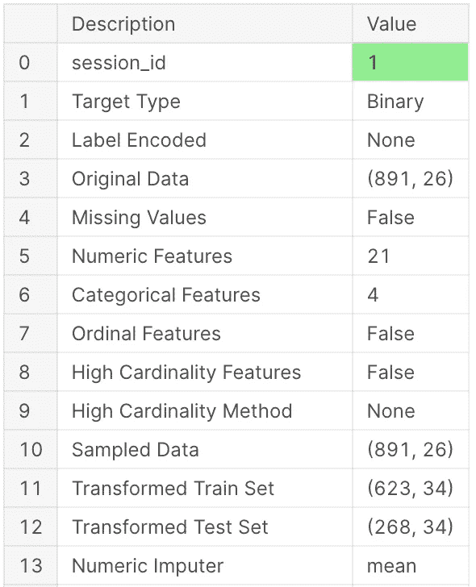
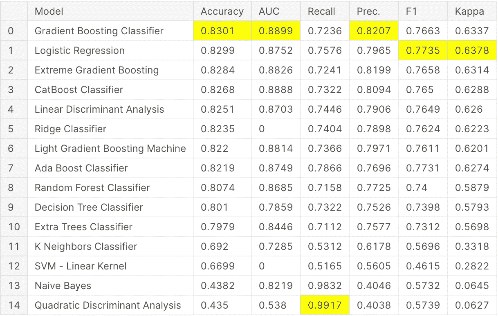
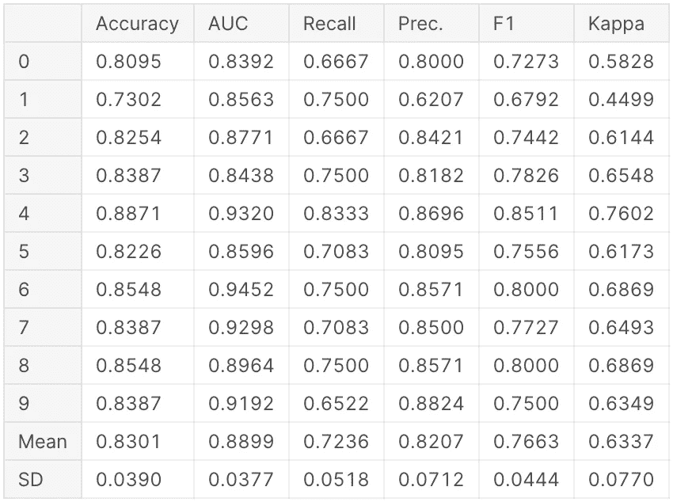
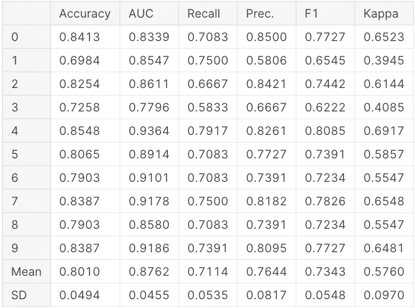
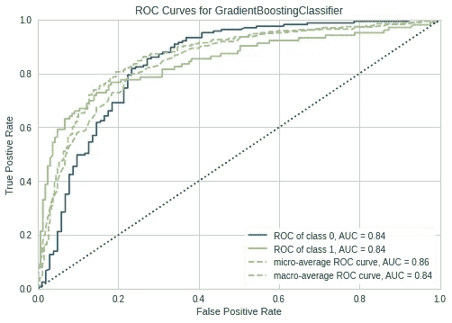
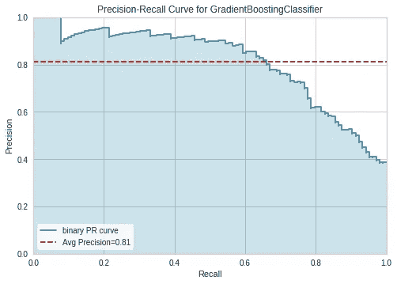
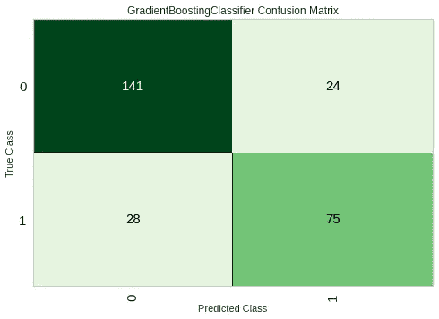
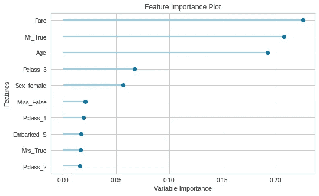
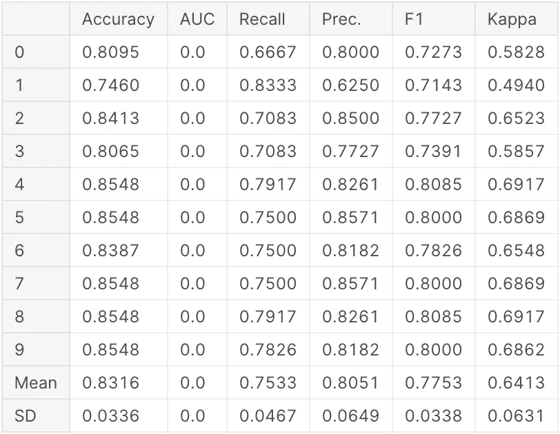
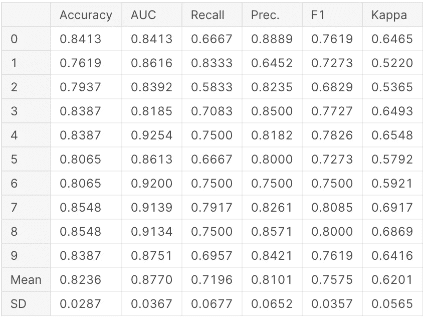

# 几秒钟内建模:使用 PyCaret 作为数据科学快速决策的工具

> 原文：<https://towardsdatascience.com/modeling-in-seconds-using-pycaret-as-a-tool-for-data-science-fast-decision-making-17c2c5642e17?source=collection_archive---------13----------------------->


弗兰基·查马基在 [Unsplash](https://unsplash.com/?utm_source=unsplash&utm_medium=referral&utm_content=creditCopyText) 上的照片

我在浏览数据科学家的空闲时间时偶然发现了 Pycaret。这是一个多功能库，您可以在其中同时应用/评估/调整许多模型。

根据 PyCaret 文档:*"*[*py caret*](https://pycaret.org/)*是 Python 中一个开源的低代码机器学习库，旨在减少从假设到洞察的周期时间。它使数据科学家和分析师能够高效地执行迭代的端到端数据科学实验，并且由于编码时间大大减少，他们可以更快地得出结论。”*

这个库看起来非常类似于 R 中的 caret 库，但是是用 Python 实现的。

在从事数据科学项目时，通常我们需要花很长时间来理解数据(EDA 和功能工程)，那么如果我们可以将花费在项目建模部分的时间减少一半会怎么样呢？

我们已经有(许多)关于泰坦尼克号数据集的帖子，所以我将只展示该库的应用。不过，如果你很好奇想了解整个 EDA/数据操纵/特征工程，可以在 [Kaggle](https://www.kaggle.com/michellgermano/titanic-using-pycaret) 或者 [GitHub](https://github.com/mgermy/modelling_disaster) 上查看我的内核。

# 1.建立图书馆

使用 PyCaret 的第一步是设置环境。这个设置的大部分是自动完成的，但是你可以手动设置一些参数。例如:

*   默认分流比是 70:30，但可以通过“列车大小”进行更改
*   默认情况下，k 倍交叉验证设置为 10
*   “会话 id”是我们经典的“随机状态”



setup()函数的输出

setup()的输出是一个表格，其中包含您可以设置的所有可能的选项。如你所见，有很多选择。如果你想尝试不同的方法，这是非常有用的。例如，您可以使用其中一个特征选项来查看模型是否有所改进。

有趣的是，你可以用这个函数预处理你的数据。要查看所有选项，请查看[库的文档](https://pycaret.org/setup/)。

# 2.比较模型



`compare_models()`的输出

`compare_models()`功能允许您一次比较多个型号。对我来说，这是使用 PyCaret 的一大优势。在短短的一行中，你就有了许多模型之间的表格比较。此外，它返回一些指标，如准确性、AUC 和 F1。另一件很酷的事情是库如何自动突出显示最好的结果。

一旦选择了模型，您就可以创建并调整它。在接下来的例子中，我将演示这些步骤。

# 3.创建和调整您的模型

让我们创建并调整我们的模型，看看库是如何处理它的。



使用 10 重交叉验证的 create_model()(左)和 tune_model()(右)的输出

我们创建了模型，并用 2 行代码对其进行了调整，如上所示。然而，我注意到的一件事是，模型的调整并没有提高我的模型的平均精度。我查了文档，上面写着:

*"为了调整超参数，使用了 tune_model()函数。该功能在预定义的搜索空间中自动调整模型的超参数，并使用分层交叉验证对其进行评分。”*

我在下面展示了为`DecisionTreeClassifier`调优模型的函数，因此我们可以对它的功能有一个概念。

```
from sklearn.tree import DecisionTreeClassifier param_grid = {"max_depth": np.random.randint(1, (len(X_train.columns)*.85),20), "max_features": np.random.randint(3, len(X_train.columns),20), "min_samples_leaf": [2,3,4,5,6],
              "criterion": ["gini", "entropy"],}
```

`tune_model()`功能将`RandomizedSearchCV`应用于考虑数据帧大小的模型。

# 4.模型性能可视化

PyCaret 的有趣之处在于它允许您轻松地评估您的模型性能。对我来说，创建这些图表有点乏味，所以有一个快速的方法来评估我的模型是完美的！有 15 种不同的地块可供选择。请参见下面的一些选项。



使用 PyCaret 可视化模型性能

与前面的步骤一样，生成这些图形的代码非常简单。我在下面的代码中展示了它:

# 5.混合模型

PyCaret 允许我们实现的另一种方法是混合模型。根据文献记载:`blend_models()`是一种集成方法，利用估计者之间的共识来生成最终预测。混合背后的想法是结合不同的机器学习算法，并在分类的情况下使用多数投票或平均预测概率来预测最终结果。

我们将尝试看看`blend_models()`是否会对我们的结果产生任何影响。`blend_models()`可以和一些预定义的模型一起使用，你可以用`estimator_list`通过。此外，在`Classification`的情况下，方法参数可用于定义“软”或“硬”，其中软使用预测的投票概率，硬使用预测的标签。为了简单起见，我就不通过车型列表了。



混合模型时的输出

我们的平均精确度从 0.8301 提高到 0.8316。没什么了不起的，但这是一点进步。

# 6.堆叠模型

PyCaret 还允许我们`stack_models()`。在文档中，它将堆叠模型定义为一种使用元学习的集成方法。叠加背后的想法是建立一个元模型，使用多个基本估计量的预测来生成最终预测。

与`blend_models()`不同的是，`stack_models()`要求通过`estimator_list()`，所以我选择了一些型号来尝试这种方法。



堆叠模型时的输出

如您所见，与其他方法相比，平均准确度没有提高。

# 7.总结

PyCaret 是一个多功能且易于使用的库。您可以用一行代码进行许多模型评估。

在比赛结束时，我使用 PyCaret 的最佳模型的平均准确度为 **0.79** 。然而，与任何新图书馆一样，仍有改进的余地。我将列出我在使用该库时发现的一些优点和缺点。

## 优点:

*   这使得项目的建模部分更加容易。您可以用一行代码创建许多不同分析。
*   在调优模型时，忘记传递参数列表。PyCaret 会自动为您完成。
*   您有许多不同的选项来评估模型，同样，只有一行代码。
*   由于它是建立在著名的机器学习库之上的，你可以很容易地将其与你的传统方法进行比较。

## 缺点:

*   这个库还是第一个版本，所以还不够成熟，容易出现 bug。
*   这是一个黑匣子，所以你真的看不到里面发生了什么。所以，我不会推荐新手使用。这会让学习过程变得有点肤浅。
*   在我的具体例子中，优化模型的函数并没有改进它。如果你们中的任何人对这件事有什么见解，请让我知道，这样我可以更新它。

暂时就这样了。我希望你喜欢这篇文章，如果你想查看我的一些作品，欢迎你访问我的 [GitHub](https://github.com/mgermy) 或 [LinkedIn](https://www.linkedin.com/in/michell-fontenelle-germano-1a654159/) 。