# 建模逻辑增长

> 原文：<https://towardsdatascience.com/modeling-logistic-growth-1367dc971de2?source=collection_archive---------4----------------------->

冠状病毒的逻辑增长。[疾控中心](https://unsplash.com/@cdc?utm_source=unsplash&utm_medium=referral&utm_content=creditCopyText)在 [Unsplash](https://unsplash.com/photos/k0KRNtqcjfw?utm_source=unsplash&utm_medium=referral&utm_content=creditCopyText) 拍摄的照片

## 用 Python 中的 Scipy 对 Logistic 增长函数进行非线性最小二乘估计——以中国冠状病毒数据为例

在之前的一篇文章中，我解释了如何使用[指数增长](/modeling-exponential-growth-49a2b6f22e1f)来模拟冠状病毒爆发的传播。它仅限于爆发的第一阶段，因为指数增长的最大限制是它永远不会停止增长。

在本文中，我将介绍这个模型的下一步:逻辑增长模型。如果你想跟着做，你可以在这里得到[笔记本，在这里](https://jooskorstanje.com/modeling-logistic-growth-corona.html)得到[数据。](http://jooskorstanje.com/full_data_logistic.csv)

# 为什么是物流增长？

逻辑增长是一个数学函数，可用于多种情况。逻辑增长的特点是在开始阶段增长增加，但在后期，当你接近最大值时增长减少。例如，在冠状病毒的情况下，这个最大限度将是世界上的总人数，因为当每个人都生病时，增长必然会减少。

在逻辑增长的其他使用情况下，该数字可以是动物种群的大小，该动物种群呈指数增长，直到它们的环境不能为所有动物提供足够的食物，因此增长变得更慢，直到达到环境的最大容量。

使用逻辑增长来模拟冠状病毒爆发的原因是流行病学家已经研究了这些类型的爆发，并且众所周知，流行病的第一阶段遵循指数增长，并且总阶段可以用逻辑增长来模拟。

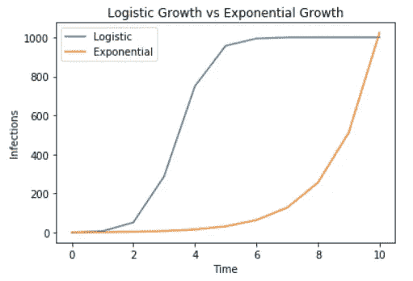

逻辑增长与指数增长

# 逻辑增长公式

逻辑增长的特征在于以下公式:

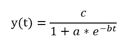

逻辑增长公式

其中:

*   *y(t)* 是任意给定*时间 t* 的病例数
*   *c* 是极限值，最大容量为 *y*
*   *b* 必须大于 0

我还列出了这个公式的另外两个有趣的地方:

*   开始的情况数，也叫*初始值*是 *: c / (1 + a)*
*   最大增长率出现在 t = *ln(a)* / b 和 y(t) = *c / 2*

## 数学爱好者的逻辑增长公式的深度挖掘

对于那些想对公式有更好的数学理解的人:上面的函数实际上是从皮埃尔·弗朗索瓦·维赫斯特发现的下面的微分公式推导出来的。我会一步一步地解释:

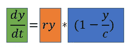

*   绿色部分 dy / dt 表示这个公式不是针对人口规模的，而是针对人口增长的。
*   我们可以看到 y 和 c 在公式中，所以我们理解人口的增长取决于 y 的值(人口规模)和 c 的值(最大容量)
*   当 y 等于 c 时(即群体处于最大规模)，y / c 将为 1。因此，蓝色部分将为 0，因此增长将为 0。
*   当 y 比 c 小很多的时候(人口远离极限)蓝色部分将几乎是 1。因此，增长由橙色部分定义。橙色部分实际上是指数增长的公式。

# 逻辑增长的一个简单例子

为了更清楚地说明这一点，我将举一个假设的例子:

*   最大患病人数 *c* ，为 1000 人
*   我们从 1 个感染者的*初始值*开始，所以 *c / (1 + a)* = 1，给 *1000 / (1 + a) = 1* ，给 *a = 999*
*   在感染开始时，每个病人会感染另外两个人，所以增长率*b = 2*
*   我们将考察从时间 0 到时间 10 的疫情发展

我们首先需要将 a 和 b 的值代入公式，以获得特定流行病的公式:

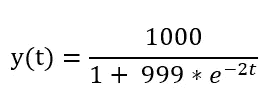

在 Python 中，这看起来如下:

然后我们可以用这个公式来计算从 0 到 10 的每个 t 值的 y 值。当我们这样做时，我们在每个时间点获得了以下感染人数，如下表所示。这表明，在开始时，感染人数增长很快，但随后就慢了很多，并在最大容量时结束。

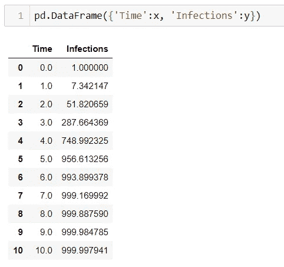

如果我们想用图表来表示，我们开始看到一个图表，看起来很像我们看到的关于冠状病毒的非常惊人的曲线:

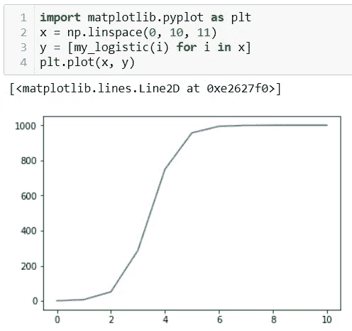

逻辑增长图

# 从冠状病毒数据到逻辑增长公式

现在，我们知道这个图或多或少有正确的形状，但我们需要做一个额外的步骤，使我们的分析有用。我们需要通过查看疫情传播的数据来找到*电晕疫情的真实曲线*。

在这种情况下，我将采用中国的数据:由于那里的增长已经大幅下降，逻辑曲线将是一个相当好的匹配。

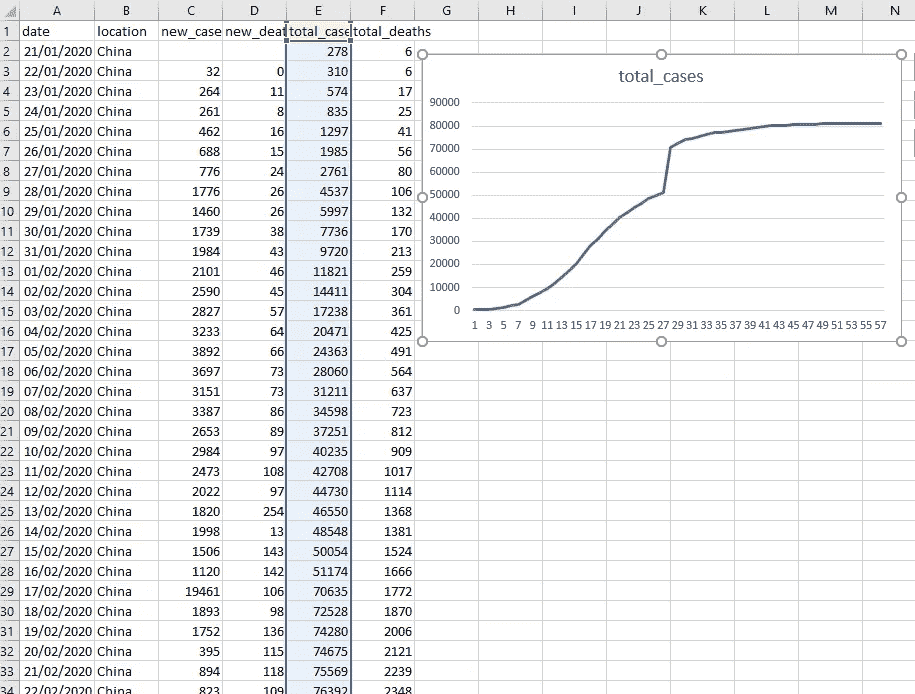

中国冠状病毒数据摘录。来源:[https://covid.ourworldindata.org/data/full_data.csv](https://covid.ourworldindata.org/data/full_data.csv)

# 中国物流增长的非线性最小二乘法

在查看数据时，我们只有每天的病例数。我们也有想要应用的公式，但是我们还没有公式中参数 a、b 和 c 的正确值。

不幸的是，不可能像指数模型那样将逻辑函数改写成线性回归。因此，我们需要一个更复杂的方法:非线性最小二乘估计。

**第一步** —读入数据

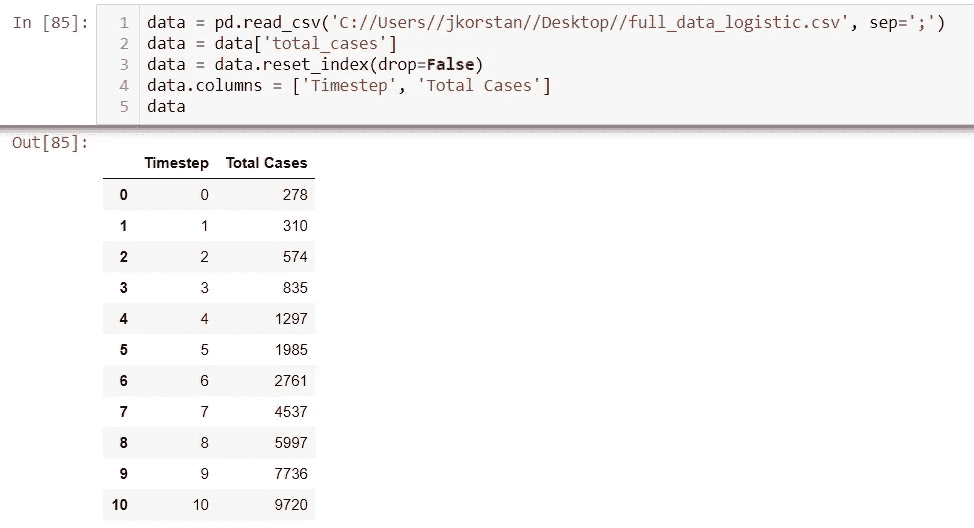

**第二步** —定义需要安装的物流功能

**第三步** —随机初始化 a、b、c

在这种情况下，我使用 np.random.exponential，但是您可以使用您喜欢的任何东西。但是请注意:您在这里的选择可能会影响步骤 5 的性能。

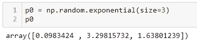

**第四步** —设置 a、b 和 c 的上下限

所有参数的下限都是 0。我把 b 的上界设为 3，因为在第一次尝试时我把它释放了，它变得太高了。a 和 c 的上限不会对曲线拟合产生负面影响，所以我让它们的上限相对较高。

**步骤 5** —使用 Scipy 曲线拟合进行非线性最小二乘估计

在这一步中，Scipy 进行非线性最小二乘优化，并给出使模型的最小二乘误差最小化的 a、b 和 c 的值。

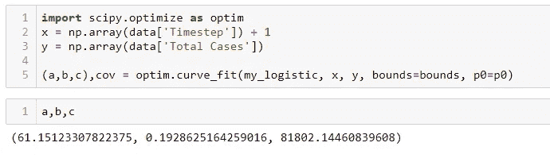

**第 6 步** —绘制拟合函数与实际数据

正如你在下面的图表中看到的，逻辑模型与实际的中国冠状病毒数据相差不远。

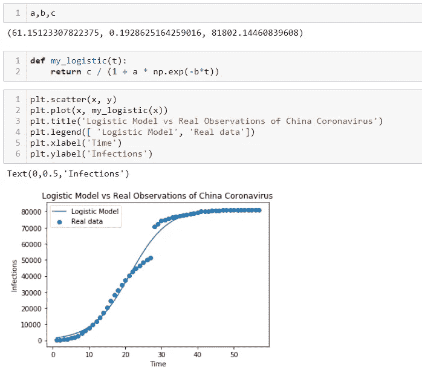

**第 7 步** —结束

我们发现了一个逻辑函数，它与从中国观察到的冠状病毒数据非常接近。为了在现实生活中真正使用这些信息，有必要进行大量的模型验证，比较不同模型的准确性和其他性能指标，并密切关注未来趋势是否符合所选模型。

这将远远超出本文的范围，本文只是试图说明如何拟合逻辑增长曲线，但是，使用该理论，我们可以陈述一些观察结果:

*   根据这个模型，c 是 81802，这将意味着中国感染人数的最大限度将是 81802。

我们还可以根据这个模型计算最大增长率出现的时间:

*   时间上的瞬间是:t =*ln(a)*/b = ln(61.5)/0.1929 =第 21 天
*   而那个时刻的感染人数是 y = *c / 2 = 40500*

有了一个完全有效的模型，这种类型的信息可以被决策者用来估计如何采取正确的措施。

我希望你已经清楚如何适应一个逻辑模型，以及如何在不同的用例中使用它。*感谢您的阅读，敬请期待更多文章！*

***编者按:*** [*走向数据科学*](http://towardsdatascience.com/) *是一份以数据科学和机器学习研究为主的中型刊物。我们不是健康专家或流行病学家，本文的观点不应被解释为专业建议。想了解更多关于疫情冠状病毒的信息，可以点击* [*这里*](https://www.who.int/emergencies/diseases/novel-coronavirus-2019/situation-reports) *。*