# 用物理学模拟市场崩溃

> 原文：<https://towardsdatascience.com/modeling-market-crashes-using-physics-485cebfddb8b?source=collection_archive---------12----------------------->

## 使用物理学概念识别市场崩溃的模式

格德·奥特曼德[皮查拜](https://pixabay.com/fr/?utm_source=link-attribution&utm_medium=referral&utm_campaign=image&utm_content=517113)的图片。

历史上有很多次市场崩盘(见[这份名单](https://en.wikipedia.org/wiki/List_of_stock_market_crashes_and_bear_markets))。重要的例子包括 1929 年的大崩盘，被称为“**”**(见下文):

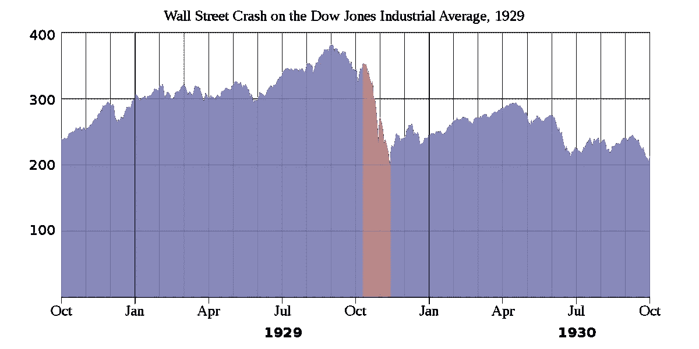

图 1:1928 年至 1930 年间道琼斯工业平均指数的暴跌。

还有 1987 年的那个“[黑色星期一](https://en.wikipedia.org/wiki/Black_Monday_(1987))”(见下):

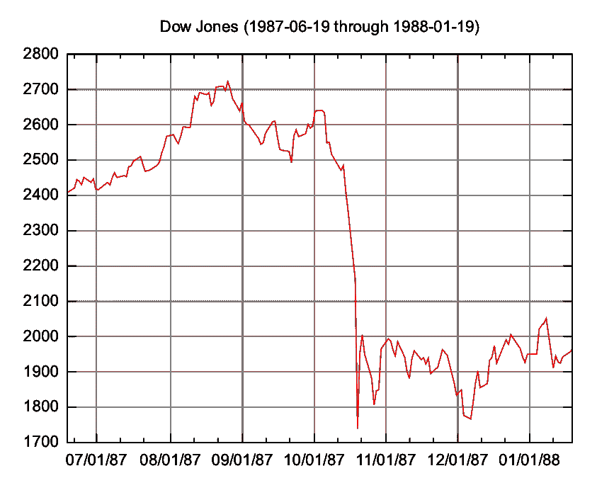

图 2:1987 年 6 月 19 日至 1988 年 1 月 19 日的[道琼斯工业平均指数](https://en.wikipedia.org/wiki/Dow_Jones_Industrial_Average)([来源](https://en.wikipedia.org/wiki/Black_Monday_(1987)))。

最近，市场在冠状病毒的担忧中暴跌，这是自 2008 年金融危机以来最严重的崩盘:

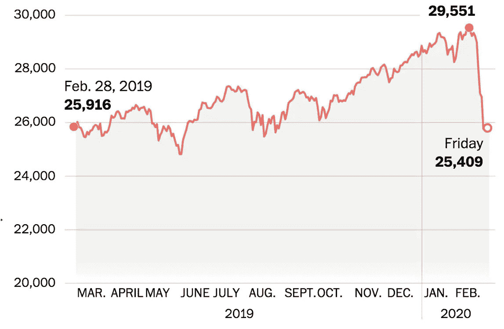

图 3:最近，道琼斯工业平均指数在冠状病毒的恐惧中暴跌。

撞车是[罕见事件](https://en.wikipedia.org/wiki/Rare_events)的例子。正如这里将显示的，主要是在[保罗和巴斯纳格尔](https://books.google.com.br/books?id=OWANAAAAQBAJ&printsec=frontcover&dq=Paul+and+Baschnagel+book&hl=en&sa=X&ved=0ahUKEwif7_uWgenoAhXII7kGHS_XAIEQ6AEIOTAC#v=onepage&q=Paul%20and%20Baschnagel%20book&f=false)之后，崩溃比通常的[高斯](https://en.wikipedia.org/wiki/Normal_distribution)或[李维分布](https://en.wikipedia.org/wiki/L%C3%A9vy_distribution)所能解释的更有可能发生。见下面两个分布的同步图。

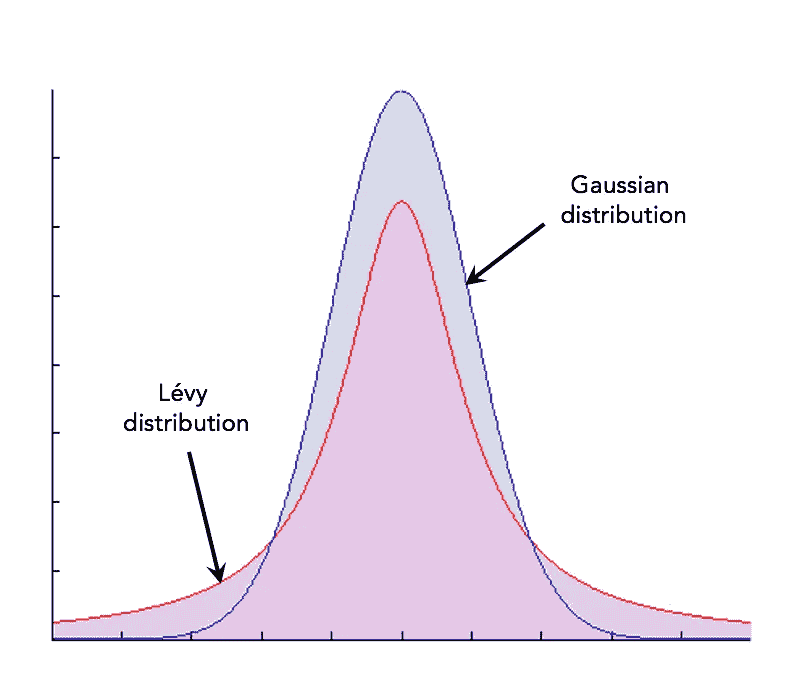

图 4:高斯分布和李维分布的比较([来源](https://stackoverflow.com/questions/51612755/heavy-tailed-and-normal-distribution-in-same-plot))。

考虑到崩溃，市场的行为可以分为质量上不同的阶段:

*   价格波动相关性很弱的正常交易阶段
*   一个[到崩溃](https://books.google.com.br/books?id=OWANAAAAQBAJ&printsec=frontcover&dq=Paul+and+Baschnagel+book&hl=en&sa=X&ved=0ahUKEwif7_uWgenoAhXII7kGHS_XAIEQ6AEIOTAC#v=onepage&q=Paul%20and%20Baschnagel%20book&f=false)的助跑阶段，其特征是价格波动之间的强相关性。

这种行为的变化将与多年来物理学中已知的一种现象相比较:[相变](https://en.wikipedia.org/wiki/Phase_transition)。在相变中，有几个物理量发散的[临界点](https://en.wikipedia.org/wiki/Critical_phenomena)。这些点将与市场崩溃进行比较。

# 崩溃的属性

正如在以前的一篇文章中详细讨论的那样(见下面的链接)，股票收益的分布更类似于李维分布，而不是高斯分布。前者有厚尾，在预测崩溃和其他类型的罕见事件时更有效。直观地假设，一次碰撞采样了尾部的非常远的边缘(用极端波动来标识)。

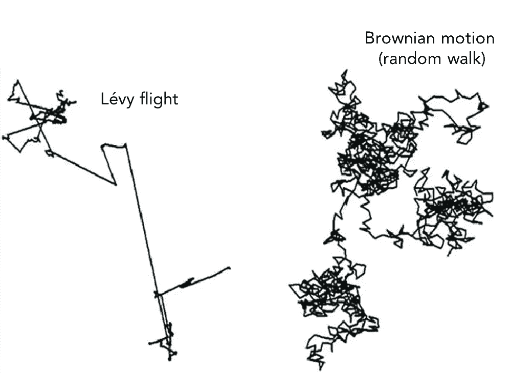

图 5:布朗运动和李维飞行的比较([来源](https://www.researchgate.net/publication/335353360_An_Enhanced_Version_of_Black_Hole_Algorithm_Via_Levy_Flight_for_Optimization_and_Data_Clustering_Problems/figures))。

按照 [Paul 和 Baschnagel](https://books.google.com.br/books?id=OWANAAAAQBAJ&printsec=frontcover&dq=Paul+and+Baschnagel+book&hl=en&sa=X&ved=0ahUKEwif7_uWgenoAhXII7kGHS_XAIEQ6AEIOTAC#v=onepage&q=Paul%20and%20Baschnagel%20book&f=false) 的说法，我们将把股票价格过程 *S* ( *t* )模拟为截断的无漂移李维飞行(参见上文李维飞行和布朗运动之间的比较)。

 [## 股票价格的统计特性

### 模拟股票市场的动态

towardsdatascience.com](/statistical-properties-of-stock-prices-15145be752a2) 

回想一下上面的文章，截断的李维分布是通过[截断通常的](https://projecteuclid.org/download/pdf_1/euclid.lnms/1215091135)[李维分布](https://en.wikipedia.org/wiki/L%C3%A9vy_distribution)的尾部得到的，使用的截断参数如下

等式 1:截断的李维分布。

其中 *N* 是*一个*归一化常数。下图显示了截断的李维分布和标准的李维分布。

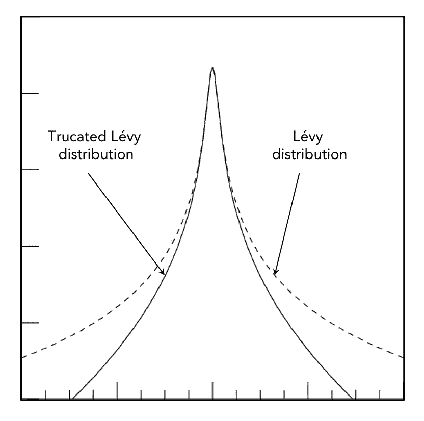

图 6:截断的李维分布与标准李维分布的比较([来源](https://agupubs.onlinelibrary.wiley.com/doi/full/10.1029/2004JA010947))。

根据 [Stanley 和 Mantegna](https://books.google.com.br/books?id=SzgXWCS7Nr8C&printsec=frontcover&dq=econophysics+stanley+mantegna&hl=en&sa=X&ved=0ahUKEwjGjcGb3b_oAhXWHbkGHXb3DWIQ6AEIKDAA#v=onepage&q=econophysics%20stanley%20mantegna&f=false) 的说法，分布的中心部分将由 *p* ( *l* 表示，其中 *l* 是价格波动，由指数为 *α* = 1.4 的 *l* < 6 *σ* 近似，其中 *σ* 人们可以按照本文中的算法生成 Lévy 增量:

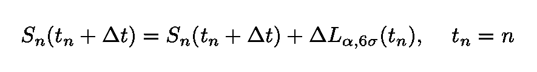

等式 2:无漂移的李维飞行。增量是从截断的 Lévy 分布中采样的。截止参数为δL = 6σ。

如果分布是对称的，指数 *α* 不等于 1，那么飞行变成:

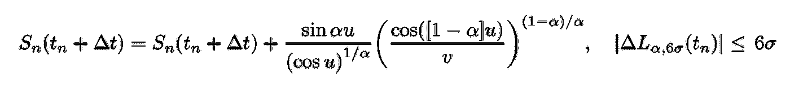

等式 3:对称分布的 Lévy 飞行，其中 u 具有[-π/2，π/2]之间的均匀分布，v 具有平均值为 1 的指数分布。

情商。3 是对称分布的 Lévy 飞行，其中:

*   *u* 是在[-π/2，π/2]之间均匀分布的随机变量
*   *v* 具有平均值为 1 的指数分布。

注意截止的存在使得 p( *l* )的所有矩都是有限的。此外， *S* ( *t→ ∞* )接近布朗运动。

## 除了最大偏移

让我们先定义某随机过程 *x* ( *t* )的最大值函数 *M* ( *t* ):

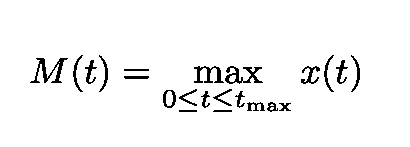

等式 4:给定间隔内样本路径 x(t)的最大值。

为了确定 *M* ( *t* )的分布，我们需要定义一个停止时间 *T.* 如果假设当 *x* ( *t* )第一次到达某个数字*a**，*时过程停止，我们可以定义:

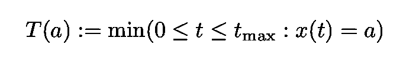

等式 5:进程 x(t)的停止时间。

可以证明(参见 [Paul 和 Baschnagel](https://books.google.com.br/books?id=OWANAAAAQBAJ&printsec=frontcover&dq=Paul+and+Baschnagel+book&hl=en&sa=X&ved=0ahUKEwif7_uWgenoAhXII7kGHS_XAIEQ6AEIOTAC#v=onepage&q=Paul%20and%20Baschnagel%20book&f=false) )标准布朗运动的最大值 *M* ( *t* )或最大偏移的概率密度为:

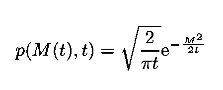

等式 6:标准布朗运动的最大值 *M* ( *t* )的概率密度。

在评估金融市场的风险时，这一结果至关重要。

我们对方程中参数的选择。如图 1 和 2 所示，极端事件的高斯行为是在大约 100 步的李维过程之后获得的。换句话说，价格波动的非高斯特征很快就消失了。

**下降** 人们也可以使用[下降](https://econpapers.repec.org/bookchap/wsiwsbook/10078.htm)的分布来衡量极端事件。下降是价格时间序列中从相对最大值到下一个相对最小值的百分比下降。请注意，水位下降方法避免了在极端偏移分布分析中出现的固定时间范围问题(因为它对极端情况之间出现的不同时间延迟进行平均)。

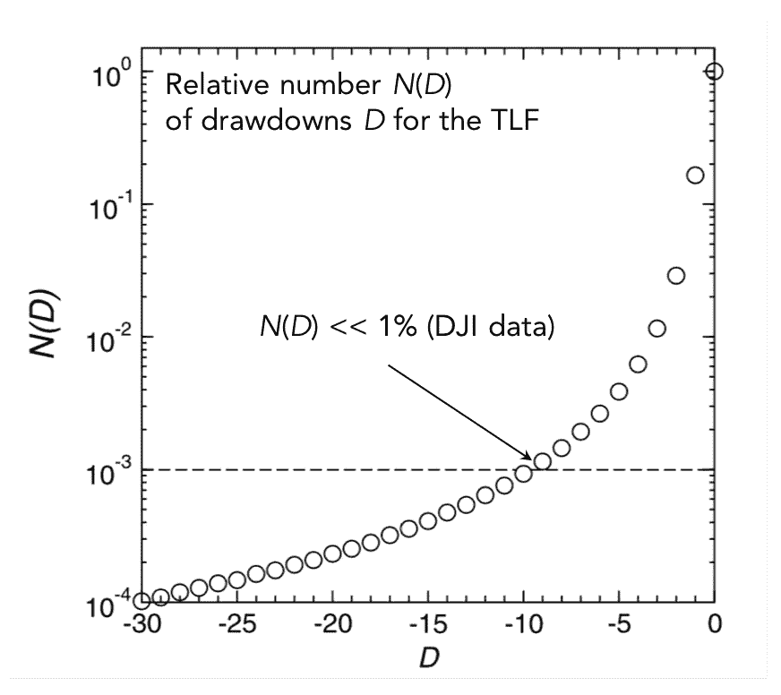

图 7:提款 D 的相对数量 N(D)的线性对数图([来源](https://books.google.com.br/books?id=OWANAAAAQBAJ&printsec=frontcover&dq=Paul+and+Baschnagel+book&hl=en&sa=X&ved=0ahUKEwif7_uWgenoAhXII7kGHS_XAIEQ6AEIOTAC#v=onepage&q=Paul%20and%20Baschnagel%20book&f=false))。

现在，在图 8 中，观察在 DJI 发现的两种状态。对于 *D* < 15% [保罗和巴斯纳格尔](https://books.google.com.br/books?id=OWANAAAAQBAJ&printsec=frontcover&dq=Paul+and+Baschnagel+book&hl=en&sa=X&ved=0ahUKEwif7_uWgenoAhXII7kGHS_XAIEQ6AEIOTAC#v=onepage&q=Paul%20and%20Baschnagel%20book&f=false)很好地符合一个指数。然而，两个图的比较表明，与模拟数据相比，DJI 在大约 30 %水平上的下降频率 *D* 大约高 10 倍。模拟数据预测提款的可能性要高得多。

图 8:DJIA 下降次数 N(D)与下降幅度 D 的对数线性图。这项分析每天进行，范围从 1900 年到 1994 年([来源](https://books.google.com.br/books?id=OWANAAAAQBAJ&printsec=frontcover&dq=Paul+and+Baschnagel+book&hl=en&sa=X&ved=0ahUKEwif7_uWgenoAhXII7kGHS_XAIEQ6AEIOTAC#v=onepage&q=Paul%20and%20Baschnagel%20book&f=false))。

# 制度变化和相变

根据这些数据，有人推测(如引言中所述),这些罕见事件不仅仅是“正常”统计中的异常值，相反，它们表明了两种状态之间的转换:一种状态具有“正常”动态，另一种状态具有巨大的波动。

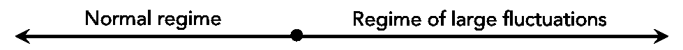

考虑图 9 中的以下两个崩溃。它们显示了 DJIA 在 1929 年和 1987 年崩盘前后的每日收盘报价。我们注意到这两个价格序列在崩盘前都是逐步上升的。这些阶跃是周期越来越小的振荡，在接近实际碰撞时消失(换句话说，随着碰撞时刻的临近，阶跃变得越来越短)。这种行为似乎是崩溃的前兆。

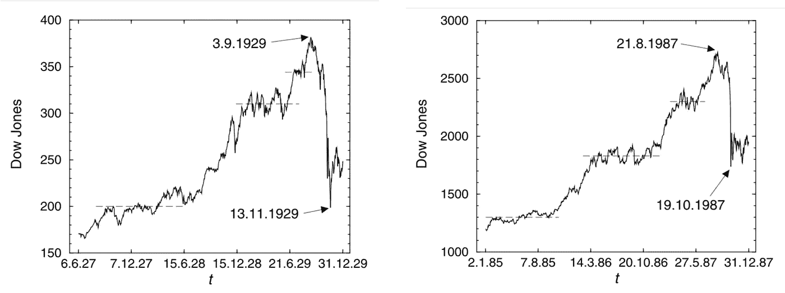

图 9:DJIA 接近 1929 年和 1987 年崩盘时的每日收盘报价。我们注意到，在崩溃之前，这两个系列都在逐步增加。此外，当我们接近崩溃时，步骤变得更短([来源](https://books.google.com.br/books?id=OWANAAAAQBAJ&printsec=frontcover&dq=Paul+and+Baschnagel+book&hl=en&sa=X&ved=0ahUKEwif7_uWgenoAhXII7kGHS_XAIEQ6AEIOTAC#v=onepage&q=Paul%20and%20Baschnagel%20book&f=false))。

此外，价格下跌的幅度表明，它们不仅仅是“正常”价格序列的罕见统计波动。

## 合作性和关键性

当崩盘即将到来时，大量交易者自发地决定卖出他们的股票(有一种“合作性”)，动摇了市场的流动性。需求不匹配导致价格下降，市场进入非均衡状态。似乎发生的情况是，交易员之间形成了相关性，从而引发了随后的崩盘。

在热力学和统计力学中，当系统接近所谓的系统临界点时，会发生极其相似的现象。在这篇文章中，作者建立了一个简单的模型来提供市场行为和热力学之间的联系。

**Cont-Bouchaud 模型** 考虑市场中平均交易量相同的 *N* ( *t* )个交易者。交易者 *i* 可以:

*   如果 *ϕᵢ* = 1 则买入
*   卖出 if *ϕᵢ* = -1
*   如果 *ϕᵢ* = 0，请等待

供求差额由下式给出:

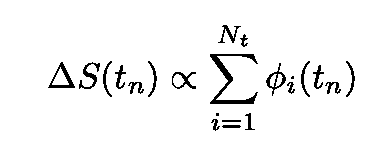

等式 7:供给和需求之间的差异。

提出了两个假设:

*   价格变化被假定为与供需不平衡成正比(这是小δS 所服从的)。
*   比例常数衡量市场对供求差异的敏感度(所谓的市场深度)。

通常，在市场中，交易者会相互“互动”。这种相互作用以两种不同的方式发生:

*   直接接触
*   间接的，通过跟踪价格的变化。

由于这种互动导致两个交易者采取共同的策略(他们要么买入，要么卖出，要么保持不动)，他们之间就产生了所谓的“纽带”。债券产生的概率是:

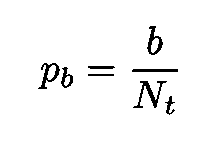

等式 8:债券创造概率，这对于大市场来说是个小数字。

考虑到 N(t) >>1，这是一个很小数量。参数 *b* 衡量交易者与同事互动的意愿。下一步是连接随机生成聚类的两个交易者，每个人对他们的活动都有不同的看法。

其中 *ϕ* ( *c* )=+1 或-1 包含活跃仓位的交易者，而*ϕ*(*c*)*=*0 包含非活跃仓位的交易者。参见图 10。

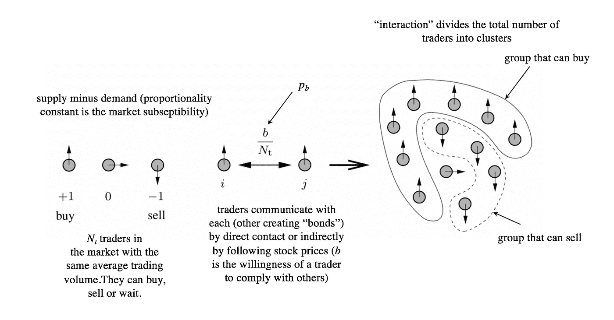

图 10:导致集群形成的步骤(改编自[来源](https://books.google.com.br/books?id=OWANAAAAQBAJ&printsec=frontcover&dq=Paul+and+Baschnagel+book&hl=en&sa=X&ved=0ahUKEwif7_uWgenoAhXII7kGHS_XAIEQ6AEIOTAC#v=onepage&q=Paul%20and%20Baschnagel%20book&f=false))。

等式中的和。7 可以重写为在 *N* ( *c* )簇上的和:

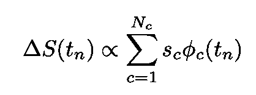

等式 9:等式中的和。7 以簇的形式书写。s 系数是聚类的大小。

其中 *s* ( *c* )是每个集群的大小。现在，我们将借用[逾渗理论](https://en.wikipedia.org/wiki/Percolation_theory)的一些结果，

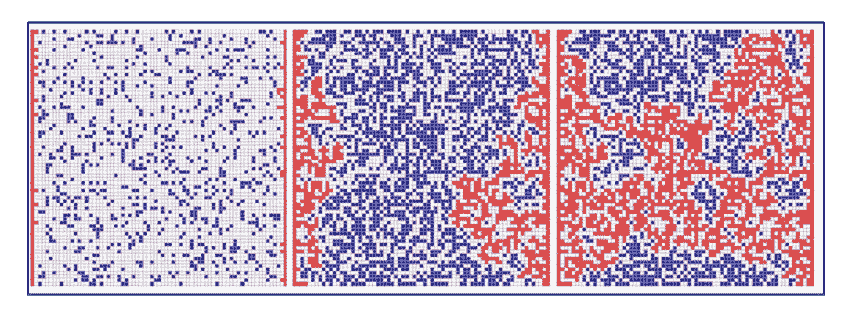

图 11:逾渗([来源](http://moreisdifferent.com/2013/11/16/percolation-theory-the-deep-subject-with-the-not-so-deep-sounding-name/))。

根据该方程，无限程键逾渗模型的团簇尺寸概率分布为

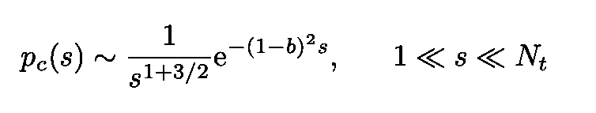

方程式 10:无限范围键渗透模型的团簇尺寸概率分布。

这对 *b* 大约 1 有效。值 *b* =1 是逾渗阈值，有限簇具有 *b* < 1。当 b =1 时，一个单独的星系团出现并渗透整个系统。这是一个临界现象的例子，其中强时间相关性产生不同的动态机制。当所有的交易者都联系在一起时，就会发生渗透(平均而言)。如果*b*1，更多的交易者进入集群，开始控制整体行为。如果这个全跨度集群的成员决定出售，新的动力就会导致崩盘。我们必须有*b*1 来规避这样的场景。但是，我们必须记住，b 必须保持接近 1。否则，截断的 Lévy 行为的保存将被破坏。似乎发生的是，内在的市场动态使 b 接近 1。市场的本质应该是这样的，它将系统推向 *b* ≈ 1，并在“正常”行为期间将其保持在临界区域。现在，物理学充满了显示这种行为的系统。许多模型在没有任何外部控制(如温度)的情况下逐渐向动态吸引子演化，当它们接近该吸引子时，它们表现出临界行为，表现出幂律和厚尾 pdf。这里的类比是精确的，因为是系统本身的动态将它带向临界点。这叫做[自组织临界](https://en.wikipedia.org/wiki/Self-organized_criticality)。

图 12:森林火灾模型是显示自组织临界性的系统的一个例子([来源](https://en.wikipedia.org/wiki/Forest-fire_model))。

因此，我们研究的模型认为股票市场是一个自组织的临界系统！

我的 [Github](https://github.com/marcotav) 和个人网站 [www.marcotavora.me](https://marcotavora.me/) 都有一些关于金融和其他主题的有趣资料，比如数学、数据科学和物理。看看他们！