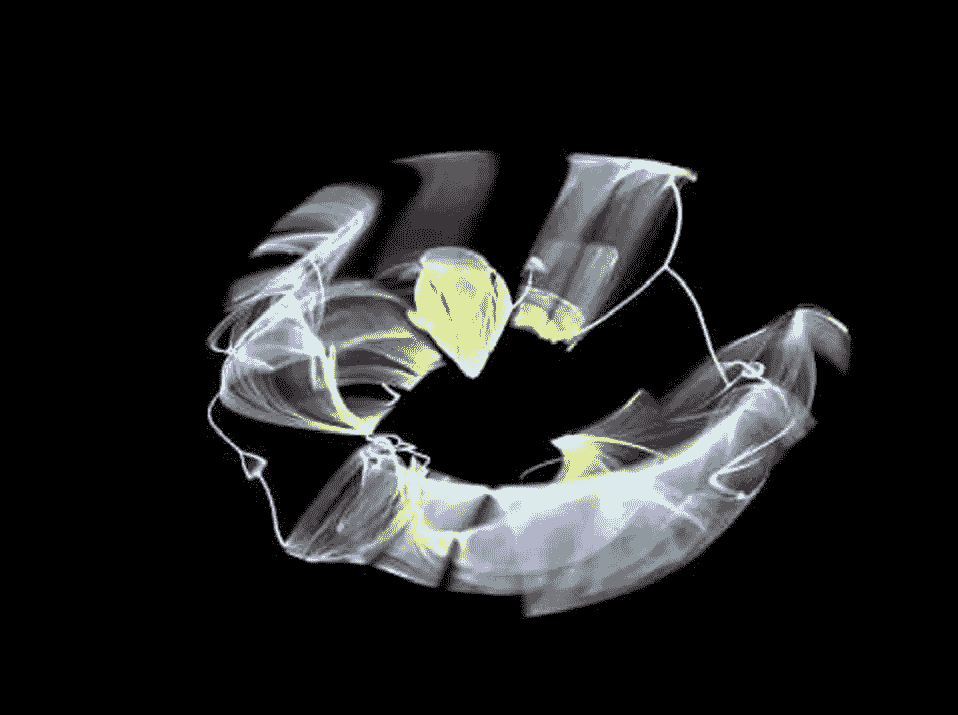
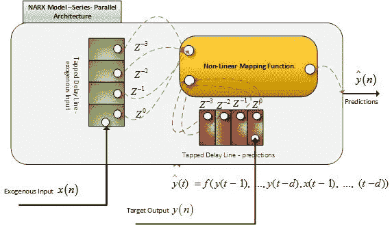
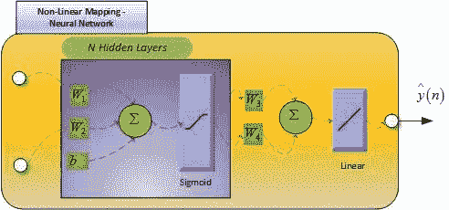
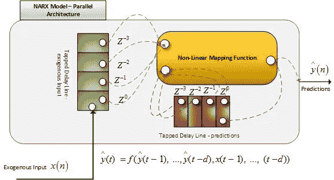
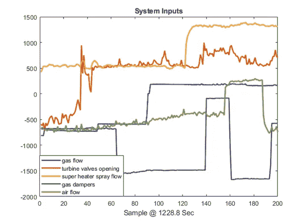
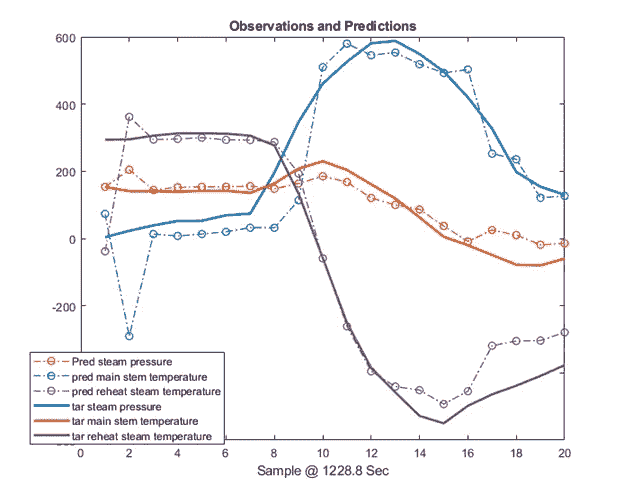

# 用神经网络建模非线性动态系统

> 原文：<https://towardsdatascience.com/modeling-non-linear-dynamic-systems-with-neural-networks-f3761bc92649?source=collection_archive---------21----------------------->

# 1.介绍

在 [数学](https://en.wikipedia.org/wiki/Mathematics)和[科学](https://en.wikipedia.org/wiki/Science)中，**非线性系统**是一个[系统](https://en.wikipedia.org/wiki/System)，其中输出的变化与输入的变化不成比例。工程师[、生物学家](https://en.wikipedia.org/wiki/Engineer)、[物理学家](https://en.wikipedia.org/wiki/Physicist)、[数学家](https://en.wikipedia.org/wiki/Mathematician)以及许多其他[科学家](https://en.wikipedia.org/wiki/Scientist)都对非线性问题感兴趣，因为大多数系统本质上都是非线性的。描述变量随时间变化的非线性[动力系统](https://en.wikipedia.org/wiki/Dynamical_system)，与简单得多的[线性系统](https://en.wikipedia.org/wiki/Linear_system)相比，可能显得混乱、不可预测或违反直觉。

我们将以工程系统为例，从统计/最大似然的角度来评估系统模型。工程系统的设计由原始设备制造商根据物理学/工程学的基本原理完成。数据科学家只获得输入和输出的集合。系统的建模——正式的系统识别——没有原始设计、领域知识和 OEM 的帮助；因此是不可能的。

那么，有没有可能根据 I/O 信息对系统建模；对于数据科学的非线性和动态系统来说也是如此吗？答案是肯定的，但即使在这种情况下，也需要一些领域专业知识来理解数据特性及其背后的数学基础。

仅基于观测数据的模型构建，没有关于其结构的任何详细信息；其特征仅在于其输入和输出，被称为黑盒模型。模型结构的元素没有物理意义。

当模型的结构和参数都完全已知时——完整的物理知识是可用的——我们就有了一个白盒模型。白盒模型可以根据先验信息构建，而不需要任何观测值。这也被称为实际系统的数字孪生或模拟。

# 2.什么是 NARX——非线性自回归外生建模？

图 NARX 模型的串并联架构。@版权

ARX 是自回归外生(ARX)的非线性推广，是线性黑箱系统辨识的标准技术。NARX 模型可用于建模各种各样的非线性动态系统。它是自动回归的，因为它的输出是以前值的回归。如果预测的映射函数是非线性的，则该模型称为 NARX。非线性映射可以是神经网络、高斯过程或其他。

图二。非线性映射函数。@版权

非线性映射函数被写成已知基函数的线性组合的情况将识别问题简化为线性回归。这是 NARX 模型非常受欢迎并成功应用于许多工业问题的一个原因。

对于静态系统，离散时间步长的输出仅取决于同一时刻的输入。静态网络可用于静态非线性系统建模。在动态系统中，给定时刻的输出不仅取决于当前的输入，还取决于系统先前的行为。动态系统是有记忆的系统——它们会随着时间而变化。

基于神经网络的 NARX 的架构如图 1 和图 3 所示。输入和输出都用抽头延迟线延迟。如果在输出信号路径中使用抽头延迟线，则可以构建反馈架构，其中前馈网络的输入或一些输入由网络的延迟输出组成。由此产生的网络是一个循环网络。该架构如图 3 所示。基本 NARX 网络用于多步预测。

假设目标的实际过去值是不可用的，并且预测本身被反馈到网络。因为在训练期间，我们可以访问实际的目标值，所以我们可以使用这些值来代替我们过去的预测。这有助于系统根据实际值而不是预测值进行训练。这是通过使用 NARX 网络的串并联版本实现的，如图 1 所示。该架构有两个优点。

首先是前馈网络的输入更加精确。

第二个是所得到的网络具有纯前馈结构，因此；静态反向传播可用于训练。

图 3。NARX 模型的并行体系结构。*观察预测被用作延迟输入的闭环系统。@版权*

# 3.发电厂示例

到为了让理解更具体，我们来建模一个电厂系统。数据来自 120MW 发电厂，参考 De Moor B.L.R .(版。)、 **DaISy:用于系统识别的数据库**，URL:[http://homes.esat.kuleuven.be/~smc/daisy/,](http://homes.esat.kuleuven.be/~smc/daisy/,)一座 120 MW 发电厂(法国桑布尔河畔)的数据。

数据采样时间为 1228.8 秒，大小为 200 个样本。输入有

1.气流

2.涡轮阀打开

3.过热器喷雾流量

4.气体阻尼器

5.气流

观察结果是

1.汽压

2.主阀杆温度

3.再热蒸汽温度

图 4 显示了电厂过程的输入传感器数据。

图 4。电厂工艺系统的输入

使用两个样本延迟、10 个隐藏神经元、Sigmoid 激活和 levengerg 损失函数来训练 **NARX** 网络。过去的外源输入和实际的目标观测值被用来预测当前观测值。如果没有记录实际目标观测值的过去值，网络将使用过去的预测值。但是，不建议用于工业先进过程控制的用例，因为预测会迅速偏离预期的估计。

图 5。输出预测和与观测值的比较。结果来自开环串并联架构。

# 结论

系统识别问题对于数据科学家来说是一个非常复杂的难题。

NARX 模型是能够以合理的精度对复杂动态系统进行建模的方法之一。

为了解决这些问题，需要用数据科学来增强领域专业知识、过程工程技能。

我们看到了一个串并联架构发电厂的建模示例。

# 下一步怎么样

还有哪些方法可以用来模拟非线性动态系统？将在下一篇文章中捕获它。

# 参考

1.  Luigi Piroddi 博士,“非线性模型识别”课程讲义
2.  肖肯斯 1 和伦纳特·荣，非线性系统辨识，arXiv:1902.00683v1 [cs .2019 年 2 月 2 日
3.  https://www.youtube.com/channel/UCAhRo1cCl1r_dFMVYaxTh5Q