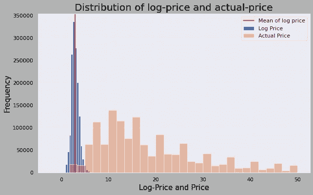
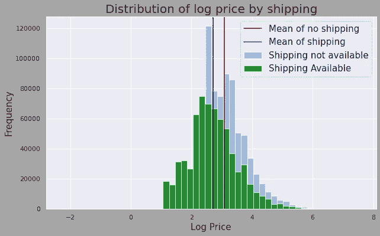
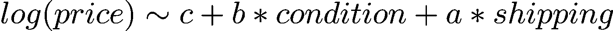
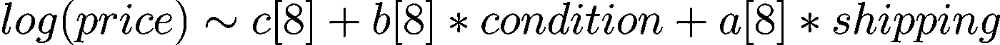
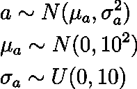
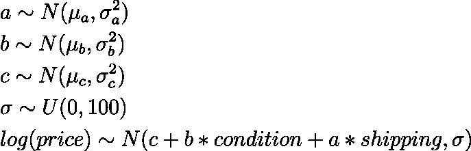
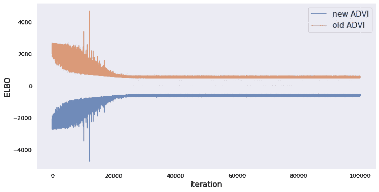

# 使用可扩展和分层的变分推理对商店价格建模

> 原文：<https://towardsdatascience.com/modeling-store-prices-using-hierarchical-variational-inference-6000f7701cb5?source=collection_archive---------35----------------------->

在本文中，我将使用来自 Kaggle 的 [Mercari 价格建议数据](https://www.kaggle.com/c/mercari-price-suggestion-challenge/data),通过在 PyMC3 中实现的自动微分变分推理来预测商店价格。这个价格模型是由 Susan Li 在[的这篇文章](/bayesian-strategy-for-modeling-retail-price-with-pystan-fd0571ed778)中使用 PyStan 完成的。我的一些作品受到了她的代码的启发。

我将更多地解释数据集、我执行的转换、我选择的模型以及我从中获得的准确性。请注意，本文的目的是探索不同的技术来更好地建模价格，并思考一些更好地构建数据的方法。我不会实现所有这些技术，但是我会在整篇文章中讨论它们。

# **价格建模的用例**

每天，电子商务网站上都会发布数百个新的房源。因为电子商务网站竞争激烈，所以上市价格有很大的差异，如果上市价格不在一般客户的承受能力范围内，就非常容易失去一个客户。影响产品价格可行性的因素有很多。这包括产品的类型、状况、品牌以及免费送货等服务的可用性。在这个作业中，我们将把这些物品的价格作为这些因素的函数来建模。

预测列表的价格对电子商务公司非常有帮助，原因如下:

*   客户的价格决定会影响 Mercari 获得的在线流量，这与他们的声誉和广告利润等相关。因此，挂牌价格必须是最优的，而不是由客户随机生成的
*   知情的价格预测有助于卖家获得大量的客户关注，从而增加快速销售产品的机会，而无需等待更长的时间。
*   价格预测工具还改善了销售者和顾客的产品体验，因为价格是合理的，并且销售者不必花费大量精力来计算价格和降低价格以吸引顾客。
*   因此，价格预测工具将对卖家和客户的体验产生重大影响，同时提高 Mercari 的盈利能力和声誉。

# **数据**

这些数据是从 Mercari 的 Kaggle Challenge 获得的，用于建立一个建议模型，根据客户提供的信息预测列表的价格。原始数据集包含大约 140 万个数据点。(梅尔卡利，2018 年)

对于每个数据点，我们都获得了以下指标:

*   条件 ID:指定产品的条件(从 1 到 5 不等)。
*   名称:列表的名称
*   类别名称:产品的一般类别。大约有 1500 个不同的类别。
*   品牌名称:品牌的名称，如果没有品牌，则为 Nan。
*   价格:客户列出的价格。
*   航运:如果航运可用
*   项目说明:列表的说明

# **数据清理、整合和转换**

为了更好地分析数据，我们执行一些操作来合并文本数据:

*   数据中大约有 1500 个不同的类别。对所有这些类别建模是不现实的。因此，我没有使用 sklearn 的标签编码器，这是许多在线模型建议的选择。相反，我手动探索了这些数据，并将其分为 8 大类:男性、女性、电子产品、运动、美容、儿童、家居和其他。使用实际类别中的关键字，我将每个类别归类为八大类别代码之一。

```
**# Loading and processing the data here**
df = pd.read_csv(‘train.tsv’, sep=’\t’)
df = df[pd.notnull(df[‘category_name’])]category_codes = []**# Analysing the words in each category and classifying them as either of the 8 numerical categories**for i in df.index:
    category = df['category_name'][i]

    if 'Men' in category:
        category_codes.append(0)
    elif 'Women' in category:
        category_codes.append(1)
    elif 'Electronics' in category:
        category_codes.append(2)
    elif 'Sports' in category:
        category_codes.append(3)
    elif 'Beauty' in category:
        category_codes.append(4)
    elif 'Kids' in category:
        category_codes.append(5)
    elif 'Home' in category:
        category_codes.append(6)
    else:
        category_codes.append(7)df['category_code'] = category_codes
```

注意，上面的方法不是最佳的，但它是一种简单有效的情感分析方法。人们可以更深入地对每个产品的 category_name 和 item_description 进行情感分析，这也将加强处理后数据的质量。例如，可以分析诸如“良好状态”或“工作正常”等词的存在，并给它们打分/评级。不同种类的单词的存在将告知每个产品的总得分，这可以成为我们数据的一个特征。

*   条件 id 和运输代码未更改，因为它们是可用于分析的分类变量。
*   我不会在此分析中使用商品名称，但也可以使用情感分析来提取相关信息，如产品的尺寸或功能，以强化其价格。
*   对于品牌，可以建立一个简单的分类器，将较大的品牌分类为“2”，较小的品牌分类为“1”，没有品牌分类为“0”。为了简化模型，我不会实现这个策略，但是我鼓励您尝试一下。
*   我们把价格转换成对数标度。这使得价格分布更加平滑，从而便于建模。这也很重要，因为价格有一个乘数。你可以在这里阅读更多相关信息[。但本质上，价格是通过乘以一个因子而变化的。例如，如果可以发货，价格将乘以 1.1。在贝叶斯统计中，对这些乘法因子进行建模更加困难，因为它们在采样期间更有可能发散。**因此，对数标度将乘法因子转换为加法因子，我们可以使用线性回归对其建模。**也使得价格成为实数线上的连续变量。](http://www.successware.net/support/pc/guides/Pricing/Pricing_Theory/The_Mechanics_Of_Pricing.htm)

# **更好地理解数据**

让我们看一下价格和对数价格分布，直观地了解这种转变:



价格与实际价格的对数分布。来源:自己的工作

在上图中，我们可以看到对数价格的分布类似于更容易建模的正态分布。



按航运可用性划分的原木价格分布。

上图挺有意思的。免运费产品的平均价格实际上小于免运费产品的平均价格，但我们可以预期相反的情况，因为运费会增加价格成本。这有两个问题:

1.  这些分布并不完全是正态分布，因此，执行 t 检验或比较平均值并不是比较这些分布的最佳方式。
2.  这里的比较分析也可能被混淆。可能的情况是，我们的无运费产品数据包含一般较便宜的产品，或者包含在分销中占主导地位的特定类别的产品。例如，大多数免运费的产品通常更便宜(也可以很容易地运送)，而更重、更大和更贵的产品通常没有免运费。因此，运费为 2 美元的 10 美元产品会被宣传为 12 美元，但更贵的产品是没有运费的产品，它们的价格(虽然不包括运费)会比包含运费的更便宜的产品高得多。

以上是数据中**结构偏差的一个经典例子，这种偏差源于我们作为人类所做的选择。**作为一名数据科学家，理解并解释这些源于非统计选择的偏差非常重要。**没有简单的方法来纠正这种偏见。一种方法是执行个体匹配。基本上，我们会浏览数据集，挑选看起来完全相同或非常相似的记录。他们之间唯一的主要区别是免费送货的可用性。因此，我们将构建一个包含两个子集的新数据集，两个子集的产品分布非常相似，但一个没有发货，而另一个有更多发货。**

您可以在文章末尾的笔记本中找到这个可视化的代码。欢迎您绘制自己的可视化图，并思考数据集中可能存在的偏见。

# **车型**

我们先来考虑一个简单的线性回归。(虽然线性回归看起来非常简单，但它们功能强大且可扩展。因此，数据科学家更喜欢用线性回归建模的方式处理他们的数据。)



这里，c 是模型中的常数，而 a 和 b 是运输系数和条件系数。为了使它变得现实，我将使用变量池。这意味着我将为每一类产品创造不同的 a、b 和 c 值。因此，“电子产品”将有自己的一套参数，“家居装饰”也将有自己的一套参数。如果我没有对一个或多个参数进行池化，这将被称为部分池化。让我们更新等式:



这里,[8]表示参数反映了 8 个不同的参数，每个参数对应一个指定的类别。

## **a、b、c 的含义:**

我们用 a、b 和 c 建立了一个模型，但是它们是什么意思呢？就线性回归而言，c 是截距，而 b 是条件系数和运输系数。在价格方面，“c”就像是每个类别的基础价格。此类别中的每个产品都有一个基准价格。该基线受产品状况的影响。这种影响的规模由‘b’控制。原木价格还受到运输的影响。这种影响的规模由“a”控制

# **建模基础设施**

既然我们已经定义了模型的基本结构，我们需要构建基于这些参数的基础先验分布。我将在这里使用层次模型，因为层次提供了值的灵活性，并允许同一参数的不同值有它们的分布，而不是依赖于同一个值。

例如，每个“a”将从平均值和标准偏差的正态分布中取样，这些正态分布将从它们自己的先验中进一步取样。因此，每个“a”都有自己的正态分布，这对于满足联营假设很重要。否则，它们可能会相互关联，从而威胁到模型的有效性。



这里‘a’的超上级是 mu 和 sigma。μ是从正态分布采样的，而标准差是从 0 到 10 之间的均匀分布采样的。请注意，标准差必须为正，因此，我们不能使用正态先验，因为正态分布的支持是整个实数行。这些先验被选为未知先验，因为我们对这些系数或它们的影响知之甚少。我们将让模型找到并收敛于最佳可能值。

我们也为“b”和“c”复制相同的模型。我们将正态分布置于两者之上，并通过其超参数“mu”和“sigma”进一步参数化。最后，似然性被建模为另一个正态分布，该正态分布被置于具有噪声“sigma”的最终线性方程上。



# **执行推理**

现在我们已经建立了我们的模型，我们想进行推理，以获得 a、b 和 c 的后验分布，它通知我们理解模型的能力。我们可以允许 MCMC 从中生成样本，或者我们可以执行变分推断，将这些分布放在我们的参数上，并优化它们的超参数值。让我们从这个分析中回顾一下我们的目标:对产品价格进行可伸缩的推断。

## 对 MCMC 及其缺点的思考；

Susan Li 在[的这篇文章](/bayesian-strategy-for-modeling-retail-price-with-pystan-fd0571ed778)中使用 PyStan 进行了类似的分析。PyStan 是一个很棒的工具，它使用一个 NUTS 采样器来执行自动哈密尔顿蒙特卡罗采样。但是 HMC 是一个非常慢的算法。在这个数据集中，我们有大约 140 万个数据点。这使得算法的平均运行时间约为 2-3 小时。虽然有不同的方法来优化 PyStan 的效率，但它不是一个可伸缩的算法。你可以在这里了解更多关于 PyStan [的线性回归。](https://mc-stan.org/docs/2_18/stan-users-guide/linear-regression.html)

PyStan 的另一个重要限制是缺乏可伸缩的适应性。随着新数据的生成和处理，我们希望我们的算法能够实时更新它们的参数，以便模型每天都变得更加智能。我们也希望这一过程快速高效地进行。因此，PyStan 可能不是在线市场模式的最佳选择。你可以在这里阅读更多关于 PyStan [的信息。](https://pystan.readthedocs.io/en/latest/)

# **自动微分变分推理**

如果你不太了解 MCMC 或者变分推理(VI)，你应该读一下[这篇文章。](/bayesian-inference-problem-mcmc-and-variational-inference-25a8aa9bce29)总而言之，VI 对给定的参数进行分布，然后优化这些分布。

VI 使用了一种叫做 KL-Divergence 的东西，它是一种成本函数，可以帮助我们理解我们的结果应该是什么样子，以及我们想要达到的目标之间的距离。但是 VI 不是全自动的，需要微调。因此，我们将使用一个称为自动微分变分推理(ADVI)的 VI 版本，它优化了一个不同的参数(类似于 KL-Divergence，但更容易优化)。该算法使用不同的库来区分 ELBO(我们这里的度量)并找到最大值来更新参数。它使用坐标下降(沿坐标轴优化)来实现参数更新方程。我知道这是很多信息，但是我推荐你阅读[这篇文章](https://luiarthur.github.io/statorial/varinf/introvi/)来熟悉它。

**这里有一个重要的注意事项:**当我们在 VI 中执行推理时，我们对定义每个模型参数(a、b 和 c)的分布的变分参数(这里是超参数)执行推理。因此，模型变量成为一个过渡参数，其分布通过对变化参数(所有 mu 和所有 sigma)的推断来确定

# **在 PyMC3 中建立模型**

对于这个实现，我们不会从头开始构建 ADVI 算法。相反，我们将使用 PyMC3 的内置特性来构建我们的模型，并指定超先验、先验、模型和推理策略。

为了使推断更快，我们将在 PyMC3 中使用迷你批处理。迷你批次减少了训练数据集的大小。在初始设置中，参数更新将要求参数查看整个训练数据集。不幸的是，我们有 140 万个数据点要看。对于大约 25000 次迭代(我们的目标)，这是一个很大的工作量。因此，迷你批次允许我们从训练数据集中取样。他们创建训练数据集的小批量(大小为“b”)，并且每次更新的训练都在小批量上进行。每次迭代后，批次都会更新。

经过大量的迭代，微型批次在优化 ELBO 方面变得非常有效，因为更新方程几乎可以查看每个数据点，但不是同时查看所有数据点，这使得该过程更具可扩展性。

下面是为我们构建模型的代码。(我的灵感来自于 PyMC3 网站上提供的[这个](https://docs.pymc.io/notebooks/hierarchical_partial_pooling.html)分层部分池示例，其中一些代码是从他们的笔记本中获得的。)

```
import pandas as pd
import matplotlib.pyplot as plt
import seaborn as sns; sns.set()
import numpy as np
%matplotlib inline
%env THEANO_FLAGS=device=cpu, floatX=float32, warn_float64=ignore
import theano
import theano.tensor as tt
import pymc3 as pmcategory_code_new = df.category_code.values
shipping = df.shipping.values
condition_id = df.item_condition_id.values
log_price = df.log_price.values
n_categories = len(df.category_code.unique())**# Minibatches below. The batch size is 500**log_price_t = pm.Minibatch(log_price, 500)
shipping_t = pm.Minibatch(shipping, 500)
condition_t = pm.Minibatch(condition_id, 500)
category_code_t = pm.Minibatch(category_code_new, 500)**# Setting the hyperpriors (mu,sigma) for a,b,c**with pm.Model() as hierarchical_model:
    mu_a = pm.Normal('mu_alpha', mu=0., sigma=10**2)
    sigma_a = pm.Uniform('sigma_alpha', lower=0, upper=10) mu_b = pm.Normal('mu_beta', mu=0., sigma=10**2)
    sigma_b = pm.Uniform('sigma_beta', lower=0, upper=10) mu_c = pm.Normal('mu_c', mu=0., sigma=10**2)
    sigma_c = pm.Uniform('sigma_c', lower=0, upper=10)**# Setting the priors here. Note the shape variable.
# The shape must be equal the number of categories. (8 here)**with hierarchical_model:
    a = pm.Normal('alpha',mu=mu_a,sigma=sigma_a, shape=n_categories)
    b = pm.Normal('beta',mu=mu_b, sigma=sigma_b, shape=n_categories)
    c = pm.Normal('c', mu=mu_c, sigma=sigma_c, shape=n_categories)**# Setting the likelihood here as another gaussian**with hierarchical_model:
    **# Estimated log prices** log_price_est = c[category_code_t] + b[category_code_t] *
                     condition_t + a[category_code_t] * shipping_t **# Noise or standard deviation of the likelihood**
    noise = pm.Uniform('eps', lower=0, upper=100) **#Likelihood function. Note that we still need to provide the 
    # total size of the dataset for convergence check.** lp_like = pm.Normal('lp_like', mu=log_price_est, sigma=eps,
             observed=log_price_t, total_size=len(df))
```

## **优化时间！**

让我们在 PyMC3 中将优化策略定义为 ADVI，并执行推理。

```
from pm.callbacks import CheckParametersConvergence**# Defining inference method and parameter checks**with hierarchical_model:
    inference = pm.ADVI()
    approx = pm.fit(100000, method=inference, callbacks= 
                    [CheckParametersConvergence()])plt.figure(figsize=(12,6))
plt.plot(-inference.hist, label='new ADVI', alpha=.8)
plt.plot(approx.hist, label='old ADVI', alpha=.8)
plt.legend(fontsize=15)
plt.ylabel('ELBO', fontsize=15)
plt.xlabel('iteration', fontsize=15);
```



ELBO 在多次迭代中的收敛性。旧 ADVI 和新 ADVI 提供了对每次迭代级别的优化的深入了解。来源:自己的工作

从图中，我们可以说 ELBO 收敛得很好，并在大约 25000 次迭代时达到最小值。我们观察到最小值出现在 490.22，而最大值出现在 4706.71。你可能会问——在 10000 次迭代左右，ELBO 中的峰值是什么？这些更新违背了我们的目标。发生这种情况可能有多种原因，最有可能的是微型批次中的巨大偏差，导致参数更新偏离其轨迹。但正是随机化的美妙之处(和数学原理)帮助我们最终得到正确的结果。

# **变分参数的后验分布**

还记得我们没有执行 MCMC 吗？是的。所以我们得到的不是样本，而是变分参数的值，它们是模型参数的超先验，然后也是模型参数的超先验。我们通过拟合模型得到的变量“近似值”将为我们提供每个参数的平均值和标准偏差。我们将获得一个均值和标准差字典，可以用参数值进行索引:

```
means = approx.bij.rmap(approx.mean.eval())
sds = approx.bij.rmap(approx.std.eval())a_mean = means['alpha']
a_std = sds['alpha'] **# for each model and variational parameter**
```

我们对变分参数的分布不太感兴趣，因为它们的先验不是动态的。我们将快速浏览一下它们的均值和标准差:

1.  mu_a ~ N(-0.00022505，0.7320357)
2.  mu_b ~ N(6.097043e-05，0.7320404)
3.  mu_c ~ N(0.00212902，0.7320338)

正如所料，它们以 0 为中心，因为这些管理部门的先验也以 0 为中心。标准差已经重新调整了(从最初的 10 到小得多的 0.732)。所有这些意味着分布彼此非常接近。因此，a、b 和 c 的实际值是从彼此非常接近的高斯样本中采样的。需要注意的重要一点是，虽然均值的后验概率是相似的，但基于所执行的推断，模型参数的实际后验概率可能会非常不同。

# 模型参数的后验分布

我们使用下面的代码来绘制后验分布的 PDF。(这里不能做直方图，因为我们没有一组样本。)

```
from scipy import stats**# List of categories**
category_names = ['Men','Women','Electronics','Sports','Beauty', 
                  'Kids', 'Home', 'Other']**# Model parameters names**
model_param = ['alpha','beta','c']fig, axs = plt.subplots(nrows=3, figsize=(12, 10))**# Plotting a set of PDFs for each Model parameter**
for var, ax in zip(model_param, axs):
    mu_arr = means[var]
    sigma_arr = sds[var]     ax.set_title(var) **# Title of the subplot** for i, (mu, sigma) in enumerate(zip(mu_arr.flatten(),
                                 sigma_arr.flatten())):
        sd3 = (-4*sigma + mu, 4*sigma + mu)
        x = np.linspace(sd3[0], sd3[1], 300)
        y = stats.norm(mu, sigma).pdf(x) **# PDF of the parameter**
        ax.plot(x, y, label='Coefficient of {}'. format(
                                           category_names[i]))
    ax.legend()
fig.tight_layout()
```

以下是混合模型参数的后验分布:


让我们分析模型参数:

1.  对于基准价格(c)，男装的基准最高，其次是女装、家居装饰和运动。其他产品有最便宜的基线。这可能是因为较小的杂项产品没有很多价值，因为它们不属于任何主要类别。
2.  对于 beta (b ),产品条件对某些类别的影响是积极的，而对其他类别则是消极的。更重要的是，它是对数线性模型中的一个系数。因此，这些系数代表实际价格的变化百分比。恶劣条件的负面影响最大的是女装，恶劣条件会导致价格下降 15%。这同样适用于男装和家居装饰。运动和童装下降了 5%。有一个电子价格的增长(约 12%)与一个坏的条件，这是违反直觉，但同样，这将需要验证匹配。
3.  对于阿尔法(a)，免费送货的影响很大程度上是负面的(正如我们在之前的初始分析中看到的)。男装的负面影响最小(约-18%)，而电子产品的负面影响最大(约-50%)。你应该更多地考虑数据的结构偏差，以及类别是否会加强偏差。**提示:**大多数电子产品需要更多的运输/处理费用，因此不提供免费运输。

从上述分析中，我们可以得出结论，最违反直觉的结果出现在电子产品和其他产品类别中，而其他产品没有出现极端结果。为了更好、更准确地建模，对该数据集执行匹配是值得的。

**不确定因素**

从后验分布可以看出，很多分布是非常确定的(比如女装的参数)。另一方面，运动产品的参数更加不确定(标准偏差为 0.025，约为实际价格的 2.5%变化)。因此，当我们根据这些结果建立预测模型时，我们需要小心这些不确定性，并将它们纳入我们的结果。

# **一个简单的预测模型**

从技术上来说，我们可以从我们的线性回归结果中建立一个确定性预测模型:

```
means = approx.bij.rmap(approx.mean.eval())def predict(shipping, condition, category):
    c = means['c'][category]
    b = means['beta'][category]
    a = means['alpha'][category] return np.exp(c + b*condition + a*shipping)
```

但是 VI 没有提供预测区间，而 MCMC 提供了。要获得预测区间，我们只需构建 a、b 和 c 的置信区间。然后，我们使用这些区间来评估相同输入在 a、b 和 c 的下限/上限处的相同预测。

# 与 HMC 坚果取样器结果的比较

在同一个模型上，我们也可以执行 HMC 螺母抽样来获得后验分布。下面是实现这一点的代码:

```
with hierarchical_model: 
    step = pm.NUTS(scaling=approx.cov.eval(), is_cov=True)
    hierarchical_trace = pm.sample(100000, step=step, 
                         start=approx.sample()[0], progressbar=True, 
                                    tune=1000, cores=4)pm.summary(hierarchical_trace)
```

请注意，PyMC3 的 NUTS 采样器(主要是 summary 函数)有一些错误，因此，我没有广泛地使用它，但您仍然可以使用 MCMC 获得一些关于我们结果的收敛性的很好的见解。

**剧透警告:**锁链不会收敛。原因可能在于使用了微型批次，这导致链分叉，因为 MCMC 并不完全执行更新参数的迭代。它可以创建许多您想要生成的样本。因此，如果样本是基于不同的小批次生成的，这组样本可能会变得非常不同(就是这种情况)。在这种情况下，您将需要更多的迭代和链来完成收敛。

# **未来的步骤和改进**

有许多方法可以改进目前的模式。我们讨论了一些更好地分析文本数据的方法。以下是 Mercari 在数据收集方面可以做得更好的一些事情。Mercari 还可以在收集更多准确且易于处理的数据方面做得更好。我们可以设置 5 个问题来帮助用户更好地对产品进行分类，而不是要求键入描述。这也将使我们能够收集易于分析的良好数据。例如，我们可以问这样的问题:“产品有多长时间了？”，‘产品有用吗？’、‘是翻新的还是有保修的？’，‘你买的时候花了多少钱？’。等等。

2.在构建价格预测器时，还应考虑客户的偏好。每个顾客在等待时间、预期价格、最初支付的价格、情感/社会价值(属于名人)等方面都有一定的偏好。因此，价格应该根据客户的偏好和情况进行调整。

# **测试笔记本**

在这里随意克隆 Python 笔记本[并测试不同的策略。](https://github.com/sohitmiglani/MCMC-and-Variational-Inference/blob/master/ADVI_for_Price_Modeling.ipynb)

*注意:*如果你有任何问题或者你想联系，我的 LinkedIn 个人资料是这里的[。](https://www.linkedin.com/in/sohitmiglani/)