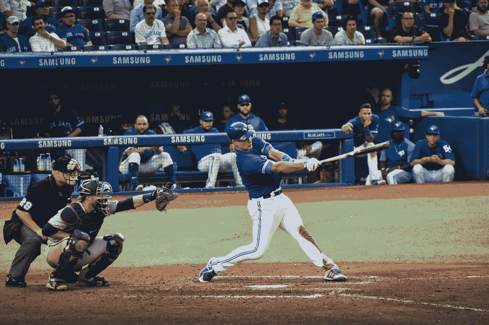

# 模拟摆动概率

> 原文：<https://towardsdatascience.com/modeling-swing-probability-b02b5ab7fbb5?source=collection_archive---------33----------------------->

戴戟·梅本在 [Unsplash](https://unsplash.com?utm_source=medium&utm_medium=referral) 上的照片

多年来，棒球的一个方面让我着迷，那就是击球手和投手在击球时进行的心理博弈。每个玩家都在不断地试图进入对手的大脑，猜测他们下一步可能会做什么。击球手可能会利用他对投手的了解来预测他是否会尝试用快速球挑战击球手，或是引诱他将突破球追出区域。与此同时，投手正在利用关于击球手的信息来制定一系列投球，这些投球应该会让他因三振出局而回到替补席。

正是在这些智力游戏中，我发现统计学和 sabermetrics 可以得到最有效的应用。投手或击球手拥有的相关数据越多，他们的优势就越大。在我之前的一篇[文章](/measuring-how-well-pitchers-hide-their-pitches-f61f076d91f4?source=friends_link&sk=be1b11123ccefe7174183e8cc67bf649)中，我量化了投手隐藏投球的程度，并讨论了击球手如何利用这些信息来识别投手可能会投出什么(不需要垃圾桶，太空人)。然而，在这篇文章中，我想调查投手如何利用打者的信息来给自己一个优势。特别是，我将试图测量某个击球手在给定投球时挥棒的概率。

**型号:**

为了构建这个模型，我将使用 Python 和它的机器学习库 LightGBM，我将把它用于它的梯度增强分类工具。如果你不知道什么是梯度增强分类算法，并想知道更多，请随时查看 StatQuest 的[这个优秀视频](https://www.youtube.com/watch?v=jxuNLH5dXCs&t=340s)进行深入了解。现在，关于我们的模型，你需要知道的是，它本质上是一个二元分类算法，其中两个分类要么是挥杆，要么是拿杆(注意:我们不关心挥杆的结果，只关心击球手是否挥杆)。

**数据:**

与大多数机器学习算法一样，如果我们希望我们的模型准确有效，我们需要大量的数据。幸运的是，有一个名为 pybaseball 的方便的 Python 库，使得获取这些数据变得轻而易举。我将使用这个库来收集 StatCast 逐节数据，以便训练模型。

**特性:**

特征选择是构建分类模型不可或缺的一部分。这些特征是算法将考虑的不同度量，以确定击球手是否会以特定的音高挥杆。因此，我们必须纳入对结果变量影响最大的指标。StatCast 跟踪大量不同的投球指标，如旋转速度、释放点等，但只有其中一些指标对决定击球手是否挥杆有用。我将在模型中使用的最重要的功能是:

1.  球场的位置
2.  投球的速度
3.  音高的垂直和水平变化
4.  投球的计数
5.  前一个投球的投球类型(除非它是击球手的第一个投球)

这些特征中的一些可能是显而易见的，但是有一些可能不是很直观。位置绝对是决定击球手挥杆与否的最重要因素；一个打者几乎不会在 3 英尺以上的区域挥棒，但经常会在中间挥出快速球。

速度和垂直/水平突破功能一举两得。首先，它们在决定击球手是否挥棒时非常重要(击球手经常挥棒打一个看起来像好球的滑球，但最终离开本垒板 6 英寸，快速球经常会冻结击球手期望的变速球)。其次，它们允许我隐式地告诉模型投掷的是什么类型的球。我不必明确地告诉模型具体的音高类型，而是算法可以根据音高的速度和移动来学习音高的行为。这在我们以后用模型做预测的时候会很有帮助。

投球的次数也是击球手决定挥杆与否的一个因素。例如，击球手通常对击球手的计数更有选择性，比如 3-0，除非完美，否则不会挥棒击球；但是当打者以 0-2 落后时，他通常会挥棒攻击任何接近好球带的地方。

最后，前一个投球的投球类型在决定击球手是否会挥棒方面起着更微妙的作用。一个刚看到曲球的击球手可能不太可能挥出随后的曲球，因为他刚看到一个曲球。

现在我们有了所有这些数据，我们终于可以开始训练模型了。

**训练模型:**

为了训练这个模型，我选择了红队的一垒手乔伊·沃托作为我们的击球手。我选择沃托是因为他在挥杆时极其挑剔，我想看看我们的模型是否会反映这一点。在用乔伊·沃托过去 5 个赛季的逐节数据训练模型后，我们得到了 0.795 的准确率。这意味着我们的模型能够在 79.5%的时间里正确预测沃托是否在投球。虽然并不完美，但这似乎很有希望。期望接近 100%的准确性是不现实的，因为人为误差和棒球的随机特性使得不可能绝对确定地预测。经过一点点的超参数调整，我能够获得高达 80.5%的精度分数，这对于我们的模型来说已经足够好了。

**使用模型:**

既然我们的模型已经训练好了，我们终于可以开始用它来做预测了。虽然知道一个特定的音高是否会被挥杆是有帮助的，但输入特定的音高来看它们是否会产生挥杆是非常低效的。即使我们这样做了，我们的模型也只有 80%的准确性，所以会有相当大的误差。相反，我们可以绕过这两个问题，在好球区周围绘制一个特定的球距图，并使用我们的模型来计算沃托在该区域每个位置的挥杆概率。

*从捕手的角度看好球带

这个图表给了我们模型的预测概率，如果乔伊·沃托在击球手的第一次投球时投出泰勒·格拉斯诺的快速球，他将挥棒击球。以这种方式使用模型的预测概率更有帮助，提供了更多的洞察力，而不是让模型简单地指示投球是否会被挥杆。该模型将预测挥杆概率为 51%的投球和挥杆概率为 98%的投球，因为两者都被挥杆，但它们显然是两种非常不同的投球。通过可视化数据，我们可以看到 Votto 以某一音高摆动的可能性，而不是简单地得到是或否的答案。

看前面的图表，我们可以看到，在球板中心上方的球路上，沃托挥出快速球的概率约为 80%,但当你到达好球带的边缘时，这种概率会迅速降低。这似乎与我们对乔伊·沃托的了解一致。他是一个非常挑剔的击球手，有着精英的眼光，所以当你远离本垒板的中心时，他的挥杆概率就会下降。这一点在击球的第一次投球时得到了进一步的强调，在这种情况下，没有必要挥动任何不容易击中的东西。基于第一个结果，我们的模型看起来是准确的，但是让我们更深入一点来确定。我们可以测试模型准确性的一种方法是通过观察 Votto 在 0-0 计数中的摆动率，看它是否与我们的模型给出的相似。

看这个我们可以看到我们的模型的情节看起来惊人的相似。这是一个好迹象，表明我们的模型是准确的。看起来确实有些细微的差异，但那很可能是因为挥杆率图表考虑了所有的球种，而不只是快速球。为了进一步测试这个模型，让我们来看看沃托在另一场比赛中的挥杆概率。

该图显示了在 0-2 计数中，沃托的挥杆概率与克莱顿·克肖的曲球。这个模型似乎又一次符合我们的预期。在 0-2 的计数中，Votto 最有可能在任何看起来可能是好球的投球上挥杆，这是由他在低于区域的投球上相对较高的挥杆概率所表明的。此外，由于落在区域顶端的曲球很少被挥击，所以当你在好球带中走得更高时，沃托的挥击概率会降低是有道理的。

**应用模型:**

既然我们已经看到我们的模型是相对准确的，我们可以考虑如何在现实世界中应用它

第一个也是最明显的应用是增强投手的打者侦察报告。虽然挥杆率数据是可用的，并且可以在 Baseball Savant 等网站上很好地可视化，但这些数据通常非常有限或过于笼统。如果一个打者在他的职业生涯中只面对过几次投手，那么样本量太小，不足以揭示任何有意义的见解。类似地，如果你试图对一种特定的投球类型进行归纳和建模，你就失去了特异性。这样的模型将克莱顿·克肖的缓慢循环曲球与泰勒·格拉斯诺的快速突破曲球归为一类，这损害了模型在应用于个案时的准确性。通过使用我们在这里制作的模型，您可以获得两个世界的最佳效果。即使一个打者没有面对过某个投手，他也很可能面对过几个不同的投手，他们有相似的投球。通过使用单个投手的平均投球动作/速度，该模型可以相对准确地预测击球手的行为，即使关于他们具体比赛的数据很少。这有助于制作适合特定投手的球探报告，并提供对击球手行为的洞察，否则这些行为会被忽略。

其次，这个模型也可以用于模拟，试图预测击球手或投手在比赛中的表现。使用像这样的模型来预测挥杆概率，同时使用其他算法来预测挥杆结果，可能有助于预测特定投手的击球结果。

如果你做到了这一步，感谢你的阅读，并随时给我留下任何提示和/或批评！如果你想查看这个模型的代码，这里有一个到 [GitHub 库](https://github.com/jwilsonds/swing_probability_model)的链接。