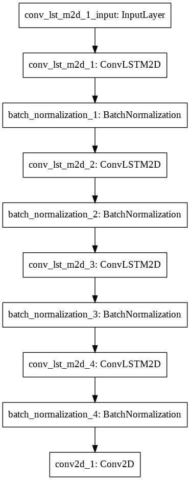
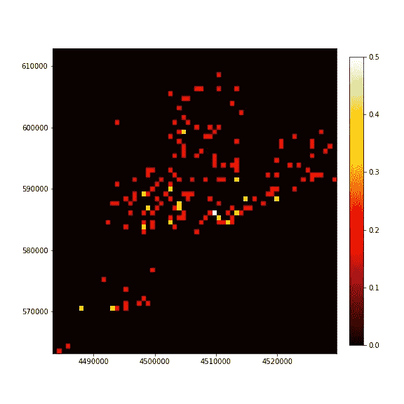

# 模拟纽约市的交通事故风险

> 原文：<https://towardsdatascience.com/modeling-the-risk-of-traffic-accidents-in-new-york-city-9292c5ae4ab4?source=collection_archive---------28----------------------->

## 使用 convLSTM2D 深度学习模型对交通事故风险进行分类

来源:[帕特米克凯恩](https://pixabay.com/users/patmikemckane-186417/)，经由[皮克斯拜](https://pixabay.com/photos/new-york-ny-nyc-new-york-city-city-286071/) (CC0)

# 问题陈述

仅在 2017 年，美国就有超过 3.7 万人死于道路交通事故。2010 年与交通事故相关的成本(来自 2015 年发表的一份报告)为 2420 亿美元，占当年国内生产总值的 1.6%。以运输为生的公司将受益于关于哪里更可能发生事故的信息，因此他们可以避开这些地区，降低事故风险。优步和 Lyft 等拼车公司依赖于快速安全地从一个地方到达另一个地方，以获得客户满意度。优步为其司机提供保险，承担事故成本，因此如果发生事故，面临的风险不仅仅是客户满意度下降。这个项目将集中于整个纽约市事故风险的时空预测。拼车公司在生成路线以避开事故风险增加的区域时，可以使用这样的信息作为额外的数据层。

我们将使用的数据是由纽约市提供的 NYPD 机动车碰撞数据。

*   [https://data . cityofnewyork . us/Public-Safety/NYPD-机动车-碰撞/h9gi-nx95](https://data.cityofnewyork.us/Public-Safety/NYPD-Motor-Vehicle-Collisions/h9gi-nx95)

数据以 CSV 格式提供，包括事故时间、地理坐标和其他信息，如事故原因、涉及的车辆、死亡人数等。数据将被清理，以确保每个条目包含有效的坐标和时间戳。在这一阶段，我们计划将数据表示为栅格，以确定一天中特定时间事故风险增加的区域。随着时间的推移而可视化的 2D 矩阵基本上是一个图像识别问题，因此我们计划开发一个卷积 LSTM 深度学习模型。像这样的方法是有先例的。

# 数据争论

我们决定将此作为一个分类问题，提出这样一个问题:在这一天的这个时候，这个地区发生事故的风险是否会增加。数据集包含 1.58 MM 的事故行，包括日期、时间、经度和纬度，以及涉及的车辆数量、促成因素、受伤人数等。在之前的项目中，我们对纽约市范围内发生的所有事故都很感兴趣，因此不关心是否有缺失的位置值。对于本项目，事故的位置和时间非常重要，因为我们试图建立一个模型来预测在选定的时间和日期发生事故的风险增加的位置。

通过上面的链接下载的. csv 文件中的数据被导入到熊猫数据框架中。列标题被转换为小写，标题中的空格被替换为下划线以允许链接。创建了一个新的 datetime 列，并将其设置为索引，以便使用 pandas 进行索引。loc 访问器。数据集中的每条线代表向 NYPD 报告的事故的时间和位置。最初检查数据时，日期时间数据的行数与经度和纬度的行数不匹配。更仔细的检查揭示了超过 185，000 个 NaN 实例，以及超过 900 个经度和纬度的 0 值。0 经纬度在赤道上，加纳以南。由于事故的日期和位置对这项工作至关重要，所有的 NaN 值首先被转换为 0，并与现有的 0 值一起删除。这些条目的删除导致了与经度和纬度相同数量的日期时间值。

所有事故都是用它们的纬度和经度值绘制的。这显示了多个外围点，很明显不在纽约市范围内。对经度和纬度的限制越来越严格，直到通过目视检查获得了一幅完整的纽约市地图。接下来，我们将经纬度转换为世界大地测量系统，这是将地球曲面投影到平面上的标准，就像地图一样。这一点很重要，因为地面距离测量会更精确。

并列显示坐标(绿色)和 WGS 投影(蓝色)

这种差异很小，但在地面测量中会造成几十米的误差。美国东海岸位于通用横轴墨卡托坐标系的 18T 区域。更多信息见[此处](https://en.wikipedia.org/wiki/Universal_Transverse_Mercator_coordinate_system#Locating_a_position_using_UTM_coordinates)。应用此功能可将纬度和经度转换为米东距和米北距，这是一种更精确的地面距离测量方法。这些值将用于这项工作的剩余部分。

# 电子设计自动化(Electronic Design Automation)

为了感受数据的一致性，我们首先按小时对事故进行分组，并绘制了两周的直方图。这表明在一天中似乎有一个双峰分布，大约在上午 8 点和下午 4 点达到峰值，这与正常的高峰时间交通一致。

从周一开始，绘制了两周的直方图，显示每小时的事故数量。

双峰分布对许多人来说是明显的，并且总是在下午发生最多的事故。还有一段时间是凌晨，事故比较少，大概是因为路上车少。然后，我们绘制了整个数据集内每月的事故总数。

数据集期间每月的交通事故总数。

事故数量似乎是季节性的，年初时最低，夏季达到高峰，接近年底时逐渐减少。然而，我们不只是对预测事故何时发生感兴趣。我们感兴趣的是事故将在何时何地发生。为此，我们将按小时和地点汇总事故。如前所述，我们将把它放在 2D 数组中。最初，我们选择将数据离散成 64 x 64 的网格。这返回了一个更加像素化的数据视图，但是城市的许多特征仍然是可辨别的。

所有的事故数据都被收集到一个 64 x 64 的数组中

像这样分组为 64×64 个箱使得每个箱的宽度大约为 712×765 米。虽然这不是绕过事故的最实际距离，但它将允许我们展示我们的模型预测交通事故的能力。为了在合理的时间内进行计算，我们决定查看最近 6 个月的事故数据，该数据集包括 2018 年 12 月 16 日至 2019 年 4 月 16 日的数据。数据被分成 70:20:10 的训练:测试:验证集。使用训练集和测试集改进的模型，验证集是一个保留集，仅应用于训练模型。

# 模型结构

我们选择用 2D 事故阵列来表示这个模型。这两个维度由规则的距离间隔定义，每个箱中的事故数量相加。这给了我们一个纽约市事故的像素化视图，但它适合看看这种方法是否有效。像这样排列的数据可以被认为是一幅图片，或者当考虑多个时间片时，是一部电影的帧。有鉴于此，我们可以把它当作一个“预测电影的下一帧”的问题。这是一个有趣的问题，因为这是一个时间序列问题，也是一个图像问题。时间序列问题通常受益于长短期记忆(LSTM)模型。这些是递归神经网络，具有存储先前信息以应用于当前帧的能力。这对于时间序列问题非常有用，因为在时间序列中可能会出现规则的模式。因为我们的问题也是一个图像问题，我们可以从卷积神经网络(CNN)中受益。CNN 使用核函数从图像中提取重要特征。我们使用 Keras 进行了深度学习，Keras 是一种运行在 TensorFlow 之上的高级 API。该包包括 convLSTM2D 层，它类似于 LSTM 层，但输入层和变换都是卷积的。

我们在这项工作中使用的深度学习 convLSTM2D 模型的图。

第一次卷积输入后，我们应用了 4 个 convLSTM2D 层，每层之间都进行了 relu 激活和归一化。最终的 conv2D 层使用 sigmoid 激活和二进制交叉熵损失函数将张量折叠回 2D 图像，这提供了我们对事故发生概率的 64 x 64 2D 阵列的预测。

该层所需的数据的输入形状是具有形状(样本、时间、行、列、通道)的 5D 张量，在我们的情况下是(样本、时间，64，64，1)。因为我们有一个 64×64 的矩阵，并且它是一个二进制分类问题，所以 1 个通道。在这种情况下，时间是时间步长，我们必须选择要使用多少时间点来预测感兴趣的小时。对于这项工作，我们选择使用之前的 6 个小时来预测 7 日。我们选择了 64 个具有 5×5 内核的过滤器。

# 特征工程

由于所涉及的因素极其复杂，直接预测交通事故是一项极其困难的工作。几乎不可能包括导致事故的所有因素，包括但不限于司机分心、天气状况、交通状况和道路状况。我们将预测事故风险，而不是直接预测事故。目前，我们的事故数据是按小时在张量中时空排列的。每个网格代表一天中该时间该网格内发生的事故数量。要将事故转换为事故风险，我们需要找到过去 x 天内每个单元的平均事故数。对于这项工作，我们选择寻找 6 天内事故的平均数。例如，如果最近 6 天上午 8 点的一个格网单元包含以下事故数:3、0、6、2、4、1，则关注日上午 8 点的事故风险为(3 + 0 + 6 + 2 + 4 + 1)/6 = 16/6 = 2.67 事故/小时。这种转换应用于所有数据，因此建模中使用的数据是 64 x 64 的事故率数组，基于同一时间的事故和过去 6 天的网格单元。

一小时内发生的事故。

n 的事故率是用前 6 天每天的同一小时计算的

同一小时的事故率是使用过去 6 天中一天的同一小时计算的(右图)。对于构建我们的模型来说，事故率比单独的事故数字提供了更多的信息。最终模型总共包含 2，876，737 个可训练参数，当在使用 GPU 的 Google Colab 笔记本中运行 50 个时期时，总训练时间约为 6 小时。

该模型似乎在第 50 个纪元时收敛，因此我们没有将训练时间延长到这之后。

# 评估模型

虽然 Keras 提供了许多内置分析，但为了简单起见，我们计算了自己的混淆矩阵。如前所述，该模型输出一个 64 x 64 的事故风险概率数组。

纽约市事故发生地点概率的基本事实(左)和预测(右)。

因为我们想要二进制分类而不是概率，所以我们需要将结果分层为 0 或 1。我们使用 predict_classes 函数来实现这一点，该函数为我们进行了分层。任何 0.5 或以上的概率变成 1，其余的为 0。

纽约市交通事故地点的地面实况(左)和预测(右)。

每个预测和地面实况 64 x 64 阵列被转换成 pandas 数据帧，该数据帧允许逐元素的乘法和减法。当两者相乘时，因为它们都是二进制矩阵，所以只有正确识别的值或真正值会保留下来。当我们从预测中减去地面真实矩阵时，真正值变成零(1 -1)，错误预测的事故或假正值变成 1(1-0)，错过的预测或假负值变成-1(0-1)。然后，可以通过从矩阵的大小(64 x 64 = 4096)中减去真正值、假正值和假负值的总和来计算真负值。

用于构建混淆矩阵的基础事实(右上)、预测(右上)、乘积图(左下)和差异图(右下)。

上面是四幅图像，分别显示了事故风险增加的基本事实(左上)、预测矩阵(右上)、显示正确预测像元的乘积矩阵(左下)以及差值图(右下)，如果像元被错误预测，则差值图返回-1(白色)，如果像元未被预测，但存在于基本事实(右)中，则差值图返回+1(黑色)。由于这两个阶层之间的不平衡(负值远远大于正值，这是一件好事！)，报告模型的准确性不是一个合适的指标。相反，我们可以使用[马修相关系数](https://en.wikipedia.org/wiki/Matthews_correlation_coefficient)，或 phi 系数作为二进制预测质量的衡量标准。

MCC = TP * TN—FP * FN/sqrt((TP+FP)*(TP+FN)*(TN+FP)*(TN+FN))

其中 TP，TN，FP，FN 分别=真阳性，真阴性，假阳性，假阴性。应用此公式将返回一个介于 1 和-1 之间的值，其中 1 表示基本事实和预测完全一致，0 表示随机机会，而-1 表示模型和基本事实完全不一致。

跨训练集(左)、测试集(中)和验证集(右)计算的迈克尔相关系数。

计算我们三个集合的迈克尔相关系数，我们看到总体上非常好的分数，训练集、测试集和验证集的平均值分别为 0.82、0.82 和 0.83。令人高兴的是，由于这些数据根本不包括在模型训练中，所以坚持组也与训练和测试组得分相似。然而，我们可以从上面图中较低值的重复模式和下面直方图中的负偏斜看出，我们的预测中存在一些异质性。

每个机组的 MCC 值分布。

理想情况下，MCC 直方图将是平均值周围的正态分布。这表明我们的模型在预测一天中特定时间的事故风险方面较弱。如果它在预测某个区域方面很弱，我们不会在 MCC 得分的急剧下降中看到这一点。

首先，我们在混淆数据帧中添加了一个日期时间索引。然后，我们将阈值设置为 0.7，并过滤出发生这些情况的小时的索引值。绘制这些值的直方图，我们看到绝大多数值出现在凌晨 1 点到 3 点之间。

训练组(左)、测试组(中)和验证组(右)的 MCC 值低于 0.7 的时间分布。

如果我们为我们的模型重新计算平均 MCC 值，如果我们排除这些数据点，我们的训练集、测试集和验证集的平均值都略微增加到 0.84。

去除低于 0.7 的值后，MCC 在每组中的分布。

# 结论

我们生成了一个深度学习模型，用于预测纽约市的交通事故风险。该模型基于 Keras convLSTM2D 架构，该架构接受事故率的 2D 阵列，该阵列是过去 6 天每小时每个网格单元的平均值。

我们证明了该模型对未来未知数据的预测性，其迈克尔相关系数为 0.84。

用原始事故数而不是事故率来训练同一模型的尝试未能收敛，导致对事故数量和位置的严重高估。

要成为真正有用的模型，每个网格的分辨率最好是城市街区的分辨率。将时间分辨率增加到比 1 小时更频繁的周期也是令人感兴趣的。这当然会大大增加计算时间。

# 编辑

如果你感兴趣，这里有我在这项工作中使用的笔记本的链接。第一个用于[数据处理](https://github.com/ghopping/Springboard_Capstone_2/blob/master/GH_Capstone_2_accident.ipynb)，第二个用于[convlsm 2d](https://github.com/ghopping/Springboard_Capstone_2/blob/master/convLSTM2D/GH_Capstone_2_convLSTM2D_model.ipynb)模型。