# 模拟疫情的传播！

> 原文：<https://towardsdatascience.com/modeling-the-spread-of-a-pandemic-92c64a6c6d8d?source=collection_archive---------50----------------------->


叶夫根尼·切尔卡斯基在 [Unsplash](https://unsplash.com?utm_source=medium&utm_medium=referral) 上拍摄的照片

## [变更数据](https://towardsdatascience.com/tagged/data-for-change)

## 科学家如何模拟流行病？政府是如何制定封锁计划的？我们怎么知道曲线是否已经变平了？

***编者按:*** [*走向数据科学*](http://towardsdatascience.com/) *是一份以数据科学和机器学习研究为主的中型刊物。我们不是健康专家或流行病学家，本文的观点不应被解释为专业建议。想了解更多关于疫情冠状病毒的信息，可以点击* [*这里*](https://www.who.int/emergencies/diseases/novel-coronavirus-2019/situation-reports) *。*

我们正生活在我们有生之年从未想象过的最前所未有的时代。我们的生活早已偏离了过去的常态，不幸的是，这个世界再也不会像从前一样了。与其强调已经发生的变化，不如接受新常态，继续前进，重新开始，这将是一个明智的想法。

> 19 世纪见证了永远改变世界的三件大事——工业化、互联网和传染病！

好吧，让我们来解决房间里的大象——源自中国的冠状病毒感染了全球近 2200 万人，并造成 77 万人死亡。这里是截至 2020 年 8 月 17 日的世界现状。

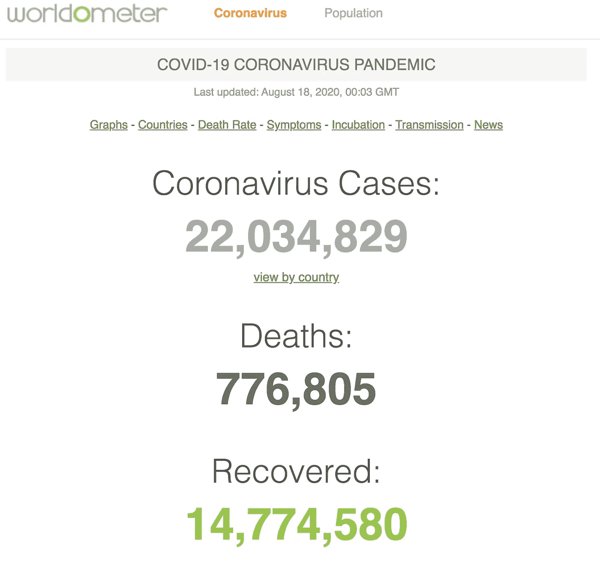

截图，摄于 2020 年 8 月 17 日 https://www.worldometers.info/coronavirus/

这是这篇文章的议程。您可以选择跳到以下您喜欢的任何部分:

*   [新冠肺炎数据可视化](#f632)
*   [指数增长，逻辑增长？他们到底在说什么？](#1057)
*   [了解疫情的基本 SIR 模型和构建模块](#4855)
*   [各国政府如何提出不同的策略？](#d718)

本文中使用的所有代码都可以从 GitHub 库下载

# 新冠肺炎数据可视化

## 数据可视化#1:按国家列出的案例总数

下面的数据可视化贯穿了从 2020 年 2 月到 2020 年 7 月底的时间线，并显示了报告病例总数排名前 20 位的国家是如何移动位置的。

## 数据可视化#2:按国家划分的死亡总数

另一个数据可视化显示了前 20 个国家在报告的新冠肺炎死亡总数方面的位次变化。

## 数据可视化#3:显示第一例报告病例前天数的世界热图

下面的数据可视化显示了它传播到全世界的速度。

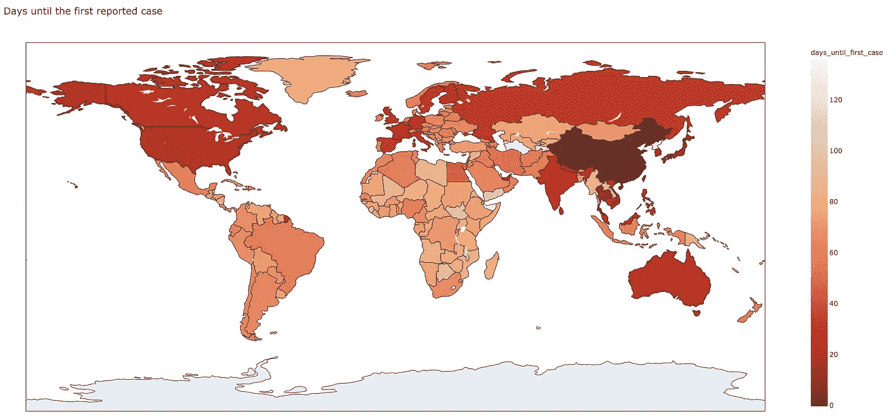

距首次报告病例还有几天。互动版[点击这里](https://genielab.github.io/assets/custom/covid-19/days_until_first_case.html)

从上面的交互式数据可视化中，我们可以看出:

*   泰国是第一个受到影响的国家(前 13 天)，然后是日本(前 15 天)和韩国(前 20 天)。
*   一个月内，病毒传播到印度、东南亚国家、澳大利亚、美国和加拿大。
*   除了葡萄牙和爱尔兰，大多数西欧国家在头一个月内感染了这种病毒，而东欧国家在大约两个月内都是安全的。
*   俄罗斯在第一个月左右就被感染了。
*   在斯堪的纳维亚国家中，挪威是最后一个被感染的国家，而瑞典和芬兰是在前一个月内被感染的。
*   相对来说，传播到南美和非洲大陆需要更长的时间。
*   朝鲜——没有数据，老规矩，别问我为什么？:P

## 数据可视化#4:显示前 1000 个案例的天数的世界热图

现在，让我们看看在每个国家达到第一个 1000 个病例需要多长时间:

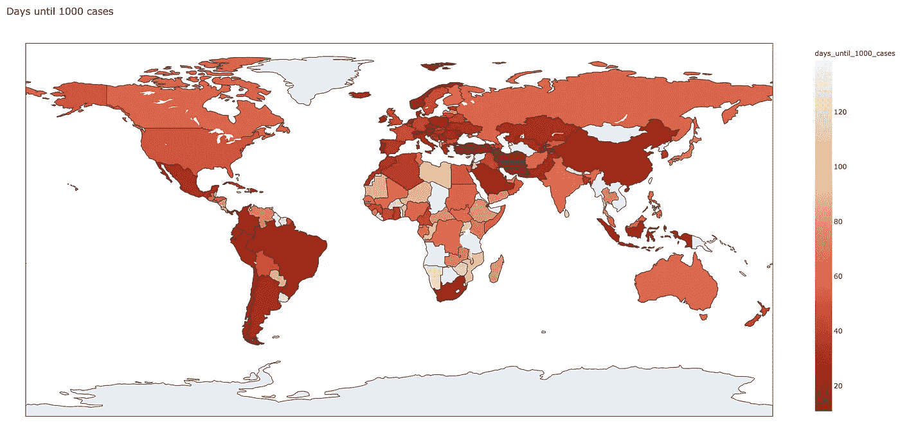

前 1000 例，互动版，[点击此处](https://genielab.github.io/assets/custom/covid-19/days_until_1000_cases.html)

从上面的交互式数据可视化中，我们可以看到，要达到第一千例:

*   虽然泰国和日本是第一个被感染的国家，但是他们花了将近两个月的时间才达到第一个千例的里程碑。
*   土耳其、伊朗和塔吉克斯坦只用了两周时间。
*   韩国用了一个多月。
*   大半个欧洲用了近一个月。
*   美国、印度和澳大利亚用了将近 2 个月。
*   巴西和大多数南美国家用了不到一个月的时间。
*   南非用了不到一个月。

尽管这种病毒在一些国家传播相对较慢，但在其他一些国家却传播很快。不同地区的增长率可以用指数增长来表示。

在下一节中，我们将讨论用于病毒建模的不同增长模型，我们还将讨论政府如何提出各种缓解策略。

# 指数增长，逻辑增长？他们到底在说什么？

在过去的几个月里，我打赌你可能已经在新闻频道上无数次听到这些术语了。他们用这些术语来解释病毒是如何传播的，等等。但是你可能想知道他们到底在说什么？

好吧，为了理解指数增长到底是怎么回事，让我们来处理一个假设的情况。比方说，我让你在我拥有的 Airbnb 网站上住一整月，这是一个惊人的交易——开始的第一天你必须支付 1 美分，但每隔一天，直到一个月，你必须向我支付前一天支付的三倍。这是一笔难以抗拒的交易吗？我看起来像个白痴吗？没关系，你可以有你无声的笑的时刻，但如果你回来报名，我打赌你非常需要一堂数学课。

我用的是所谓的 ***指数增长*** 骗你进去。随着指数增长，我的每日利率从第一天的 0.01 美元上升到一个月底的 2 万亿美元以上。如果我们修改我们的交易，所以你每天只付我两倍的钱，你最后一天的最终账单会减少到 1000 万美元，如果我们再次修改交易，所以你每天只增加 50%的钱，你的最终账单会是更合理的 1917.51 美元。

下表总结了这些结果:

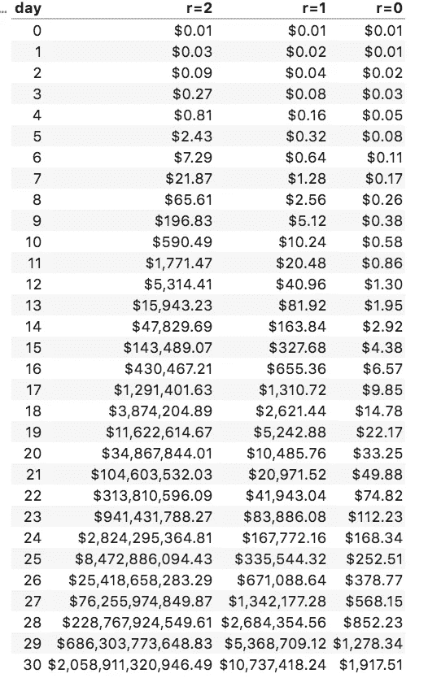

指数增长的示例

下面是我们用来计算上表中数字的简单指数方程:

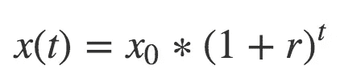

指数增长公式

在上面的公式中，x(t)是你在第 t 天支付给我的，x₀是初始值(你在第一天支付给我的)，r 是增加的百分比。

明白了吗？

科学家和流行病学家利用新冠肺炎的这种指数增长来了解病毒是如何传播的。换句话说，他们试图将每天记录的病例数据点拟合到这个模型中，并试图估计增长因子，从而预测未来。更具体地说，我们可以找出病毒在一个国家相对于另一个国家传播的速度。

但是指数增长有个问题！如果你还没有注意到，增长并没有停止。只要你输入一些参数 t，就会有一些输出值。但这并不是以前所有病毒爆发的情况，因为我们知道它们都在某个时候停止了。

我们的下一位嘉宾来了， ***物流成长*** ！

与指数增长不同，逻辑增长不会无限增长。

它遵循三个阶段——在第一阶段非常缓慢地增长，在中间阶段非常迅速，在第三阶段再次开始缓慢增长，最后变平。这正是任何病毒爆发都会遵循的模式。

这是解释逻辑增长的简单公式。

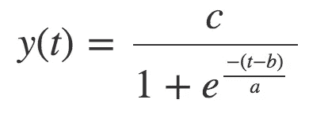

逻辑增长公式

科学家们还研究了一种叫做 ***冈珀兹增长*** 的东西，这是一种特殊的逻辑增长，也类似于一个 sigmoid 函数。与在第一阶段和最后阶段完全对称的逻辑增长不同，Gompertz 函数增长缓慢，并缓慢变平。下面的公式表示 Gompertz 增长

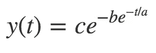

Gompertz 增长公式

在 logistic 和 Gompertz 增长公式中，参数 c 代表 logistic 函数的渐近线。换句话说，c 的值是疫情结束前我们将出现的最大病例数。

下面的图表给你一个在所有三种模型中增长率如何变化的感觉。

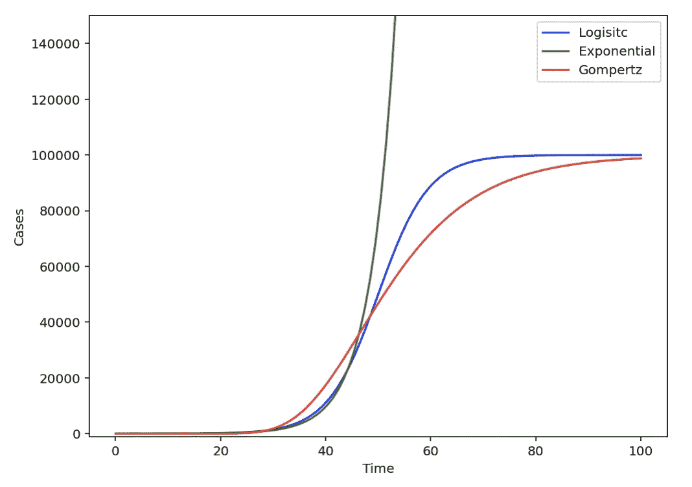

说明指数、逻辑、Gompertz 的增长率

> *科学家们使用指数函数和逻辑函数来研究我们目前处于流行病的哪个阶段。流行病的第一阶段可以用指数函数更好地表示，然而，第二阶段可以用逻辑函数更好地表示。*

利用约翰·霍普斯金大学编制的[新冠肺炎报告数据](https://github.com/CSSEGISandData/COVID-19)，我们可以对指数和逻辑斯蒂模型进行曲线拟合。

以下是我们将要做的事情——我们将把除 lat 1 day(2020 年 7 月 29 日)之外的所有数据拟合到模型中，并尝试预测这一天的情况。我们将使用`[scipy.optimize.curve_fit](https://docs.scipy.org/doc/scipy/reference/generated/scipy.optimize.curve_fit.html)`一个 *Scipy* 函数，该函数使用非线性最小二乘回归来拟合一个选定国家的数据。我们可以使用 **R2 分数**，这是一个测试模型拟合度的常用指标，衡量模型预测曲线新点的能力。值非常接近 1，意味着模型可以很好地预测数据，而值接近 0 甚至负值，意味着模型非常不适合。

下面是相同的代码:

曲线拟合代码

以下是一些选定国家的结果:

## **中国**

从下面的结果来看，中国的指数模型 R2 得分为负，逻辑模型 R2 得分为正。这标志着中国已经越过指数阶段，进入逻辑阶段。R2 分数非常接近 1 表明非常适合逻辑模型。事实上，曲线的平坦化发生在 2020 年 3 月 13 日。

```
**** Prediction for China-CHN as of 2020-07-29 ****
Initial no. of cases on 2020-01-19 -> 216.0
No. of cases on 2020-07-28 -> 86783.0
~~ Exponential Model ~~
['p=0.035', 'sigma_p=0.001']
MSLE: 45.617, Exp of RMSLE: 9.670, R2 score: -9.730
~~ Logistic Model ~~
['a=10.000', 'b=0.113', 'c=84166.683'] ['sigma_a=1.115', 'sigma_b=0.005', 'sigma_c=390.112']
MSLE: 0.418, Exp of RMSLE: 1.909, R2 score: 0.963
Day of flattening of the infection curve ->  13, Mar 2020
```

## 韩国

韩国也是如此。曲线的平坦化发生在 2020 年 5 月 1 日。

```
**** Prediction for South Korea-KOR as of 2020-07-29 ****
Initial no. of cases on 2020-02-21 -> 155.0
No. of cases on 2020-07-28 -> 14203.0
~~ Exponential Model ~~
['p=0.032', 'sigma_p=0.001']
MSLE: 31.421, Exp of RMSLE: 9.670, R2 score: -11.591
~~ Logistic Model ~~
['a=3.858', 'b=0.074', 'c=12089.302'] ['sigma_a=0.468', 'sigma_b=0.005', 'sigma_c=113.041']
MSLE: 0.132, Exp of RMSLE: 1.439, R2 score: 0.881
Day of flattening of the infection curve ->  01, May 2020
```

## 法国和意大利

对法国和意大利来说，逻辑模型显示了拟合优度。这两个国家的曲线在 6 月变平。

```
**** Prediction for France-FRA as of 2020-07-29 ****
Initial no. of cases on 2020-03-01 -> 100.0
No. of cases on 2020-07-28 -> 183079.0
~~ Exponential Model ~~
['p=0.056', 'sigma_p=0.001']
MSLE: 37.960, Exp of RMSLE: 9.670, R2 score: -3.601
~~ Logistic Model ~~
['a=10.000', 'b=0.055', 'c=166804.289'] ['sigma_a=1.059', 'sigma_b=0.003', 'sigma_c=1840.738']
MSLE: 1.355, Exp of RMSLE: 3.203, R2 score: 0.961
Day of flattening of the infection curve ->  21, Jun 2020

**** Prediction for Italy-ITA as of 2020-07-29 ****
Initial no. of cases on 2020-02-24 -> 132.0
No. of cases on 2020-07-28 -> 246286.0
~~ Exponential Model ~~
['p=0.054', 'sigma_p=0.001']
MSLE: 43.168, Exp of RMSLE: 9.670, R2 score: -3.856
~~ Logistic Model ~~
['a=10.000', 'b=0.056', 'c=243030.882'] ['sigma_a=0.895', 'sigma_b=0.002', 'sigma_c=2068.458']
MSLE: 1.156, Exp of RMSLE: 2.931, R2 score: 0.973
Day of flattening of the infection curve ->  13, Jun 2020
```

## 新西兰

新西兰政府的反应被认为是最好的反应之一。对新西兰来说，2020 年 4 月 18 日开始变平

```
**** Prediction for New Zealand-NZL as of 2020-07-29 ****
Initial no. of cases on 2020-03-23 -> 102.0
No. of cases on 2020-07-28 -> 1207.0
~~ Exponential Model ~~
['p=0.024', 'sigma_p=0.001']
MSLE: 18.770, Exp of RMSLE: 9.670, R2 score: -22.147
~~ Logistic Model ~~
['a=5.567', 'b=0.213', 'c=1159.461'] ['sigma_a=0.323', 'sigma_b=0.006', 'sigma_c=2.736']
MSLE: 0.005, Exp of RMSLE: 1.072, R2 score: 0.985
Day of flattening of the infection curve ->  18, Apr 2020
```

## 美国、印度和巴西

当世界其他国家开始看到隧道尽头的一些曙光时，美国、印度和巴西仍然深陷疫情。新病例持续上升。

虽然美国的逻辑模型表明非常适合(R2 接近 1)，但印度和巴西的模型有些不太适合，但仍被认为处于逻辑阶段，因为 R2 > 0。下面的预测表明，这三个国家有望在 2020 年 11 月底之前使曲线变平。

```
**** Prediction for Brazil-BRA as of 2020-07-29 ****
Initial no. of cases on 2020-03-15 -> 121.0
No. of cases on 2020-07-28 -> 2442375.0
~~ Exponential Model ~~
['p=0.080', 'sigma_p=0.000']
MSLE: 32.941, Exp of RMSLE: 9.670, R2 score: -0.713
~~ Logistic Model ~~
['a=9.998', 'b=0.025', 'c=2159468.826'] ['sigma_a=2.364', 'sigma_b=0.006', 'sigma_c=637699.122']
MSLE: 5.820, Exp of RMSLE: 11.161, R2 score: 0.735
Day of flattening of the infection curve ->  19, Nov 2020

**** Prediction for India-IND as of 2020-07-29 ****
Initial no. of cases on 2020-03-17 -> 125.0
No. of cases on 2020-07-28 -> 1483156.0
~~ Exponential Model ~~
['p=0.076', 'sigma_p=0.000']
MSLE: 27.423, Exp of RMSLE: 9.670, R2 score: -0.560
~~ Logistic Model ~~
['a=9.994', 'b=0.024', 'c=1066388.221'] ['sigma_a=3.159', 'sigma_b=0.008', 'sigma_c=441540.841']
MSLE: 6.032, Exp of RMSLE: 11.657, R2 score: 0.650
Day of flattening of the infection curve ->  27, Nov 2020

**** Prediction for United States-USA as of 2020-07-29 ****
Initial no. of cases on 2020-03-03 -> 103.0
No. of cases on 2020-07-28 -> 4290263.0
~~ Exponential Model ~~
['p=0.079', 'sigma_p=0.001']
MSLE: 45.859, Exp of RMSLE: 9.670, R2 score: -1.501
~~ Logistic Model ~~
['a=10.000', 'b=0.024', 'c=4262579.365'] ['sigma_a=1.038', 'sigma_b=0.003', 'sigma_c=503190.213']
MSLE: 5.149, Exp of RMSLE: 9.670, R2 score: 0.903
Day of flattening of the infection curve ->  17, Nov 2020
```

# 理解疫情的基本 SIR 模型和构建模块

虽然指数模型和逻辑模型有助于我们了解我们处于流行病的哪个阶段，但是也有一定的局限性:

*   他们不考虑人口规模，除非我们为这些函数创建一些界限。
*   他们只模拟感染，但不考虑康复和死亡。
*   他们没有考虑感染率或恢复率。
*   他们没有考虑改善治疗对更快康复的影响。
*   他们不考虑疫苗接种的影响，如果在一段时间内有疫苗接种的话。

为了分析如此复杂的场景和模拟，科学家和流行病学家使用了另一种模型，称为 ***SIR(易感-感染-康复)模型。***

这个模型由[克马克和麦肯德里克于 1927 年](https://en.wikipedia.org/wiki/Kermack%E2%80%93McKendrick_theory)首次发表。在这个模型中，一个地区的全部人口被分成三个部分，称为**易感(S)、感染(I)、恢复/移除(R)。**

**易感**房室包括易受感染的所有人群。在任一时间点，这是总人口减去感染、康复和死亡的人口。

**已感染(R)** 区间包括目前已感染病毒且有传播疾病能力的人群。从技术上来说，我们需要至少有一个被感染的个体才能引发流行病。

**恢复/移除(R)** 区间包括所有不再被感染且不能感染任何人的人。这包括已经康复、产生免疫力或已经死亡的人。因此，这个群体有时被称为删除。

*一般来说，当一个人康复后，他们的身体会产生抗体，从而获得对疾病的免疫力，因此他们不会再被感染。除非病毒能够变异，这可能适用于大多数传染病。*

接下来，我们需要了解病毒是如何传播的。

了解病毒如何传播的第一个基础是知道病毒的 ***繁殖数(R0)*** 。

> **生殖数量**是一个感染者在患病过程中会感染的平均个体数量。

如果 R0=2.0，这意味着平均每个感染者会将疾病传播给另外两个人。对于任何要成为成功疫情的病毒爆发，它需要具有非常高的 R0 值。

R0 始终作为一个范围发布，因为它根据各种因素不断变化。以下是一些常见病毒爆发的 R0，

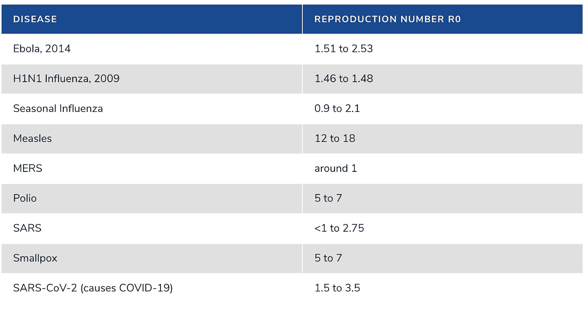

一些常见疾病爆发的 R0 值。来源:[https://SPH . umich . edu/pursuit/2020 posts/how-scientists-quantify-outbreaks . html](https://sph.umich.edu/pursuit/2020posts/how-scientists-quantify-outbreaks.html)

从上表可以看出，科学家估计新冠肺炎的 R0 在 1.5-3.5 之间。它不像一些致命的流行病如麻疹、天花等那样糟糕，但规模如此巨大的原因可能是传播的性质。

> 任何流行病要减缓传播并逐渐消失，都需要维持 R0 ≤1

下一个构件是病毒的 ***恢复时间*** 。

> **恢复时间**是个人从病毒中恢复的预期天数。

缩短恢复时间也会减缓病毒的传播。

使用这两个构建模块，我们可以计算以下参数:

*   ***Gamma (γ):*** 这代表**日恢复数**。假设一个人需要 14 天恢复，那么γ = 1/14
*   ***β/感染率(β):*** 这是病毒的**每日繁殖数**。假设如果 R0=4，那么β=4/14

下面是一个基本的 SIR 模型的图解，带有来自人口的每个状态的转移率。

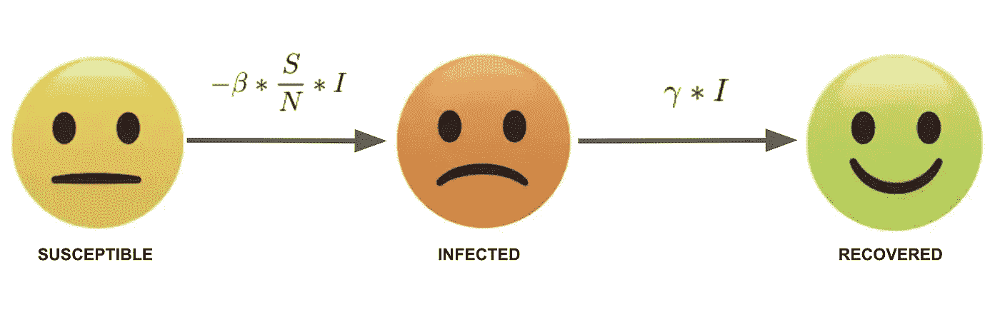

随着时间的推移，人们在**易感**到**感染**到**移除**之间过渡。每天都会发生以下情况:

*   **易感**人口因新增感染者数量而减少。
*   **感染**人口随着新感染人数的增加而增加，随着新恢复人数的减少而减少。
*   **恢复/移除**人口随着新恢复的数量而增加。

这些变化率可以用下面的微分方程进行数学表达:

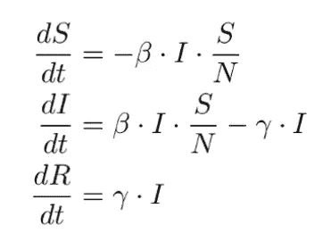

SIR 模型微分方程

使用下面的代码，我们可以为 1000 人的小群体模拟一个简单的 SIR 模型，有 10 个初始感染和 0 个恢复。

SIR 模型

这是简单模拟的结果。

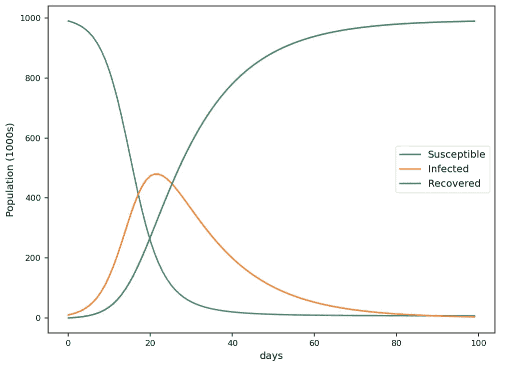

SIR 模型的示例模拟。

可以看出，随着时间的推移，会发生以下情况:

*   在流行病开始的时候，人群中易感个体的比例非常高。这将增加感染率，因为更多来自感染者的相互作用将与易感个体发生。此时，**恢复的个体数量**非常少**，因为没有多少被暴露。**
*   **在疫情中期，易感个体在人群中的比例开始下降。很快**新恢复的**个体每天变得*大于***新感染的**个体，并且**感染**的数量开始减少。****
*   ****在一场疫情的**结束**时，在 ***附近***【R】***数量开始趋于平稳【N】***随着大家都有了病毒，又恢复了 ***。******感染人数*** 和 ***易感人数******(S)***随着不再有更多的人易感，在 **0** 附近开始趋于平稳。****

# ***各个政府如何提出不同的策略？***

***在上一节中，我们已经看到了针对小规模人群的基本 SIR 模型的简单模拟，现在让我们来看看大规模的基本 SIR 模型。***

***让我们考虑一个假设的情况，一个拥有 800 万人口的大都市被 R0=5 的疫情困住，当地政府面临控制局面的压力。***

***这是这种疾病的简要介绍:***

*   ***再现数，R0=5.0***
*   ***被感染的正常恢复时间是 14 天。***
*   ***初始感染人数为 1000 人***
*   ***初始恢复人数为 0***

***政府想看到的第一件事是这件事有多大。该镇最优秀的科学家通过一些快速模拟(见下图)显示，大约 375 万人(该市 47.8%的人口)将在疫情爆发的 37 天内被感染。换句话说，什么都不做的代价是非常非常巨大的！***

***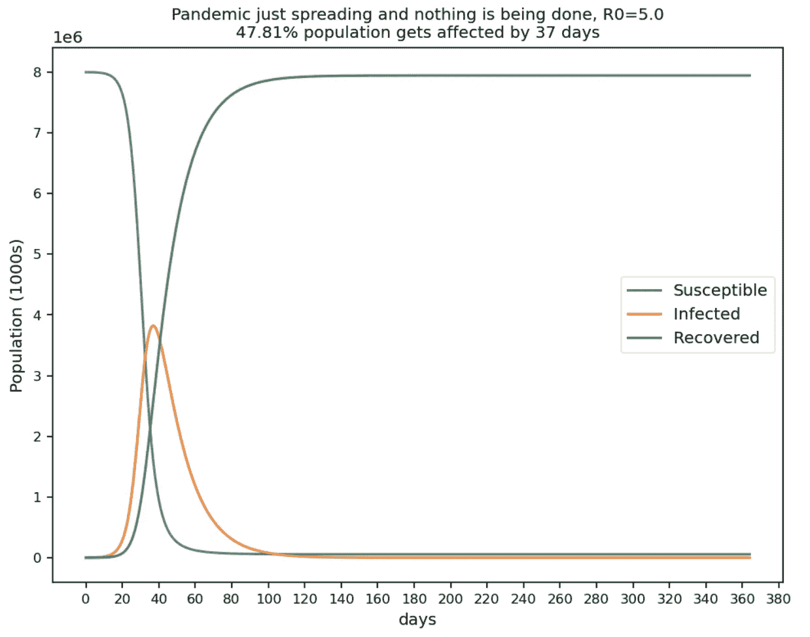***

***说明疫情如何在大都市蔓延。***

***因此，政府对即将发生的事情有所察觉。所以他们接下来想的是我们如何控制局面？***

***科学家们通过一些额外的模拟来显示 R0 的影响，他们强调 R0 需要降至 1 或更低，以减缓病毒的传播，并最终阻止疫情。***

***毕竟这不是火箭科学。通过查看下面的图表，政府将会明白，降低 R0 会产生巨大的影响——R0 每降低 1 个单位，感染的峰值就会变小，并推迟几周，因此政府可以争取一些时间来改善医疗设施或实施策略或开发疫苗(如果可行的话)。***

***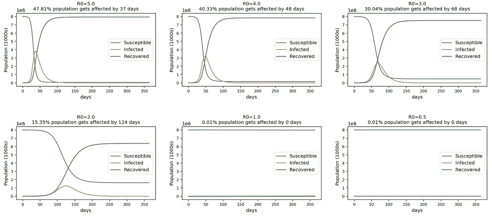***

***R0 对疫情传播的影响***

***政府不希望经济关闭，所以他们想看看某种洗手或公共行为政策限制是否会有所帮助？***

***科学家们进行了一些模拟，并做出了以下评论:***

*   ***这种病毒的本质是通过感染者和易感人群之间成功的相互作用来传播。***
*   ***洗手和公共接触政策的改变只是通过限制成功互动的次数来降低病毒传播的可能性。因此，R0 只是减少到某个数值，比如说 2.5。***
*   ***即使在这种情况下，至少有 23%的人口在 88 天后被感染。所以这一次，在感染达到高峰之前有一些延迟。***

***因此，政府明白这是行不通的，所以拒绝了这个想法。***

******

***说明洗手指南的效果。***

***政府能想到的下一件事是封锁，但他们需要知道以下几点:***

*   ***他们需要多长时间实施锁定—1 周、2 周还是 3 周？***
*   ***他们应该封锁多久——30 天还是 60 天？***
*   ***封锁的严格程度应该是怎样的——适度还是严格？***

***除了寻找上述问题的答案，政府还需要优化以下内容:***

*   ***最大限度地减少感染高峰——确保总体感染比例非常低。***
*   ***我们需要选择一个最佳的锁定选项，以免对经济造成太大伤害，因为一个真正受到伤害的经济稍后会卷土重来，对我们造成同样严重的打击。***
*   ***尽可能争取一些时间，以便扩大医疗设施，或许也给科学家们一些时间来开发疫苗或其他东西。***

***同样，科学家通过对各种场景进行模拟来帮助政府，并得出以下结果:***

***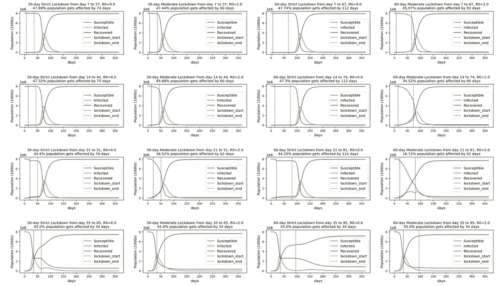***

***不同锁定选项的图示***

***你应该如何阅读上面的图表？***

*   ***每一行代表锁定开始的日期，例如，第一行的所有图表对应于在爆发后第 7 天开始的锁定，意味着在 1 周内，第二行是关于在第 2 周开始的锁定，依此类推。***
*   ***在每一行中，有 30 天与 60 天、适度与严格的模拟选项。***
*   ***每个图表显示 R0、感染高峰日的时间以及感染高峰日的感染人口比例。***
*   ***当然，我们希望感染比例最低，但与此同时，我们也需要了解感染高峰期还有多长时间。***

***我们可以从上面的图表中观察到以下情况:***

*   ***在每个锁定选项中，感染的高峰只是被延迟了，但不会完全消失。***
*   ***与相应的适度锁定选项相比，所有严格锁定选项都为我们赢得了更多时间。例如，如果我们考虑从第 14 天开始的 30 天封锁，严格封锁会在 75 天内导致 47%的感染，而中度封锁会在 60 天内导致 45%的感染(相对更快)——赢得一些时间至关重要。***

> ***不管潮水有多高，我们宁愿晚一点被打，因为这样我们可以做一些安全准备或制定逃生路线。***

*   ***在所有中度封锁中，封锁解除后，感染高峰就会上升。***
*   ***等到 35 天后才实施封锁看起来太晚了，因为感染高峰会上升，所以完全排除了这种选择。***

> ***通过考虑前面讨论的所有优化因素，政府提出了一个从第 14 天开始实施的 30 天严格封锁计划。***

***我们现在正处于从第 14 天开始的为期 30 天的严格封锁之中。利用赢得的时间，政府在两周内迅速增加了医疗设施，并从第 28 天开始部署改进的治疗方案。***

***以下是正常锁定方案与改进处理方案的对比:***

***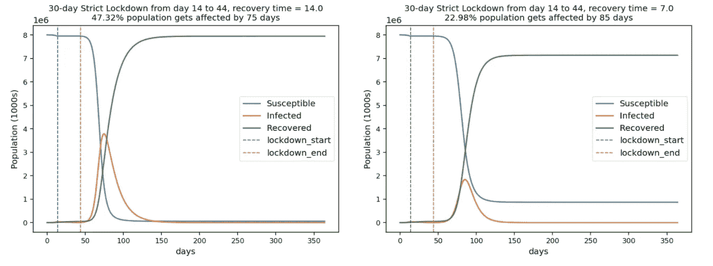***

***改进了 30 天锁定中的恢复时间图示***

***从上面的图表中我们可以观察到以下情况***

*   ***改进的治疗方案大大减少了 50%的恢复时间，这是非常好的。***
*   ***感染高峰减少了 50%，这意味着现在只有 22%的人被感染，这是一个好消息。***
*   ***感染高峰推迟了，这意味着我们可以再争取几天时间——这太好了。***

***随着改进的治疗方案的到位，政府想知道如果我们现在将封锁期延长到 60 天，会对感染高峰产生任何影响吗？***

***下图显示了相同的改进治疗方案，但是是在 60 天严格封锁的情况下。***

***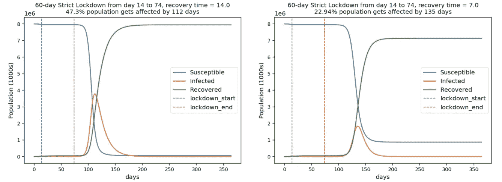***

***改进了 60 天锁定中的恢复时间图示***

***30 天的禁闭与 60 天的禁闭有什么不同？***

***尽管在一天结束时感染的人口比例相同，但是通过 60 天的封锁，我们赢得了更多的时间(135 天)，这对制定下一步措施至关重要。***

***因此，政府将封锁期延长至 60 天。***

***政府现在意识到永远推迟这一趋势是没有意义的，因此它与一组科学家合作，为疫苗开发提供一些资金。***

***如果有疫苗呢？下一个问题是有效控制感染的每日容量应该是多少？***

***下面显示了 60 天锁定环境中的另一个模拟:***

***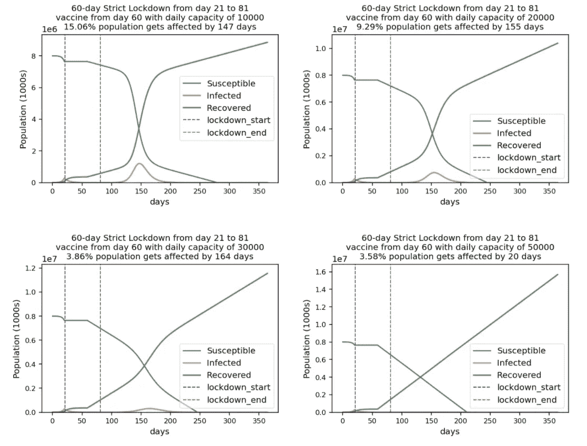***

***疫苗容量说明***

***这些数字看起来很有希望。***

***对于我们正在应对的大都市(800 万人口)的规模，我们似乎需要每天接种 3 万到 5 万次疫苗，以保持较低的感染率。***

***因此，现在政府可以致力于提供必要的基础设施，希望疫苗能尽快问世。***

***在本文中，为了简单起见，我们只讨论了基本的 SIR 模型。但是，该模型没有考虑以下情况:***

*   ***生命动力学——每天都有新生儿出生和死亡。***
*   ***移民每天都在发生。***
*   ***大多数病毒都有潜伏期——这可以用 SEIR 模型来模拟，它是 SIR 的变体，引入了另一个称为“暴露”的隔室。***
*   ***有些人是渐近的，不处于感染状态等。***
*   ***住院、重症监护室、呼吸机等。***

***在真实世界场景中，科学家采用最准确的数据，例如新记录的出生或死亡数量、因其他原因发生的死亡数量、ICU 中的人数等，从而做出准确的预测。***

***因此，在本文中，我们看到了如何将新冠肺炎数据拟合到指数和逻辑模型中，从而做出预测，并推断出某个国家何时曲线变平，或者如果没有变平，预计何时会变平。***

***此外，我们还看到科学家如何使用 SIR 模型模拟各种场景，以帮助政府制定不同的病毒预防策略。***

***本文使用的所有代码都可以从[GitHub 资源库](https://github.com/genielab/covid19_modeling)下载***