# 模拟疾病的传播

> 原文：<https://towardsdatascience.com/modeling-the-spread-of-diseases-821fc728990f?source=collection_archive---------16----------------------->

## SIR 模型的模拟练习

约翰·西米托普洛斯在 [Unsplash](https://unsplash.com/s/photos/people?utm_source=unsplash&utm_medium=referral&utm_content=creditCopyText) 上的照片

这些天，关于新冠肺炎病毒传播的新闻占据了所有报纸的专栏，所以我尝试了一个关于这个主题的简单建模练习。

*在继续之前，我需要说两点。第一点很明显:本文仅供参考，不提供任何医疗建议，也不能替代专业医疗。第二个是，作为我的习惯，我选择使用手绘公式，因为我发现在介质上使用乳胶相当烦人。我提前为书法道歉。*

在流行病学中，有一个数学技术家族，称为**房室模型**，用于传染病的[建模。顾名思义，在这些模型中，种群被分成不同的组，并假设在相同区间中的个体具有相同的特征。](https://en.wikipedia.org/wiki/Mathematical_modelling_of_infectious_disease)

我们来考虑一下 **SIR** **型号**，这是最简单的一种。在这个模型中，种群被分成三组:易感个体， **S，**感染个体， **I** ，以及 **R** 。应该注意的是，这里的术语“康复的”表示可能已经痊愈并产生免疫力的个体，或者可能已经死亡的个体，但是在任何情况下，他们都不能再被感染。

# 假设

SIR 模型依赖于几个重要的假设。

*   首先，没有人加入易感群体，因为我们忽略了出生和移民，我们假设人们只能被感染一次。因此，个体离开易感群体的唯一途径就是被感染。同样，受感染的个体最终只能进入康复组。

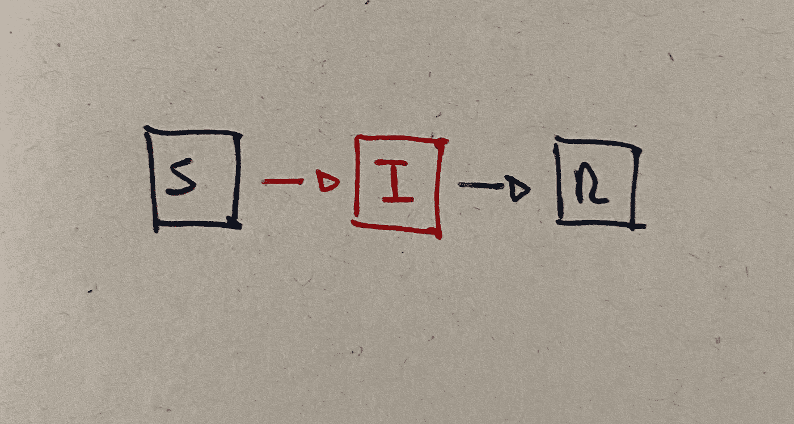

隔间之间的流动

*   第二，人口中的所有个体都具有相同的患病概率，并且他们的年龄分布均匀地分布在 **0** 和**预期寿命 *L*** 之间(这种假设尤其对发达国家是合理的)。
*   第三，群体的*同质混合*:个体与群体其余部分的接触也遵循均匀分布，即个体不是更小群体的一部分。由于通常存在的社会结构，这种假设不太合理，但有必要使模型易于处理。

# 基本定义

在定义模型之前，我们需要引入两个基本的流行病学量:

*   **感染率 *β*** ，即单位时间内单个(被感染)个体感染的人数。这个量与单位时间内的接触次数(假定不变)和疾病传播的概率有关；
*   **痊愈/死亡率𝛾** ，是单位时间内痊愈的感染者的平均比率。例如，如果一次感染的持续时间***【D】****为 10 天，那么从统计数据来看，当前感染人群的 *1/10* 每天都会康复。*

*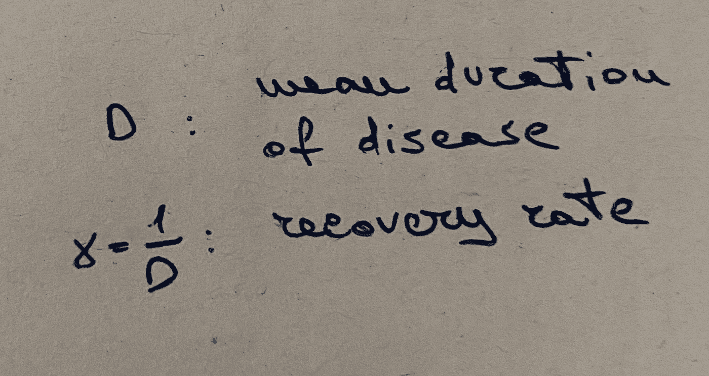*

*恢复速度和疾病持续时间*

*感染率和恢复率之间的比率给了我们另一个基本的衡量标准，即**r₀的基本再生数**:*

*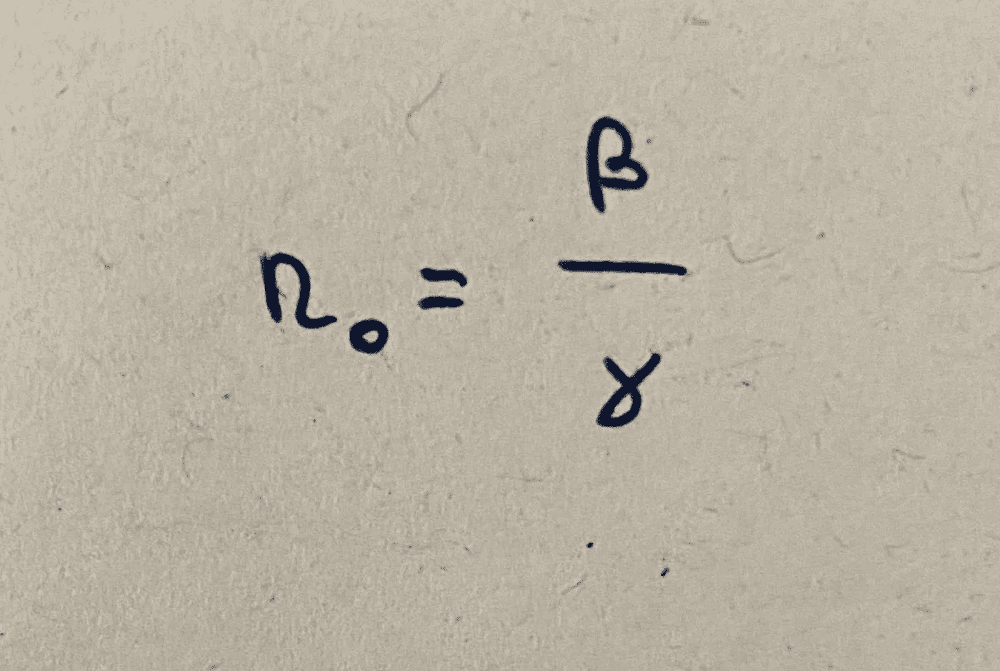*

*基本复制数*

*基本生殖数代表疾病的**生殖比率**，是易感个体群体中一个受感染个体直接产生的预期病例数。*

*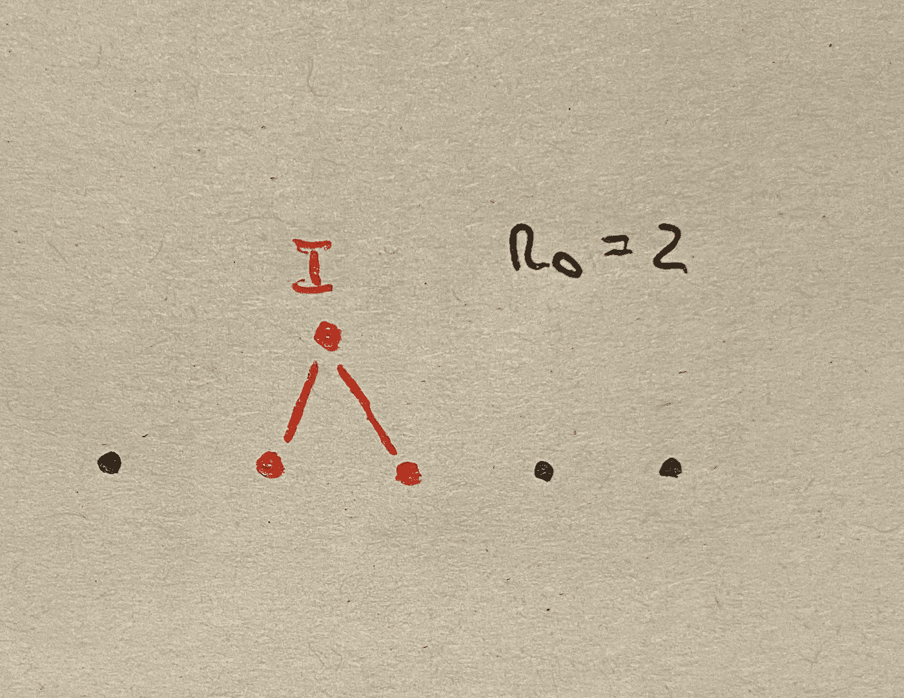*

*每个被感染的个体预计会感染另外两个个体*

*如果估计准确的话，这是一个非常重要的数字，因为它区分了自熄性疾病( **R₀ < 1** )、地方性疾病( **R₀=1** )和流行病( **R₀ > 1** )。*

# *模型*

*为了开始建模，让我们定义一组变量。*

*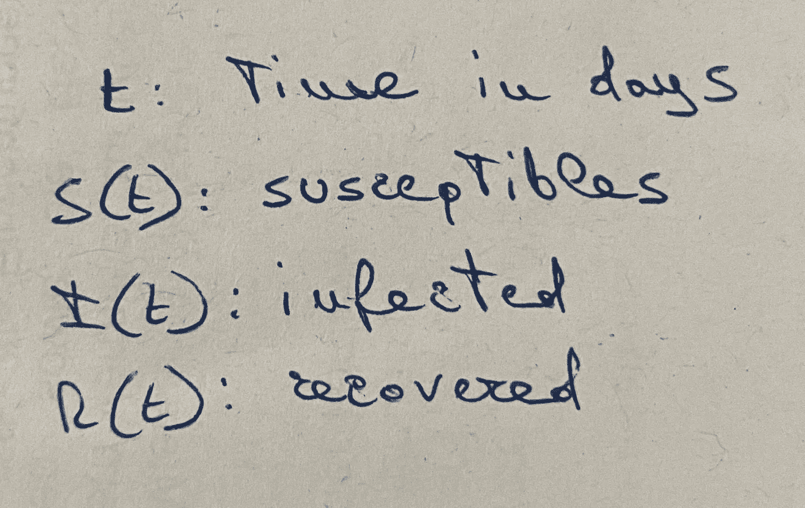*

*模型的变量*

*给定模型假设，以下等式成立:*

*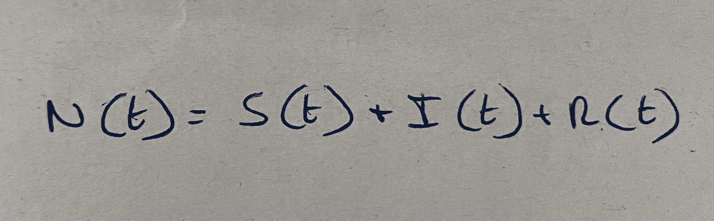*

*平衡方程式*

*为了推广该模型并简化计算，我们将从现在开始考虑每一组相对于总体的分数:*

*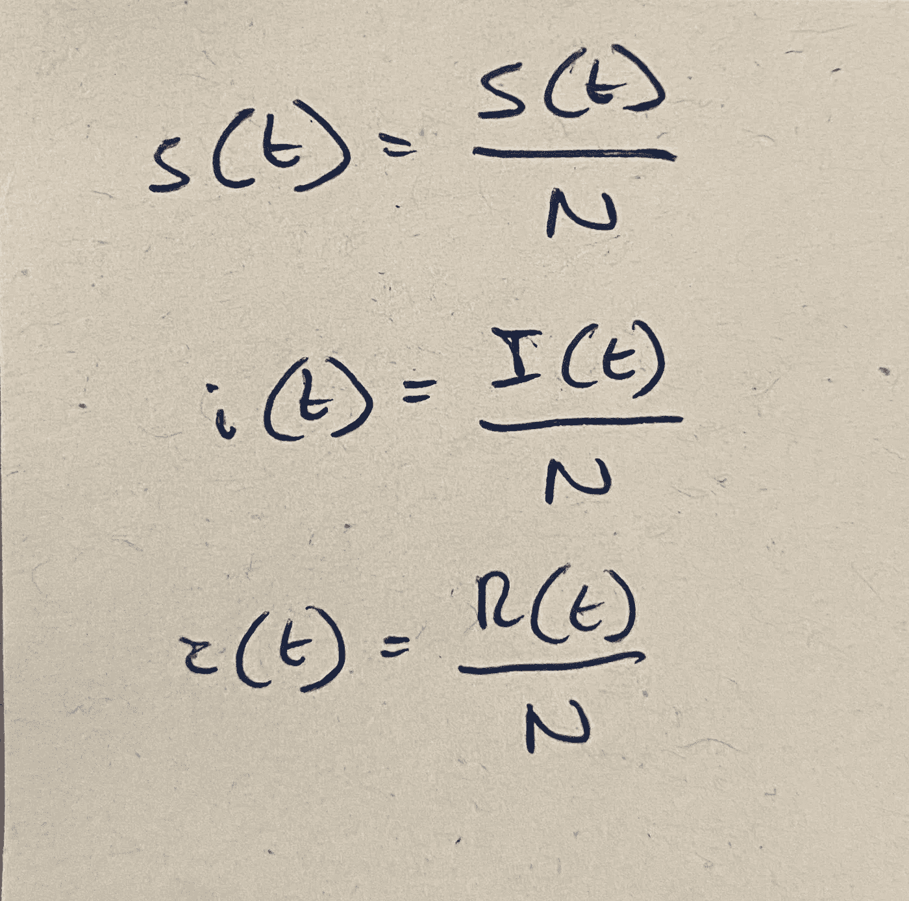*

*三类人口的比例*

*给定上述假设，这些量应该如何随时间变化？*

*随着人们感染这种疾病，易感者的数量会减少，所以这种变化肯定是负面的。单个(被感染)个体在单位时间内感染 *β* 【易感】个体，则单位时间内感染者的总分数等于:*

*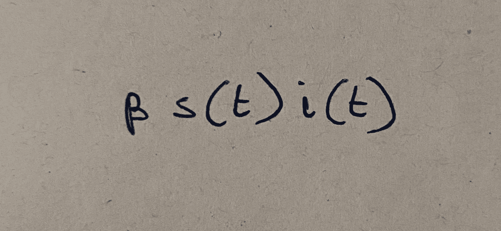*

*单位时间内受感染个体的比例*

*另一方面，如果一部分𝛾感染的个体在单位时间内康复，则在单位时间内康复的个体的总比例为:*

*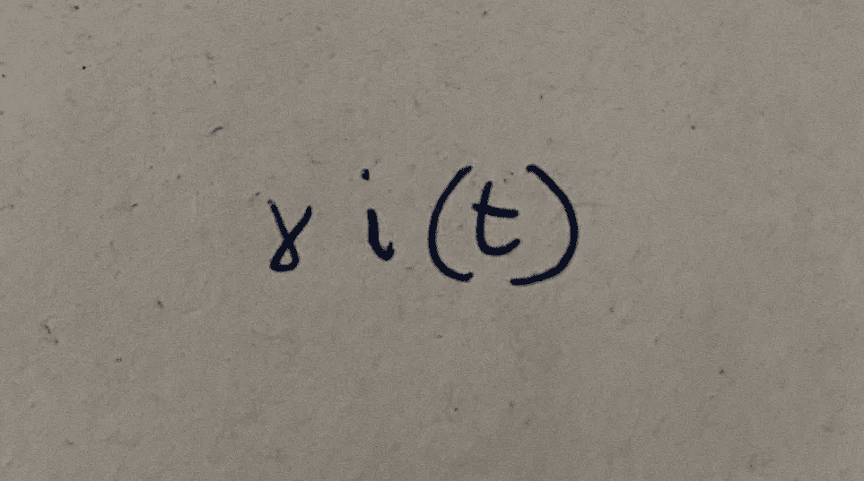*

*单位时间内恢复个体的分数*

*现在，使用正确的符号，我们可以写出模型的微分方程:*

*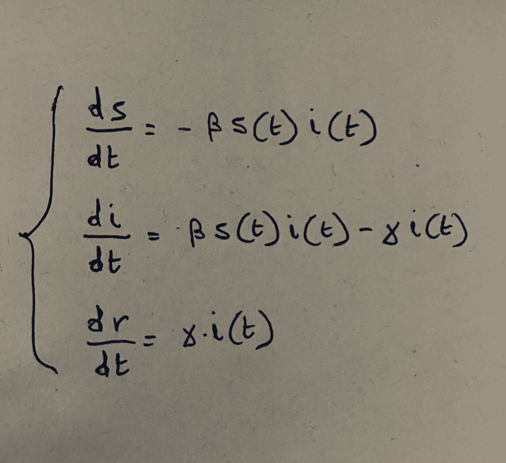*

*模型方程*

*它们反映了模型的假设:没有人会再次变得易感，易感者会被感染，所有被感染的个体最终会康复(或死亡)，没有其他选择。*

# *模拟*

*运行模型的时间到了。迄今为止，我一直在努力寻找新冠肺炎病毒的已知参数。根据[1]，恢复的中位时间约为 2 周，因此 ***β=1/14*** *。*另一个来源【2】估计基本再生数为 ***R₀=2.28*** ，由此我们可以推断出 ***𝛾=0.16*** 。最后，尽管有些说法与此相反，但最被接受的假设仍然是，一个人一旦被感染，就会获得对病毒的免疫力。*

*为了整合模型的方程，我使用了 scipy 的[*odeint*](https://docs.scipy.org/doc/scipy/reference/generated/scipy.integrate.odeint.html)*函数。顺便说一句，[3]为编写 SIR 模型提供了一个很好的例子。我假设最初的感染人数等于 0.1%(T21)。**

**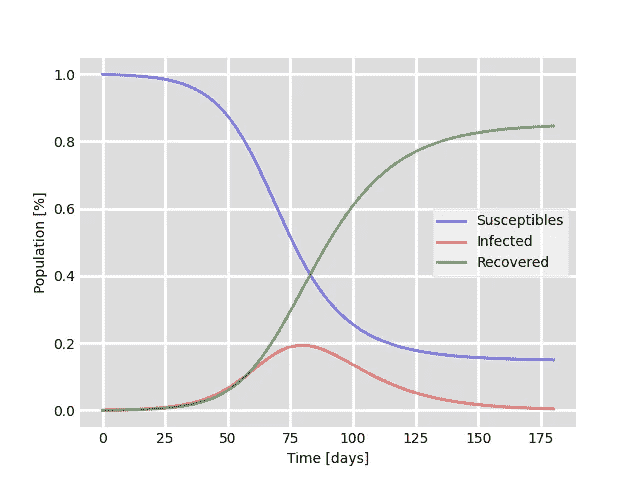**

**新冠肺炎的 SIR 模型**

**根据这个模型，在没有任何干预来控制传播的情况下，病毒将在大约 180 天内被消灭，挽救不到 20%的人口。**

**SIR 模型当然是一个非常简单的模型，不适合塑造复杂的动态，尤其是那些涉及大量不同人群的动态。尽管如此，它仍然适用于小规模同质人群，在这些人群中，更容易尊重模型背后的假设(例如，疫情发生在游轮[钻石公主号](https://en.wikipedia.org/wiki/2020_coronavirus_outbreak_on_cruise_ships#Diamond_Princess)上)。**

**当局下令采取的措施如何遏制病毒的传播？最近在一些欧洲地区实施的隔离和检疫措施显然是为了尽可能地限制感染的可能性。在我们的模型中，这反映在因子 *β的突然降低。***

**假设这些措施:**

*   **使新的*ββ₂=β/3*(也许没有这么大的减少)，并且**
*   **在第 50 天施用，即在感染人数达到高峰之前，**

**会出现以下情况:**

**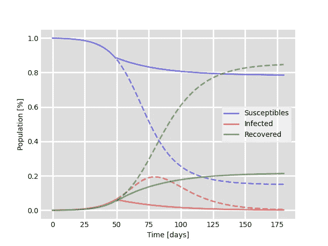**

**减少模型的 *β***

**事实上，通过迅速反应，大幅降低β因子，感染人数立即减少，从而趋近于零。**

## **参考**

**[1][https://ourworldindata.org/coronavirus](https://ourworldindata.org/coronavirus)**

**[2][http://www . cid rap . umn . edu/news-perspective/2020/02/study-72000-新冠肺炎-病人-发现-23-死亡率](http://www.cidrap.umn.edu/news-perspective/2020/02/study-72000-covid-19-patients-finds-23-death-rate)**

**[3][https://scipython . com/book/chapter-8-scipy/additional-examples/the-sir-epidemic-model/](https://scipython.com/book/chapter-8-scipy/additional-examples/the-sir-epidemic-model/)**