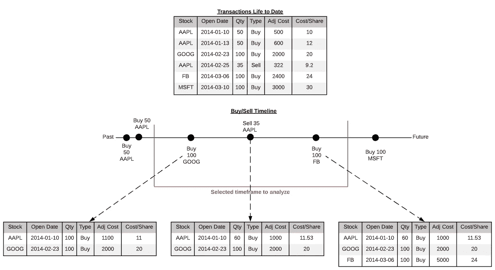
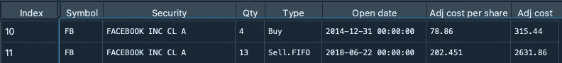
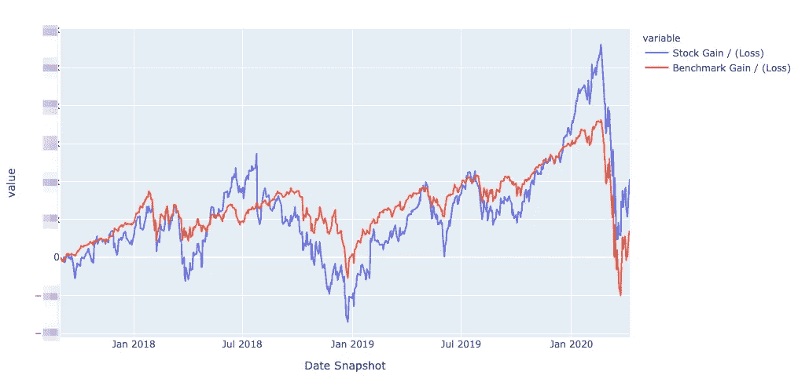
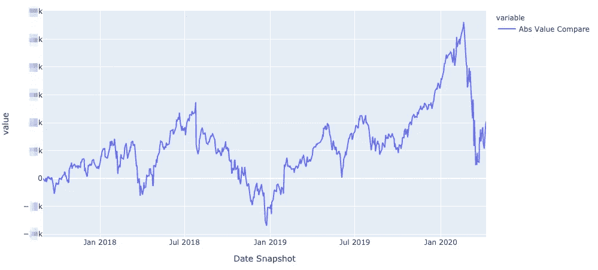
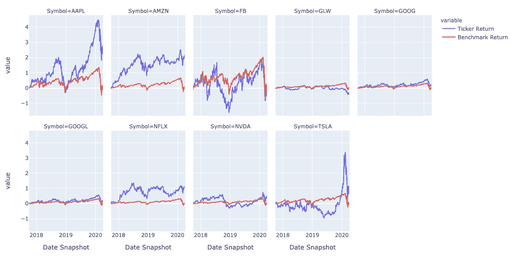

# 用 Python 建模你的股票投资组合表现

> 原文：<https://towardsdatascience.com/modeling-your-stock-portfolio-performance-with-python-fbba4ef2ef11?source=collection_archive---------5----------------------->

## 用 200 行代码评估你的交易表现


照片由[杰米街](https://unsplash.com/@jamie452?utm_source=medium&utm_medium=referral)在 [Unsplash](https://unsplash.com?utm_source=medium&utm_medium=referral)

当我刚开始学习 Python 时，我的目标之一是理解如何更好地评估我的股票投资组合的财务表现。我看到了凯文·博勒(Kevin Boller)的一篇很棒的文章(T5 ),他用 python 将投资组合与标准普尔 500 指数进行了比较。我强烈建议花几分钟时间通读它，以便更好地理解基本的金融概念，因为我在这里不会深入探讨。

然而，我想要的是数据的时间序列显示，而这更多的是一个时间点的汇总。最初的代码还假设股票销售永远不会发生，我希望它反映在动态时间框架内买入/卖出头寸的现实。

本文的其余部分将探讨我如何构建代码的过程，在时间加权的基础上准确计算性能的挑战，以及如何显示最终结果。下面解释的文件和代码可以在这里[找到并分叉](https://github.com/mattygyo/stock_portfolio_analysis)。

# 构建问题

我们的目标是从某人的投资组合中读取一个包含“买入”和“卖出”的 CSV 文件，然后计算任意指定时间范围内相对于某个指数的回报率。“听起来不可怕！”——在开始编码之前，我脑海中傲慢的声音说道。事实证明，语音是一个绝望的乐观主义者，实际上有很多障碍，包括:

*   对于相对的开始和结束日期，如何计算开始时的“当前”持有量？
*   在给定的时间范围内，你如何计算同一仓位的多次买入和卖出？
*   当同一支股票在不同的成本基础上进行多次购买/销售时，如何准确描述成本基础？

为了更好地说明这些挑战，这里有一张图，试图将一个场景可视化:



显示买卖后正确计算的成本/份额的示例

请看插图，最上面的表格代表投资组合中的一些虚假的买入/卖出数据。下面的部分显示了所选时间段内不同时间点的每日快照。正如你所看到的，在开始日期之前的交易**在计算时间段开始时的活跃余额时变得非常重要。仅仅因为我在开始日期之前购买了 100 股苹果股票，并不意味着它应该被排除在外。**

你还会注意到，在表格的底部中间，卖出 AAPL 股票时，每股成本变成了 11.53 美元，这是为什么呢？因为 AAPL 股票是在两天后以不同的价格购买的，我们需要合计并平均成本。这意味着你销售的顺序变得很重要！对于本文，我们将假设一切都符合 [FIFO](https://en.wikipedia.org/wiki/FIFO_and_LIFO_accounting) 标准，这意味着最早买入的股票是最先卖出的股票。最后，我们看到购买 MSFT 股票将被排除，因为它存在于时间范围之外，所以我们需要在我们的计划中考虑这一点。

# 解决方案提案

在考虑了上面提到的挑战后，我决定创建一个新的持股和股票价格的“每日”计算，这对于生成准确的分析是必要的。作为一个额外的好处，凯文文章中提到的一切也是可行的，因为几乎所有的计算都是基于拍摄一张快照并将其与后来的快照进行比较。记住这一切，我们将采用以下方法来构建它:

*   读取包含所有买入/卖出交易日期的投资组合文件，然后在指定的结束日期之前提取所有报价机的每日数据(记住我们需要担心开始日期之前的买入/卖出)
*   根据提供的起始日期，计算“活跃”投资组合持有量和调整后的单位持有成本
*   在我的投资组合中创建一个每日“活跃持有”清单，以及股票的每日收盘价
*   基于每天的合并数据创建计算

现在我们已经有了一个我们想要完成的松散结构，让我们开始打字吧！

Doggo 正在做一个蛇 boi 程序

# 步骤 1 —获取数据

我们需要做的第一件事是获取我们投资组合中股票的每日数据，以及我们评估投资组合的基准数据。股票数据通常不会以开源或免费的形式提供，尽管有很多令人敬畏的服务，如用于核心分析的 [Quandl](https://www.quandl.com/) 或 [IEXFinance](https://iexcloud.io/) ，它们对我的普锐斯需求来说是一辆法拉利。幸运的是，有一个名为 [yfinance](https://github.com/ranaroussi/yfinance) 的优秀库，它可以抓取雅虎财经的股票数据，并以结构化的形式返回。因此，让我们从导入我们需要的库和获取数据的前几个函数开始:

我们正在编写的第一个函数叫做`create_market_cal`，它使用[pandas _ market _ calendars](https://github.com/rsheftel/pandas_market_calendars)库来查找指定时间段内的所有相关交易日。这个库根据市场自动过滤掉非交易日，所以我不需要担心通过使用类似 [pandas.date_range](https://pandas.pydata.org/pandas-docs/version/0.22.0/generated/pandas.date_range.html) 的东西将数据连接到无效日期。由于我的股票都在美国，我将选择`NYSE`作为我的日历，然后标准化时间戳，使它们便于以后加入。

`get_data`函数获取一组股票报价器以及开始和结束日期，然后使用上面列出的 yfinance 库获取数据。您会注意到结束日期参数包括一个`timedelta`转移，这是因为 yfinance 不包括您提供的结束日期。由于我们不想在设置参数时记住这个警告，我们将使用 timedelta 将这里的日期移动+1。

最后，`get_benchmark`函数只是馈入`get_data`，然后放下股票代码。现在我们已经有了初始函数，让我们运行下面的程序来给变量赋值:

```
portfolio_df = pd.read_csv('stock_transactions.csv')
portfolio_df['Open date'] = pd.to_datetime(portfolio_df['Open date'])symbols = portfolio_df.Symbol.unique()
stocks_start = datetime.datetime(2017, 9, 1)
stocks_end = datetime.datetime(2020, 4, 7)daily_adj_close = get_data(symbols, stocks_start, stocks_end)
daily_adj_close = daily_adj_close[['Close']].reset_index()
daily_benchmark = get_benchmark(['SPY'], stocks_start, stocks_end)
daily_benchmark = daily_benchmark[['Date', 'Close']]
market_cal = create_market_cal(stocks_start, stocks_end)
```

作为参考，我的 CSV 文件包含以下各列，如果您尝试复制，您需要确保您的 CSV 包含相同的列:



事务 CSV 格式

我们现在有四个重要的数据集来继续:

1.  `portfolio_df`根据我们的购买/销售交易历史
2.  `daily_adj_close`在指定的结束日期之前，每天关闭我们库存中的所有票据
3.  `daily_benchmark`与每日收盘数据进行基准比较
4.  `market_cal`包含我们时间段内市场开放的日期

利用这一点，我们可以前进到下一步，走向辉煌！

# 第 2 步——找到我们最初的活跃投资组合

现在我们有了这四个数据集，我们需要计算出在指定的起始日期我们积极持有了多少股票。为此，我们将创建两个函数，`portfolio_start_balance`和`position_adjust`。

将输出分配给一个变量应该会给你投资组合中的活跃头寸:

```
active_portfolio = portfolio_start_balance(portfolio_df, stocks_start)
```

现在我们可以看到代码了，让我们看看内部的工作原理，用通俗的语言展示一下发生了什么。

## `portfolio_start_balance`

首先，我们向`portfolio_start_balance`函数提供 CSV 数据和开始日期，并创建在开始日期之前发生的所有交易的数据框架。然后，我们将检查在 start _ date 之后**是否有未来销售，因为我们最终将重建该数据帧的快照:**

```
positions_before_start = portfolio[portfolio['Open date'] <= start_date]
future_sales = portfolio[(portfolio['Open date'] >= start_date) & (portfolio['Type'] == 'Sell.FIFO')]
```

然后，我们将创建一个在 start_date 之前**发生的销售数据框架。我们需要确保在指定的 start_date，这些都从我们的活动投资组合中剔除:**

```
sales = positions_before_start[positions_before_start['Type'] == 'Sell.FIFO'].groupby(['Symbol'])['Qty'].sum()
sales = sales.reset_index()
```

接下来，我们将制作在指定时间段内没有任何销售发生的头寸的最终数据框架:

```
positions_no_change = positions_before_start[~positions_before_start['Symbol'].isin(sales['Symbol'].unique())]
```

现在，我们将遍历我们的`sales`数据帧中的每一笔销售，调用我们的`position_adjust`函数，然后将它的输出追加到我们的空`adj_postitions_df`中:

```
adj_positions_df = pd.DataFrame()
for sale in sales.iterrows():
    adj_positions = position_adjust(positions_before_start, sale)
    adj_positions_df = adj_positions_df.append(adj_positions)
```

现在让我们看看`position_adjust`函数是如何工作的，这样我们就可以完全理解这里发生了什么。

## `position_adjust`

首先，我们将创建一个名为`stocks_with_sales`的空数据框架，稍后我们将在其中添加调整后的头寸，另一个数据框架包含所有标记为“买入”的交易。

请记住，我们已经在`portfolio_start_balance`函数中过滤了“未来购买”,因此无需在此重复。你还会注意到我们是按“开仓日期”排序的，这很重要，因为我们想用 FIFO 方法减去仓位。通过对日期进行排序，我们知道我们可以迭代地遍历从旧到新的位置列表:

```
stocks_with_sales = pd.DataFrame()    
buys_before_start = daily_positions[daily_positions['Type'] == 'Buy'].sort_values(by='Open date')
```

现在我们在一个数据框架中有了所有的买入，我们将过滤股票代码与卖出位置的股票代码相匹配的所有买入:

```
for position in buys_before_start[buys_before_start['Symbol'] == sale[1]['Symbol']].iterrows():
```

您会注意到，我们使用索引来访问数据中的“符号”列。这是因为使用`iterrows()`从索引[0]和数据序列[1]创建了一个元组。这与我们在遍历`buys_before_start`时使用索引的原因相同:

```
for position in buys_before_start[buys_before_start['Symbol'] == sale[1]['Symbol']].iterrows():
        if position[1]['Qty'] <= sale[1]['Qty']:
            sale[1]['Qty'] -= position[1]['Qty']
            position[1]['Qty'] = 0
        else:
            position[1]['Qty'] -= sale[1]['Qty']
            sale[1]['Qty'] -= sale[1]['Qty']
        stocks_with_sales = stocks_with_sales.append(position[1])
```

所以循环中发生的是在`buys_before_start`的每一次购买:

*   如果最早的买入数量≤卖出数量(也就是你卖出的数量超过了你最初的买入数量)，从卖出数量中减去买入数量，然后将买入数量设置为 0
*   否则(某一天你买入的数量>卖出的数量)，从买入位置减去卖出数量，然后从卖出位置减去相同的数量
*   将调整后的位置附加到空的`stock_with_sales`数据帧中

一旦循环通过每个销售位置，您的代码现在将执行`portfolio_start_balance`的最后几行:

```
adj_positions_df = adj_positions_df.append(positions_no_change)
adj_positions_df = adj_positions_df.append(future_sales)
adj_positions_df = adj_positions_df[adj_positions_df['Qty'] > 0]
```

因此，我们在`adj_positions_df`中获取调整后的头寸，添加从未有过销售的回售头寸，添加未来发生的回售头寸，并最终过滤掉`position_adjust`清零的任何行。你现在应该有一个准确的记录，你的积极持有开始日期！

# 步骤 3 —创建每日性能快照

现在我们有了在开始日期持仓的准确报表，让我们创建每日业绩数据！我们的策略类似于我们在步骤 2 中所做的，事实上，我们将再次重复使用`position_adjust`方法，因为我们需要考虑我们的日期范围内的潜在销售额。我们将继续创建两个新函数，`time_fill`和`fifo`，我将更详细地解释每个函数的作用:

## 时间填充

与`portfolio_start_balance`类似，我们的目标是提供活跃头寸的数据框架，找到卖出头寸，并根据买入头寸将卖出头寸清零。这里的主要区别是，我们将使用有效交易日的`market_cal`列表进行循环:

```
sales = portfolio[portfolio['Type'] == 'Sell.FIFO'].groupby(['Symbol','Open date'])['Qty'].sum()
sales = sales.reset_index()per_day_balance = []
for date in market_cal:
        if (sales['Open date'] == date).any():
            portfolio = fifo(portfolio, sales, date)
```

这样，我们可以每天查看是否有销售发生，正确调整头寸，然后返回每日数据的正确快照。此外，我们还将过滤之前或当前`date`发生的头寸，并确保只有买入。然后，我们将在 market_cal 循环中添加一个带有当前`date`的`Date Snapshot`列，然后将其追加到我们的`per_day_balance`列表中:

```
daily_positions = portfolio[portfolio['Open date'] <= date]
daily_positions = daily_positions[daily_positions['Type'] == 'Buy']
daily_positions['Date Snapshot'] = date
per_day_balance.append(daily_positions)
```

## 先入先出

我们的`fifo`函数获取您的活跃投资组合头寸、在`time_fill`中创建的销售数据框架以及在`market_cal`列表中的当前`date`。然后对`sales`进行过滤，找出当前`date`发生的任何情况，并创建不受`sales`影响的位置的数据帧:

```
sales = sales[sales['Open date'] == date]
daily_positions = daily_positions[daily_positions['Open date'] <= date]
positions_no_change = daily_positions[~daily_positions['Symbol']. isin(sales['Symbol'].unique())]
```

然后，我们将使用我们可靠的`position_adjust`函数来清除任何活跃销售的头寸。如果在特定日期没有销售，我们的函数将简单地将`positions_no_change`附加到空的`adj_positions`数据帧上，为您留下准确的每日头寸快照:

```
adj_positions = pd.DataFrame()
for sale in sales.iterrows():
    adj_positions = adj_positions.append(position_adjust( daily_positions, sale))
adj_positions = adj_positions.append(positions_no_change)
adj_positions = adj_positions[adj_positions['Qty'] > 0]
```

运行这行代码应该会返回指定时间范围内所有交易日的列表，以及每天头寸的准确计数:

```
positions_per_day = time_fill(active_portfolio, market_cal)
```

# 步骤 4 —进行投资组合计算

如果你还跟着我们，我们就在最后阶段了！现在我们已经有了我们的活跃持仓量的准确的每日分类账，我们可以继续创建生成图表所需的最终计算！为此，我们将在代码中添加另外六个函数:

让我们从最后一个函数`per_day_portfolio_calcs`开始，因为它将使用所有其他函数。

## 每日投资组合计算

现在我们已经有了步骤 3 中的`positions_per_day`，我们的目标是将它与`daily_benchmark`、`daily_adj_close`和`stocks_start`一起传递给这个新函数:

```
combined_df = per_day_portfolio_calcs(positions_per_day, daily_benchmark, daily_adj_close, stocks_start)
```

然后，我们将使用`pd.concat`将我们的数据帧列表连接成一个列表:

```
df = pd.concat(per_day_holdings, sort=True)
```

现在我们有了一个大数据帧，我们将把它传递给`per_day_portfolio_calcs`中的其余函数。

## 修改后的每股成本

如果我们想跟踪每天的表现，我们需要知道我们每天持有股票的理论价值。这需要计算当前持有的证券数量，然后乘以每只证券的每日收盘价。

```
mcps = modified_cost_per_share(df, daily_adj_close, stocks_start)
```

为此，我们提供了新的单一 df 以及使用 yfinance 提取的每日数据，以及我们的开始日期。然后，我们将通过将投资组合快照的日期与每日数据的日期相结合，以及在自动收报机上相结合，来将我们的投资组合与每日收盘数据相结合。对于更熟悉 SQL 的人来说，这实际上是一个左连接:

```
df = pd.merge(portfolio, adj_close, left_on=['Date Snapshot', 'Symbol'],right_on=['Date', 'Ticker'], how='left')
```

一旦我们合并了`df`,我们将把每日收盘重新命名为“符号调整收盘”,然后用每日收盘乘以拥有的股票数量。删除额外的列将返回我们需要继续的数据帧:

```
df.rename(columns={'Close': 'Symbol Adj Close'}, inplace=True)
df['Adj cost daily'] = df['Symbol Adj Close'] * df['Qty']
df = df.drop(['Ticker', 'Date'], axis=1)
```

## 基准 _ 投资组合 _ 计算

现在我们有了证券的准确每日成本，我们希望将基准添加到数据集中，以便与我们的投资组合进行比较:

```
bpc = benchmark_portfolio_calcs(mcps, daily_benchmark)
```

我们首先使用类似于`modified_cost_per_share`中的合并将我们的每日基准数据合并到正确的快照中:

```
portfolio = pd.merge(portfolio, benchmark, left_on=['Date Snapshot'], right_on=['Date'], how='left')
portfolio = portfolio.drop(['Date'], axis=1)
portfolio.rename(columns={'Close': 'Benchmark Close'}, inplace=True)
```

现在我们已经将基准的每日收盘数据合并到我们的投资组合数据集中，我们将根据其最大和最小日期过滤我们的`daily_benchmark`数据。使用最大值和最小值来对比你的开始和结束日期是很重要的，因为最大值/最小值会考虑市场开放的日子:

```
benchmark_max = benchmark[benchmark['Date'] == benchmark['Date'].max()]
portfolio['Benchmark End Date Close'] = portfolio.apply(lambda x: benchmark_max['Close'], axis=1)benchmark_min = benchmark[benchmark['Date'] == benchmark['Date'].min()]
portfolio['Benchmark Start Date Close'] = portfolio.apply(lambda x: benchmark_min['Close'], axis=1)
```

太好了！因此，现在我们在投资组合数据集中也有了基准的绝对开始和结束收盘，这在计算每日回报时将非常重要。

## 投资组合 _ 年末 _ 统计

现在我们的基准数据已经添加完毕，让我们进入下一步:

```
pes = portfolio_end_of_year_stats(bpc, daily_adj_close)
```

我们这里的目标是获取`benchmark_portfolio_calcs`的输出，找到投资组合中所有股票的最后一天收盘，然后向我们的投资组合数据集中添加一个`Ticker End Date Close`列。我们将再次合并到每日股票数据中，过滤最大日期，然后根据股票代码进行连接:

```
adj_close_end = adj_close_end[adj_close_end['Date'] == adj_close_end['Date'].max()]portfolio_end_data = pd.merge(portfolio, adj_close_end, left_on='Symbol', right_on='Ticker')portfolio_end_data.rename(columns={'Close': 'Ticker End Date Close'}, inplace=True)portfolio_end_data = portfolio_end_data.drop(['Ticker', 'Date'], axis=1)
```

现在，在我们生成计算结果之前，只需再走一步！

## 投资组合 _ 年初 _ 统计

这最后一步采用更新的投资组合数据框架，即来自 yfinance 的每日股票数据，并为基准分配年初等价头寸:

```
pss = portfolio_start_of_year_stats(pes, daily_adj_close)
```

我们将首先过滤开始日期的每日收盘数据，然后使用股票代码将我们的投资组合数据合并到其中。为了方便起见，我们将这种关闭称为`Ticker Start Date Close`:

```
adj_close_start = adj_close_start[adj_close_start['Date'] == adj_close_start['Date'].min()]portfolio_start = pd.merge(portfolio, adj_close_start[['Ticker', 'Close', 'Date']], left_on='Symbol', right_on='Ticker')portfolio_start.rename(columns={'Close': 'Ticker Start Date Close'}, inplace=True)
```

然后我们需要调整每股成本，但是为什么呢？想象一下，你很久以前以 500 美元/股的价格购买了谷歌，但现在你想计算 2020 年你的头寸的 YTD 回报率。如果你用 500 美元作为你 2020 年初的成本基础，你不会有一个准确的比较，因为成本基础是多年前的。为了解决这个问题，我们将使用 Numpy 的`where`函数:

```
portfolio_start['Adj cost per share'] = np.where(portfolio_start['Open date'] <= portfolio_start['Date'],
         portfolio_start['Ticker Start Date Close'],
         portfolio_start['Adj cost per share'])
```

简单来说，这就是说‘如果开市日期≤开始日期的日期，那么`Adj cost per share`等于`Ticker Start Date Close`’(股票从 yfinance 数据上的 min 日期开始的收盘价)。如果没有，那就用现有的`Adj cost per share`。

剩余部分根据修改后的每股成本修改调整后的成本，从合并中删除不需要的列，然后根据新计算的调整后成本计算您将拥有的基准股票的等量:

```
portfolio_start['Adj cost'] = portfolio_start['Adj cost per share'] * portfolio_start['Qty']
portfolio_start = portfolio_start.drop(['Ticker', 'Date'], axis=1)portfolio_start['Equiv Benchmark Shares'] = portfolio_start['Adj cost'] / portfolio_start['Benchmark Start Date Close']portfolio_start['Benchmark Start Date Cost'] = portfolio_start['Equiv Benchmark Shares'] * portfolio_start['Benchmark Start Date Close']
```

恭喜，我们现在已经有了正确计算回报的所有必要数据！让我们完成最后一部分，然后开始想象！

## 计算返回

这里的最后一步只是从所有其他函数中提取聚合数据帧，对我们一直在修改的数据应用一系列计算，并返回最终数据帧:

```
returns = calc_returns(pss)
```

第一组`Benchmark Return`和`Ticker Return`都使用当前收盘价除以其初始成本基础来计算回报:

```
portfolio['Benchmark Return'] = portfolio['Benchmark Close'] / portfolio['Benchmark Start Date Close'] - 1portfolio['Ticker Return'] = portfolio['Symbol Adj Close'] / portfolio['Adj cost per share'] - 1
```

每家公司的份额价值以相同的方式计算，使用我们之前计算的修改后的每日数量和等效基准份额:

```
portfolio['Ticker Share Value'] = portfolio['Qty'] * portfolio['Symbol Adj Close']portfolio['Benchmark Share Value'] = portfolio['Equiv Benchmark Shares'] * portfolio['Benchmark Close']
```

我们将再次做同样的事情来计算货币收益/损失，从我们在`portfolio_start_of_year_stats`函数中计算的修改后的调整成本中减去股票价值列:

```
portfolio['Stock Gain / (Loss)'] = portfolio['Ticker Share Value'] - portfolio['Adj cost']portfolio['Benchmark Gain / (Loss)'] = portfolio['Benchmark Share Value'] - portfolio['Adj cost']
```

最后，我们将使用之前计算的基准指标来计算绝对回报值:

```
portfolio['Abs Value Compare'] = portfolio['Ticker Share Value'] - portfolio['Benchmark Start Date Cost']portfolio['Abs Value Return'] = portfolio['Abs Value Compare']/portfolio['Benchmark Start Date Cost']portfolio['Abs. Return Compare'] = portfolio['Ticker Return'] - portfolio['Benchmark Return']
```

嘣！现在，让我们弄清楚如何绘制我们的新数据，并完成这项工作。

## 步骤 4 —可视化数据

那么，现在我们已经经历了所有这些来获得我们的日常性能数据，我们应该如何最好地显示它呢？每日数据的最大好处是可以看到你的头寸在一段时间内的表现*，所以让我们先来看看我们的汇总数据。*

*在最近的项目中，我一直在使用 Plotly，所以为了做到这一点，我将选择 simple 并使用 [Plotly Express](https://plotly.com/python/plotly-express/) 库。由于我们需要将每天的股票汇总到一个单一的每日指标中，我将把它写成一个函数，它采用您完成的数据框架和两个您想要相互对照的指标:*

*如您所见，我们将提供 ticker 和基准收益/损失作为指标，然后使用 groupby 将每日业绩汇总到投资组合级别。画出来应该会返回类似这样的东西！*

**

*每日累计损益与基准对比*

*您还可以使用不同的指标(如`Abs Value Compare`)进行聚合，将其视为一行:*

**

*使用绝对值比较度量显示*

*这很棒，但在我看来，最有用的视图可以通过使用 plotly express 中的`facet_col`选项来生成每个股票的图表，将基准与每个股票的性能进行比较:*

*我们还将使用`facet_col_wrap`参数来限制每行的图表数量。运行这段代码应该会生成类似下面的输出！*

**

*每只股票的基准回报比较示例数据*

# *结论*

*我们在这里讨论了很多内容，希望这对学习更多关于填充和分析财务数据的知识有所帮助！未来还有很多可以探索的领域，包括:*

*   *考虑分红和股票分割——yfinance 有这个数据，但我想在添加更多功能之前先发布这个数据*
*   *加入更多奇异的指标，比如波动性比较和滚动平均。在投资组合层面与基准层面进行比较可能会很有意思*
*   *改善可操作性的信号。例如，你可以利用日间数据，观察短期均线何时穿过长期均线，作为潜在买入/卖出头寸的信号*

*希望这对任何人都有帮助，并随时联系或在下面评论问题/评论。感谢阅读！*