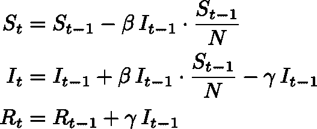
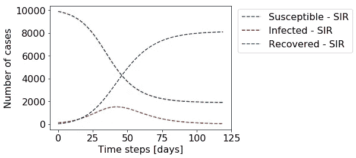
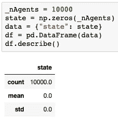
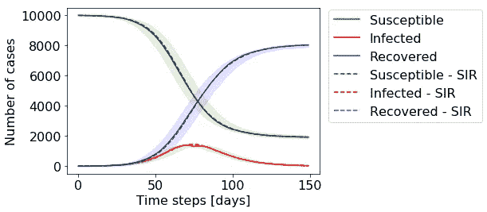
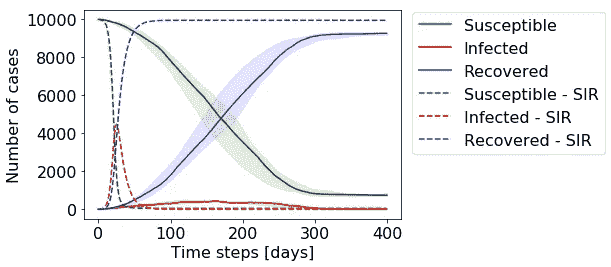
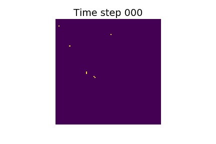
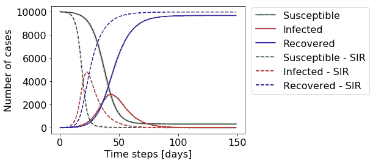
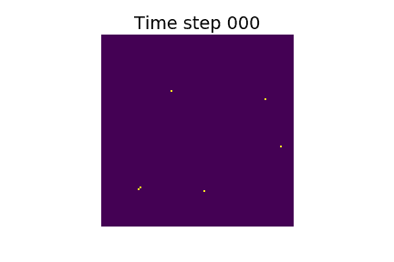

# 给疫情做模特

> 原文：<https://towardsdatascience.com/modelling-a-pandemic-eb94025f248f?source=collection_archive---------17----------------------->

## 复杂系统

## 使用 Python 和 pandas 构建基于代理的模型

克里斯多夫·伯恩斯在 [Unsplash](https://unsplash.com?utm_source=medium&utm_medium=referral) 上拍摄的照片

在我们的日常生活中，我们会遇到许多复杂的系统，在这些系统中，个人会相互影响，例如股票市场或高峰时间的交通。为这些复杂系统找到合适的模型可以让我们更好地理解它们的动力学，并允许我们在变化的条件下模拟其行为。对复杂系统建模的一种方式是使用基于主体的模型，这意味着我们是**明确地模拟个体和他们的相互作用**，而不是以集合的方式推导系统的动态。

您可以在这里找到一篇关于基于代理的模型的介绍性文章:

 [## 利用基于代理的模型克服复杂性

### 基于代理的模型初学者指南:它们如何工作和做什么

medium.com](https://medium.com/swlh/overcoming-complexity-with-agent-based-models-5c4cca37cc61) 

在这篇文章中，我们想用 python 开发这样一个基于代理的模型。作为一个例子，我们试图模拟疫情的行为。请注意，我根本不是流行病学家。这篇文章的目标不是建立一个复杂的模型来预测现实生活，而是看看**我们如何建立一个简单的基于主体的模型**并研究一些由此产生的动力学。让我们从一些基本的考虑因素开始。

## 我们模型的基础

对于我们的例子，我们假设一种非致命的疾病可能在相互接触的个体之间传播。最基本的方法是考虑三个不同的群体:

1.  尚未感染的个体，称为*易感*组。
2.  被*感染*并可能传播疾病的个体。
3.  已经从疾病中康复的个体现在是免疫的。

因为有三个相关的组(**S**u 可接受， **I** 感染， **R** 恢复)，这些模型也被称为 SIR 模型。

# 解析 SIR 模型

我们将从一个数学 SIR 模型开始，它将作为一个基准模型。在基本 SIR 模型中，三组之间的流量为:`S -> I -> R`。这是一条单行道，在这条单行道上，开始时大多数个体都属于 *S* 群体，最终通过 *I* 群体级联成 *R* 群体。在每个时间步 *t* 中，一定数量的个体从 *S* 穿越到 *I* 以及从 *I* 穿越到 *R* ，而个体总数 *N = S+I+R* 保持不变。我们可以将这些动力学写成一组微分方程，或者，以一种更容易理解的形式，我们可以写下每个组在某个时间步长内的变化量:

基本 SIR 模型

动态由两个变量 *β* 和 *γ* 控制。 *β* 是传染性个体传染他人的速率， *γ* 是传染性个体恢复的速率。对于固定的 *β* 和 *γ* 来说，这些动态特性如下所示:

你可以看到受感染个体的数量增长很快，在第 40 天左右达到高峰，此时易感个体的数量显著下降，感染率下降。这仅仅是因为到那时，相当数量的人已经感染了这种疾病，不能再被感染了。到最后，受感染个体的数量下降到零，根除了疾病。请注意，到那时，大约 20%的人从未被感染。这个所谓的*稳态解*也可以解析计算，并且取决于参数 *β* 和 *γ。*

通过这个简单的 SIR 模型，我们已经可以观察到我们问题的一些基本动力学。然而，我们只是以一种综合的方式来看待我们的群体。我们假设个体是一个同质的、非结构化的集合，被组织成三个定义明确的、完全混合的群体。被建模的相互作用平均起来只有*。每个被感染的个体每天感染固定数量的接触，并且每天所有被感染个体中的恒定部分被治愈。在这个模型中，没有办法实现个人之间复杂的社会互动。为了放宽这些假设，我们现在将建立一个基于代理的模型，分别模拟每个个体。*

# *基于主体的模型*

*我们的第一个目标是再现解析 SIR 模型的结果。作为一种数据结构，我们希望使用熊猫数据帧。让我们从初始化 10，000 个代理开始，用数据帧中的行表示:*

**

*目前，数据帧只有一行称为 *state* ，表示代理的健康状态。我们用 0 编码易感，用 1 编码感染，用 2 编码康复。*

*现在我们需要一些功能来感染一个代理。我们希望这个函数获取与被感染的代理有过接触的代理的列表。此外，我们希望给出这些接触者实际被感染的概率。为了增加随机性，这里使用了一些蒙特卡罗方法。下面的函数完成所需的工作。*

*联系人列表允许多次保留同一个代理。我们为联系人列表中的每个唯一代理滚动 0 到 1 之间的随机数，并且如果该滚动低于概率阈值，则将状态从易感染(0)更新为已感染(1)。该函数的最后一行相应地更新 state 列。*

*同样，我们需要一个函数，以一定的概率恢复被感染的代理。这里，我们在每个时间步中使用一个平坦的恢复机会。*

*在每个时间步调用*感染*和*恢复*函数。为此，我们创建了一个*步骤*函数。这里，我们生成一个随机接触列表，其长度为受感染代理数量的常数倍。*

*为了对我们基于代理的模型的结果的变化有一个感觉，我们将运行模拟十次。对于每个实验，我们初始化一组 10，000 个代理，开始时有 5 个被感染的患者，零个患者。然后我们执行 150 个时间步骤。*

## *基线结果*

*在每个时间步可视化三个组(易感、感染和恢复)的每个组的大小，我们可以看到我们的基于代理的模型的动力学与基本 SIR 模型一致。*

**

*基线模型的结果。这里我们使用以下参数:_randomContacts=9，_chanceOfInfection=0.025 和 _chanceOfRecovery=0.1。对于 SIR-模型，参数为 *β=0.225* 和 *γ=0.1。**

*实线显示了我们 10 次模拟运行的中值，而阴影区域显示了 25%-75%分位数之间的区域。即使在模拟的中心部分存在一些差异，所有模型都达到了非常相似的终点，即等于解析解。*

*到目前为止，与基本的 SIR 模型相比，我们还没有获得太多，但是我们已经建立了一个基于代理的基线模型，并验证了它的行为类似。有了这个设置，我们现在可以开始添加额外的复杂性。*

## *基于空间主体的模型*

*直觉上，假设被感染的病原体会与一组完全随机的病原体接触，在现实生活中可能不成立。你更希望有一些社会邻居，一群被感染的代理人定期接触的人。模拟这种效果的一个简单方法是将代理放在一个格子上，让它们与 9 个最近的邻居互动。*

**

*空间模型的结果。这里我们使用以下参数:_randomContacts=0，_chanceOfInfection=0.06 和 _chanceOfRecovery=0.1。对于 SIR 模型，参数为 *β=0.54* 和 *γ=0.1。**

*注意延长的 *x* 轴。您可以看到，对于基于空间代理的模型来说，动力学现在慢了很多。我甚至不得不显著增加感染的几率，让它继续运行。我们向接触者介绍的结构导致这样一个事实，即受感染的病原体生活在已经有许多病原体被感染或已经康复的环境中，从而导致疾病传播的显著减少。我们可以在下面的动画中直观地看到代理的空间分布:*

**

*蓝色:易感，黄色:感染，绿色:康复*

## *添加随机联系人*

*我们发现，当我们将空间结构引入到个体的社会互动中时，疾病的发展速度明显减慢。除了九个空间邻居之外，我们为每个代理引入一个额外的随机接触会发生什么？*

**

*空间模型的结果。这里我们使用以下参数:_randomContacts=1，_chanceOfInfection=0.06 和 _chanceOfRecovery=0.1。对于 SIR-模型，参数为 *β=0.6* 和 *γ=0.1。**

**

*蓝色:易感，黄色:感染，绿色:康复*

*只需一次额外的随机接触，感染的动力学就再次变得更快，迅速破坏我们通过在网格上放置药剂而引入的结构。*

## *日益增加的复杂性*

*我们有一个工作设置，人们现在可以通过增加复杂性来玩它。人们可以考虑对不同的、相互联系很弱的个体群进行建模，或者为个体引入一个年龄结构，以反映不同年龄组的不同类型的相互作用。此外，人们可以开始采取措施，在某个时间阶段减少感染的机会，或者减少接触的次数。*

# *表演*

*一句话关于模型的性能。通常，我喜欢使用面向对象的方法来构建基于代理的模型。将代理建模为一个类使得模拟和编码非常直观。然而，在 python 中，模拟可能很快变得相对缓慢。通过将数据存储到 pandas dataframes 中，其中一行代表一个代理，我们失去了一些灵活性，但是我们可以依靠 numpy 函数来完成主要的工作负载，从而使模拟相当快。我的机器以每秒 50 步的速度运行了 100，000 个模拟代理，在几秒钟内产生模拟输出。*

# *结论*

*我向您展示了如何从头开始建立一个基本的基于代理的模型。我们看了模拟疾病传播的例子。作为第一步，我们对照一个已知的数学模型来验证我们模型的最小版本。然后，我们开始改变参数，以研究系统的动态变化。通过在药物中引入晶格结构，我们观察到疾病的传播明显减慢，但只允许一次随机接触又会导致动力学增加。所提出的实现是一种灵活的设置，允许代理内更复杂的交互、异构性和结构的简单实现。此外，我们能够在一个复杂的大规模模拟中研究个体水平上的代理或代理的子群。*

*请随意使用这个设置作为开始，并与它一起玩。完整代码可在此处获得:*

 *[## 比特桶

### 贮藏室ˌ仓库

bitbucket.org](https://bitbucket.org/chgraf/blog/src/master/Agent%20Based%20Pandemic/)*