# 为药物发现知识图建模生物医学数据

> 原文：<https://towardsdatascience.com/modelling-biomedical-data-for-a-drug-discovery-knowledge-graph-a709be653168?source=collection_archive---------22----------------------->

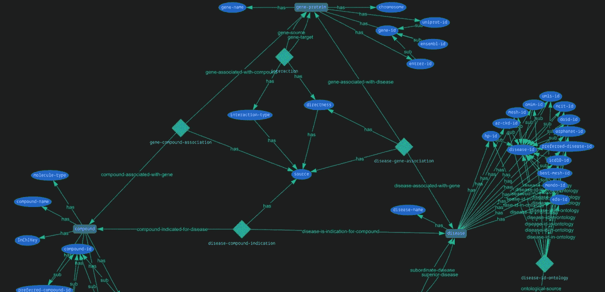

## 听取阿斯利康的数据科学和人工智能的汇报

本月早些时候，阿斯利康的副首席科学家娜塔莉·库尔巴托娃加入了我们的第一系列[轨道](https://discuss.grakn.ai/t/grakn-orbit-an-event-by-the-grakn-community/2177)。

Natalie 在阿斯利康的数据科学和人工智能部门工作，在那里她专注于数据建模、将数据集成到知识图、预测算法以及其中的主题。

# **目标:预测新的疾病目标**

在阿斯利康，Natalie 的团队专注于构建一个知识图来预测新的疾病目标(基因或蛋白质目标)，他们称之为*发现图*。在构建过程中，Natalie 向我们介绍了两种要考虑的数据源:

**结构化数据**指的是生物信息学中公开可用的数据集，这些数据集已经在行业中进行了整理和广泛使用。虽然生物医学结构化数据是机器可读的，但通常不容易处理。特别是，很难集成这些数据集，因为它们可以以不同的方式描述类似的概念，例如:*不同的 id 彼此不一致*。一些最常用的公开可用数据集包括: [Ensembl](https://www.ensembl.org/index.html) 、 [Uniprot](https://www.uniprot.org/) 、 [ChEMBL](https://www.ebi.ac.uk/chembl/) 、 [PubChem](https://pubchem.ncbi.nlm.nih.gov/) 、 [OmniPath](https://omnipathdb.org/) 、 [Reactome](https://reactome.org/what-is-reactome) 、GO、CTD、[human protein tlas](https://www.proteinatlas.org/)。

**非结构化数据**指来自文本的数据。为了处理这个，我们需要使用 NLP(自然语言处理)管道，然后处理它们的输出。在这里，困难在于这些数据往往是杂乱和嘈杂的。对于他们的 NLP 引擎，娜塔莉的团队使用了开源库 SciBERT 以及阿斯利康的专有工具。

Natalie 然后向我们介绍了她的团队为他们的发现图构建的模式(幻灯片如下)。

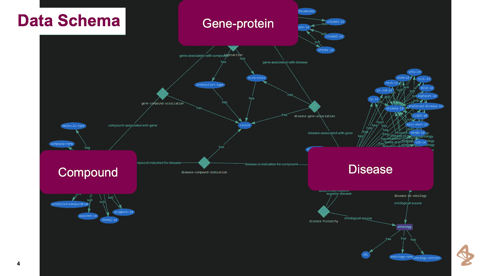

TypeDB Studio 中的可视化模式——关注已定义的实体。经许可重新发布的幻灯片。

娜塔莉的团队主要对研究`compounds`、`diseases`和`gene/proteins`感兴趣——他们亲切地称之为*金三角*。这些实体之间的连接需要尽可能的稳固和可靠，这意味着将所有可能的、相关的数据源吸收到它们的*发现图中。*

这个*发现图*每天都在变大。到今天为止，它已经广泛地包含了这三种实体类型:

`gene-protein`:19371
`disease`:11565
`compound`:14294
*实体类型之间还有 656206 个关系。*

# 他们是如何模拟这个“金三角”的？

娜塔莉接着解释了她是如何对*发现图*的每一部分建模的，并一路举例。

## **模拟基因和蛋白质**

首先，她的团队着眼于如何模拟基因和蛋白质。Natalie 的团队没有将这些分成两个实体，而是决定将它们建模为一个实体，他们称之为`gene-protein`。这有助于减少噪声和偏差。

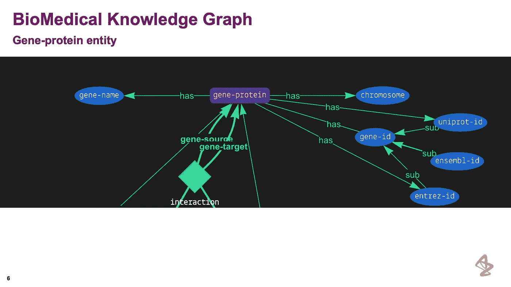

在 TypeDB Studio 中可视化的[基因-蛋白质]实体。经许可重新发布的幻灯片。

相关属性`gene-name`和`chromosome`，指定相应的基因名称，以及该基因所在位置的染色体名称。`gene-id`属性被建模为一个*抽象*，它包含每个`gene-protein`的唯一 id。

```
💡 There may have been scenarios where a parent attribute is only defined for other attributes to inherit, and under no circumstance do we expect to have any instances of this parent. To model this logic in the schema, use the abstract keyword.
```

`interaction`关系建立了`gene-protein`之间的交互，其中一个*扮演* `gene-source`的角色，另一个`gene-target`。这种关系在预测新的疾病靶点中特别重要，因为它连接了基因和蛋白质之间的调节相互作用。

## **建模化合物**

娜塔莉的团队将小分子和抗体放在一起，而不是将它们分开，作为一个实体类型，他们称之为`compound`。对于这些数据，他们使用了数据源:PubChem 和 ChEMBL。

这些数据库大约 95%相同，但有些化学物质只存在于两个来源中的一个。为了处理这些独特的化学物质，他们决定分配一个`chembl-id`作为主要 ID，如果它有一个，但是如果它没有那个 ID，那么他们将使用`pubchem-id`。

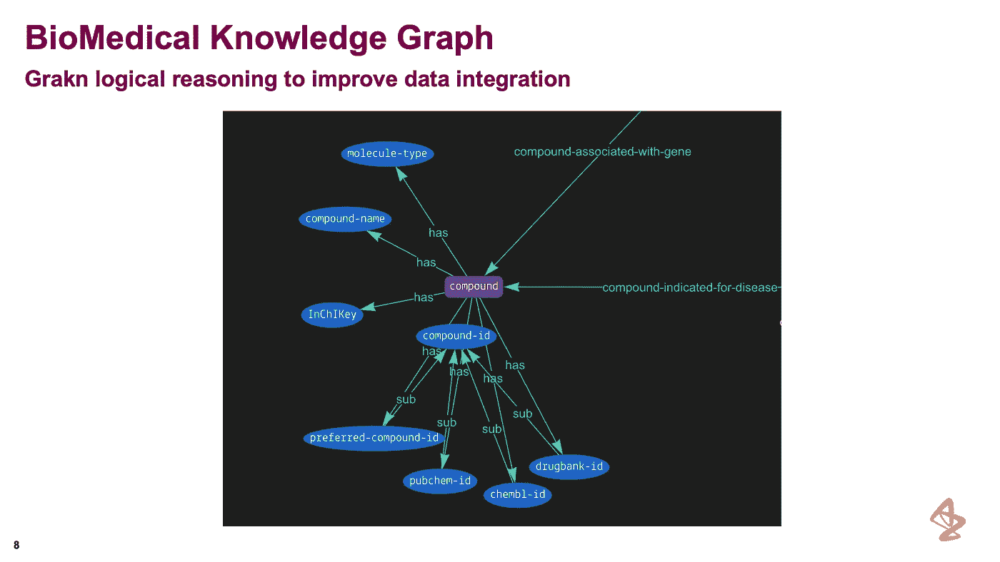

在 TypeDB Studio 中可视化的[复合]实体。经许可重新发布的幻灯片。

正如我们在 Natalie 的幻灯片上看到的,`compound`用更多的属性建模。属性`compound-id`被用作一个抽象属性，其子属性`preferred-compound-id`、`pubchem-id`、`chembl-id`和`drugbank`。

为了获得`preferred-compound-id`属性的值，他们使用两个*规则*来根据下面的逻辑分配`chembl-id`或`pubchem-id`:

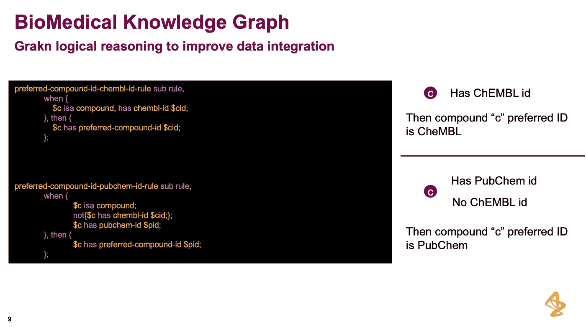

用于将适当的(ID)分配给特定[化合物]的规则。经许可重新发布的幻灯片。

第一个规则将`chembl-id`的值(如果存在的话)附加到`preferred-compound-id`。第二个规则首先检查`compound`是否没有`chembl-id`，如果是，那么它将`pubchem-id`属性的值附加到`preferred-compound-id`。这使得在特别查询*化合物*时，很容易查询该属性。

## **建模疾病**

娜塔莉解释说，要建模的最复杂的概念是疾病。这是因为疾病有多个本体，每个本体都有不同的 id。例如，一种疾病可能有来自不同本体和疾病层次的多个 id。在下面的幻灯片中，娜塔莉向我们展示了三个数据源的层次结构:EFO、蒙多和多德。

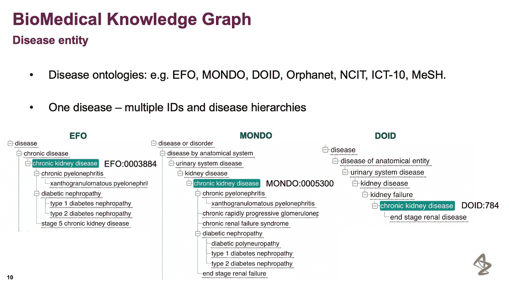

疾病数据源的本体论层次。经许可重新发布的幻灯片。

这种异质性的原因是，最初，这些本体是在不同的子域中设计的:例如，医生使用 Orphanet，而医学研究小组可能使用另一个:EFO 或 MONDO。这导致数据互不关联，互不相干。Natalie 和她的团队希望能够建立一个疾病实体模型，在这些本体之间交叉引用。

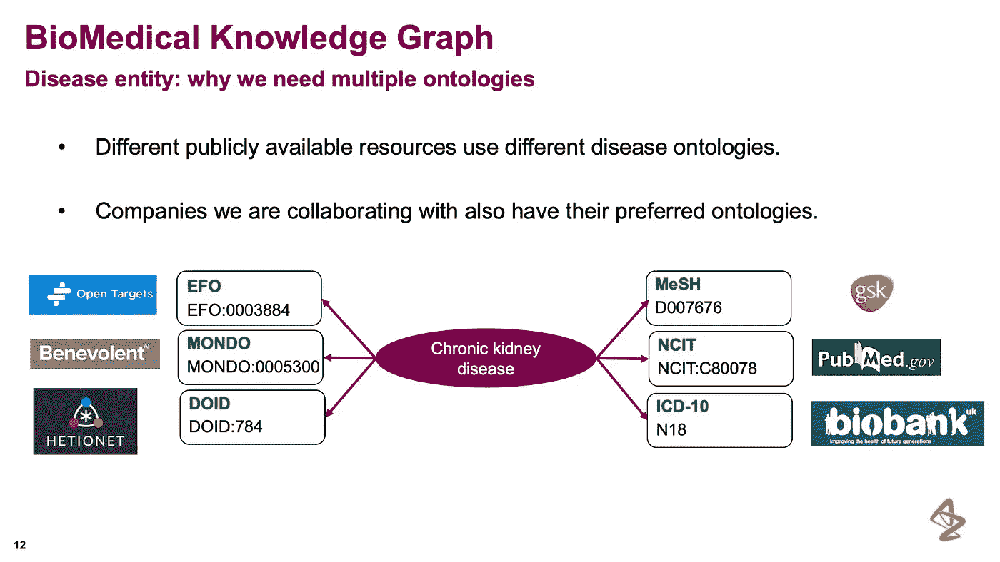

数据是从哪里来的？经许可重新发布的幻灯片。

因为这个挑战，他们选择了建模两种实体类型:`disease`和`ontology`。他们使用一个`disease-hierarchy`关系——一个*三元关系*——来连接这两者。

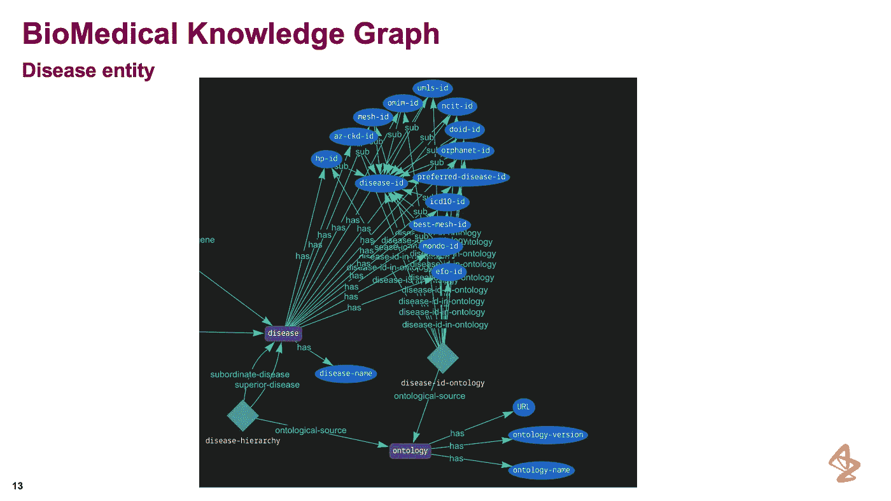

在 TypeDB Studio 中可视化的[疾病]实体。经许可重新发布的幻灯片。

有了这个`disease-hierarchy`关系，Natalie 和她的团队能够编写有用的查询，例如:

> 给我所有“慢性肾脏病”患儿的疾病节点使用 EFO 本体。

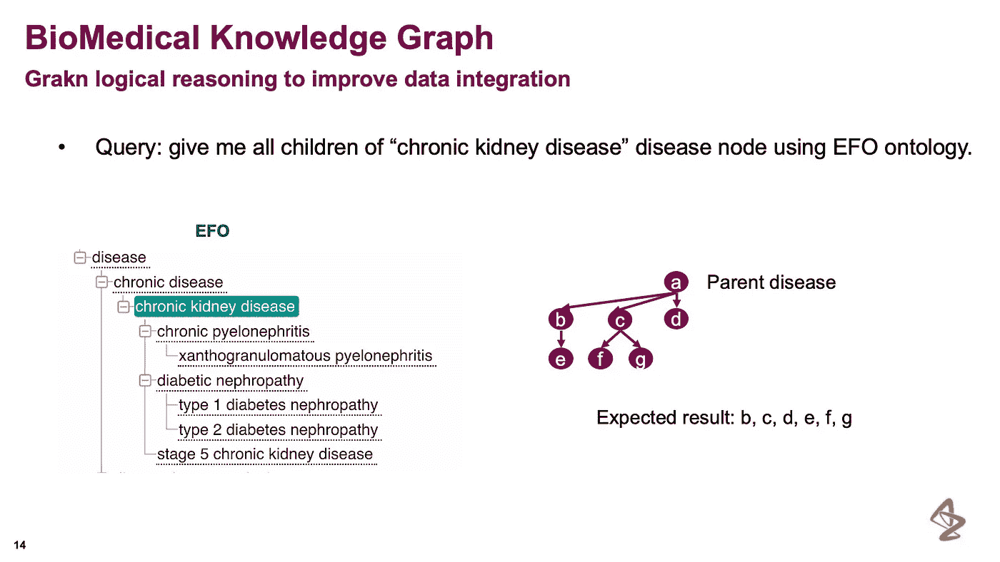

示例查询和层次结构中的预期路径。经许可重新发布的幻灯片。

这个查询展示了模型的强大功能——使用 TypeDB 的模式的强大功能——因为即使他们只是询问高级疾病，查询也将返回该疾病的所有可能的*子类型*。

为了对此建模，Natalie 再次利用 TypeDB 的规则引擎:

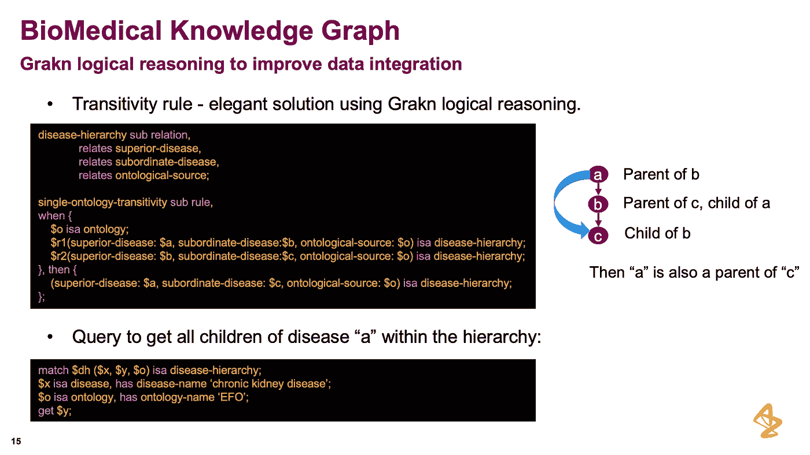

TypeDB 中的传递性规则示例。经许可重新发布的幻灯片。

上面幻灯片中显示的规则`single-ontology-transitivity`在`disease-hierarchy`关系中创建了一个传递性。这个规则的结果是，如果查询一个*扮演* `superior-disease`的疾病，将会推断出*扮演* `subordinate-disease`的所有疾病。此外，这意味着即使您不指定您要查询的本体，您仍然会返回所有摄取的数据源中该特定父疾病的所有*从属疾病、*。

当特定的本体中没有相应的引用 ID 时，这种类型的规则特别有用。

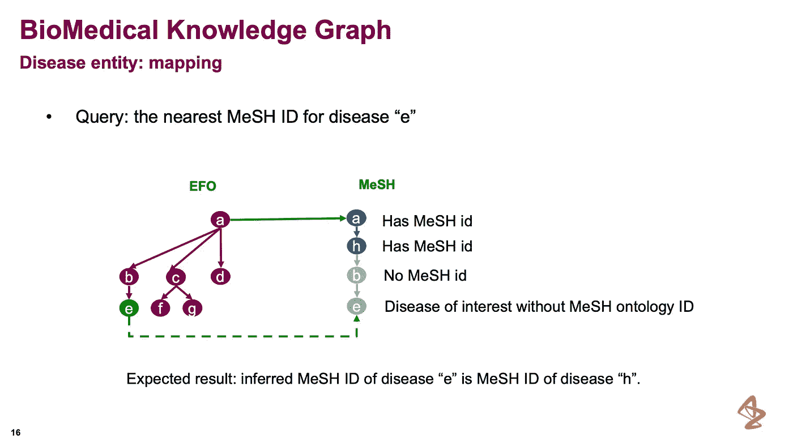

将疾病实体映射到适当的[疾病 id]。经许可重新发布的幻灯片。

正如 Natalie 向我们展示的，当某个`disease-id`不存在于某个本体中时，我们可以沿着层级向上，直到我们找到一个确实存在的 ID，然后分配那个 ID。为此，Natalie 使用了另一个*传递规则*:

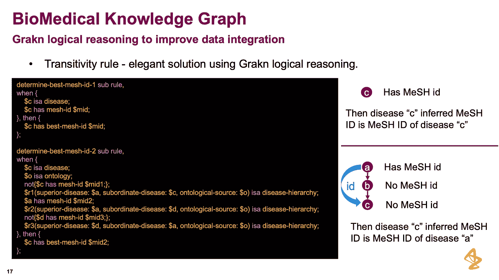

当一个(id)不存在时，这个传递性规则从父节点向下拉。经许可重新发布的幻灯片。

第一个规则`determine-best-mesh-id-1`，如果一个`mesh-id`已经存在，就给一个`disease`实体分配一个`best-mesh-id`属性。然后，第二个规则声明，如果我们不知道`mesh-id`，我们希望从父疾病中删除`mesh-id`。娜塔莉强调了这是多么有效，以及在实践中结果是多么积极。

# **数据整合**

一旦领域被建模，我们就可以开始接收数据了。为此，有两种方法可以采用:

*   **数据工厂:**在加载到知识图之前集成数据
*   **数据模式:**通过灵活的数据加载和后续推理，数据集成发生在知识图中

Natalie 的研究小组使用**数据模式**方法，使用知识图本身作为整合数据的工具。这对一些开发者来说可能是反直觉的。

如果您设想添加额外的未知数据源，那么您必须足够灵活地操作数据库中的数据。这使得复制另一个人的工作[论文]来验证假设。

在研究工作的情况下，灵活性是必不可少的，正如 Natalie 在之前的冲突 mesh-id 中向我们展示的那样。

如上所述，解决方案是使用 TypeDB 的推理引擎。

# 摘要

最后，Natalie 花了几分钟总结了这种方法在数据模式和逻辑推理方面的优势。

其他图形数据库在数据加载方面很灵活，但缺乏验证。虽然灵活性很重要，但是验证对于保持数据的一致性也是必要的。

> 几个月前，Natalie 的一个初级同事不小心将电影数据加载到了他们的生物医学知识图表中。第二天早上，团队的其他成员惊讶地看到他们的生物医学数据中有电影和演员！

使用 TypeDB，在插入时通过数据模式对数据进行逻辑验证，以确保正确的数据进入知识图。

Natalie 认为这个数据库在正式的模式设计、逻辑推理和预测算法能力之间提供了一个很好的平衡。根据她的经验，在将数据加载到知识图之前，需要先对数据进行建模。和灵活的模式有助于找到这种理想的平衡。

```
💡 Note that all prediction algorithms depend on what you load in the database — aka: be careful what you put in the knowledge graph. The noise level should be as low as possible.
```

最后，她谈到了我们是在加载数据之前还是之后集成数据的关键选择，在他们的情况下(如上所述),一旦插入数据库，就在加载之后完成。

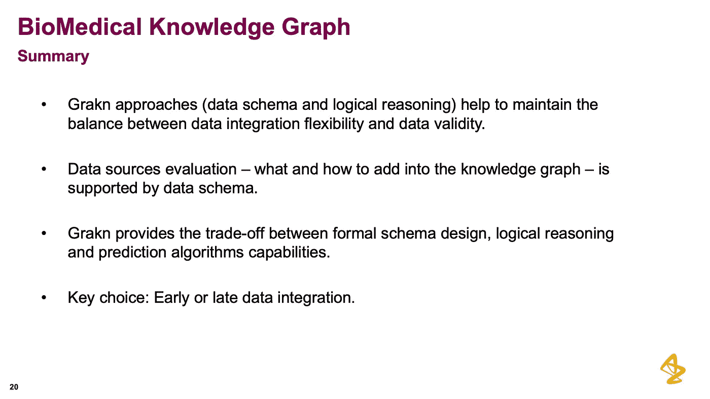

特别感谢娜塔莉和她在阿斯利康的团队的热情、奉献和透彻的解释。

你可以在 Vaticle 的 YouTube 频道[这里](https://youtube.com/c/vaticle)找到完整的演示。