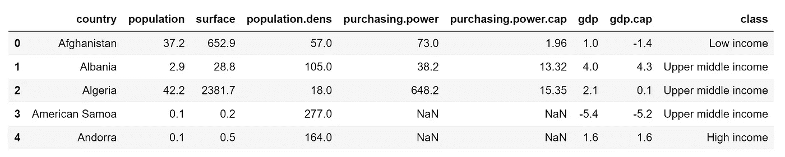
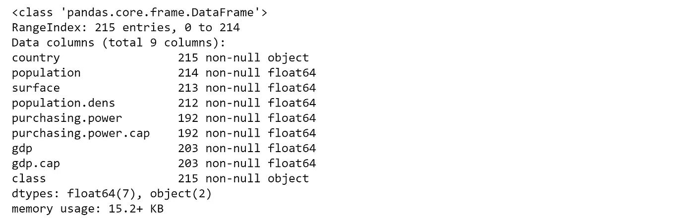
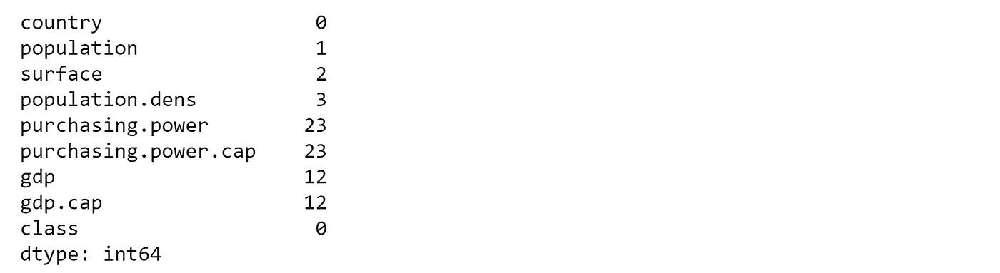
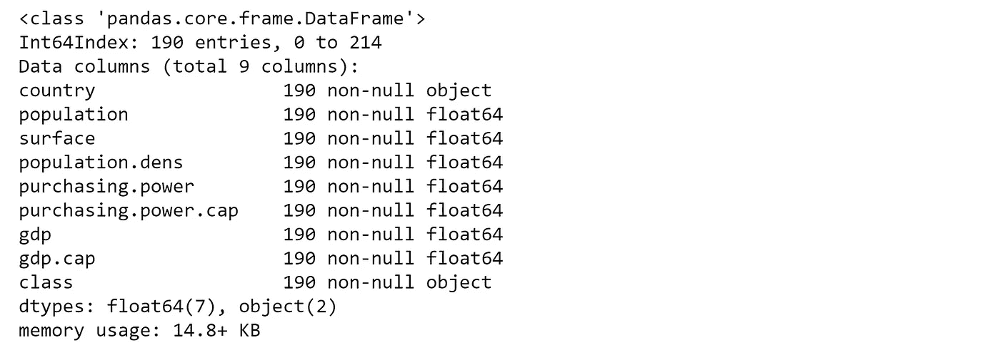
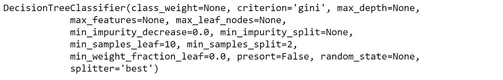
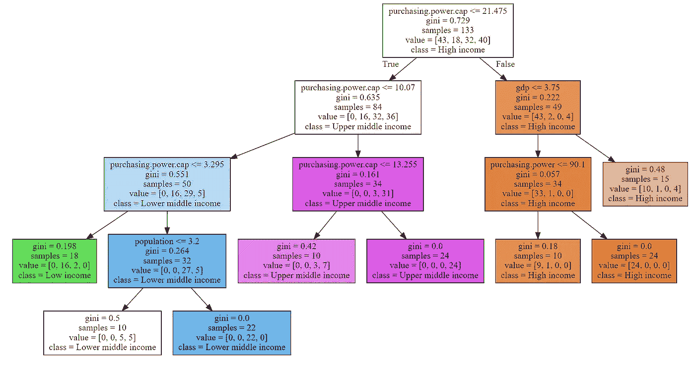
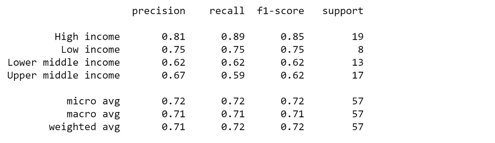
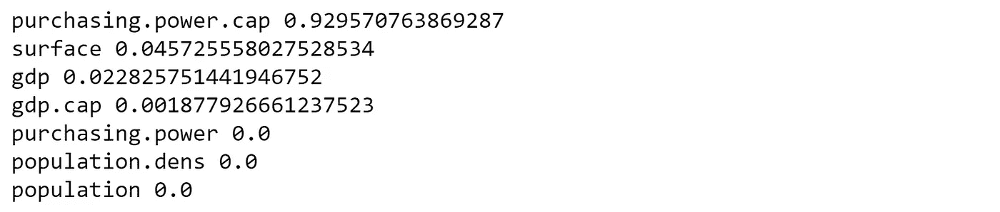

# 建模分类树

> 原文：<https://towardsdatascience.com/modelling-classification-trees-3607ad43a123?source=collection_archive---------45----------------------->

## 如何编写最流行的机器学习算法之一(Python)


凯利·西克玛在 [Unsplash](https://unsplash.com?utm_source=medium&utm_medium=referral) 上的照片

决策树是机器学习中最流行的算法之一:它们易于可视化，高度可解释性，超级灵活，可以应用于分类和回归问题。DTs 通过学习从数据特征中推断出的简单决策规则来预测目标变量的值。

在我的帖子 *"* [*决策树完全指南*](/the-complete-guide-to-decision-trees-28a4e3c7be14) *s"* 中，我详细描述了 DT:它们在现实生活中的应用，不同的 DT 类型和算法，以及它们的优缺点。现在是务实的时候了。你如何建立一个 DT？你如何将它应用到真实数据中？DTs 只不过是算法(或步骤序列)，这使得它们非常适合编程语言。让我们看看怎么做。

# 问题是

世界银行将世界经济分成四个收入组:

*   高的
*   中上
*   中下
*   低的

这一分配基于使用[图册方法](https://datahelpdesk.worldbank.org/knowledgebase/articles/77933-what-is-the-world-bank-atlas-method)计算的人均国民总收入(GNI)(以现值美元计算)，类别定义截至 2018 年 7 月 1 日。利用数据预处理技术，我创建了一个数据集，其中还包括其他国家的变量，如人口、面积、购买力、GDP 等。你可以在[这个链接](https://github.com/dlopezyse/Medium)下下载数据集。

> 该分类树的目标是根据数据集中包含的变量预测一个国家的收入组。

# 台阶

您可以通过处理更简单的子步骤来降低构建 DTs 的复杂性:DT 中的每个单独的子例程都将连接到其他子例程以增加复杂性，这种构造将让您获得更健壮的模型，更易于维护和改进。现在，让我们用 Python 建立一个分类树(特殊类型的 DT)。

## 加载数据并描述数据集

加载数据文件是最简单的部分。问题(也是最耗时的部分)通常是指数据准备过程:设置正确的数据格式、处理缺失值和异常值、消除重复值等。

在加载数据之前，我们将导入必要的库:

```
import xlrd
import pandas as pd
import numpy as np
from sklearn.tree import DecisionTreeClassifier
from sklearn.model_selection import train_test_split
```

现在我们加载数据集:

```
df_c = pd.read_excel(“macrodata_class.xlsx”)
```

看一下数据:

```
df_c.head()
```



我们可以看到有一些缺失的值。让我们检查变量的类型:

```
df_c.info()
```



在总共 215 个条目中，几乎所有的列都有缺失值。同样，我们可以看到，除了从变量“国家”和“类”(我们的目标变量)被定义为“对象”，其余的都是数字变量(float64)。

我们可以计算每个变量中有多少个缺失值:

```
print(df_c.isnull().sum())
```



让我们在构建 DT 之前去掉那些缺失的值:

```
df_c.dropna(inplace=True)
```

如果我们再次描述我们的数据集，我们会看到这些寄存器已被删除:

```
df_c.info()
```



您可以在[链接](/exploratory-data-analysis-on-steroids-e1488324fbaa)上找到探索性数据分析的其他技术。

## 选择特征和目标变量

您需要将给定的列分成两种类型的变量:因变量(或目标变量)和自变量(或特征变量)。首先，我们定义特性:

```
X_c = df_c.iloc[:,1:8].copy()
```

然后是目标变量:

```
y_c = df_c.iloc[:,8].copy()
```

## 分割数据集

要了解模型性能，将数据集分为定型集和测试集是一个好策略。通过将数据集分成两个独立的集合，我们可以使用一个集合进行训练，使用另一个集合进行测试。

*   **训练集:**这个数据用来建立你的模型。例如使用 CART 算法来创建决策树。
*   **测试集:**该数据用于查看模型在看不见的数据上的表现，就像在现实世界中一样。在您想要测试您的模型以评估性能之前，这些数据应该是完全不可见的。

```
X_c_train, X_c_test, y_c_train, y_c_test = train_test_split(X_c, y_c, test_size=0.3, random_state=432, stratify=y_c)
```

这里有几件事:我们将数据集分为 70%的训练和 30%的测试，并执行分层抽样，以便产生的样本中值的比例与目标变量中提供的值的比例相同。

## 建立 DT 模型并微调

构建 DT 就像这样简单:

```
clf = DecisionTreeClassifier(criterion=’gini’,min_samples_leaf=10)
```

在这种情况下，我们只定义了分裂标准(选择了基尼指数而不是熵)，并且只定义了一个超参数(叶子的最小样本量)。定义模型架构的参数被称为**超参数**，因此，搜索理想模型架构(最大化模型性能的架构)的过程被称为超参数调整*。* A **超参数**是在学习过程开始前就设定好值的参数，它们不能直接从数据中训练出来。

您可以通过调用模型来查看可以优化的其余超参数:

```
clf
```



模型可以有许多超参数，并且有不同的策略来寻找参数的最佳组合。你可以在[这个链接](/hyperparameter-tuning-explained-d0ebb2ba1d35)上看看其中的一些。

## 列车 DT 模型

将模型拟合到训练数据代表了建模过程的训练部分。在模型定型后，可以使用预测方法调用来进行预测:

```
model_c = clf.fit(X_c_train, y_c_train)
```

## 测试 DT 模型

测试数据集是独立于训练数据集的数据集。该测试数据集是您的模型的未知数据集，有助于您对其进行概化:

```
y_c_pred = model_c.predict(X_c_test)
```

## 设想

DTs 最大的优势之一是它们的可解释性。可视化 DTs 不仅是理解模型的有效方法，也是传达模型工作原理的有效方法:

```
from sklearn import tree
import graphviz
dot_data = tree.export_graphviz(model_c, feature_names=list(X_c), class_names=sorted(y_c.unique()), filled=True)
graphviz.Source(dot_data)
```



“purchasing.power.cap”这个变量似乎对于定义阶层或目标变量非常重要:高收入国家位于右侧，中上收入位于中间，低/中下收入位于左侧。

## 评估绩效

评估你的机器学习算法是任何项目必不可少的一部分:你如何衡量它的成功，你什么时候知道它不应该再改进了？不同的机器学习算法有不同的评估指标。让我们提一下分类树的一些主要方法:

> **准确度得分**

分类问题的准确性是指模型在各种预测中做出的正确预测的数量。

```
print ('Accuracy is:',(accuracy_score(y_c_test,y_c_pred)))
```


我们的准确率是 71.9%。如果我们认为可以通过生成新的特征或调整超参数来改进我们的模型，这还不错。但这是一个全球指标，所以让我们用其他指标来了解更多细节。

> **混乱矩阵**

混淆矩阵是用于发现模型的正确性和准确性的最直观的度量之一。它用于**分类问题**，其中输出可以是两种或多种类型的类。为了理解它，首先，我们需要定义一些术语:

*   **真阳性(TP)** :显示一个模型*正确*预测*阳性*病例为*阳性。被诊断为存在的疾病确实存在。*
*   **假阳性(FP)** :显示一个模型*错误地*预测*阴性*病例为*阳性。E* 例如，被诊断为存在的疾病不存在(I 型错误)。
*   **假阴性(FN):** 表示一个*模型错误地将*阳性*病例预测为*阴性*。例如，存在被诊断为不存在的疾病(类型 II 错误)。*
*   **真阴性(TN):** 表明模型*正确*预测*阴性*的情况为*阴性*。被诊断为不存在的疾病是真正不存在的。

```
cmatrix = confusion_matrix(y_c_test,y_c_pred, labels=y_c_test.unique())
pd.DataFrame(cmatrix, index=y_c_test.unique(), columns=y_c_test.unique())
```


在像我们这样的多类混淆矩阵的情况下，矩阵将扩展到类的数量(在我们的例子中是 4 x 4)。我们的 DT 正确预测了 19 个“高收入”实例中的 17 个，8 个“低收入”实例中的 6 个，13 个“中低收入”实例中的 8 个，以及 17 个“中高收入”实例中的 10 个。

关于多类混淆矩阵的完整解释，请查看本文[。](https://dev.to/overrideveloper/understanding-the-confusion-matrix-264i)

> **分类报告**

分类报告显示了每个类别的主要分类指标。这给出了对分类器行为超过全局准确性的更深的直觉，这可以掩盖多类问题中的一类中的功能弱点。分类报告集成了不同的指标，例如:

*   **精度(TP/(TP+FP):** 是正确预测的正观测值与总预测正观测值之比。对于每个类别，它被定义为真阳性与真阳性和假阳性之和的比率。换句话说，当预测正面实例时，分类器有多“精确”？
*   **Recall (TP/(TP+FN):** 是分类器找到所有正例的能力。对于每个类别，它被定义为真阳性与真阳性和假阴性之和的比率。换句话说，“对于所有实际上为阳性的实例，正确分类的百分比是多少？”
*   **F1-Score (2*(精度*召回)/(精度+召回)):**是精度和召回的加权调和平均值，使得最好的分数是 1.0，最差的是 0.0。一般来说，F1 分数低于准确度，因为它们将准确度和回忆嵌入到计算中。根据经验，F1 的加权平均值应该用于比较分类器模型，而不是全局精度。
*   **Support:** 是指定数据集中该类实际出现的次数。训练数据中的不平衡支持可以指示分类器的报告分数中的结构弱点，并且可以指示分层采样或再平衡的需要。支持在不同的模型之间不会改变，而是对评估过程进行诊断。

```
report = classification_report(y_c_test, y_c_pred)
print(report)
```



> **特征重要性**

另一个关键指标包括为预测模型的输入特征分配分数，表明每个特征在进行预测时的相对重要性。**特征重要性**提供对数据、模型的洞察，并代表降维和特征选择的基础，这可以提高预测模型的性能。越多的属性用于 DT 的关键决策，其相对重要性就越高。

```
for importance, name in sorted(zip(clf.feature_importances_, X_c_train.columns),reverse=True):
 print (name, importance)
```



变量“purchasing.power.cap”相对于所有其他变量(是模型的主要特征)来说非常重要，如果我们考虑目标变量，这完全有意义。

# 包裹

虽然我们在建模期间涵盖了几个步骤，但这些概念中的每一个都是独立的学科:探索性数据分析、特征工程或超参数调整都是任何机器学习模型的广泛而复杂的方面。你应该考虑更深入地研究那些学科。

此外，DTs 是称为集成方法的更强大算法的基础。**集成方法**将几个 DTs 结合起来，产生比单个 DTs 更好的预测性能。**系综**模型背后的主要原理是一群弱学习者走到一起形成强学习者，显著提高单个 DT 的表现。它们用于减少模型的方差和偏差，并改进预测。既然你已经看到了决策树是如何工作的，我建议你继续使用像[打包或推进](/ensemble-methods-bagging-boosting-and-stacking-c9214a10a205)这样的集合方法。

> *对这些话题感兴趣？关注我*[*Linkedin*](https://www.linkedin.com/in/lopezyse/)*或* [*Twitter*](https://twitter.com/lopezyse)