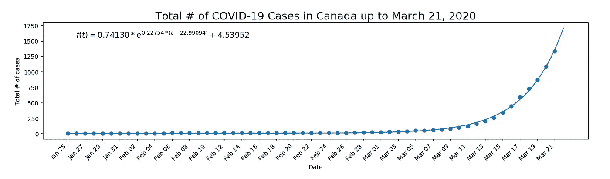
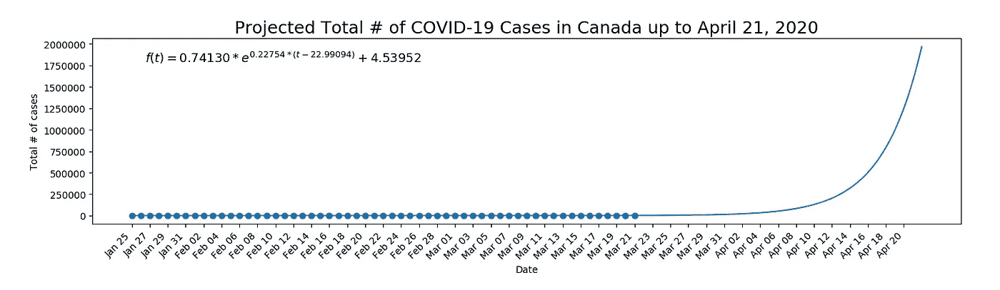

# 将新冠肺炎病毒在加拿大的传播建模为指数增长

> 原文：<https://towardsdatascience.com/modelling-covid-19-spread-in-canada-as-exponential-growth-6938b4a41b5?source=collection_archive---------25----------------------->

## 指数增长及其如何应用于加拿大新冠肺炎传输的简要回顾。

指数函数的一般方程

***编者按:*** [*走向数据科学*](http://towardsdatascience.com/) *是一份以数据科学和机器学习研究为主的中型刊物。我们不是健康专家或流行病学家，本文的观点不应被解释为专业建议。想了解更多关于疫情冠状病毒的信息，可以点击* [*这里*](https://www.who.int/emergencies/diseases/novel-coronavirus-2019/situation-reports) *。*

# 介绍

鉴于几天前加拿大的新冠肺炎病例数超过了 1000 例，我认为现在是回顾指数增长的适当时机。在这篇文章中，我将快速演示为什么加拿大的病例总数继续呈指数增长是令人担忧的。声明一下，我不是流行病学家——只是一个对数学建模感兴趣的人。

# 指数增长引物

如果你有一段时间没上过数学课，我们来简单回顾一下指数增长。如果你 20 多岁，那么我敢打赌，由于指数增长的性质，你已经有几个人建议你开始投资了。对于那些能够留出额外资金的人来说，这是一个好主意。假设你以每年 8%的复利投资 100 美元，在第一年年末你将有 108 美元。如果你把你的 108 美元再投资，第二年后你会有 116.64 美元。如此重复 30 年后，你会有超过 1000 美元。虽然你可能需要几年时间才能开始注意到任何重大收益，但随着时间的推移，你账户的余额会越来越快。这是为什么呢？指数增长的显著特征是它的变化率在增加。同样，它的变化率也在增加。还有，它的变化率，它的变化率是递增的，等等。尽管指数曲线的第一部分可能看起来很平坦，但很难想象这种快速变化仍在发生，只是规模较小。

# 新冠肺炎以指数增长的方式传播

指数增长的原理可以应用于新冠肺炎的传输。如果每个感染者多感染 2 个人，那么总感染人数就乘以了 3！就像你的投资一样，它开始时很慢，但随着时间的推移会以越来越大的速度增长(这对早期投资者来说是好事，但对传染病来说是坏事)。

图 1 显示了 1 月 25 日至 3 月 21 日加拿大确诊的新冠肺炎病例总数。这个数据是在[https://covid 19 tracker . ca](https://covid19tracker.ca/)找到的，它一直保存着每天病例总数的历史记录[1]。从数据点可以看出，它们遵循指数增长模式。假设指数增长，[非线性最小二乘](https://wikipedia.org/wiki/Non-linear_least_squares)分析被应用于得出指数函数的方程以模拟这种增长。该等式打印在下面的图 1 中。很明显，指数函数很好地拟合了(目前收集的)数据。

**图 1:** 截至 3 月 21 日，加拿大新冠肺炎病例总数。指数函数被拟合到数据中。t 是自 2020 年 1 月 25 日起的天数。

# 含义

如果新冠肺炎的传播继续遵循下图所示的指数增长模型，病例数将继续快速上升。图 2 显示了这个模型到 4 月 21 日的推断。如果这个指数函数继续准确地模拟新冠肺炎的总病例数，似乎我们可以在一个月内接近 200 万例。这仅占我国人口的 5%多一点。我们的医疗系统将不堪重负。你可以看到底部的图表在 3 月 21 日之前看起来是平的，考虑到正在发生的增长类型，这是误导性的。如果病毒继续按照这个模型的速度传播，我们没有希望很快“拉平曲线”。只有降低传输速率，才能做到这一点。

**图 2:** 假设我们拟合的指数模型仍然准确，推测加拿大截至 4 月 21 日(含 4 月 21 日)的新冠肺炎病例总数。

# 结论

让我们通过尽力练习社交距离来证明这个模型是错误的。通过限制与他人的接触，你正在为“打破”这种模式做出贡献！如果我们成功地减少了传播，也许我会写一篇关于 sigmoid 增长曲线的后续文章(“曲线变平”的结果)。在那之前，享受外面的好天气和与家人在一起的宝贵时间。

# 参考

小小的。[加拿大新冠肺炎跟踪者](https://covid19tracker.ca/dist/index.html) (2020)，COVID19Tracker.ca