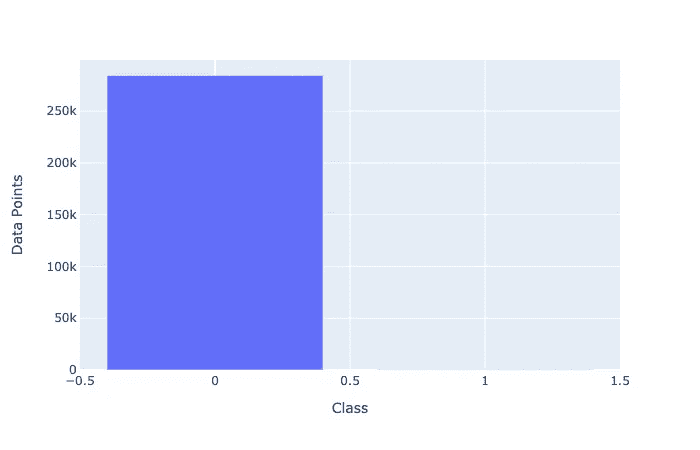
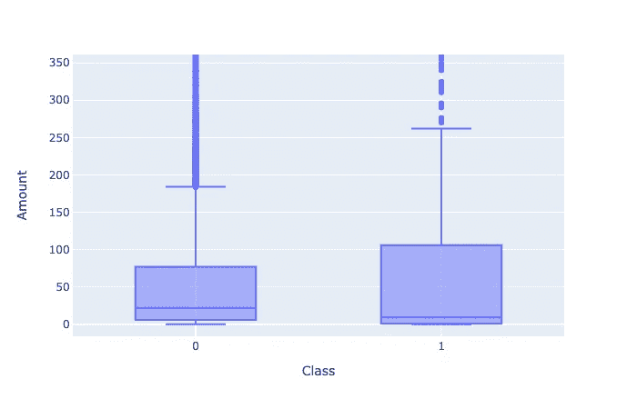
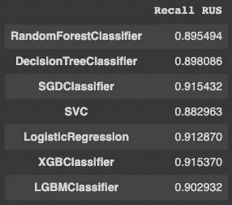
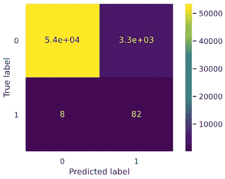
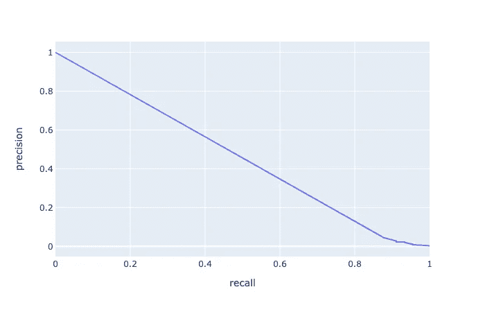
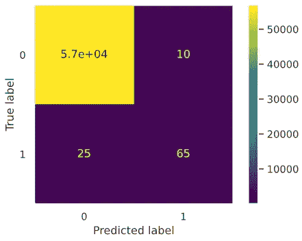

# 模拟信用卡欺诈

> 原文：<https://towardsdatascience.com/modelling-credit-card-fraud-detection-e3006dd212ab?source=collection_archive---------41----------------------->

## 人为平衡的数据总是最佳选择吗？

插图。来源: [Pixabay](https://pixabay.com/pt/illustrations/hack-fraude-cart%C3%A3o-c%C3%B3digo-3671982/)

信用卡诈骗是世界上一个“仍在增长”的问题。**据估计，2018 年欺诈损失超过 270 亿美元，预计未来几年仍将大幅增长**，如本文[文章](https://nilsonreport.com/mention/407/1link/)所示。

随着越来越多的人在日常生活中使用信用卡，也增加了犯罪分子从中赚钱的机会。新技术的发展使得罪犯和信用卡公司都在不断地改进他们的系统和技术。

鉴于这一金额，机器学习对信用卡公司来说肯定不是一个新词，早在它成为一种趋势之前，它们就已经在这方面进行了投资，以创建和优化风险和欺诈管理模型。这个来自 Visa 的快速视频以友好的方式展示了这个价值数百万的复杂系统的冰山一角。

在这本笔记本中，我将使用匿名信用卡交易数据开发一个机器学习模型，以展示一个稍微简单的模型在欺诈检测方面可以实现什么。我也会从实用的角度来讨论一些选型的相关点。

信用卡登记簿被视为个人信息，不能公开共享。所使用的数据集是来自实际卡使用的文件，但是使用称为主成分分析的方法掩盖了变量。这种方法不仅改变变量的名称，还改变变量的数值，用于降维。然后，我们可以在不识别任何个人信息的情况下处理真实数据。

数据集包含欧洲持卡人在 2013 年 9 月进行的交易，并在 [Kaggle](https://www.kaggle.com/mlg-ulb/creditcardfraud) 中共享。

# 探索性分析

在我们实际创建机器学习模型之前，对数据有一个大致的了解是很重要的。分布、趋势、异常值，这些都是重要的信息，有助于在模型开发过程中创建和验证可能相关的理论。由于数据集涉及个人和财务信息，变量被 PCA 方法“掩盖”，不具有实际意义。因此，可以从实际分析中提取的信息急剧减少。但是让我们利用现有的资源。首先，我将创建一个计数图，显示数据集中有多少正常和欺诈交易。

为每堂课计算绘图。由作者创作。

甚至很难看到欺诈交易的杠杠。在 284807 笔交易中，只有 492 笔被发现是欺诈。这意味着，正如所料，这是一个非常不平衡的数据集，只有不到 1%的数据被归类为 1。

我还将创建一个按正常(0)和欺诈(1)分类的交易金额(欧元)的箱线图。

每类金额的箱线图。由作者创作。

箱形图显示了分布的偏斜程度，但仍有许多异常值超出了此图中 y 轴的限制。有趣的是，欺诈实际上比真实交易的中位数要低。也许犯罪分子想避开大额交易中常见的障碍和额外要求。但这能保护他们的行动不被发现吗？

# 模型开发

既然探索性分析已经完成，就可以创建一个预测模型来避免将来的欺诈。我不会关注研究中使用的代码、库或方法，而是关注我为获得结果所遵循的步骤。你可以在我的 [Github](https://github.com/diegopescoalcalde/portfolio/blob/master/README.md) 里看到完整的分析。

## 训练测试集分割

第一步是将可用数据分成两组。第一组称为训练集，将用于训练模型，选择最佳模型并调整其参数。第二个称为测试集，用作模型的测试。它就像是新数据一样提供，以便模型预测可以与每个操作的实际分类进行比较。

## 平衡

当数据集在类的数据之间有很大差异时，它被认为是不平衡的。为了确保模型能够正确地检测两个类的模式，其中一个选项是人工平衡数据集，使所有类的信息数量相似。我使用了随机下划线方法，最终每个类的点数分布均匀(数据集也小得多)。该过程导致整个数据集的 99%以上被排除在模型开发阶段之外。

为每堂课计算绘图。由作者创作。

## 正常化

一些机器学习模型可能更依赖于变量的数量级。例如，这意味着高阶变量可能被误解为与最终输出更相关。为了避免这种情况，归一化是可以使用的方法之一，因为它将转换所有变量，使它们具有标准的标度。我决定将数据标准化，以确保这些数量级不会影响我的结果。

## 型号选择

有许多机器学习模型可以用来解决一个问题。对于何时使用每一种都有通用的指导原则，但是强烈建议进行多项测试，以了解哪一种对每种情况都具有最佳的可预测性。这是一个分类问题，目标是根据交易的属性来预测交易属于哪个类别。最常用的分类模型是逻辑回归和分类树，但还有许多其他可用的模型。在这个例子中，我测试并比较了其中的一些，以确定哪一个是使用交叉验证方法的最佳选择。我根据每个模型的召回率做出决定，召回率是模型正确预测的真实类别总数的百分比。

每个型号的召回分数。由作者创作。

不同型号的召回结果非常相似。基于这些结果，我决定继续使用 XGBClassifier 模型。

## 超参数调谐

机器学习模型具有定义它们将如何学习和预测结果的重要参数。不同的参数导致不同的模型，从而导致不同的结果。由于模型的复杂性，没有分析方法来定义哪种参数组合将提供最佳结果。超参数调整是一种迭代方式，计算机测试不同的参数组合并计算分数以定义最佳组合。

在我的分析中，我测试了模型参数的许多组合，并找到了一个可以进一步改善结果的组合，但在召回率方面没有真正有意义的改善。

## 模型验证

模型验证的步骤是最等待的一步，因为它显示了新数据的分类是好是坏。让我们看看我的模型在分类报告中的表现。

模型分类报告。由作者创作。

这些都不是很好的结果。召回结果表明，该模型确实能很好地检测欺诈行为。但是，精度显示它也会有许多误报(正常交易被识别为欺诈)。这在混乱矩阵中会更清楚。

预测混乱矩阵。由作者创作。

可以看到，超过 3000 个正常操作被模型错误地分类为欺诈。这将意味着超过 3000 笔交易被阻止，消费者感到恼火，从而发现 82 起欺诈。这是因为该模型正在识别这些操作中的欺诈模式。如果这些模式不明显，这可以通过调整模型阈值来解决。

为了解释什么是阈值，让我们回顾一下分类模型是如何工作的。基于观察到的数据，它估计了它属于研究中的每个类的概率。基于概率，将点分类到一个类中，因此存在一个参考概率，在该参考概率之上点被分类。这个参考概率被称为阈值，并且可以被调整以适合特定分析的需要并改进分类结果。每个阈值的精确度和召回率的结果可以在精确度-召回率曲线中检查，所以我决定画一条曲线，看看是否有更好的阈值。

精确召回曲线。由作者创作。

曲线显示，可供选择的好阈值选项并不多。这意味着模型认为正常交易的模式与欺诈非常相似。似乎平衡数据集大大减少了正常交易的信息，以至于模型无法正确区分它们。所以我决定使用实际的原始数据集，看看不平衡类的结果是否会更糟。

不平衡数据集的模型分类报告。由作者创作。

分类报告在精确度和召回率的结果上显示出更多的均等。让我们看看混淆矩阵。

不平衡数据集的预测混淆矩阵。由作者创作。

现在，被认定为欺诈的正常业务数量大幅下降。因此，该模型无法预测像第一个案例中那样多的欺诈。预测和召回的结果可以在精确召回曲线中再次观察到。

不平衡数据集的精确召回曲线。由作者创作。

在曲线中，可以看到有一个阈值提供了 0.8 的精确度和 0.82 的召回率。在我看来，这是一个有趣的选择，但根据最终目标，有许多组合可以使用。似乎使用整个数据集创建的模型能够更好地识别正常交易与欺诈的模式。因此，当它看到新数据时，预测的欺诈总数从 3000 多起下降到 75 起，这是一种更加自信的方法。

# 结论

在这篇文章中，我开发了一个机器学习模型来预测信用卡交易中的欺诈行为。该分析涉及不同模型的测试，以基于召回、超参数调整以及使用精确召回曲线的分类阈值调整来选择最佳选项。

通过在分析中使用平衡的和不平衡的数据集，我证明了在某些情况下，使用不平衡的数据集可以获得良好的预测结果，并且在寻找问题的最佳解决方案时，“一刀切”的思维模式是没有帮助的。

使用不同的数据集和阈值，我能够预测数据集中 82%的欺诈，并保持高精度，因此正常交易不会频繁受阻。

当然，没有完美的模型，总会有一个时刻，项目团队必须决定哪种折衷最适合其目标。在本例中，决策点是用平衡或不平衡的数据开发模型。这导致了不同的精确度和召回率。另一个决策是哪个阈值在欺诈检测和误报方面带来最佳平衡。如果公司有非常严格的安全政策，它可以选择尽可能高的召回率，不管精确度是多少。另一方面，一些公司更愿意允许一些欺诈行为，以确保他们的客户在正常交易中不会被卡。

好消息是，无论目标和限制是什么，数据科学中工具和技术的多样性和灵活性允许它应用于许多不同的情况。对此的主要要求是明确定义目标和度量标准。基于此，一个有经验的团队可以在研究过程中运用批判性思维找到最佳解决方案。

# 谢谢大家！

感谢你阅读这份材料，我希望它能在某些方面对你有用。如果你想了解分析的更多细节，你可以查看我的 GitHub 中的完整研究。在接下来的几周里，我会发布一些非常好的文章，如果你喜欢这篇文章，请查看我的[媒体](https://medium.com/@dp.alcalde)或 [LinkedIn](https://www.linkedin.com/in/diegopesco/) 个人资料！感谢您的阅读！