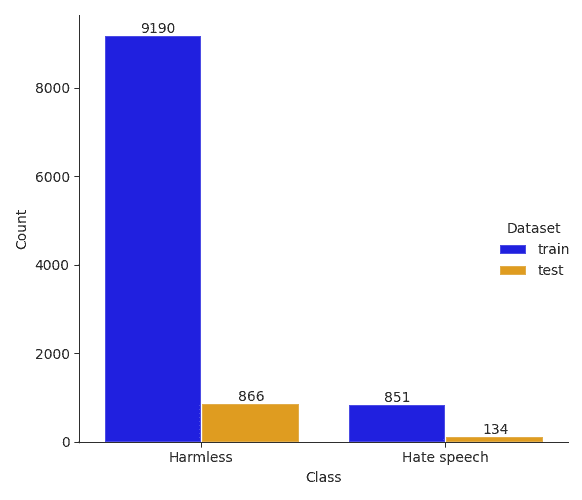
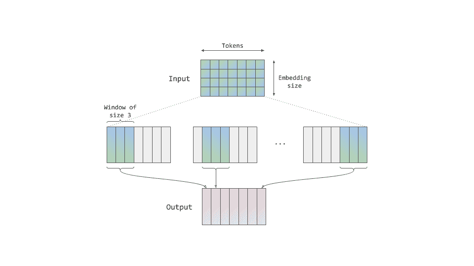
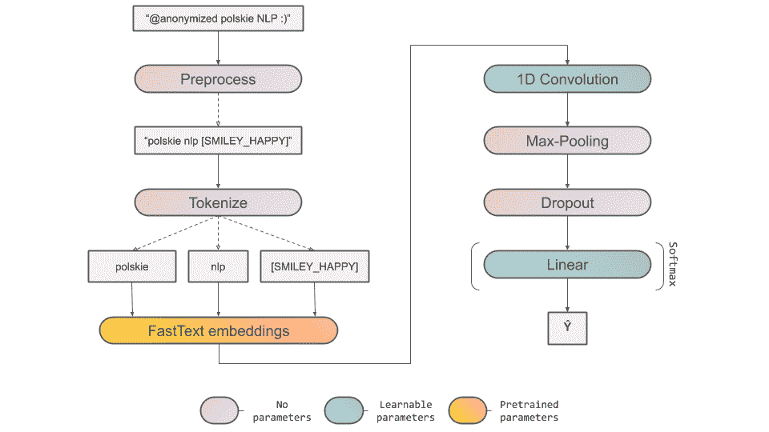
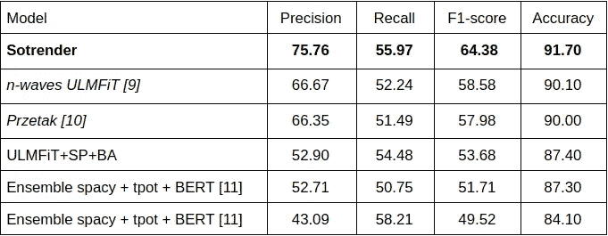
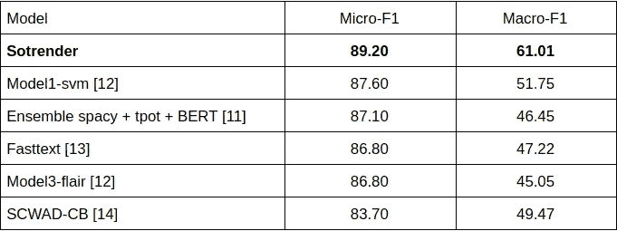
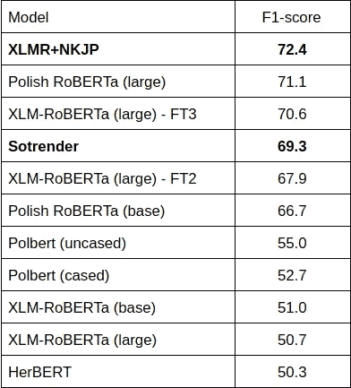

# 波兰语仇恨言论建模:特定领域嵌入的重要性

> 原文：<https://towardsdatascience.com/modelling-hate-speech-in-polish-importance-of-domain-specific-embeddings-206a02fb3a3b?source=collection_archive---------57----------------------->

## 机器学习和社交媒体

## 我们通过使用具有特定领域嵌入的 FastText 与 RoBERTa 和 ULMFiT 竞争

图片来自[安德鲁·亨特](https://unsplash.com/@dre0316)在 [Unsplash](https://unsplash.com/)

在 Sotrender，我们通过将内部构建的机器学习模型应用于社交媒体，利用人工智能增强数字营销。我们最近的挑战是检测波兰信息中的仇恨言论。下面你可以看到我们是如何解决这个问题的，以及我们所获得的结果。

# *仇恨言论的问题*

在互联网时代，讨论正在各种[交流平台上在线进行，而不是面对面](https://onlinelibrary.wiley.com/doi/epdf/10.1002/9781118783764.wbieme0091)。缺少我们信息的直接接收者会给人一种欺骗性的匿名感。这让我们可以更自由地表达自己，但另一方面，忽略了我们的文本会被另一个人阅读的事实。这也被称为[在线去抑制效应](https://d1wqtxts1xzle7.cloudfront.net/57217642/71994_Suler_1.pdf?1534767113=&response-content-disposition=inline%3B+filename%3DSuler_1.pdf&Expires=1592995069&Signature=hRdDIIo6GGgWSqIb~-M1AxM2rkXqVQG-MOMg~NOkfkCbyqiORCNz4ZIRW57dxsAVTKh9JCStxzkoHjsYI9-1RPuy3N72wbmGTAMF4l2aISMO9D4cXQFWRd8HaXXJP~jAhLprkh5g3XWELvTFRBKobceCFqiCfIRQKndwF3RIv7hEXVx853Bu3ZubGTwlMMbuPge3vfaMgLv-hOoiCYBI8opBQKzcEpY-yDFDdpZ8Ev6NItkpXImlEEL2APzNMW7vz0RCrp41cG0HnyNRvvT6RNPM5DnoDd35yds-S-7bsd4YNJu5K5GzB8eDr~Jia3zEbcDoqH-vdrThs5of67rk1w__&Key-Pair-Id=APKAJLOHF5GGSLRBV4ZA)。此外，人们不会被迫为他们大部分时间在网上发布的言论负责。**这些观点导致了网上讨论中明显的仇恨**。

由于最近在自然语言处理(NLP)方面的进步，越来越多的有害信息可以被自动检测出来(T3)。然而，主流的自然语言处理研究只集中在一个小的子集，要么是常用语言，要么是人口众多的语言，如英语或汉语(参见[1]对自然语言处理中语言多样性的综合研究)。这在 NLP 模型的质量(以及检测有害内容的能力)之间产生了明显的差异，这取决于它们所针对的语言。虽然最近的一些研究旨在通过开发多语言模型来弥合这一差距，**大多数时候，那些针对单一语言的研究呈现出更好的语言理解能力**。幸运的是，一些新的可能性正在出现，以支持对代表性不足的语言的研究。

在这篇文章中，我们将关注波兰语言中的仇恨言论检测问题。我们将从描述最近创建的数据集开始，该数据集可用作仇恨言论检测方法的基准。然后，我们将讨论我们基于快速简单的深度学习模型的方法。我们将我们的方法与来自 [PolEval](http://2019.poleval.pl/) 竞赛和 [KLEJ 基准](https://klejbenchmark.com/)的提交文件进行了比较。与 PolEval 的结果相比，所提出的模型实现了显著的改进，并且与 KLEJ 的基于变压器的模型相当，同时在概念上更简单并且需要更少的计算资源。**我们方法的优势展示了特定领域文本嵌入的重要性，以及非常适合手头任务的神经模块的使用**。

# *pole val——seme val 的波兰对应物*

PolEval 是专门为波兰语设计的 NLP 工具的评估活动。从 2017 年开始，他们每年举办各种语言理解任务的比赛，如[机器翻译](https://en.wikipedia.org/wiki/Machine_translation)或[命名实体识别](https://en.wikipedia.org/wiki/Named-entity_recognition)。2019 年，其中一项任务是解决从公共论坛上的讨论中收集的信息中检测有害内容的问题。也就是说，分为两部分的"自动网络欺凌检测"任务旨在区分无害和有害信息，或将有害信息进一步分类为网络欺凌或仇恨言论。**虽然乍一看，网络欺凌和仇恨言论之间的区别可能并不明显，但这项任务根据特定有害行为的目标将它们区分开来**:在网络欺凌中，它是针对个人的，而在仇恨言论中是针对一个群体或实体的。更详细的定义在任务附带的一篇论文中讨论[2]。

# *数据描述*

用于该任务的数据集由从公开的 Twitter 讨论中收集的 tweets 组成。这些推文经过了最低限度的预处理，因此不包含私人身份信息。除此之外，它们的原始格式没有改变。这意味着，它们可以包含表情符号、表情符号、标签、HTTP URLs 和拼写错误等噪音。虽然 URL 通常不包含关于信息危害性的有用信息，但是表情符号、表情符号和标签可以用来加强文本内容或表示讽刺。数据集中的一个示例如下所示:

检测有害信息的另一个挑战来自讨论的主题。**数据集中的大量消息与政治相关**。一般来说，人们可以怀疑在线平台上发布的关于政治的信息可能包含更多的负面情绪。基于这种数据训练的模型可以学习不期望的偏见，并且认为关于该主题的所有消息更可能是有害的。一般来说，来自数据集的推文指的是政治、体育和新闻(更详细的描述可以在[2]中找到)。

最后，从机器学习(ML)模型的角度来看，数据集可能被认为是具有挑战性的。它包含大约 11k 条 tweet(10k 用于训练集，1k 用于测试),与其他 NLP 任务相比，这是一个相当小的数目。此外，类别分布严重不平衡，因为大多数文本是无害的(见图 1)。

**图一。**数据集的训练和测试分裂中的类分布。数据集中的大多数消息是无害的。训练拆分仅包含 8.5%的有害消息，而测试包含 13.4%。

# *我们的方法*

大多数最先进的 NLP 模型都是在结构良好的文档上预先训练的，例如来自维基百科的文章，这允许我们建立一个丰富而准确的语言模型。**然而，这些预先训练过的模型可能不一定知道如何处理特殊的符号，如新的表情符号、标签或社交媒体传播专用的全新短语，他们在**没有接受过这些训练。不同语言风格、缩写、俚语、混合不同语言的单词或简单的打字错误或语法错误的存在将进一步测试模型概括分布外数据的能力。然而，处理词汇表外键的令牌嵌入方法可以部分解决这个问题。

此外，这些型号中的大多数都使用了[变压器](https://arxiv.org/abs/1706.03762)【3】架构。虽然最近它已经成为大多数 NLP 问题的标准选择，但与 FastText [4，5]等更简单的方法相比，它需要大量的计算资源。**在为生产环境开发模型时，必须考虑这一特性**。基于 Transformer 的模型的推理时间，即使部署在能够访问 GPU 的实例上，也可能导致过高的延迟。此外，由于高昂的财务成本，用 GPU 部署多个副本可能是不可能的。

牢记这两个方面，我们的方法基于低延迟令牌嵌入模型，专门针对来自社交媒体的数据进行训练，并将其与简单有效的分类头相结合。给定一条消息，我们从简单的预处理步骤开始:

*   将所有字符改为小写，
*   删除空白字符(制表符、换行符等。),
*   丢弃 URL，
*   将表情符号、表情符号和标签编码为特殊符号，这些符号出现在我们的词汇中(":)"-> "[SMILEY_HAPPY]")。

结果是一个干净的消息，然后被分割成令牌，这些令牌可以使用令牌嵌入模型编码为向量。

我们没有使用已经预先训练好的令牌嵌入模型，而是决定专门在我们自己的社交媒体数据集上从头训练一个新的模型。大部分数据来自脸书几年来收集的帖子和评论。此外，它还包含来自其他社交媒体平台的文本，如 Instagram 或 YouTube。我们使用另一种语言检测模型只选择了波兰语文本。总的来说，该数据集包含 10 亿个单词，其中超过 300 万个是唯一的。这些文本经过了最少的预处理，主要是删除 URL，将所有表情符号和表情符号编码为特殊的符号，并将其包含在我们的词汇中。然而，我们没有纠正任何错别字。

虽然最近的工作主要集中在基于 Transformer 的架构上，但是我们选择了 FastText 作为令牌嵌入模型，原因有几个。首先，快速的推理时间和较低的计算要求使得该模型易于部署。其次，FastText 使用字符级信息，这使得该方法非常适合于形态学丰富的语言，如波兰语。

值得指出的是，从头开始创建模型需要大量的时间，不仅是为了训练(我们在一天内完成了训练)，也是为了准备数据集。尽管如此，在 Sotrender 中，我们处理的数据主要来自社交媒体，因此我们能够在其他 NLP 任务中使用该模型，如[情感分析](/sentiment-analysis-concept-analysis-and-applications-6c94d6f58c17)。此外，训练基于 Transformer 的模型(如 BERT)通常不是您的首选，因为它对硬件的要求很高，甚至比 FastText 花费更多的时间，因此非常昂贵。我们认为，在实践中，最好从简单的解决方案开始，只有在必要时才逐渐增加复杂性。

在这一点上，重要的是观察到，在许多情况下，检测仇恨言论的任务可以通过搜索句子中有害的单词序列(标记)来解决。通常，识别这样的序列就足够了，不需要分析整个信息的上下文。受这一观察的激励，我们在令牌嵌入模型之后直接采用了一维卷积神经网络(CNN)。包含在 CNN 架构中的平移不变性允许我们精确地处理这样的记号序列。此外，通过考虑具有固定宽度(卷积核的大小)的记号列表的所有这样的子阵列，我们能够创建整个句子的表示。类似的方法可以在其他一些作品[6，7]中找到，甚至可以在单词袋(BoW)模型中找到，该模型考虑了 n-grams 的令牌。图 2 展示了如何将 1D 卷积应用于一系列令牌嵌入。

**图二。** 1D 卷积神经网络通过在标记序列上滑动固定宽度的窗口来处理编码的句子。该窗口能够捕捉连续记号的模式，而与它们在句子中的位置无关。为了捕捉不同的模式，每个 CNN 层由许多这样的窗口组成，由给定层的深度决定。

虽然 CNN 大多是从计算机视觉问题中得知的，**我们的方法证明了它们同样适用于包括文本分类在内的序列处理任务，同时比递归模块的计算要求更低**。我们还尝试用其他在序列处理方面表现突出的架构来替代 CNN，包括长短期记忆(LSTM)或门控循环单元(GRU)，但最好的结果是使用具有池层的单层 CNN。

总之，使用具有池层的浅 1 维 CNN 来变换令牌嵌入，并使用跟随有 softmax 的学习线性变换来投影到类分布中。此外，我们在倒数第二层使用 l2 正则化和丢弃。完整的架构如图 3 所示。

**图三。**我们完整的文本处理管道，将句子转换成预测的类别分布。

在训练期间，令牌嵌入模型的权重被冻结，并且网络的剩余可学习参数被优化。在大多数实验中，我们使用验证数据集(使用分层抽样从训练分裂中提取)来提前停止和选择超参数，除非另有说明。此外，我们在训练期间应用简单的数据扩充，这将打乱和删除随机选择的令牌。我们计划在未来的文章中对测试过的增强方法进行全面的回顾。

# 结果

我们分两步对我们的方法进行了评估。首先，我们将其与提交给 PolEval2019 Task 6 的最佳模型进行了比较。该比较包括该任务的二进制(任务 6.1)和多类(任务 6.2)版本。接下来，我们查看了使用 KLEJ 基准[8]中的 CBD 任务评估的大型变压器模型的结果。由于不均衡的类别分布，对于二元分类任务，使用 F1 分数来比较模型，并且在多类别分类的情况下，使用微观 F1 和宏观 F1 来比较模型。

## PolEval2019 任务 6

在这两项任务中，我们将我们的模型与五个最佳竞争对手进行了比较。有趣的是，提交的材料包含一些不同的方法。对于任务 6.1，通过以下方法获得了最佳结果(表 1):

*   n-waves UML fit[9]——ul fit 架构的扩展，适用于使用子词标记化的形态丰富的语言，
*   Przetak [10] —一种识别有毒单词形式并使用对字符 5-grams 单词的逻辑回归来聚集它们的方法，
*   ULMFiT+SP+BA — ULMFiT 与句子成分和分支注意相结合，
*   集成 spacy + tpot + BERT [11] —由来自 spacy 和 BERT 的分类器组成的集成，结合使用 tpot 库自动创建的文本处理管道，
*   系综空间+ tpot [11] —同上，除了使用 ULMFiT 代替 BERT。

**表 1。**将结果与提交给 PolEval2019 任务 6.1 的模型进行比较。我们的模型被命名为*软渲染*。

任务 6.2(表 2)中的最佳执行方法还包括:

*   模型 1-svm [12] —在表征的 TF-IDF 表示上训练的支持向量机，
*   fasttext [13] —基于在“Narodowy Korpus jzyka Polskiego”(NKJP)上预训练的 fasttext 单词嵌入的模型，
*   model3-flair [12] —该方法依赖于快速文本单词嵌入与来自 flair 的前向和后向字符级语言模型的组合，其形成双向 GRU 网络的输入，
*   SCWAD-CB [14] —基于特征组合的多层感知器，包括激光嵌入、Morfeusz 限定词、基于外部词汇和字符 n-grams 提取的粗俗和攻击性词语。

**表二。**将结果与提交至 PolEval2019 任务 6.2 的模型进行比较。

正如在两个表中所看到的，我们的方法大大超过了其他报道的结果。重要的是要记住，我们的模型不是基于复杂的功能，如[10]或[14]，也不依赖于大架构，如[9]和[11]。这种明显的改进来自于使用领域特定的嵌入，这些嵌入是在类似于模型化的任务/问题的数据上训练的。

## KLEJ 基准

为了进一步证明我们模型的优势，我们将它与 KLEJ 基准[8]中评估的基于变压器的方法进行了比较。在许多任务中，它包括网络欺凌检测(CBD)，它使用与 PolEval2019 的任务 6.1 相同的数据集。出于公平比较的目的，我们遵循[15]中的设置，并在整个训练分割上训练模型。

**表 3。**将结果与提交给 KLEJ 基准的模型进行比较【8】。有关各型号的详细信息，请参考 [KLEJ 排行榜](https://klejbenchmark.com/leaderboard/)。

从表中可以看出，虽然我们没有达到排行榜的首位，但我们取得了不相上下的成绩。我们的车型排名第四，超越了基于伯特、罗伯塔或 XLM 的其他车型。

# *结论*

在本文中，我们已经展示了实现复杂的架构或者增加模型参数的数量并不是成功的唯一途径。我们的方法认为，另一个关键因素是使用特定领域的归纳偏见。在我们的例子中，这些偏差主要存在于令牌嵌入模块中，但也存在于 CNN 中，CNN 非常适合于仇恨言论检测的问题。

由于我们方法的简单性，我们能够成功地将我们的模型部署到生产环境中。推理过程可以在没有 GPU 的情况下执行，并且只需要一个 CPU 和不到 3GB 的 RAM。这产生了易于水平扩展的低成本解决方案。如果您对我们如何部署我们的模型感兴趣，请在评论中提出问题，我们也会尽力准备一篇关于它的文章。

从这篇文章中得到的关键观察是，认识到即使在变形金刚的世界里，[锤子](https://en.wikipedia.org/wiki/Law_of_the_instrument)也可以被螺丝刀代替。

# *参考文献*

[1] P. Joshi 等人，[NLP 世界中语言多样性和包容性的状况和命运](https://arxiv.org/abs/2004.09095) (2020)，arXiv 预印本 arXiv:2004.09095

[2] M. E. Ptaszynski 和 F. Masui 编辑。，[自动网络欺凌检测:新兴研究和机遇:新兴研究和机遇](https://scholar.google.com/scholar_url?url=https://books.google.com/books%3Fhl%3Den%26lr%3D%26id%3DP7J2DwAAQBAJ%26oi%3Dfnd%26pg%3DPR1%26dq%3DAutomatic%2BCyberbullying%2BDetection%2B%2BEmerging%2BResearch%2Band%2BOpportunities%2B%2BEmerging%2BResearch%2Band%2BOpportunities%2B%26ots%3De61vKr-UzG%26sig%3DawBmM3BXQmey77pN1cHsvS6d1RQ&hl=en&sa=T&oi=gsb&ct=res&cd=0&d=1251501130585636232&ei=m9AGX9iLA4aSmgG_g7NI&scisig=AAGBfm1BNC-z0XY_pS4bG_UpamCje5ytGw) (2018)，IGI 全球 2018

[3] A. Vaswani 等人，[注意力是你所需要的全部](http://papers.nips.cc/paper/7181-attention-is-all-you-need) (2017)，神经信息处理系统进展 2017

[4] P. Bojanowski 等，[用子词信息丰富词向量](https://www.mitpressjournals.org/doi/abs/10.1162/tacl_a_00051) (2017)，计算语言学协会会刊 5(2017):135–146

[5] A. Joulin 等人，[高效文本分类的锦囊妙计](https://arxiv.org/abs/1607.01759) (2016)，arXiv 预印本 arXiv:1607.01759

[6]b . gamb CK 和 U. K. Sikdar，[使用卷积神经网络对仇恨言论进行分类](https://www.aclweb.org/anthology/W17-3013/) (2017)，第一届在线辱骂性语言研讨会会议录

[7] S. Bai，J. Z. Kolter 和 V. Koltun，[用于序列建模的一般卷积和递归网络的经验评估](https://arxiv.org/abs/1803.01271) (2018)，arXiv 预印本 arXiv:1803.01271

[8] P. Rybak 等人， [KLEJ:波兰语理解综合基准](https://arxiv.org/abs/2005.00630) (2020)，arXiv 预印本 arXiv:2005.00630

[9] P. Czapla 等人，[波兰仇恨言论检测通用语言模型微调](http://poleval.pl/files/poleval2019.pdf#page=149) (2019)，PolEval 2019 年研讨会会议录:149

[10] M. Ciura， [Przetak:网络上的杂草越来越少](http://2019.poleval.pl/files/poleval2019.pdf#page=127) (2019)，PolEval 2019 研讨会会议录:127

[11] R. Korzeniowski 等人，[利用无监督预训练和自动化特征工程进行波兰语低资源仇恨言论检测](https://arxiv.org/abs/1906.09325) (2019)，arXiv 预印本 arXiv:1906.09325

[12] M. Biesek，[波兰语自动网络欺凌检测中传统机器学习方法和深度学习模型的比较](http://2019.poleval.pl/files/poleval2019.pdf#page=121) (2019)，PolEval 2019 研讨会论文集:121

[13] K. Wróbel，[对波兰推文进行自动网络欺凌检测](https://ruj.uj.edu.pl/xmlui/handle/item/148794) (2019)

[14] K. Krasnowska-Kieras 和 A. Wróblewska，[用于检测网络欺凌的简单神经网络](http://2019.poleval.pl/files/poleval2019.pdf#page=161) (2019)，PolEval 2019 研讨会会议录:161

[15] S. Dadas，m . perekiewicz 和 r . powiata，[大规模预训练基于波兰语转换器的语言模型](https://arxiv.org/abs/2006.04229) (2020)，arXiv 预印本 arXiv:2006.04229