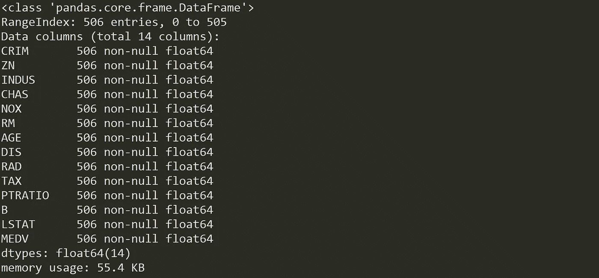
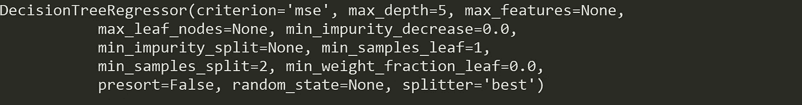
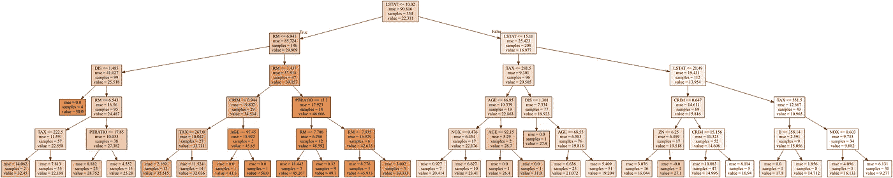
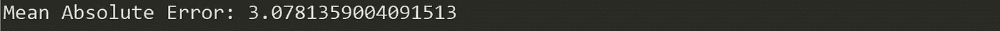
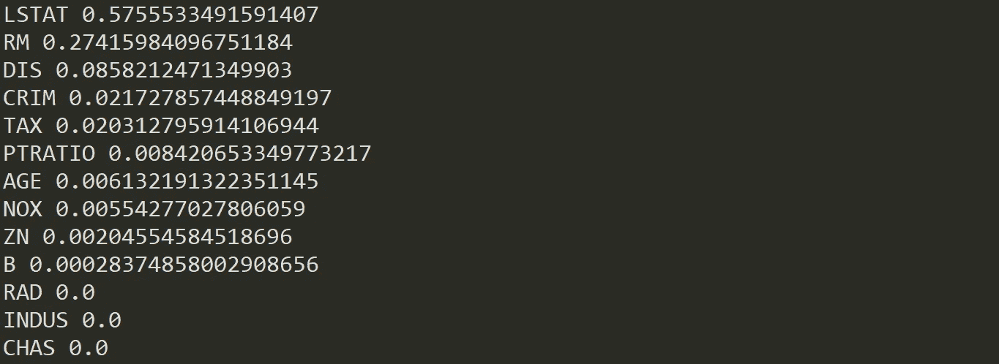
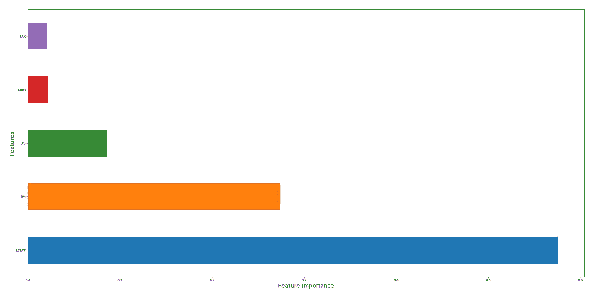
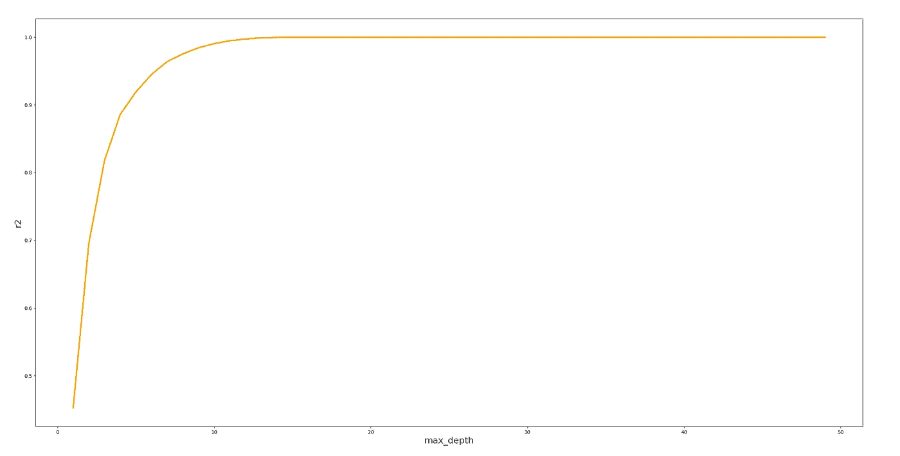

# 建模回归树

> 原文：<https://towardsdatascience.com/modelling-regression-trees-b376e959d02e?source=collection_archive---------11----------------------->

## 如何编写这个经典的机器学习算法(Python)


🇨🇭·克劳迪奥·施瓦茨| @purzlbaum 在 [Unsplash](https://unsplash.com?utm_source=medium&utm_medium=referral) 上拍摄的照片

决策树可能是最流行的机器学习算法之一。在我的帖子 *"* [*决策树完全指南*](/the-complete-guide-to-decision-trees-28a4e3c7be14) *s"* 中，我详细描述了 DT:它们在现实生活中的应用，不同的 DT 类型和算法，以及它们的优缺点。我已经详细介绍了如何编写分类树，现在轮到回归树了。

**回归树使用数字目标变量**。与目标变量是定性的分类树不同，回归树用于预测连续输出变量。如果您想要预测诸如医疗成功的概率、金融股票的未来价格或给定人群的工资等事情，您可以使用此算法。让我们看一个用 Python 实现的例子。

# 问题是

波士顿住房数据集由美国波士顿不同地方的房价组成。除了价格之外，该数据集还提供了犯罪水平、城镇非零售商业区、房屋所有者的年龄以及其他属性等信息。

名为“MEDV”的变量表示房价，是目标变量。其余的变量是我们预测房子价值的预测因素。

# 台阶

您可以通过处理更简单的子步骤来降低构建 DTs 的复杂性:DT 中的每个单独的子例程都将连接到其他子例程以增加复杂性，这种构造将让您获得更健壮的模型，更易于维护和改进。现在，让我们用 Python 构建一棵回归树(特殊类型的 DT)。

## 加载数据并描述数据集

加载数据文件是最简单的部分。问题(也是最耗时的部分)通常是指数据准备过程:设置正确的数据格式、处理缺失值和异常值、消除重复值等。

在加载数据之前，我们将导入必要的库:

```
import pandas as pd
from pandas_datareader import data
import numpy as np
from sklearn.tree import DecisionTreeRegressor
from sklearn.model_selection import train_test_split
from sklearn import metrics
from sklearn.metrics import r2_score
```

现在，我们加载数据集并将其转换为熊猫数据帧:

```
boston = datasets.load_boston()
df = pd.DataFrame(boston.data)
```

并将列命名为:

```
df.columns = boston.feature_names
df[‘MEDV’] = boston.target
```

首先理解数据集并描述它:

```
print(boston.DESCR)df.info()
```



不错:506 条记录，14 个数字变量，没有缺失值。我们不需要预处理数据，我们已经准备好建模。

## 选择特征和目标变量

您需要将给定的列分成两种类型的变量:因变量(或目标变量)和自变量(或特征变量)。在我们的例子中，变量“MEDV”(自有住房的中值)是我们试图预测的。

```
X = df.iloc[:,0:13].copy()
y = df.iloc[:,13].copy()
```

## 分割数据集

要了解模型性能，将数据集分为定型集和测试集是一个好策略。通过将数据集分成两个独立的集合，我们可以使用一个集合进行训练，使用另一个集合进行测试。

*   **训练集:**这些数据用来建立你的模型。例如使用 CART 算法来创建决策树。
*   **测试集:**该数据用于查看模型在看不见的数据上的表现，就像在现实世界中一样。在您想要测试您的模型以评估性能之前，这些数据应该是完全不可见的。

接下来，我们将数据集分成 70%训练和 30%测试。

```
X_train, X_test, y_train, y_test = train_test_split(X, y, test_size=0.3)
```

## 建立 DT 模型并微调

构建 DT 就像这样简单:

```
rt = DecisionTreeRegressor(criterion = ‘mse’, max_depth=5)
```

在这种情况下，我们只定义了分裂标准(选择均方误差)和一个超参数(树的最大深度)。定义模型架构的参数被称为**超参数**，因此，搜索理想模型架构(最大化模型性能的架构)的过程被称为超参数调整*。* A **超参数**是在学习过程开始前就设定好值的参数，它们不能直接从数据中训练出来。

您可以通过调用模型来查看可以优化的其余超参数:

```
rt
```



模型可以有许多超参数，并且有不同的策略来寻找参数的最佳组合。你可以在[这个链接](/hyperparameter-tuning-explained-d0ebb2ba1d35)上看看其中的一些。

## 列车 DT 模型

将模型拟合到训练数据代表了建模过程的训练部分。在模型定型后，可以使用预测方法调用来进行预测:

```
model_r = rt.fit(X_train, y_train)
```

## 测试 DT 模型

测试数据集是独立于训练数据集的数据集。该测试数据集是您的模型的未知数据集，有助于您对其进行概化:

```
y_pred = model_r.predict(X_test)
```

## 设想

DTs 最大的优势之一是它们的可解释性。可视化 DTs 不仅是理解模型的有效方法，也是传达模型工作原理的有效方法:

```
from sklearn import tree
import graphviz
dot_data = tree.export_graphviz(rt, feature_names=list(X), class_names=sorted(y.unique()), filled=True)
graphviz.Source(dot_data)
```



变量“LSTAT”似乎对定义回归树的划分至关重要。我们将在计算要素重要性后检查这一点。

## 评估绩效

模型的质量与其预测值与实际值的匹配程度有关。评估你的机器学习算法是任何项目必不可少的一部分:你如何衡量它的成功，你什么时候知道它不应该再改进了？不同的机器学习算法有不同的评估指标，所以让我们提到一些回归问题的主要评估指标:

> **平均绝对误差(MAE)**

是测试集中所有实例的单个预测误差绝对值的平均值**。它告诉我们平均预期误差有多大。**

```
print(‘Mean Absolute Error:’, metrics.mean_absolute_error(y_test, y_pred))
```



> **均方误差**

是测试集中所有实例的预测误差平方的平均值。因为 MSE 是平方的，所以它的单位与原始输出的单位不匹配，而且因为我们正在平方差值，所以 MSE 几乎总是大于 MAE:因此我们不能直接比较 MAE 和 MSE。

```
print(‘Mean Squared Error:’, metrics.mean_squared_error(y_test, y_pred))
```


MSE 方程中平方项的影响在我们的数据中存在异常值时最为明显:虽然 MAE 中的每个残差按比例**贡献给总误差**，但 MSE 中的误差以二次方的方式**增长。这最终意味着，我们数据中的异常值将导致 MSE 中比 MAE 中更高的总误差，并且该模型将因做出与相应实际值相差很大的预测而受到更多惩罚。**

> **均方根误差(RMSE)**

是所有误差的平方的平均值的平方根。通过在计算平均值之前对误差求平方，然后取平均值的平方根，我们得到了一个误差大小的度量，该度量对较大但不常见的误差给予了比平均值更大的权重。我们还可以比较 RMSE 和梅，以确定预测是否包含大量但不常见的误差:RMSE 和梅之间的差异越大，误差大小越不一致。

```
print(‘Root Mean Squared Error:’, np.sqrt(metrics.mean_squared_error(y_test, y_pred)))
```


> **R 平方得分(R2)**

用百分比解释由于特征变量的变化而引起的响应变量的变化量。 **R 的平方**可以取 0 到 1 之间的任何值，尽管它提供了一些关于回归模型的有用见解，但是您不应该只依赖这个度量来评估您的模型。

```
print(‘R Squared Score is:’, r2_score(y_test, y_pred))
```


对 R 平方最常见的解释是回归模型与观察数据的拟合程度。就像我们的例子一样，R 的平方为 0.74 表明 74%的数据符合回归模型。虽然较高的 R 平方表示模型更适合，但高度量值并不总是适合回归模型:统计度量值的质量取决于许多因素，例如模型中使用的变量的性质、变量的度量单位以及应用的数据转换。

> ***特征重要性***

另一个关键指标包括为预测模型的输入特征分配分数，表明每个特征在进行预测时的相对重要性。**特征重要性**提供对数据、模型的洞察，并代表降维和特征选择的基础，这可以提高预测模型的性能。越多的属性用于 DT 的关键决策，其相对重要性就越高。

```
for importance, name in sorted(zip(rt.feature_importances_, X_train.columns),reverse=True):
 print (name, importance)
```



如可视化中突出显示的，变量“LSTAT”相对于其他变量具有更高的重要性(是模型的主要特征)。让我们在图上看一下:



特征“LSTAT”和“RM”占进行预测的重要性的 80%以上。

我们只能将我们模型的误差指标与**竞争**模型的误差指标进行比较(例如，2 个不同模型的 R 平方得分)，尽管这些指标提供了关于模型性能的宝贵见解，但请始终记住:

> 仅仅因为一个预测在过去是准确的，并不意味着它在未来也是准确的。

# 最后的想法

我们在建模过程中已经涵盖了几个步骤，其中每一个都是独立的学科:探索性数据分析、特征工程或超参数调整都是任何机器学习模型的广泛而复杂的方面。你应该考虑更深入地研究那些学科。

与其他算法相比，决策树的一个重要方面是它划分数据空间的方式。如果您选择用**线性回归**来求解波士顿房价预测，您会看到如下图表:


线性回归将搜索目标与其预测值之间的线性关系。在这个例子中，两个变量(“MEDV”和“RM”)似乎是线性相关的，这就是为什么这种方法可能工作得相对较好，但现实往往显示非线性关系。让我们看看回归树如何映射目标和预测值之间的相同关系:


在此示例中，使用 MSE 作为分区标准且 max_depth 为 5 的回归树以完全不同的方式划分数据空间，从而确定线性回归无法拟合的关系。

决策树划分数据空间以优化给定标准的方式不仅取决于标准本身(例如 MSE 或 MAE 作为划分标准)，还取决于所有超参数的设置。超参数优化定义了决策树的工作方式，并最终决定了它的性能。一些超参数会严重影响模型的性能，找到它们的正确级别对于达到最佳性能至关重要。在下面的示例中，您可以看到超参数 max_depth 在设置为 0 到 10 之间时如何对回归树的 R 平方得分产生巨大影响，但在 10 以上，您选择的任何级别都不会对其产生影响:



为了克服你试图为你的 DT 找到“完美的”超参数水平而使你的模型过度拟合的事实，你应该考虑探索集合方法。**集成方法**将几个 DTs 结合起来，产生比单个 DTs 更好的预测性能。**系综**模型背后的主要原理是一群弱学习者聚集在一起形成强学习者，显著提高单个 DT 的性能。它们用于减少模型的方差和偏差，并改进预测。既然你已经看到了决策树是如何工作的，我建议你继续使用集合方法，比如[打包或推进](/ensemble-methods-bagging-boosting-and-stacking-c9214a10a205)。

> *对这些话题感兴趣？在*[*Linkedin*](https://www.linkedin.com/in/lopezyse/)*或* [*Twitter*](https://twitter.com/lopezyse) 上关注我