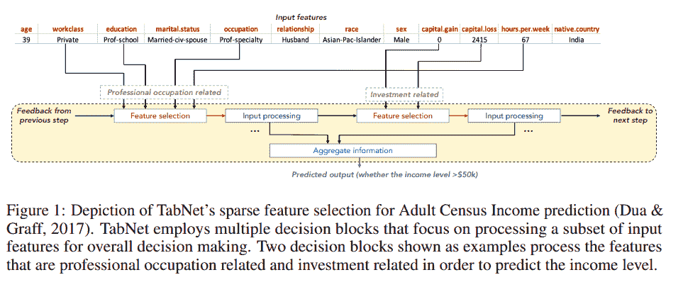

# 用 Google 的 TabNet 对表格数据建模

> 原文：<https://towardsdatascience.com/modelling-tabular-data-with-googles-tabnet-ba7315897bfb?source=collection_archive---------2----------------------->

神经网络能打败经典方法吗？


[国家癌症研究所](https://unsplash.com/@nci?utm_source=unsplash&utm_medium=referral&utm_content=creditCopyText)在 [Unsplash](https://unsplash.com/s/photos/research?utm_source=unsplash&utm_medium=referral&utm_content=creditCopyText) 上拍摄的照片

*2019 年发布，谷歌研究的* [*TabNet*](https://github.com/google-research/google-research/tree/master/tabnet) *在一篇* [*预印稿*](https://arxiv.org/abs/1908.07442) *中声称在表格数据上胜过现有方法。它是如何工作的，怎样才能尝试呢？*

如今，表格数据可能构成了大部分业务数据。想想零售交易、点击流数据、工厂中的温度和压力传感器、银行使用的 KYC(了解你的客户)信息，或者制药公司使用的模式生物的基因表达数据。品种简直是无穷无尽。

在另一篇文章的[中，我介绍了 CatBoost，这是我最喜欢的在表格数据上建立预测模型的方法之一，以及它的神经网络对应物 NODE。但是大约在 NODE 手稿出来的同时，Google Research 发布了一份手稿，采用了一种完全不同的方法用神经网络进行表格数据建模。尽管 NODE 模仿决策树集成，但 Google 提出的 TabNet 试图建立一种适合表格数据的新型架构。](/modelling-tabular-data-with-catboost-and-node-929bfbaaeb08)

描述这种方法的论文名为 [TabNet:专注的可解释表格学习](https://arxiv.org/pdf/1908.07442.pdf)，它很好地总结了作者们试图做的事情。“网络”部分告诉我们，它是一种神经网络，“注意力”部分意味着它正在使用一种[注意力机制](http://d2l.ai/chapter_attention-mechanisms/attention.html)，它的目标是可解释的，它用于对表格数据进行机器学习。

## 它是如何工作的？

TabNet 使用一种软特征选择，只关注对于手头的例子重要的特征。这是通过连续的多步决策机制实现的。也就是说，输入信息是分几个步骤自顶向下处理的。正如手稿所述，“*顺序形式的自上而下注意的想法是受其在处理视觉和语言数据中的应用的启发，如视觉问题回答(Hudson & Manning，2018 年)或强化学习(Mott 等人，2019 年)，同时在高维输入中搜索相关信息的子集。*

执行这种顺序注意的构建块被称为[变压器块](http://d2l.ai/chapter_attention-mechanisms/transformer.html)，即使它们与流行的 NLP 模型中使用的变压器有点不同，如 [BERT](http://jalammar.github.io/illustrated-bert/) 。这些变形金刚使用自我关注，并试图模拟句子中不同单词之间的依赖关系。这里使用的转换器类型试图通过使用 [sparsemax](https://arxiv.org/abs/1602.02068) 函数完成的“软”特征选择，逐步消除那些与当前示例不相关的特征。

论文中的第一张图，复制如下，描绘了信息是如何被聚合以形成预测的。



图片来自[https://arxiv.org/abs/1908.07442](https://arxiv.org/abs/1908.07442)

TabNet 的一个很好的特性是它不需要特征预处理(与例如节点相反)。另一个原因是，它具有“免费”内置的可解释性，为每个示例选择最相关的功能。这意味着您不必应用外部解释模块，如 [shap](https://github.com/slundberg/shap) 或 [LIME](https://github.com/marcotcr/lime) 。

当阅读这篇文章时，不太容易理解这个架构内部发生了什么，但幸运的是有[发布的代码](https://github.com/google-research/google-research/blob/master/tabnet/tabnet_model.py)稍微澄清了一些事情，并表明它没有你想象的那么复杂。

# 怎么用？

*2020 年 3 月 9 日新增:*

现在 TabNet 有了比下面描述的更好的接口:一个用于 [*PyTorch*](https://github.com/dreamquark-ai/tabnet/) *，它有一个类似 scikit-learn 的接口，一个用于*[*FastAI*](https://github.com/mgrankin/fast_tabnet)*。*

## 原始的 TabNet 代码和我的修改

正如已经提到的，代码是[可用的](https://github.com/google-research/google-research/tree/master/tabnet)，作者展示了如何将它与[森林覆盖类型数据集](https://archive.ics.uci.edu/ml/datasets/covertype)一起使用。为了方便起见，他们提供了三个特定于数据集的文件:一个文件下载并准备数据([download _ prepare _ cover type . py](https://github.com/google-research/google-research/blob/master/tabnet/download_prepare_covertype.py))，另一个文件定义适当的 Tensorflow 特征列和 CSV 阅读器输入函数([data _ helper _ cover type . py](https://github.com/google-research/google-research/blob/master/tabnet/data_helper_covertype.py))，以及包含训练循环的文件([experiment _ cover type . py](https://github.com/google-research/google-research/blob/master/tabnet/experiment_covertype.py))。

回购自述文件指出:

> 要将实验修改为其他表格数据集:
> 
> -替换“data/”目录下的 train.csv、val.csv 和 test.csv 文件。
> 
> -用新数据集的数字和分类特征修改 data_helper 函数，
> 
> -重新优化新数据集的 TabNet 超参数。

在用其他数据集经历了几次这个过程之后，我决定编写自己的包装器代码来简化这个过程。这个代码，我必须强调是一个完全非官方的分叉，在 [GitHub](https://github.com/hussius/tabnet_fork) 上。

根据上面的自述文件:

1.  与其为每个数据集创建新的 train.csv、val.csv 和 test.csv 文件，我更喜欢读取整个数据集并在内存中进行拆分(当然，只要可行)，所以我在代码中为 Pandas 编写了一个新的输入函数。
2.  修改 data_helper.py 文件可能需要一些工作，至少在开始时，当您不太确定它做什么以及应该如何定义特性列时(我就是这种情况)。还有许多参数需要更改，但这些参数在主训练循环文件中，而不是在数据帮助文件中。鉴于此，我还试图在我的代码中概括和简化这个过程。
3.  我添加了一些快速和肮脏的代码来进行超参数优化，但到目前为止只用于分类。
4.  还值得一提的是，作者的示例代码只显示了如何进行分类，而不是回归，因此额外的代码也必须由用户编写。我已经添加了回归功能和简单的均方误差损失。

# 使用命令行界面

执行如下命令:

```
python train_tabnet.py \
  --csv-path data/adult.csv \
  --target-name "<=50K" \
  --categorical-features workclass,education,marital.status,\
occupation,relationship,race,sex,native.country\
  --feature_dim 16 \
  --output_dim 16 \
  --batch-size 4096 \
  --virtual-batch-size 128 \
  --batch-momentum 0.98 \
  --gamma 1.5 \
  --n_steps 5 \
  --decay-every 2500 \
  --lambda-sparsity 0.0001 \
  --max-steps 7700
```

强制参数是`— -csv-path`(指向 CSV 文件的位置)、`--target-name`(带有预测目标的列的名称)和`--categorical-featues`(应该被视为分类的特征的逗号分隔列表)。其余的输入参数是超参数，需要针对每个特定问题进行优化。不过，上面显示的值直接取自 TabNet 手稿，因此作者已经针对成人人口普查数据集对它们进行了优化。

默认情况下，训练过程会将信息写入您执行脚本的位置的 tflog 子文件夹中。您可以将 tensorboard 指向此文件夹，查看训练和验证统计数据:

```
tensorboard --logdir tflog
```

并将您的网络浏览器指向`localhost:6006`。

# 如果你没有 GPU…

…你可以试试[这款合作笔记本](https://colab.research.google.com/drive/1AWnaS6uQVDw0sdWjfh-E77QlLtD0cpDa)。请注意，如果您想查看 Tensorboard 日志，您最好的选择可能是[创建一个 Google 存储桶](https://medium.com/@robertjohn_15390/introduction-to-google-cloud-storage-e806d7341340)，并让脚本在那里写入日志。这是通过使用`tb-log-location`参数完成的。例如，如果您的 bucket 的名称是`camembert-skyscrape`，您可以将`--tb-log-location gs://camembert-skyscraper`添加到脚本的调用中。(不过，请注意，您必须[正确设置存储桶](https://glaforge.appspot.com/article/tip-making-a-google-cloud-storage-bucket-or-file-public)的权限。这可能有点麻烦。)

然后，您可以从自己的本地计算机将 tensorboard 指向该桶:

`tensorboard --logdir gs://camembert-skyscraper`

# 超参数优化

在 repo 中还有一个进行超参数优化的快速而肮脏的脚本( [opt_tabnet.py](https://github.com/hussius/tabnet_fork/blob/master/opt_tabnet.py) )。同样，在[合作笔记本](https://colab.research.google.com/drive/1AWnaS6uQVDw0sdWjfh-E77QlLtD0cpDa)中显示了一个例子。到目前为止，该脚本仅适用于分类，值得注意的是，一些训练参数仍然是硬编码的，尽管它们实际上不应该是硬编码的(例如，早期停止的耐心参数[在最佳验证准确性没有提高的情况下，您继续多少步]。)

在优化脚本中变化的参数是 N_steps、feature_dim、batch-momentum、gamma、lambda-sparsity。(output_dim 被设置为等于 feature_dim，正如下面的优化提示中所建议的。)

本文提供了以下关于超参数优化的提示:

> 大多数数据集产生 N_steps ∈ [3，10]的最佳结果。通常，更大的数据集和更复杂的任务需要更大的 N_steps。非常高的 N_steps 值可能遭受过度拟合，并且产生较差的泛化能力。
> 
> 调整 Nd [feature_dim]和 Na [output_dim]的值是权衡性能和复杂度的最有效方法。对于大多数数据集，Nd = Na 是一个合理的选择。非常高的 Nd 和 Na 值可能遭受过拟合，并且产生较差的概括。
> 
> γ的最佳选择会对整体性能产生重大影响。通常，较大的 N_steps 值有利于较大的γ。
> 
> 大批量有利于提高性能-如果内存限制允许，建议使用总训练数据集大小的 1–10%。虚拟批量通常比批量小得多。
> 
> 最初大的学习速率是重要的，它应该逐渐衰减直到收敛。

# 结果

我已经通过这个命令行界面对几个数据集尝试了 TabNet，包括我在关于 NODE 的[帖子中使用的](/modelling-tabular-data-with-catboost-and-node-929bfbaaeb08)[成人人口普查数据集](https://archive.ics.uci.edu/ml/datasets/Census+Income)和 CatBoost ，原因可以在那个帖子中找到。方便的是，这个数据集也曾在 TabNet 手稿中使用过，作者展示了他们在那里找到的最佳参数设置。使用这些设置重复运行，我注意到最佳验证误差(和测试误差)往往在 86%左右，[类似于没有超参数调整的 CatBoost】。作者在手稿中报告了 85.7%的测试集性能。当我使用 hyperopt 进行超参数优化时，不出所料，我达到了大约 86%的类似性能，尽管参数设置不同。](/modelling-tabular-data-with-catboost-and-node-929bfbaaeb08)

对于其他数据集，如扑克手数据集，TabNet 据称以相当大的优势击败了其他方法。我还没有花太多时间在这上面，但是每个人当然都被邀请在各种数据集上尝试超参数优化的 TabNet！

# 结论

TabNet 是一个有趣的架构，似乎有希望用于表格数据分析。它直接对原始数据进行操作，并使用顺序注意机制来为每个示例执行显式特征选择。这个属性也给了它一种内置的可解释性。

我试图通过编写一些包装代码来使 TabNet 更容易使用。下一步是在大范围的数据集上将它与其他方法进行比较。

如果你有兴趣，请在你自己的数据集上试一试，或者发送拉请求，帮助我改进界面！