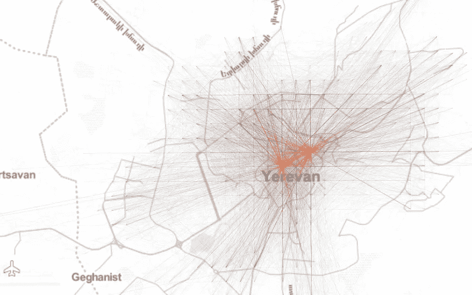
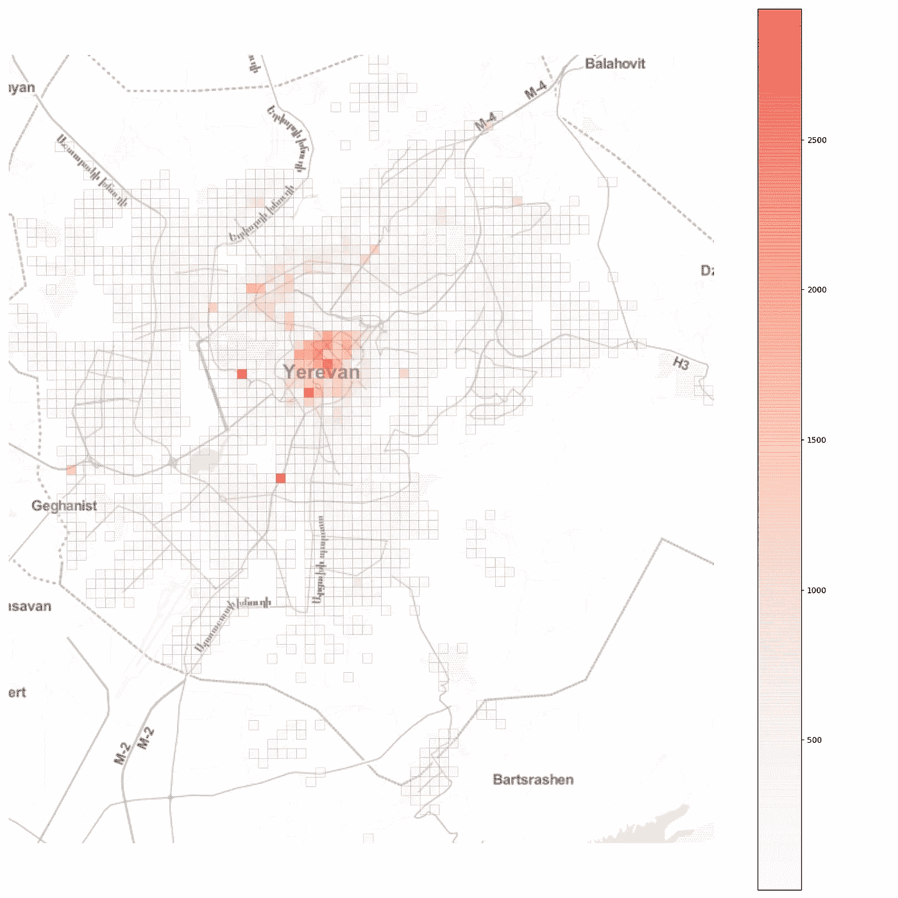
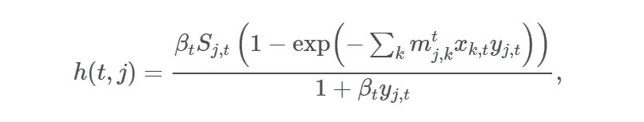
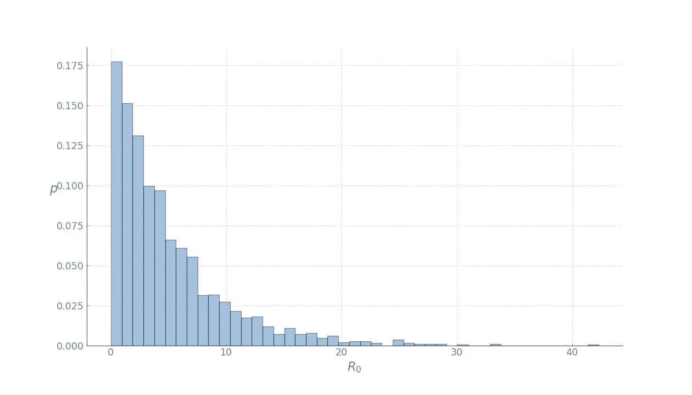
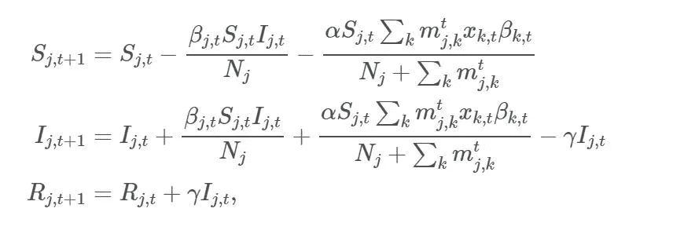
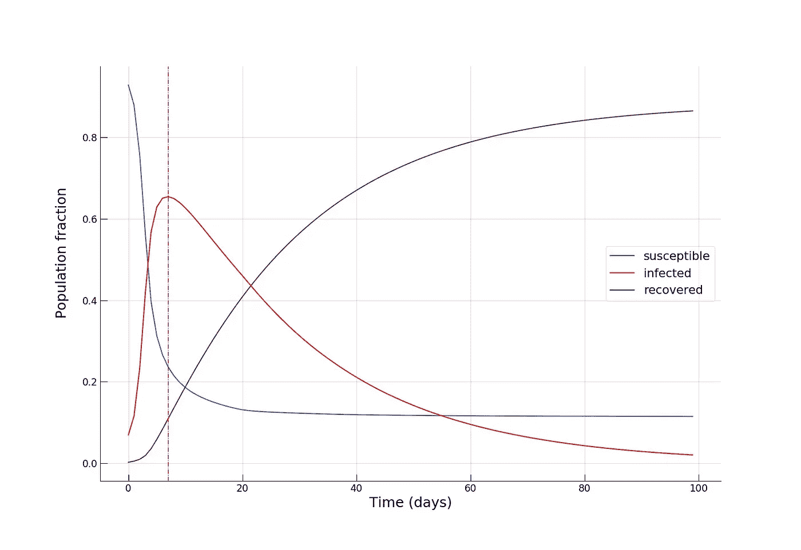
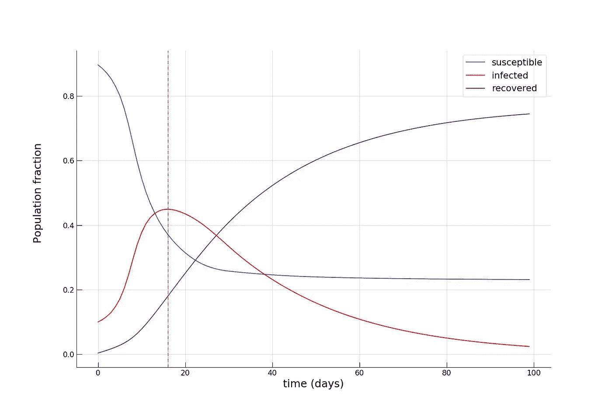
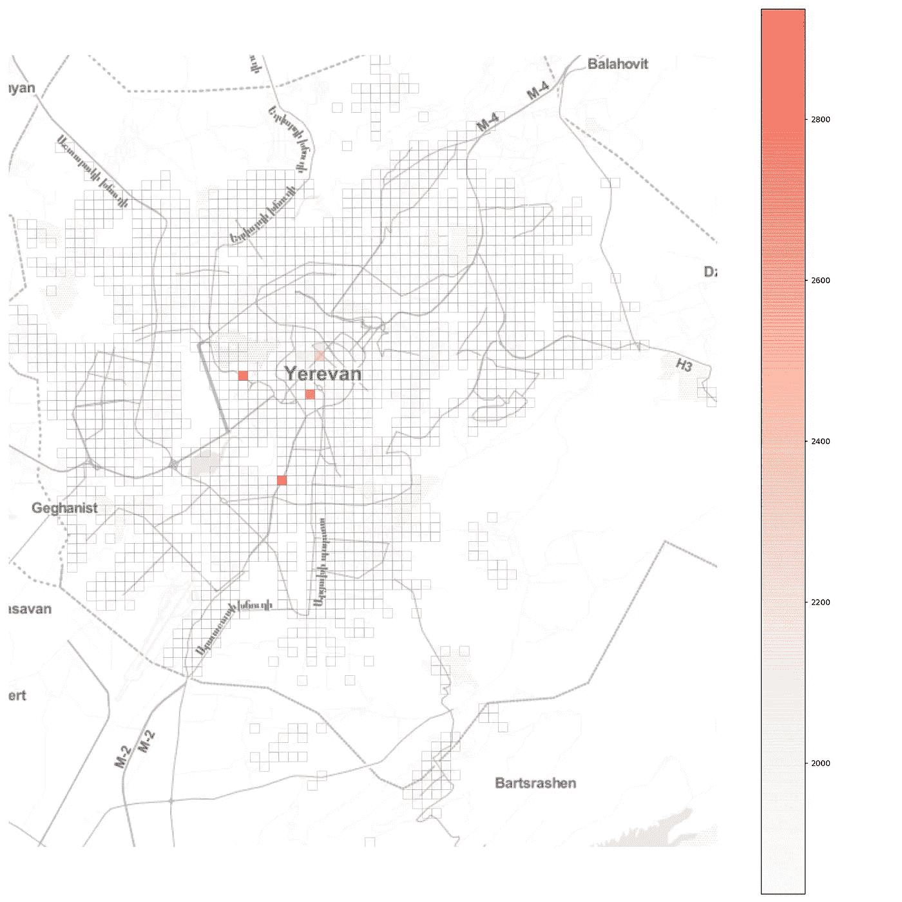
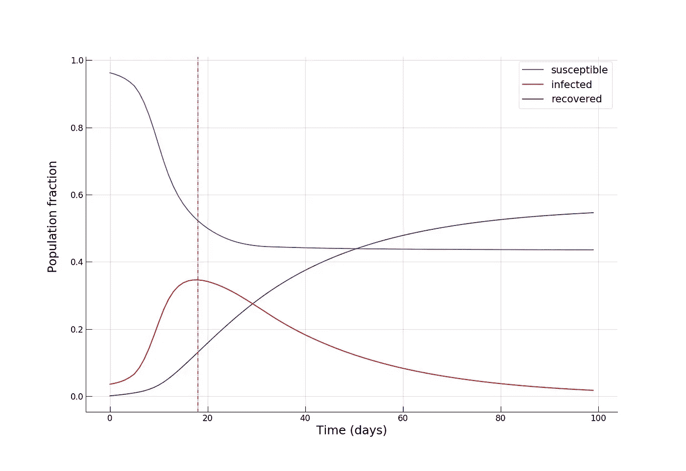
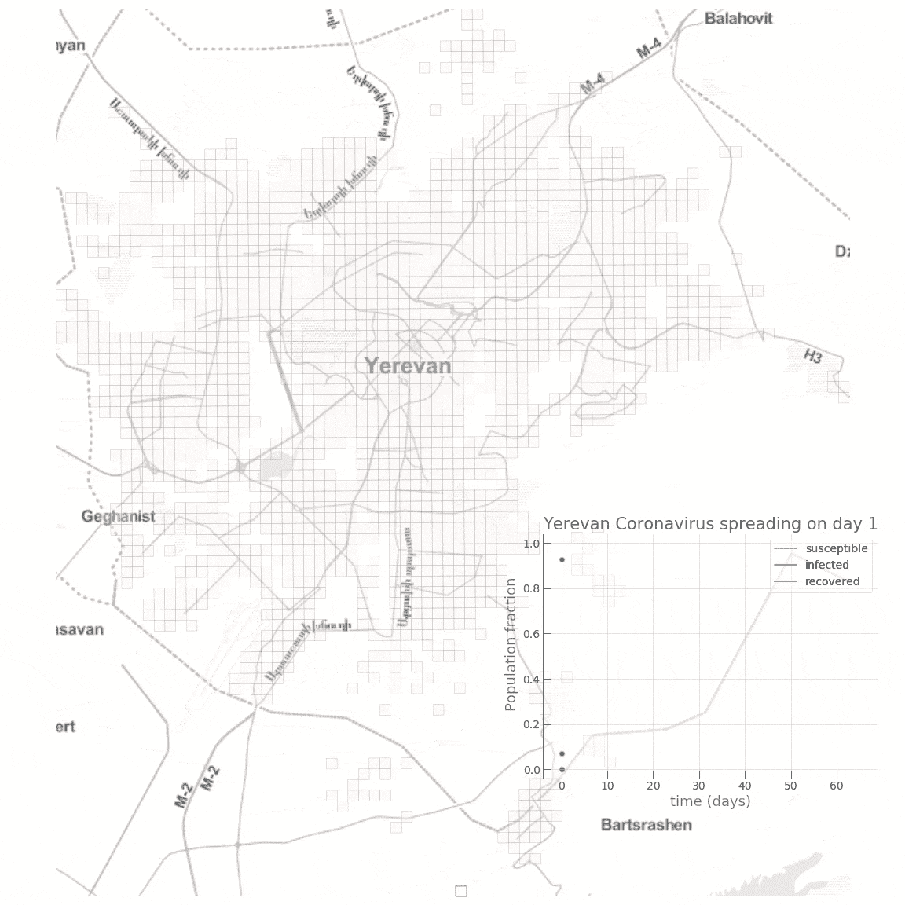

# 用 Python 模拟城市冠状病毒流行

> 原文：<https://towardsdatascience.com/modelling-the-coronavirus-epidemic-spreading-in-a-city-with-python-babd14d82fa2?source=collection_archive---------4----------------------->

## 城市为流行病做好准备了吗？

> 在[这个在线课程](https://www.udemy.com/course/covid-19-urban-epidemic-modelling-in-python/?referralCode=220EF2D17E80758E78B5)或[这个](https://skl.sh/30Vdq7J)中，你可以只使用 Python 来学习新冠肺炎疫情在一个城市中传播的整个建模、模拟和空间可视化。

最近在中国爆发的 [2019-nCoV 武汉冠状病毒](https://en.wikipedia.org/wiki/Novel_coronavirus_(2019-nCoV))已经震惊了金融市场和整个经济体，并适时引发了全球普通民众的恐慌。2019 年 1 月 30 日，nCoV 甚至被世界卫生组织(世卫组织)指定为全球卫生紧急事件。在撰写本文时，尚未发现任何经医学研究标准验证的特定治疗方法。此外，一些关键的流行病学指标，如[基本再生数](https://en.wikipedia.org/wiki/Basic_reproduction_number)(一个患病个体感染的平均人数)仍然未知。在我们这个前所未有的全球连通性和流动性的时代，由于小世界网络的影响，这种流行病是全球范围内的主要威胁。人们可以推测，如果 2020 年发生全球灾难性事件(大致定义为> 1 亿人伤亡),最有可能的原因恰恰是某种疫情——不是核灾难，也不是气候灾难，等等。世界范围的快速城市化进一步加剧了这种情况，我们人口密集的动态城市变成了疾病传播网络中的传播节点，从而变得极其脆弱。

在本帖中，**我们将讨论当流行病袭击一个城市时会发生什么，应该立即采取什么措施，以及这对城市规划、政策制定和管理有什么影响**。我们将把埃里温市作为我们的案例研究，并将在 Python 中对冠状病毒在城市中的传播进行数学建模和模拟，观察城市移动模式如何影响疾病的传播。

# 城市流动性

有效、高效和可持续的城市交通对于现代城市的运行至关重要。已经证明直接影响城市的宜居性和经济产出。但是，**一旦发生疫情，就会火上浇油**，放大和传播疾病的蔓延。

因此，让我们先来看看埃里温统一笛卡尔网格上聚集的始发地-目的地( *OD* )交通网络，以了解该城市交通模式的空间结构:



此外，如果我们观察网格单元的总流入量，我们会看到一个或多或少的单中心空间组织，其中一些具有高日流入量的单元位于中心之外:



现在，想象一场流行病在城市的一个随机地点爆发。**会如何传播？可以做些什么来遏制它？**

# 流行病建模

为了回答这些问题，我们将建立一个简单的[房室模型](https://en.wikipedia.org/wiki/Compartmental_models_in_epidemiology#The_SIR_model)来模拟传染病在城市中的传播。随着流行病的爆发，其[传播动态会发生显著变化](https://www.ncbi.nlm.nih.gov/pubmed/23864593)，这取决于最初感染的地理位置及其与城市其他地方的连接性。这是从最近关于城市人口流行病的数据驱动研究中获得的最重要的见解之一。然而，正如我们将在下文进一步看到的，各种结果要求采取类似的措施来遏制疫情，并在规划和管理城市时考虑到这种可能性。

由于运行基于个体的流行病模型是具有挑战性的，并且我们的目标是展示城市中流行病传播的一般原理，而不是建立一个精确校准的流行病模型，我们将遵循自然杂志文章中描述的方法，根据我们的需要修改经典的 SIR 模型。

该模型将人口分为三个部分。对于在时间 *t* 的每个位置 *i* ，三个隔间如下:

*   *Si，t* :尚未感染或易感该疾病的个体数。
*   *Ii，t* :感染疾病并能将疾病传播给易感人群的个体数量。
*   *Ri，t* :由于康复或死亡，已经被感染然后从感染组中移除的个体数量。这一群体中的个人没有能力再次感染疾病或将感染传播给他人。

在我们的模拟中，时间将是一个离散变量，因为系统的状态是在每天的基础上建模的。在时间 *t* 在位置 *j* 的完全易感人群中，爆发发生的概率为:



其中 *βt* 为第 *t* 天的传输速率； *mj，k* 反映从位置 *k* 到位置 *j* 的移动性， *xk，t* 和 *yk，t* 分别表示 *t* 日在位置 *k* 和位置 *j* 的感染和易感人群比例，由 *xk，t = Ik，t / Nk* 给出然后，我们继续模拟一个随机过程，将疾病引入完全易感人群的位置，其中 *Ij，t+1* 是一个概率为 *h(t，j)* 的伯努利随机变量。

一旦在随机地点引入感染，疾病在这些地点传播，并由旅行的个人在其他地点携带和传播。**这就是由 *OD* 流量矩阵表征的城市流动模式发挥关键作用的地方**。

此外，为了正式确定疾病是如何由感染者传播的，我们需要*基本繁殖数*、 *R0* 。定义为 *R0 = βt / γ* 其中 *γ* 为恢复率，可以认为是感染个体与易感人群接触后二次感染的预期次数。在撰写本文时，武汉冠状病毒[的基本繁殖数估计为 1.4 至 4。我们假设最坏的情况是 4。但是，我们应该注意，它实际上是一个随机变量，报告的数字只是*预期的*数字。为了让事情变得更有趣一点，我们将在每个位置使用不同的 *R0* 来运行我们的模拟，从一个良好的候选分布 *Gamma* 中抽取，平均值为 4:](https://www.nejm.org/doi/full/10.1056/NEJMoa2001316)



我们现在可以进入模型动力学:



其中 *βk，t* 为 *t* 日 *k* 处的(随机)传输速率， *α* 为表示[模式份额](https://en.wikipedia.org/wiki/Modal_share)或城市公共交通与私人小汽车出行方式强度的系数。

上述等式中描述的模型动态非常简单:在第*天 t+1* 在位置 *j* 处，我们需要从易感人群 *Sj，t* 中减去在位置 *j* 内被感染的人的比例(第一等式中的第二项)以及从城市中其他位置到达的被感染的人的比例，用他们各自的传染率 *βk，t* 进行加权(第一等式中的第三项由于总人口 *Nj = Sj + Ij + Rj* ，我们需要将减去的部分移到感染组，同时也将恢复的部分移到 *Rj，t+1* (第二个和第三个方程)。

# 模拟设置

在此分析中，我们将使用从当地拼车公司 [**gg**](https://www.ggtaxi.com/) 提供的 GPS 数据中获得的典型日的聚合 *OD* 流量矩阵，作为埃里温市移动模式的代表。接下来，我们需要每个 *250×250m* 格网单元中的人口数，我们通过按比例缩放提取的流量数来近似计算，以便不同位置的总流入量总计约为埃里温 110 万人口的一半。这实际上是一个大胆的假设，但是由于改变这个部分产生了非常相似的结果，我们将坚持它。

# 减少公共交通？

在我们的第一次模拟中，我们将想象一个以可持续公共交通为主导的未来城市交通，其中 *α=0.9* :



我们看到受感染的人口比例迅速攀升，在大约第 8-10 天达到疫情高峰，几乎 70%的人口感染了，而只有一小部分人(~10%)从疾病中康复。接近第 100 天时，当疫情消退时，我们看到**康复个体的比例达到惊人的 90%** ！现在让我们看看将公共交通出行的强度降低到类似于 *α = 0.2* 的水平对缓解疫情传播是否有任何作用。这既可以解释为**采取激烈的措施减少城市流动性(例如，通过发布宵禁)**也可以解释为**增加私家车出行的比例以减少出行期间感染*的机会***。



我们看到了疫情的高峰是如何在第 16 天和第 20 天之间到来的，其中**的感染群体**(约 45%)要小得多，而康复的人数是前者的两倍(约 20%)。在疫情接近尾声时，易感个体的比例也增加了一倍(约 24%对约 12%)，这意味着更多的人逃脱了疾病。不出所料，**我们看到引入戏剧性的措施来暂时降低城市流动性对疾病传播动态有很大影响**。

# 隔离热门地点？

现在，让我们看看另一个直观的想法，完全切断几个关键的热门地点是否有预期的效果。要做到这一点，让我们选择与高 1%的流动性流量相关的位置，



而**完全阻断了所有进出这些地点的人流**，有效地在那里建立了隔离制度。从图中我们可以看出，在埃里温，这些位置大多位于市中心，另外两个位置是两个最大的购物中心。选择一个适中的 *α = 0.5* ，我们得到:



在疫情高峰期，我们看到的感染者比例甚至更小(~35%)，最重要的是，我们看到在疫情接近尾声时，**大约一半的人口仍然易感，有效地避免了感染！**

这是一个小动画，展示了公共交通高分担率场景的动态变化:



# 结论

绝不是声称精确的流行病模型(或者甚至任何流行病学的基本知识之外的实质性知识)，我们在这篇文章中的目的是获得关于传染病爆发期间网络效应如何在城市环境中发挥作用的第一手见解。随着人口密度、流动性和动态性的不断增加，我们的城市越来越容易受到“黑天鹅”的影响，也越来越脆弱。既然你死了就不能去取咖啡，如果没有有效和高效的危机处理能力和机制，智能和可持续发展的城市将毫无意义。例如，我们看到在关键地点引入隔离制度，或采取严厉措施遏制流动性，在这种健康危机期间可能是有用的。然而，一个更重要的问题是**如何实施这些措施，同时尽量减少对城市功能及其经济的损害和损失？**

此外，传染病的确切流行传播机制[仍然是一个活跃的研究领域](https://link.springer.com/chapter/10.1007/978-1-4614-4496-1_4)，该领域的进展将必须传达给城市规划、政策制定和管理部门，并融入其中，以使我们的城市更加安全和[抗脆弱性](https://en.wikipedia.org/wiki/Antifragility)。

附:点击阅读[原文。](https://lexparsimon.github.io/coronavirus/)

上述模拟的代码:

```
import numpy as np
  # initialize the population vector from the origin-destination flow matrix
  N_k = np.abs(np.diagonal(OD) + OD.sum(axis=0) - OD.sum(axis=1))
  locs_len = len(N_k)                 # number of locations
  SIR = np.zeros(shape=(locs_len, 3)) # make a numpy array with 3 columns for keeping track of the S, I, R groups
  SIR[:,0] = N_k                      # initialize the S group with the respective populations

  first_infections = np.where(SIR[:, 0]<=thresh, SIR[:, 0]//20, 0)   # for demo purposes, randomly introduce infections
  SIR[:, 0] = SIR[:, 0] - first_infections
  SIR[:, 1] = SIR[:, 1] + first_infections                           # move infections to the I group

  # row normalize the SIR matrix for keeping track of group proportions
  row_sums = SIR.sum(axis=1)
  SIR_n = SIR / row_sums[:, np.newaxis]

  # initialize parameters
  beta = 1.6
  gamma = 0.04
  public_trans = 0.5                                 # alpha
  R0 = beta/gamma
  beta_vec = np.random.gamma(1.6, 2, locs_len)
  gamma_vec = np.full(locs_len, gamma)
  public_trans_vec = np.full(locs_len, public_trans)

  # make copy of the SIR matrices 
  SIR_sim = SIR.copy()
  SIR_nsim = SIR_n.copy()

  # run model
  print(SIR_sim.sum(axis=0).sum() == N_k.sum())
  from tqdm import tqdm_notebook
  infected_pop_norm = []
  susceptible_pop_norm = []
  recovered_pop_norm = []
  for time_step in tqdm_notebook(range(100)):
      infected_mat = np.array([SIR_nsim[:,1],]*locs_len).transpose()
      OD_infected = np.round(OD*infected_mat)
      inflow_infected = OD_infected.sum(axis=0)
      inflow_infected = np.round(inflow_infected*public_trans_vec)
      print('total infected inflow: ', inflow_infected.sum())
      new_infect = beta_vec*SIR_sim[:, 0]*inflow_infected/(N_k + OD.sum(axis=0))
      new_recovered = gamma_vec*SIR_sim[:, 1]
      new_infect = np.where(new_infect>SIR_sim[:, 0], SIR_sim[:, 0], new_infect)
      SIR_sim[:, 0] = SIR_sim[:, 0] - new_infect
      SIR_sim[:, 1] = SIR_sim[:, 1] + new_infect - new_recovered
      SIR_sim[:, 2] = SIR_sim[:, 2] + new_recovered
      SIR_sim = np.where(SIR_sim<0,0,SIR_sim)
      # recompute the normalized SIR matrix
      row_sums = SIR_sim.sum(axis=1)
      SIR_nsim = SIR_sim / row_sums[:, np.newaxis]
      S = SIR_sim[:,0].sum()/N_k.sum()
      I = SIR_sim[:,1].sum()/N_k.sum()
      R = SIR_sim[:,2].sum()/N_k.sum()
      print(S, I, R, (S+I+R)*N_k.sum(), N_k.sum())
      print('\n')
      infected_pop_norm.append(I)
      susceptible_pop_norm.append(S)
      recovered_pop_norm.append(R)
```