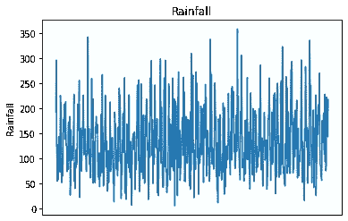
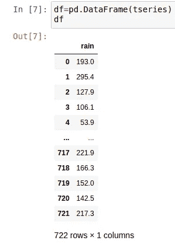
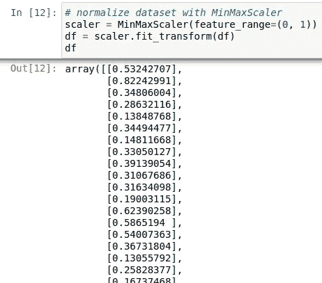
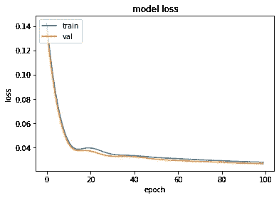

# 用 LSTM 网络模拟波动时间序列

> 原文：<https://towardsdatascience.com/modelling-volatile-time-series-with-lstm-networks-51250fb7cfa3?source=collection_archive---------19----------------------->

## 这是一个长短期记忆网络(LSTM)如何被用来模拟一个不稳定的时间序列的例子。

每年的降雨量数据可能很不稳定。不同于气温，气温通常显示出一个明显的季节趋势，降雨量作为一个时间序列是相当不稳定的。在爱尔兰，夏季和冬季一样多雨并不罕见。


资料来源:pixabay.com

这是爱尔兰纽波特 1959 年 11 月的降雨模式的图解说明:



作为一个序列神经网络，LSTM 模型在解释时间序列的波动性方面可以证明是优越的。

使用 Ljung-Box 检验，小于 0.05 的 p 值表明该时间序列中的残差呈现随机模式，表明波动性显著:

```
>>> res = sm.tsa.ARMA(tseries, (1,1)).fit(disp=-1)
>>> sm.stats.acorr_ljungbox(res.resid, lags=[10])
(array([78.09028704]), array([1.18734005e-12]))
```

# 数据操作和模型配置

正在讨论的数据集包括 722 个月的降雨数据。爱尔兰新港的降雨量数据来源于英国气象局网站。

选择 712 个数据点用于训练和验证目的，即建立 LSTM 模型。然后，将过去 10 个月的数据用作测试数据，与 LSTM 模型的预测进行比较。

以下是数据集的一个片段:



然后形成数据集矩阵，以便根据过去的值回归时间序列:

```
# Form dataset matrix
def create_dataset(df, previous=1):
    dataX, dataY = [], []
    for i in range(len(df)-previous-1):
        a = df[i:(i+previous), 0]
        dataX.append(a)
        dataY.append(df[i + previous, 0])
    return np.array(dataX), np.array(dataY)
```

然后用 MinMaxScaler 对数据进行归一化处理:



随着*先前的*参数被设置为 120，训练和验证数据集被创建。作为参考， *previous = 120* 表示模型使用从 *t — 120* 到 *t — 1* 的过去值来预测时间 *t* 的降雨量值。

选择*之前的*参数需要反复试验，但选择了 120 个时间段，以确保捕捉到时间序列显示的波动性或极值。

```
import tensorflow as tf
from tensorflow.keras import layers
from tensorflow.keras.layers import Dense
from tensorflow.keras.layers import LSTM# Training and Validation data partition
train_size = int(len(df) * 0.8)
val_size = len(df) - train_size
train, val = df[0:train_size,:], df[train_size:len(df),:]# Number of previous
previous = 120
X_train, Y_train = create_dataset(train, previous)
X_val, Y_val = create_dataset(val, previous)
```

然后输入被整形为*样本、时间步长、特征*的格式。

```
# reshape input to be [samples, time steps, features]
X_train = np.reshape(X_train, (X_train.shape[0], 1, X_train.shape[1]))
X_val = np.reshape(X_val, (X_val.shape[0], 1, X_val.shape[1]))
```

# 模型训练和预测

该模型跨 100 个时期进行训练，并且指定了 712(等于训练和验证集中的数据点的数量)的批量大小。

```
# Generate LSTM network
model = tf.keras.Sequential()
model.add(LSTM(4, input_shape=(1, previous)))
model.add(Dense(1))
model.compile(loss='mean_squared_error', optimizer='adam')
history=model.fit(X_train, Y_train, validation_split=0.2, epochs=100, batch_size=448, verbose=2) # list all data in history
print(history.history.keys())
# summarize history for accuracy
plt.plot(history.history['loss'])
plt.plot(history.history['val_loss'])
plt.title('model loss')
plt.ylabel('loss')
plt.xlabel('epoch')
plt.legend(['train', 'val'], loc='upper left')
plt.show()
```

这是培训与验证损失的关系图:



还生成了预测降雨量与实际降雨量的关系图:

```
# Plot all predictions
inversetransform, =plt.plot(scaler.inverse_transform(df))
trainpred, =plt.plot(trainpredPlot)
valpred, =plt.plot(valpredPlot)
plt.xlabel('Days')
plt.ylabel('Rainfall')
plt.title("Predicted vs. Actual Rainfall")
plt.show()
```


将预测结果与基于平均方向精度(MDA)、均方根误差(RMSE)和平均预测误差(MFE)的验证集进行比较。

```
>>> def mda(actual: np.ndarray, predicted: np.ndarray):
>>>     """ Mean Directional Accuracy """
>>>     return np.mean((np.sign(actual[1:] - actual[:-1]) == np.sign(predicted[1:] - predicted[:-1])).astype(int))

>>> mda(Y_val, predictions)0.9090909090909091>>> from sklearn.metrics import mean_squared_error
>>> from math import sqrt
>>> mse = mean_squared_error(Y_val, predictions)
>>> rmse = sqrt(mse)
>>> print('RMSE: %f' % rmse)RMSE: 49.99>>> forecast_error = (predictions-Y_val)
>>> forecast_error
>>> mean_forecast_error = np.mean(forecast_error)
>>> mean_forecast_error-1.267682231556286
```

*   丙二醛: 0.909
*   RMSE:49.99 美元
*   MFE: -1.26

# 根据测试数据进行预测

虽然验证集的演示结果相当不错，但只有通过将模型预测与测试(或看不见的)数据进行比较，我们才有理由相信 LSTM 模型具有预测能力。

如前所述，过去 10 个月的降雨量数据用作测试集。然后，使用 LSTM 模型预测未来 10 个月，并将预测值与实际值进行比较。

向下到 *t-120* 的先前值用于预测时间 *t* 的值:

```
# Test (unseen) predictions
Xnew = np.array([tseries.iloc[592:712],tseries.iloc[593:713],tseries.iloc[594:714],tseries.iloc[595:715],tseries.iloc[596:716],tseries.iloc[597:717],tseries.iloc[598:718],tseries.iloc[599:719],tseries.iloc[600:720],tseries.iloc[601:721]])
```

获得的结果如下:

*   **丙二醛:** 0.8
*   RMSE:49.57 美元
*   **MFE:** -6.94

由于过去 10 个月的平均降雨量为 148.93 毫米，预测精度表现出与验证集相似的性能，相对于测试集计算的平均降雨量，误差较低。

# 结论

在本例中，您看到了:

*   如何准备用于 LSTM 模型的数据
*   LSTM 模型的构建
*   如何检验 LSTM 预测的准确性
*   使用 LSTM 建模波动时间序列的优势

非常感谢您的宝贵时间，这个例子的相关库可以在[这里](https://github.com/MGCodesandStats/weather-modelling)找到。

你也可以在 michael-grogan.com[找到更多我的数据科学内容。](https://www.michael-grogan.com/)

*免责声明:本文是在“原样”的基础上编写的，没有任何担保。它旨在提供数据科学概念的概述，不应被解释为专业建议。本文中的发现和解释是作者的观点，不以任何方式得到 Metéire ann 的认可或隶属于 Metéire ann。*