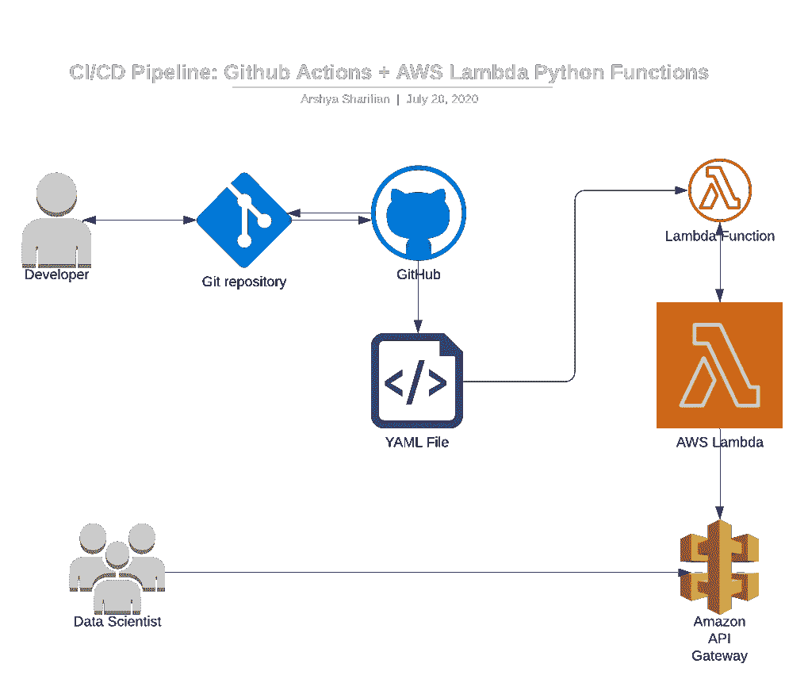

# 现代 CI/CD 管道:带有 AWS Lambda 无服务器 Python 函数和 API 网关的 Github 动作

> 原文：<https://towardsdatascience.com/modern-ci-cd-pipeline-git-actions-with-aws-lambda-serverless-python-functions-and-api-gateway-9ef20b3ef64a?source=collection_archive---------9----------------------->

## 使 web 应用程序开发和部署现代化

照片由[晨酿](https://unsplash.com/@morningbrew?utm_source=medium&utm_medium=referral)在 [Unsplash](https://unsplash.com?utm_source=medium&utm_medium=referral) 拍摄

云已经存在，越来越多的开发人员正在寻找有效整合云的方法。无论您是一家认识到本地硬件和本地机器局限性的初创企业，还是一家对如何缓慢卸载本地工作负载感到好奇的大型企业，本教程都很有见地。我描述了第 1 阶段的 AWS 架构，包括 Github、API Gateway 和 AWS Lamba python 函数。这是向开发人员展示 AWS 云采用学习曲线的初始教程。

# 大纲:

1.  概念建筑
2.  目的和目标
3.  如何设置
4.  自动气象站 Lambda 的局限性和问题
5.  想法和结论

## 概念架构:

架构图

上面的架构描述了使用 AWS Lambda 部署 python 函数的基本 CI/CD 管道。上面提到的开发人员可以使用 git 将他们的 git 存储库拉入和推送至 github。我们配置了 github actions YAML 文件，一旦一个拉请求被合并到主分支，它就会自动更新 AWS Lambda 函数。API 网关代表一个触发器，它运行 AWS Lambda python 函数并返回结果。通过这种方式，数据科学家(或分析师、前端开发人员或其他开发人员)可以快速简洁地触发和访问结果。

> N 注意:AWS Lambda 函数存在于开发人员无法访问的计算资源 AWS Lambda 中。

## 目的和目标

这个架构代表了团队为应用程序开发和部署构建健壮的 CI/CD 管道的有效方式。尽管这种架构相对于成熟的 web 应用程序来说是“不完整的”，但这种设计可以代表构建 web 应用程序的第一阶段。对于任何对卸载本地计算资源感兴趣的人来说，AWS Lambda 无服务器功能是以经济高效的方式利用云的有效方式(AWS Lambda 功能是 AWS always free 层的一部分)。很多时候，开发团队为应用程序部署(或迁移)设计了一个崇高的基于云的架构，却失败了。进行概念验证并慢慢引入云是更谨慎的做法。

## 如何设置

主要挑战是理解 YAML 文件并正确格式化在 AWS Lambda 中执行的“main.py”文件。要设置一个新的工作流，开发人员可以在其中为功能部署配置 YAML 文件，请在 github 存储库中单击“actions”。这将提供创建新工作流或从与部署架构一致的现有工作流中进行选择的说明。我创建了一个默认的工作流，然后搜索其他工作流来找到一个部署到 AWS Lambda 的模板(但是可能有一种更简单的方法来利用 AWS Lambda 的预配置工作流)。

> 注意:第 57 行实际上是将 github repo 压缩到一个名为“test-dep-dev”的 zip 文件中。理想情况下，要组织一个 Lambda 函数部署，我建议在 repo 中创建一个文件夹，并压缩该文件夹以进行部署。例如，您可以创建一个名为“Lambda _ Function _ Scrapping _ Data”的文件夹，其中包含部署您的函数所需的所有依赖项。第 57 行将类似于“zip -r test-dep-dev.zip。/Lambda _ functions _ screwing _ Data "

一旦您配置了 YAML 文件，请检查 AWS Lambda 函数页面，查看该函数是否已经更新。为了排除故障，[在 AWS Lambda 函数中创建一个测试用例](https://docs.aws.amazon.com/lambda/latest/dg/getting-started-create-function.html)。我首先面临的问题是 python 返回值的语法不正确([这里有一些文档可能对](https://aws.amazon.com/premiumsupport/knowledge-center/malformed-502-api-gateway/)有帮助)。下面是一个 AWS Lambda Python 函数的简单示例。响应格式是最重要的。

> 注意:在 AWS Lambda 函数中，处理程序被定义为 file_name.function_name。例如，如果文件名为 main.py，函数为 my_serverless_function，则句柄应定义为 main.my_serverless_function。

这不是重新创建轮子，而是演示如何为 AWS Lambda 函数创建 API 网关的精彩视频:

## AWS Lambda 的局限性和问题以及可能的替代方案

在决定使用 AWS Lambda 之前，考虑其局限性是很重要的。AWS Lambda 函数将在 15 分钟后超时，这已经足够了，但是对于更复杂的企业级工作负载，这可能还不够。更重要的是，你打包的函数被限制为 250mb 解压缩和 50mb 压缩，这包括包的大小、编码的函数和其他依赖项。这些只是特别适用于我正在处理的用例的一些限制。你可以在这里找到其他限制。

鉴于 AWS Lambda 本质上是一个运行容器化功能的共享计算实例，为了更加灵活，您可以提供一个 EC2 实例。显然，这导致了更高的成本。如果您担心高可用性，我不确定 SLA 为 AWS Lambda 提供了什么，但通常情况下，AWS 计算实例用户应该假设 90%的可用性。

## 结论

对 AWS Lambda 和无服务器函数有一点学习曲线，但是考虑到它们在大多数现代 web 应用程序开发中的普遍适用性，我认为这是值得的时间投资。如果你正在做一个项目，并且想要结合一些云，从过程和成本的角度来看，AWS Lambda 是相当值得的。最终用户可以轻松地调用端点并检索数据。似乎有大量的文档和教程可以解决几乎所有的用例。总体来说，我会推荐 AWS Lambda。为了提高计算实例的灵活性，我推荐 Oracle 云计算实例。它们是免费的(不到 1 OCPU)，但是文档可能很难找到和理解。

## 子堆栈:

我最近创建了一个[子栈](https://arysharifian.substack.com/)来学习如何用 Python 编程和解决 LeetCode 问题。