# 现代探索性数据分析

> 原文：<https://towardsdatascience.com/modern-exploratory-data-analysis-29fdbecec957?source=collection_archive---------20----------------------->

## 抛弃旧的方式。未来是自动化的。

## 四个自动化 EDA 库述评


照片由[亚历山德罗·埃尔贝塔](https://unsplash.com/@alessandroerbetta?utm_source=medium&utm_medium=referral)在 [Unsplash](https://unsplash.com?utm_source=medium&utm_medium=referral) 拍摄

EDA 代表探索性数据分析，可能是任何数据科学项目中最重要但最容易被忽视的步骤。

**我的目标是与您分享一些工具，这些工具可以在探索数据时将您的工作效率提升 10 倍。**

# 语境

正是在探索阶段，数据科学家在进入数据清理、特征工程和建模之前，与数据集保持密切联系。

> 然而，我们中有太多的人匆忙完成数据探索，过早地跳到下一步。

过去，你必须为 EDA 编写自己熟悉的函数，在这个领域已经有了很多重新发明轮子和/或复制粘贴的方法。但是随着自动机器学习等先进技术的出现，很明显 EDA 也可以从自动化中受益。

在这篇文章中，我首先展示了一个用老式方法做 EDA 的例子。然后，我回顾了以下致力于使 EDA 尽可能简单高效的软件包:

*   熊猫-剖析(python)
*   摘要工具(R)
*   探索(R)
*   数据女仆(R)

# ✨要求运行下面的例子

我们将使用的数据集是:

*   回归:[健康保险](https://www.kaggle.com/mirichoi0218/insurance#insurance.csv)，这里的目标是预测保险费。
*   分类:[泰坦尼克号](https://www.kaggle.com/c/titanic/data)，目标是预测谁幸存。

安装 R 包:

```
install.packages(c("summarytools", "explore" "dataMaid"))
```

安装 python `pandas-profiling`包:

```
pip install pandas-profiling
```

要使用 Jupyter 笔记本中的软件包，我们还需要从命令行运行以下命令:

```
jupyter nbextension enable --py widgetsnbextension
```

如果您更喜欢 Jupyter Lab，命令改为:

```
jupyterlab: jupyter labextension install @jupyter-widgets/jupyterlab-manager
```

# 老办法

在过去，人们要么使用可视化库，要么使用 pandas 内置的可视化功能。让我们看几个例子。

```
import pandas as pd 
import numpy as np data = pd.read_csv('insurance.csv')
```

## 👉`head`功能

这可能是每个数据科学笔记本中的第一个函数调用，用于查看数据:

```
**data**.head()
```

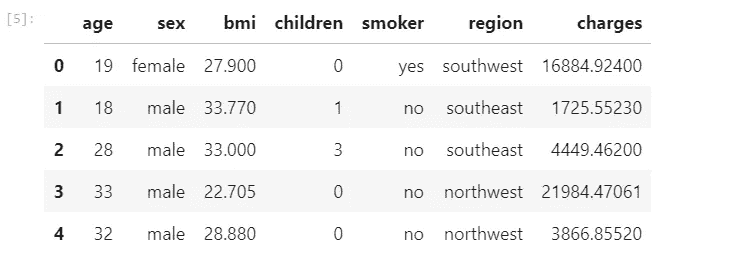

## 👉`describe`功能

这个函数为我们提供了每个变量的一些汇总统计数据。我喜欢把数字变量和分类变量分成两个独立的调用:

```
data.describe(include=np.number)
```

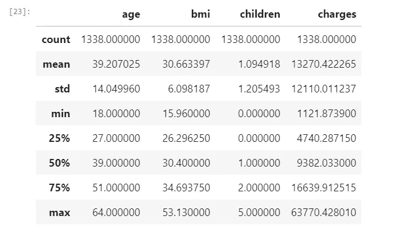

```
data.describe(include=np.object)
```

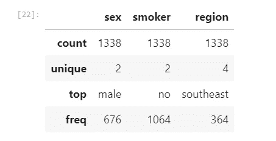

## 👉和熊猫一起策划

两种最常见的单向分布图是分类变量的条形图和连续变量的直方图。两者都很容易直接从熊猫上使用:

```
data['region'].value_counts().plot.barh(title='Region')
```

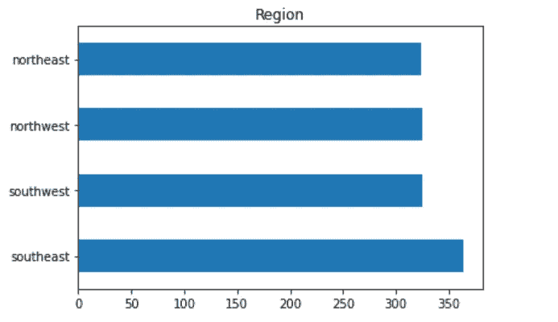

```
data['age'].plot.hist(title='Age distribution')
```

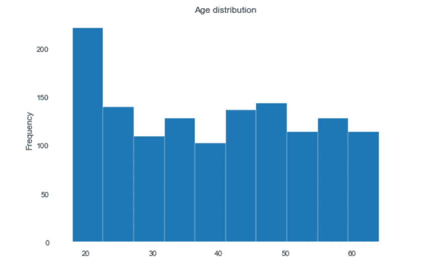

最后，我们有普遍存在的相关矩阵:

```
data.corr().style.background_gradient(cmap='coolwarm').set_precision(2)
```

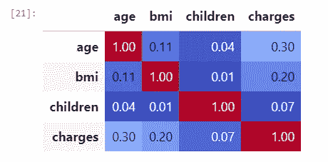

这就结束了我们对老派探索性数据分析的快速回顾。如你所见，我们必须明确地写下每一步。如果列数增加，这个过程要么变得乏味，要么我们必须写下自己的函数来实现自动化。

在这篇文章的其余部分，我回顾了现有的成功的可以为我们执行自动化的包。

# 📦摘要工具`(R)`

`summarytools`可能是获取数据集中每一列单向信息的最简单方法。

```
library(summarytools) 
library(readr) df <- read_csv("insurance.csv") view(dfSummary(df))
```

输出直接显示在 RStudio 的浏览器中，但是您也可以使用`file`参数将其保存为 html 文件。看一看:

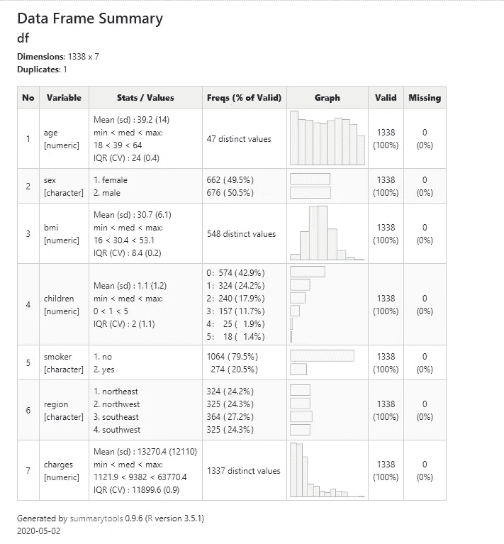

虽然不全面，但我发现这个输出在很小的空间内打包大量有用的信息时非常有效。这个包还有一些其他的单变量统计和交叉制表的函数，但是在我看来真正的精华是上面的`dfSummary`函数。

# 📦探索`(R)`

`explore`套餐相当不可思议。只需一行代码，您就可以得到一个完整的闪亮的应用程序，让您交互式地探索您的数据。让我们看一个 **titanic** 数据集的例子。下面，我展示了两个变量的单向和双向图，一个分类变量(性别)和一个连续变量(年龄)。我们立刻发现女性更有可能存活，年轻人也更有可能存活:

```
library(explore) df <- read_csv("titanic_train.csv") explore(df)
```

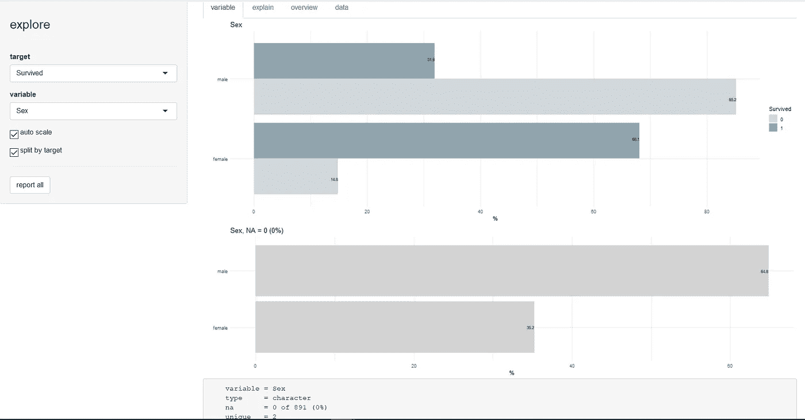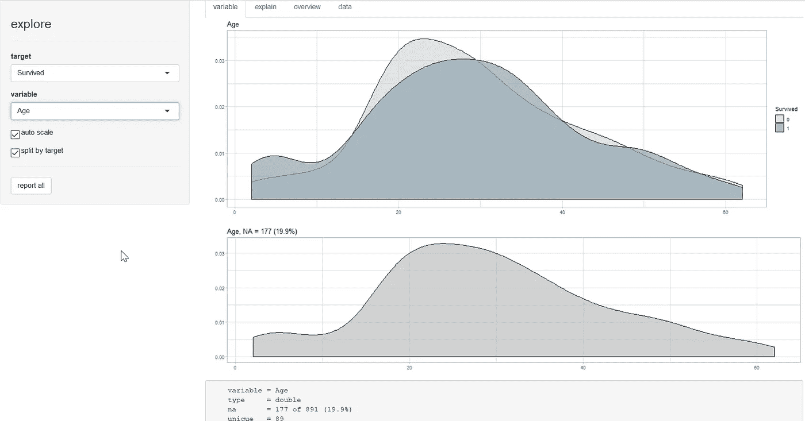

另一个很好的功能是“解释”选项卡，在这里我们可以直观地看到一个简单的决策树，以建立我们对预测变量的直觉:

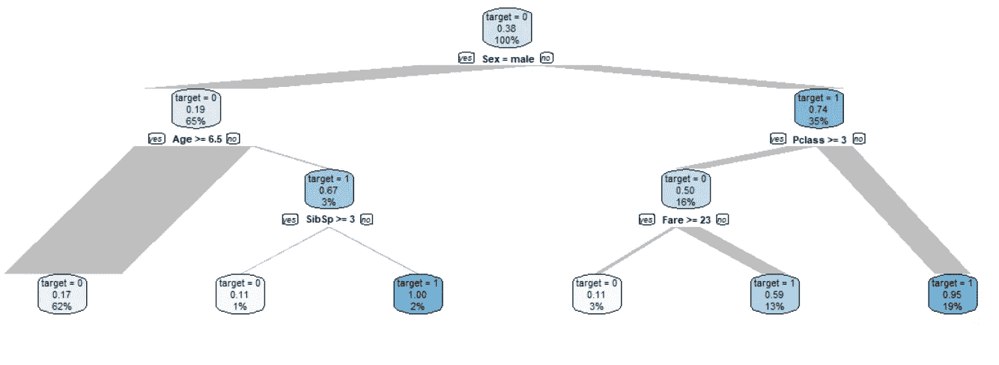

# 📦数据助理`(R)`

```
library('dataMaid') makeDataReport(df,                
               render = FALSE,
               file = "output_file.Rmd",
               replace = TRUE)
```

`dataMaid`可能是目前为止最全面的选项。您可以输出一个 Rmd 文件，然后从 RStudio 将其编织成 HTML 报告，或者您可以使用`render=TRUE`为您输出一个漂亮的 Word 文档！

报告以一个汇总表开始:

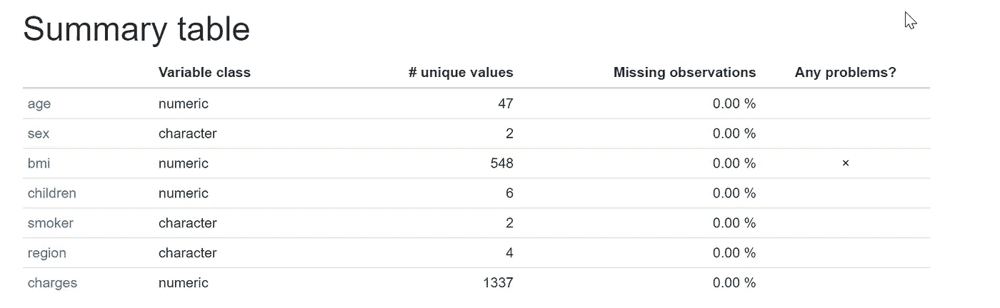

后面是每个变量的一个部分。这是 bmi 的部分，根据上面的汇总表，它可能有问题，结果是潜在异常值的问题:

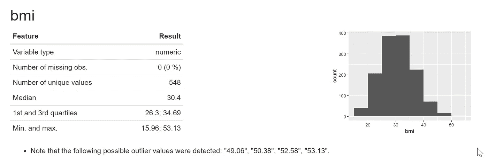

`makeDataReport`函数有很多参数来调整输出。总的来说，我对这个包印象非常深刻。

# 📦熊猫简介`(python)`

最后但同样重要的是，`pandas-profiling`可能是 python 世界中自动 EDA 最流行的包。您可以在笔记本中使用它，并且由于奇妙的`ipywidgets`库，您可以获得一个交互式的非常丰富的可视化来探索您的数据。

```
from pandas_profiling import ProfileReport profile = ProfileReport(data, 
                        title='Pandas Profiling Report', 
                        html={'style':{'full_width':True}}) profile.to_widgets()
```

首先，您将获得数据的概述:

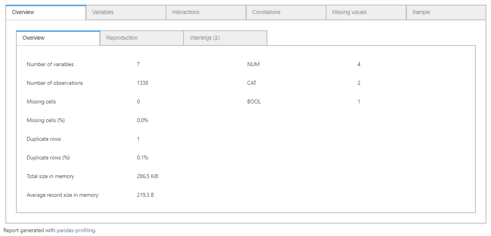

以及一些以前的包没有捕捉到的警告:

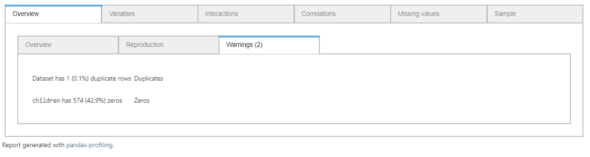

我们还会得到每个变量的详细报告:

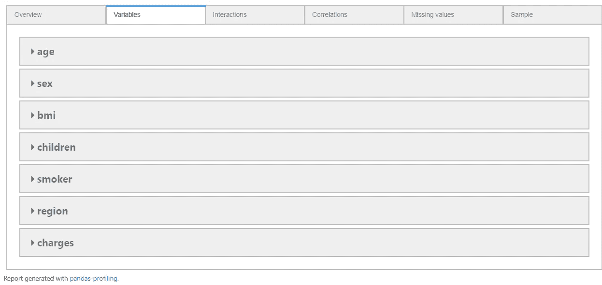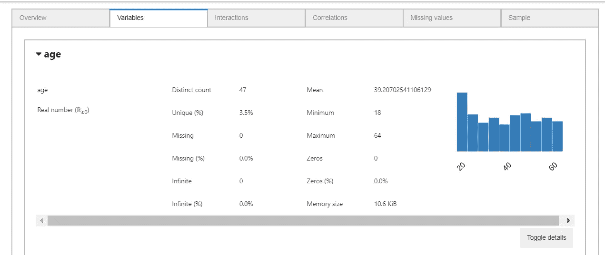

我们甚至可以切换细节进行更深入的探索:

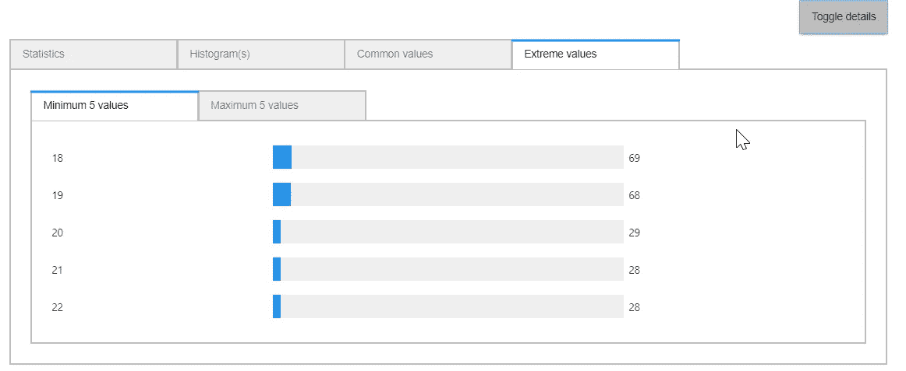

变量之间的相互作用图也可用:

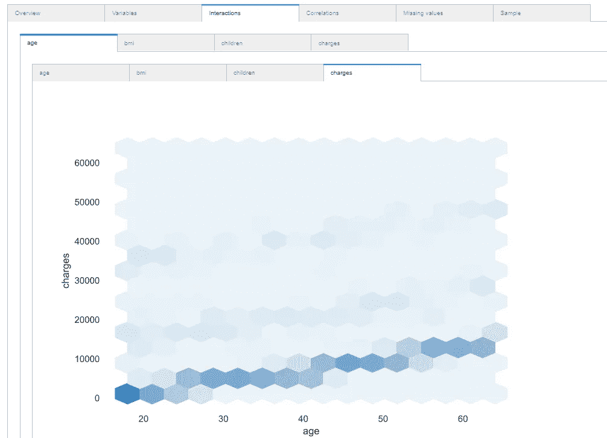

其他选项卡(相关性、缺失值和样本)是您所期望的。我邀请你来玩这个奇妙的包。

# ✅裁决

我希望我说服你停止使用自制的功能或昂贵的可视化工具，改用开源的专用包。

上面描述的 4 个包是我在真实情况下进行数据探索的常用工具。我从非交互式的开始，首先是`summarytools`，然后是`dataMaid`。然后我和`explore`一起玩耍，最后，我和`pandas-profiling`在一起的时间最多。

这就是我如何尽可能熟悉我的数据，而不浪费时间编写模板代码。根据我得出的发现，我将使用其他软件包进行异常检测、插补、特征工程等。这些都将是未来文章的主题。感谢阅读！