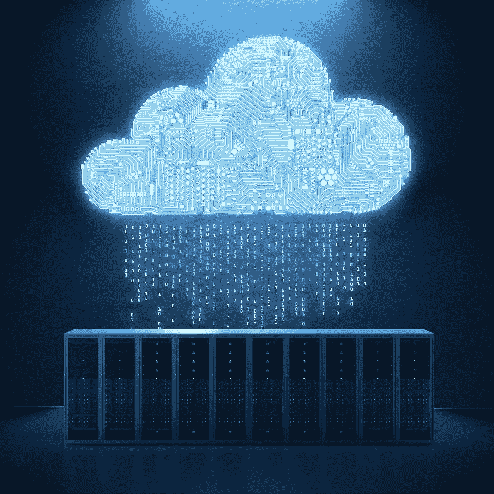
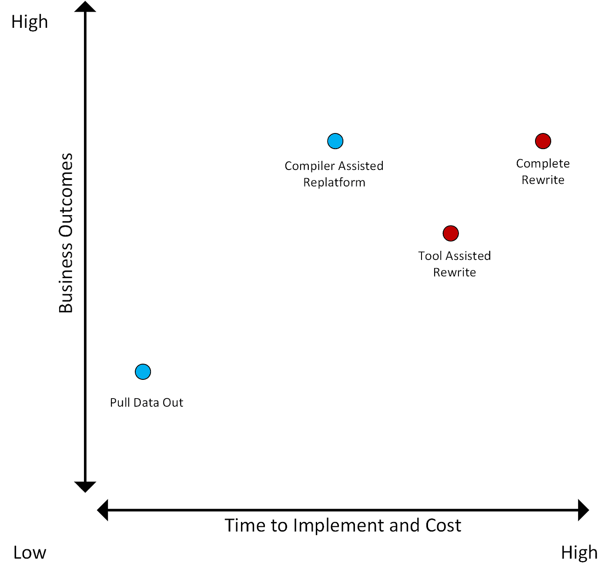

# 现代化大型机应用程序

> 原文：<https://towardsdatascience.com/modernizing-mainframe-applications-part-i-517e657ee336?source=collection_archive---------12----------------------->

## 从 COBOL 迁移并添加 AI

## 迈克尔·克鲁彻和蒙特·兹韦本

几十年来，大型机一直是银行、保险、医疗保健、零售以及公共部门等行业的支柱。所有这些行业都需要高负载、低延迟的事务处理。大型机旨在为任务关键型应用程序提供高可用性，在这种情况下，停机时间成本极高或者根本无法接受。

但是，随着企业努力使用分布式计算和公共云进行转型，大型机应用程序正在被抛在后面。在很大程度上，这是因为人们认为现代化大型机应用程序势不可挡，甚至是不可能的。

这种看法是错误的。新技术降低了大型机现代化的障碍，并提供了几个关键优势，包括降低成本、业务敏捷性和释放新的人工智能应用功能。让我们来研究一下这些收获。

## 成本降低

对大型机驱动的应用程序进行现代化改造，以使用廉价的商用硬件，从而显著降低大型机的前期资本支出以及持续许可和维护成本。迁移到云无疑提供了独特的优势，但许多具有大型机工作负载的客户也碰巧拥有未充分利用的本地集群，这些集群可用于承载现代化的大型机工作负载。导致容器化解决方案的大型机应用程序现代化通常可以提供两方面的最佳效果。例如，Kubernetes 方法可以提供一种途径来抽象出底层基础设施，并将其部署在本地或云中，在两种选择之间充当桥梁，只需很少或不需要修改。

## 业务敏捷性

将大型机工作负载迁移到云中可以提高业务灵活性。容器化使应用程序更加敏捷，因为它允许应用程序快速部署和调整大小，以适应不断变化的基础设施需求。它既可以在云中利用，也可以在内部利用。容器化内部部署应用程序使客户能够分期偿还其现有基础设施投资，同时提供快速的云之路。云提供了随用随付的定价和对各种计算基础设施的轻松访问，而不需要 IT 团队支持大量潜在的硬件配置。

从大型机中迁移还提供了一条通向更现代的数据库的道路，使应用程序能够横向扩展以容纳更多的数据。它还通过将现有数据和工作负载分布在无限多的商用服务器上，增强了性能和并发性。Splice Machine(我是该公司的联合创始人和首席执行官)就是这种横向扩展 SQL RDBMS 的一个例子。

此外，大型机开发人员和操作员技能也很稀缺。在更现代的编程语言和基础设施上，可以更容易地为任务关键型应用程序找到合格的员工。

容器化、横向扩展数据库和更大的人才库都有助于提高现代化大型机应用程序的灵活性。

## 新功能

第三，也是将应用程序从大型机中迁移出来的最重要的原因，是由于人工智能，它开启了全新的业务成果。现代环境可以支持这种人工智能。基于大型机的环境不能。

多年来为企业提供良好服务的任务关键型应用程序正在通过数据和新软件功能实现彻底的现代化。例如，保险系统不再简单地管理保单和索赔。他们需要使用新的数据源来支持人工智能和机器学习技术，这些技术可以对风险进行评分，检测欺诈或洗钱，并了解投保人可能感兴趣的其他选项。他们必须在几毫秒内完成这一切。

大型机迁移使老牌企业能够跟上甚至超越其风险投资支持的新贵竞争对手，这些竞争对手自诞生以来就使用数据和人工智能。应用需要高性能和可扩展、一致、灵活的数据访问来完成工作。当公司将他们的大型机基础设施换成一个融合平台(如 Splice Machine)时，他们会立即加速他们的遗留应用程序。它们使他们能够立即处理运营记录系统工作负载、分析报告要求以及基于数据库内机器学习的自动化操作。他们立刻变得聪明，能够根据预测采取行动。

这个数据平台与基础设施无关。它可以直接部署，也可以部署在由 Kubernetes 编排的容器中。它可以在内部或云上的商用集群上进行调配。它具有处理极其广泛的数据库工作负载的独特能力，无需专门的数据模式和数据移动，这使它成为大型机应用程序迁移的理想数据库。最重要的是，它为机器学习提供了一条前进的道路，这是应用程序以前所没有的。

# 将应用程序从大型机中迁移出来的方法

由于系统的复杂性和多种选择，没有一种单一的迁移途径适用于每一家公司。这导致了非常复杂、冗长的迁移规划和执行过程。

我们建议通过问自己两个问题来简化这个过程:

1.  您希望通过大型机现代化实现哪些业务成果？
2.  对于迁移过程，您愿意花费多少时间、金钱和风险？

时间和成本有效地衡量迁移所需的工作量。有时，时间和成本可以相互交换。例如，如果迁移需要手动工作，您可以部署更多的人来解决问题，或者您可以通过许可合适的软件来自动化工作。

## 迁移大型机应用程序的选项

编译器辅助的平台重建和数据提取比重写更有前途

## 完整的应用程序重写

大型机迁移的一种方法是从头开始重写现有的应用程序。在这种情况下，开发团队使用现有大型机应用程序的功能来定义其最低可行的需求。然后，团队用另一种语言重新编写应用程序。

例如，一家公司可能用 Java 重写了一个有 30 年历史的事务性 COBOL 应用程序，使用微服务设计模式，并使用横向扩展的 NoSQL 文档数据库。这提供了立竿见影的敏捷性、横向扩展能力、更大的人才库以及其他优势。它还在编程语言、设计模式、基础设施和数据管理实现方面为他们提供了完全的灵活性，可以在现代环境中使用。就好像应用程序是全新的一样。

明显的缺点(也是很少部署这种方法的原因)是这种灵活性的代价很大。从头开始的应用程序迁移过程(规范、实现、业务逻辑测试等)需要大量的工作，并且经常容易出错。大型开发团队必须重新编写应用程序，调整数据模式，构建新的 ETL，执行功能和性能测试，等等。

## 工具辅助的需求收集和重写

加速需求收集和实现的另一种方法是使用商业软件工具，这些工具分析现有的大型机应用程序并生成业务规则和编程语言存根。这种方法的一些例子包括 [EvolveWare](https://evolveware.com/business-rules-extraction/) 、 [AveriSource](https://averisource.com/cobol-business-rule-extraction/) 和 [UniqueSoft](https://www.uniquesoft.com/dcode-software-modernization.php) 。

这些工具有时可以减少迁移的时间和成本，但通常会牺牲灵活性和业务成果。工具可能会假设目标语言和基础设施选项，如果开发团队从零开始使用最佳的软件和基础设施，就不会选择这些选项。

此外，由软件工具自动生成的代码通常需要大量的返工。嵌入在大型机应用程序中的业务规则可能无法完全准确地提取出来，而且微妙的问题可能难以检测，修复起来也很昂贵。

## 从主机中提取数据

一些开发团队不是从头开始重写大型机应用程序，而是通过将数据从大型机中取出并放入现代数据库中来使他们的大型机应用程序现代化。这种方法的一个主要好处是，通常可以识别和卸载资源密集型大型机任务。例如，大型机通常对业务运营负有报告责任。如果这些报告职责需要大量的总基础设施资源，精明的开发团队可以将报告功能迁移到本地或云中的商用基础设施，从而节省大量资金。

这种方法还提供了用人工智能和机器学习为应用提供动力的可能性。采用这种方法的公司包括 Syncsort 和 T2 Ispirer。

这种技术有一个明显的缺点。尽管这通常是朝着正确方向迈出的一步，但这种方法不会导致从大型机完全迁移出去。结果，该公司仍然不得不承担维护大型机的许可成本、维护时间和机会成本—只是为了更少的业务用途。

## 编译器辅助的大型机迁移

大型机应用程序迁移的最后一个选项是通过理解大型机应用程序的语言和数据管理实现的编译器来完成大型机应用程序的迁移。编译器生成可以编译成目标语言和数据管理实现的中间语言源。

这种方法通常可以快速实现，同时比完全重写成本低得多，并提供显著的业务成果。实施的成本和时间很低，因为实际的转换是高度(但不是完全)自动化的。编译器软件并不试图理解和提取复杂的业务规则:它在较低的层次上工作，创建应用程序逻辑本身的中间表示。将这种方法作为解决方案一部分的公司包括[传家宝计算](https://www.heirloomcomputing.com/)和[微焦点](https://www.microfocus.com/en-us/home)。

大型机应用程序编译的大多数实现将保留现有的 RDBMS(几乎总是 DB2 或 Oracle)。但现在有机会跨越传统数据库，在一个横向扩展的 HTAP 数据库上实现应用程序的现代化，该数据库包含原生人工智能。如果您使用这种编译方法，并将 Splice Machine 作为您的目标 DB，您可以在几个月内轻松地将 ML/AI 添加到您的大型机应用程序中。

Splice Machine 最近与一家领先的保险公司合作，将其全球索赔、客户和保单应用程序从传统的本地 DB2 架构迁移到部署在多个云上的分布式 SQL 平台。已有 35 年历史的 PL-I 应用程序(仍然是公司核心业务流程的支柱)已经转换为 Java，现在能够在融合平台上利用 OLAP 和 OLTP 功能。现在，该公司以前由于 ETL 延迟而无法运行的预测模型可以直接注入到实时索赔工作流中。这是因为 OLTP RDBMS 和 AI 模型共同驻留在 Splice Machine 的聚合架构上。

# 走向

一般来说，我们推荐“拉出数据”或“编译器辅助的”大型机迁移技术，稍微倾向于后者。

“拉出数据”方法可以快速实施，并显著降低大型机利用率，从而降低未来大型机硬件和许可证成本，同时实现全新的功能。“编译器辅助的应用程序迁移”是一个更全面的解决方案，借助合适的合作伙伴工具是有意义的。

正确的方法取决于许多因素，但我们认为这种解决方案的基本要素是具有 ACID 和 ML 功能的横向扩展 SQL 数据库。这样一个平台不仅使公司能够使他们的大型机应用程序现代化，变得敏捷、数据丰富和智能，而且不需要从头重写。将传统应用程序迁移到统一的平台可以降低数据库许可成本，使应用程序能够大规模添加新数据源，统一分析和，并通过机器学习为它们增压，使它们比以往任何时候都更加智能。

要了解更多关于如何使您的大型机应用现代化的信息，请查看我们的[网络研讨会](https://info.splicemachine.com/heirloom-mainframe-webinar-recording)，观看编译器辅助的大型机迁移演示。