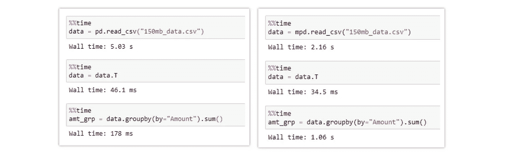
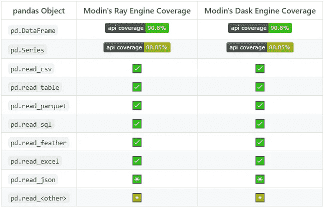
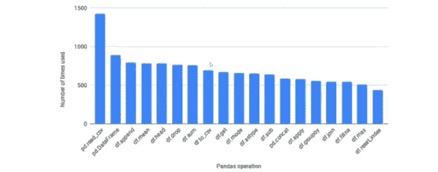
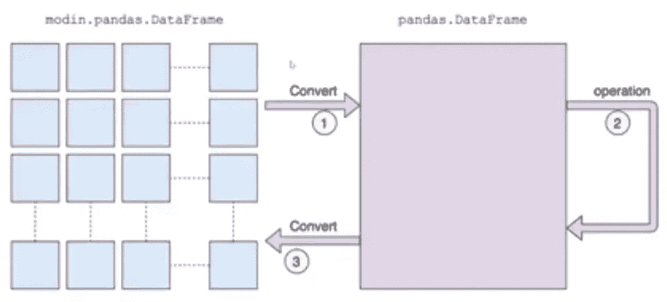

# 摩丁-加速你的熊猫笔记本，脚本和图书馆

> 原文：<https://towardsdatascience.com/modin-speed-up-your-pandas-notebooks-scripts-and-libraries-c2ac7de45b75?source=collection_archive---------31----------------------->

## 使用 Modin 扩展 Pandas 工作流，只需更改一行代码


尼古拉斯·霍伊泽在 [Unsplash](https://unsplash.com?utm_source=medium&utm_medium=referral) 上拍摄的照片

## 熊猫简介:

**Pandas** 是一个开源库，为 Python 语言提供了高性能、易于使用的数据结构和数据分析工具。Pandas 是用 Python 进行真实世界数据分析的基本高级构建块。它有一个更广泛的目标，那就是成为最强大、最灵活的开源数据分析和操作工具。

熊猫库有 40 多个 API，其中一些最常用的是熊猫数据帧、熊猫系列、熊猫绘图、熊猫输入/输出。熊猫图书馆的重要亮点是:

*   一个快速高效的 **DataFrame** 对象，用于集成索引的数据操作
*   **读写数据的工具**
*   智能**数据对齐**和集成处理**缺失数据**
*   大数据集的基于智能标签的**切片**、**花式索引**和**子集**
*   通过引擎与强大的**组聚合或转换数据。**
*   数据集的高性能**合并和连接**
*   **时间序列**-功能

熊猫图书馆在学术和商业领域被广泛使用，包括金融、神经科学、经济学、统计学、广告、网络分析等等。

Pandas 是一个非常棒的库，可以让数据科学家/数据分析师与数据进行交互。但是与大数据交互需要时间。熊猫主要使用 1 核 CPU 处理指令并返回结果。这里，摩丁出现了，他使用分布式计算来加速熊猫的工作流程。


([来源](https://github.com/modin-project/modin))，摩丁 logo

# 如何加快熊猫的工作流程:

Modin 是一个早期访问的多处理数据帧库，具有与 pandas 相同的 API，弥补了数据分析和大数据之间的差距。它提供了一种轻松的方式来加速 pandas 笔记本、脚本和库，并管理数据分区和洗牌，以便数据科学家/数据分析师可以有效地与数据进行交互。

> 四核笔记本电脑的摩丁速度提升了 4 倍。

Modin 加速了熊猫的查询，只需要用户在笔记本上修改一行代码。熊猫只使用一个 CPU 核心来处理指令，其余的核心没有被利用。然而，Modin 利用系统中所有可用的内核来加速 Pandas 的工作流程。


([来源](https://github.com/modin-project/modin))，比较熊猫与摩丁读取 CSV 文件的时间利用率的图表，(图 1)

# 引擎盖下的摩丁作品:

如上所述，Modin 通过分布式计算加速了 Pandas 查询。它利用了系统的所有核心。对于 4 核系统，下图比较了 Pandas 和 Modin 库的利用率。


([来源](https://www.youtube.com/watch?v=-HjLd_3ahCw))，熊猫和摩丁的 CPU 核心利用率，(图 2)

与标准笔记本电脑相比，在拥有更多内核的大型服务器上，Modin 的性能会呈指数级增长。从(图 1)可以看出，加载 18gb 的 CSV 文件只需几秒钟。

## 安装:

Modin 是开源的，你可以在这里找到 GitHub 库。从 PyPI 安装 Modin:

```
**pip install modin**
```

如果您没有安装 [Ray](https://github.com/ray-project/ray) 或 [Dask](https://github.com/dask/dask) ，您将需要安装带有其中一个目标的摩丁:

```
# Install Modin dependencies and Ray to run on Ray
**pip install modin[ray]**# Install Modin dependencies and Dask to run on Dask
**pip install modin[dask]**# Install all of the above
**pip install modin[all]**
```

Modin 将自动检测您安装了哪个引擎，并用于调度计算。

## 实施:

使用 Modin 来加速你的熊猫查询，只需要一行代码，只需要导入 Modin 库。

```
**import modin.pandas as pd**
```

# 摩丁与熊猫的比较:



(图片由作者提供)，**左** : Pandas，**右** : Modin，在 Pandas 和 Modin 中读取 150 MB CSV 文件的编译时间比较

# 一些限制:

Pandas 是一个拥有大量 API 的大型库，其中一些著名的 API 是 DataFrame、Series 等。Pandas DataFrame 和系列各有 280 多种功能。摩丁并不支持熊猫的所有功能，但它支持最著名的功能。



([来源](https://github.com/modin-project/modin))，熊猫 API 报道，(图 3)

摩丁的开发者想出了在 Kaggle 比赛中最受欢迎的熊猫方法。图 4 中列出了前 20 名。



([来源](https://www.youtube.com/watch?v=-HjLd_3ahCw))，Kaggle 最常用的 20 种熊猫方法，(图 4)

他们开始按照流行程度实现分布式计算的功能。

没有在 Modin 中实现的功能，默认为 pandas。如果您尝试使用未在 Modin 中发布的函数，库将使用 Pandas 中该函数的默认实现，方法是将 Modin 数据框转换为 Pandas 数据框，执行操作，然后再转换为 Modin 数据框。



([来源](https://www.youtube.com/watch?v=-HjLd_3ahCw))，默认为熊猫在摩丁不支持的功能，(图 5)

# 结论:

您可以使用 Modin 代替 pandas，因为它可以并行化实现并减少计算时间，即使某些 pandas API 没有并行化，它仍然默认为 Pandas。

摩丁使用[雷](https://github.com/ray-project/ray/)或[达斯克](https://dask.org/)来尽可能地并行化熊猫 API。它旨在作为熊猫的替代物。从长远来看，Modin 计划成为一个支持流行 API(SQL，pandas 等)的数据框架库。)并在各种计算引擎和后端上运行。

# 参考资料:

[1]熊猫文件，(2020 年 9 月 8 日):[https://pandas.pydata.org/](https://pandas.pydata.org/)

[2]摩丁文献:[https://modin.readthedocs.io/en/latest/](https://modin.readthedocs.io/en/latest/)

[3] PyData [YouTube 视频](https://www.youtube.com/watch?v=-HjLd_3ahCw)“利用摩丁-德文·彼得森扩展互动熊猫工作流程”，(2019 年 2 月 1 日)

> 感谢您的阅读