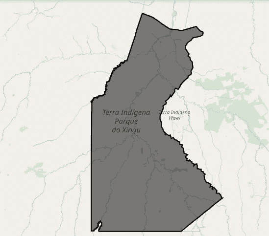
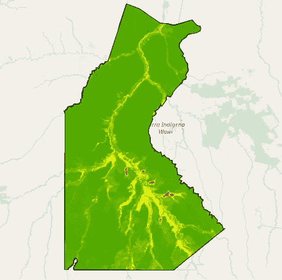
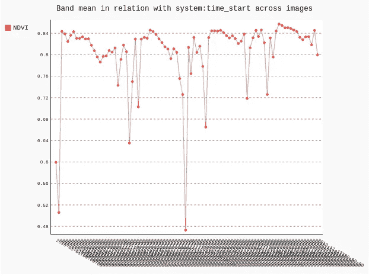
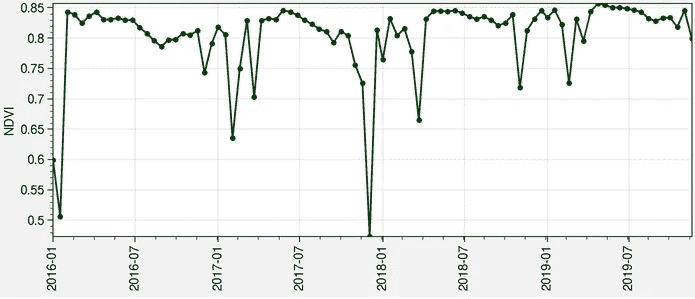
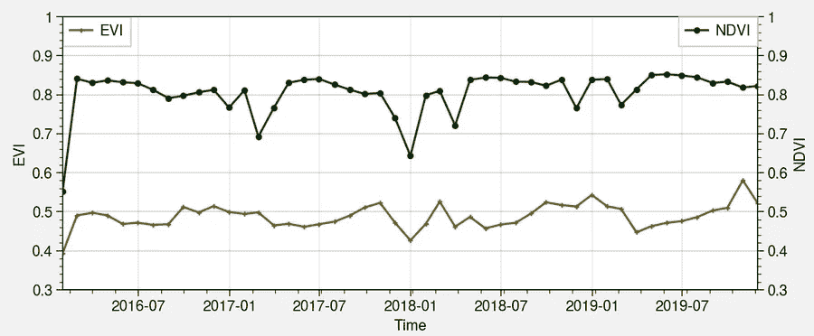

# MODIS 植被指数:GEE 方法

> 原文：<https://towardsdatascience.com/modis-vegetation-indices-a-gee-approach-f48e1259e462?source=collection_archive---------18----------------------->

## 气候数据科学

## 巴西新古土著公园的案例。

自 1999 年首次发射进入轨道以来，**中分辨率成像光谱仪** (MODIS)是地球观测中使用的关键传感器之一。它的成功有几个原因:1 至 2 天的重访时间、全球覆盖、广泛的适用性及其衍生产品。仅举几个例子。

在本教程中，您将重点关注 [MOD13Q1](https://developers.google.com/earth-engine/datasets/catalog/MODIS_006_MOD13Q1) 产品，该产品由全球范围内 16 天频率的**归一化差异植被指数** (NDVI)和**增强植被指数** (EVI)组成。你可能已经从 GEE 的[介绍中知道了 NDVI，但是在这里你还将探索 EVI 在环境分析中的用途。](/a-quick-introduction-to-google-earth-engine-c6a608c5febe)


女士们先生们，我们正在从太空探索地球。Brian McGowan 在 [Unsplash](https://unsplash.com?utm_source=medium&utm_medium=referral) 上拍摄的照片

# 通常的嫌疑人(和一个新的)

从 GEE 的介绍中，您已经知道如何注册和使用`gee`，安装`folium`进行交互式可视化，以及`geehydro`以类似于原生 Javascript API 的方式与代码进行交互。如果你对气候建模感兴趣并阅读了 CMIP6 的[介绍，那么你一定也知道`Proplot`。本教程的新颖包是`ipygee`，其工作方式与`geehydro`类似，允许使用一些仅在](/a-quick-introduction-to-cmip6-e017127a49d3) [GEE 代码编辑器](https://code.earthengine.google.com/)中可用的功能。

要安装`ipygee`，只需使用`Pip`:

```
pip install ipygee
```

然后，您可以导入本教程中需要的所有工具:

```
import ee
import folium 
import geehydro
import numpy as np # yes, numpy!
import pandas as pd # yes, pandas!
import proplot as plot 
import matplotlib.pyplot as plt from ipygee import*
from pandas.plotting import register_matplotlib_converters
```

如你所知，要使用`gee`，你必须总是触发认证并初始化库，特别是如果你有兴趣运行 [Google Colab](/getting-started-with-google-colab-f2fff97f594c) 中的代码。

```
# Trigger the authentication flow.
>>> ee.Authenticate()
# Initialize the library.
>>> ee.Initialize()
```

# 世界保护区

[**世界保护区数据库**](https://www.protectedplanet.net/) (WDPA)是最大的海洋和陆地保护区数据库，在 GEE 中很容易找到[。它提供全面的地理信息和世界上任何地区的边界。在这里，您将使用它来获得巴西的](https://developers.google.com/earth-engine/datasets/catalog/WCMC_WDPA_current_polygons)[新古土著公园](https://en.wikipedia.org/wiki/Xingu_Indigenous_Park)的形状，该公园被称为世界上第一个也是最大的保护区之一。

使用 EE 片段，您可以加载 WDPA 的面数据库并过滤新谷公园的区域:

```
wdpa_polygon = ee.FeatureCollection('WCMC/WDPA/current/polygons')
# select the Xingu Indigenous Park shapefile
xingu = wdpa_polygon.filter(ee.Filter.eq('NAME', 'Parque do Xingu'))
```

正如你已经知道的，`Folium`和`geehydro`允许 GEE 数据的可视化。在这种情况下，您可以绘制新谷公园的区域并与之交互:

```
Map = folium.Map(location=[-12., -52.5], zoom_start=8)
>>> Map.addLayer(xingu)
>>> Map
```



巴西新古土著公园的 WPDA 多边形。

新谷公园因其丰富的历史和多样性而成为一个特别的地方。在 1961 年划定边界使公园成为官方公园之前， [**别墅-博厄斯兄弟**](https://en.wikipedia.org/wiki/Villas-B%C3%B4as_brothers) 第一次去那里几乎是偶然的，作为**龙卡多尔-新古探险**的一部分。由于该国大部分地区(以及当时的政府)都认为这个地区已经荒芜，他们很快发现这里住满了数百个不同的土著部落。这些遭遇确定了巴西土著权利历史的开端。

# MODIS MOD13Q1 植被指数

要加载 MODIS 产品，只需使用`ee.ImageColletion()`和您需要的代码片段。为了使分析更容易，您将过滤过去 3 年的数据。

```
# MODIS MOD13Q1
modis = ee.ImageCollection('MODIS/006/MOD13Q1')
modis = modis.filterDate(ee.DateRange('2016-01-01','2019-12-01'))
```

MOD13Q1 产品提供 NDVI 和 EVI，因此您可以轻松选择它们并将数据归属于不同的变量:

```
# select EVI and NDVI
evi = modis.select('EVI')
ndvi = modis.select('NDVI')
```

MODIS 数据的一个小问题是你需要根据你使用的产品应用一个比例因子来理解它。根据本[用户指南](https://vip.arizona.edu/documents/MODIS/MODIS_VI_UsersGuide_June_2015_C6.pdf) (RTFM)，MOD13Q1 产品的比例因子仅为 **0.0001** 。这意味着您必须将每个数据集乘以这个比例因子，才能正确使用它。

你可能已经意识到你需要写一个小函数来实现它。在 GEE 方言中，这意味着你必须越过一个 T1。请不要在这里使用不必要的 for 循环。入乡随俗。

请在这里插入你的*巨蟒*笑话。

```
def scale_factor(image):
# scale factor for the MODIS MOD13Q1 product
return image.multiply(0.0001).copyProperties(image, 
                                             ['system:time_start'])# mapping function to multiply by the scale factor
scaled_evi = evi.map(scale_factor)
scaled_ndvi = ndvi.map(scale_factor)
```

适当缩放数据集后，您最终可以在新谷公园的 WDPA 边界内使用它们并开始分析。一个好的开始方式是在互动的`Map`上画出卑鄙的 NDVI。

```
# mean NDVI in the Xingu Park
>>> Map.addLayer(scaled_ndvi.mean().clip(xingu),
                  vis_params={'min': 0,
                              'max': 1,
                              'palette': ['red', 'yellow','green']})
>>> Map
```



2016-2019 年期间的平均 NDVI。

同样的代码也适用于 EVI。多亏了`Folium`和`geehydro`，事情就这么简单。虽然交互式的`Map`很酷，但是任何 python 爱好者都会有兴趣获得一个时间序列，并利用数据科学从中挤出一些很酷的信息。GEE 有一个本地的方法来绘制时间序列，但不幸的是，这只能在代码编辑器中使用。这正是`ipygee`派上用场的地方，因为它模仿了原生的基于 javascript 的`ui.Chart.image.series()`。没有它，我们会有麻烦。

它的工作方式与[相同，参数与](https://developers.google.com/earth-engine/charts_image_series)相同，它甚至允许你在绘图时用它制作一个小部件。

```
# Xingu MOD13Q1 NDVI time series
xingu_ndvi = chart.Image.series(**{'imageCollection': scaled_ndvi,
                                   'region': xingu,
                                   'reducer': ee.Reducer.mean(),
                                   'scale': 1000,
                                   'xProperty': 'system:time_start'})xingu_ndvi.renderWidget(width='50%')
```



新谷原住民公园的 NDVI 时报系列。

你可能会想，这样会更好。令人惊奇的是,`ipygee`还允许你像熟悉的任何`Dataframe`一样处理这个时间序列。这就是`Pandas`的作用。不信？

```
>>> type(xingu_ndvi.dataframe)
pandas.core.frame.DataFrame
```

从此，你可以放心地从 GEE 进入我们通常的 Python 生态系统。想想`Pandas`、`Seaborn`或者你知道的任何一个相关的包来研究时间序列。多亏了`ipygee`,你可以随时从这两点出发。

这意味着你可以用你喜欢的方式来绘制它。用`Proplot`试试看:

```
fig, ax = plot.subplots(figsize=(7, 3), tight=True)
ax.plot(xingu_ndvi.dataframe.index, xingu_ndvi.dataframe['NDVI'],
        color='forest green', marker='o')plot.show()
```



一个好看的 NDVI 时间序列图。

同样的事情也可以发生在即将到来的 EVI 时间序列上。通过一点点`Pandas`，我们可以用`.groupby()`将这些 16 天的采样时间序列转换成一个月的时间序列。这可能会让他们表现得不那么疯狂。

```
# monthly averaging
xingu_evi_monthly = xingu_evi.dataframe.groupby(pd.Grouper(freq="M")).mean()xingu_ndvi_monthly = xingu_ndvi.dataframe.groupby(pd.Grouper(freq="M")).mean()
```

为了比较这两个时间序列，您将返回到标准的`Matplotlib`，因为在`Proplot`中有一些关于共享轴的问题。不幸的是，或者不是，在他们解决这个小问题之前，您将不得不坚持使用稍微不那么优雅的解决方案。

```
# time index
time = xingu_evi_monthly.index# plot
fig, ax1 = plt.subplots(figsize=(7, 3))
ax2 = ax1.twinx()# EVI
ax1.plot(time, xingu_evi_monthly, label='EVI',
         color='muddy brown', marker='+')
# NDVI
ax2.plot(time, xingu_ndvi_monthly, label='NDVI',
         color='forest green', marker='o')ax1.set_xlabel('Time')
ax1.set_ylabel('EVI')
ax2.set_ylabel('NDVI')ax1.set_yticks(np.arange(0.3, 1.1, 0.1))
ax2.set_yticks(np.arange(0.3, 1.1, 0.1))plt.legend()
plt.tight_layout()
plt.show()
```



EVI 和 NDVI 在新谷土著公园。

请注意两个时间序列中的幅度差异，但行为相同。很可能更复杂的 EVI 算法使其能够抵抗大气影响，并允许其反映更强的植被变化。新谷公园的植被以塞拉多生物群落为主，比*标准的*亚马逊雨林密度要低。也许这就是 EVI 比 NDVI 低的原因，但这只是猜测。

# **遗言**

MODIS 相关产品是极好的数据集，允许广泛的环境应用。全球高频率和高分辨率的 MOD13Q1 数据集对于研究植被行为和变化非常有用。使用 Python API，您可以在 GEE 中访问许多这些[产品，并且希望您通过本教程学会了如何探索它们。](https://developers.google.com/earth-engine/datasets/catalog/modis)

像往常一样，在我的[气候数据科学](https://github.com/willyhagi/climate-data-science)资源库中可以免费获得上面所有代码的交互式 Jupyter 笔记本。