# 模块化最大化

> 原文：<https://towardsdatascience.com/modularity-maximization-5cfa6495b286?source=collection_archive---------18----------------------->

## 贪婪算法

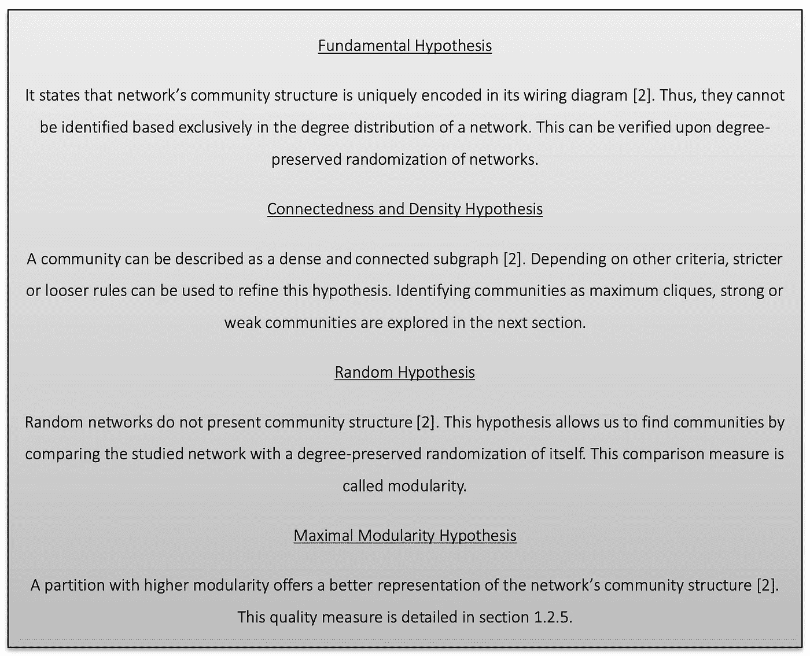

本文基于这四个假设来定义社区

基于随机网络不具有社团结构的假设，提出了局部模块性的概念[1]。它将给定网络的划分与类似的保度随机化进行比较。

考虑具有 *N* 个节点和 *L* 条链路的网络，以及具有 *nc* 个社区的网络分区，每个社区具有 *Nc* 个节点和 *Lc* 条链路:

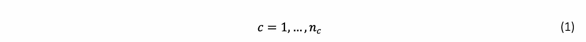

局部模块性比较子图 *Cc* 的实际网络布线和随机重布线子图之间的链路数量:

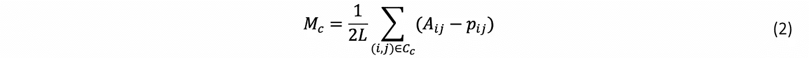

*pij* 对整个网络进行随机重新布线，保持每个节点的预期程度:

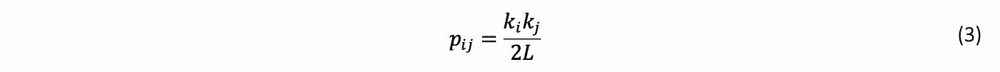

如果 *Mc* = 0，那么子图是随机连线的(因此，没有社区结构)。如果 *Mc*

操作(2)，得到一个简化公式:

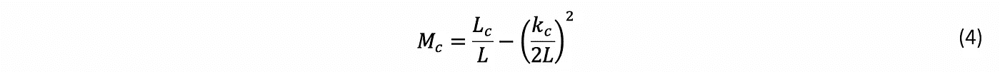

将局部模块性推广到整个网络，识别图的最佳划分。这样，网络的模块性就变成了(4)的所有社区的总和:

类似地，模块性越高，网络的划分质量越高。它可以取正值、空值或负值。每当整个网络被定义为一个团体时:

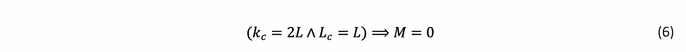

在极端的情况下，每个节点是一个单独的社区， *Lc* = 0，模块性变成负的。因此，以前的结构都不能归类为社区。

一些算法使用模块化来划分网络。

# 贪婪算法

贪婪算法在每一步最大化模块性[2]:

1.一开始，每个节点属于一个不同的社区；

2.最大程度地增加模块化的一对节点/社区成为同一个社区的一部分。模块性是针对全网计算的；

3.执行步骤 2，直到剩余一个社区；

4.选择具有较高模块性的网络分区。

在计算复杂度方面，由于模块性变化可以在常数时间内计算，所以步骤 2 需要 *O(L)* 计算。在合并社区之后，网络的邻接矩阵在最坏情况下被更新 *O(N)* 。每个合并事件重复 *N-1* 次。于是，整体复杂度为: *O((L+N)N)* 或 *O(N^2)* ，在稀疏图中。

尽管模块性在计算上是合适的，并且是一种准确的社区检测方式，但是应该强调两个缺陷:分辨率限制和模块性最大值。

## 分辨极限

首先，介绍了一种计算社区 *A* 和 *B* 合并时网络模块度变化的方法[2]:

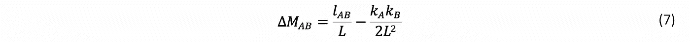

这意味着两个社区应在以下情况下加入:

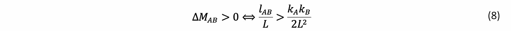

假设在社区 *A* 和 *B* 之间有一个链接:

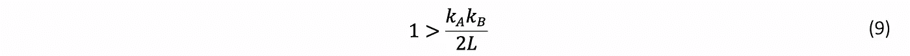

换句话说，当社区 *A* 和 *B* 仅通过一条链路连接时，如果它们的大小低于阈值，它们将被合并。变得不可能检测低于一定规模的社区。

假设，

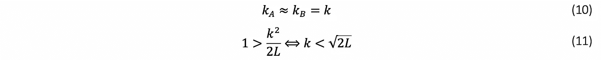

分辨率限制取决于网络的规模。克服这种限制的一种方法是将较大的社区细分为较小的社区，并对它们进行划分。

## 模块化最大值

本文开头提出的第四个假设依赖于这样一个假设，即更高的模块化意味着更好的网络划分。尽管在一些图中，显著不同的分区可能具有相似的模块性。当网络中的节点数量增加时，这成为一个相关的问题。越来越难将网络的最佳分区与质量较低的分区区分开来。在优化模块化的算法的情况下，这是一个中心问题，一旦它们迭代直到其变化低于输入阈值。

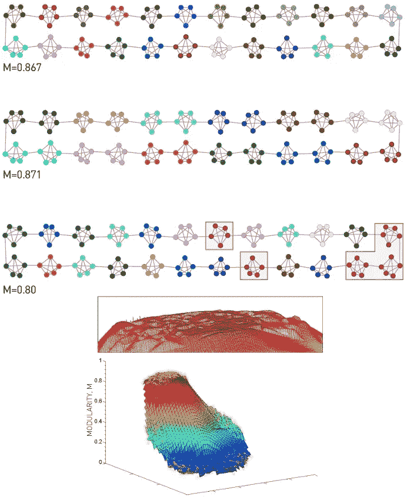

**图 1** 同一网络中显著不同的分区可以具有相似的模块性[2]

根据对图 1 中网络的分析，每个集群内的链路数量大约为:

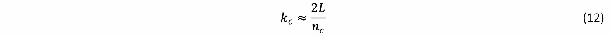

考虑 kA = kB = kC 并将(7)应用于先前的网络，根据节点数量 nc 计算模块性变化:

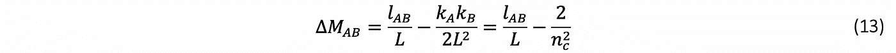

将先前网络的两个随机集群合并到同一个社区中最多会降低模块化 2/nc^2.在极限情况下，这种变化是检测不到的:

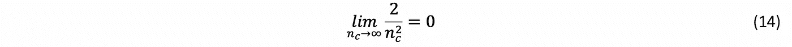

根据经验，最好的分区应该是将每个 5 节点集群分组到不同社区的分区。虽然，每当两个相邻的社区合并时，模块性增加 0.003。此外，如果将随机的 5 节点集群分配给一个社区，即使它们没有直接连接，也会导致在最佳分区检测到的模块性变化接近 0。这符合模块化图中平台的设想，这可能会扭曲图 1 中最佳分区的选择。这个平台解释了为什么大量模块化最大化算法可以快速检测高模块化分区——它们不是唯一的。

模块化优化算法是通过优化质量函数来解决的更大问题集的一部分。

# 参考

[1] A.-L. Barabási，《网络科学书》，[在线]。可用:[http://networksciencebook.com。](http://networksciencebook.com.)【2019 年 5 月 15 日获取】

[2] M. E. J .纽曼，“检测网络中社团结构的快速算法”，*物理评论 E，*69 卷 6 期，2004