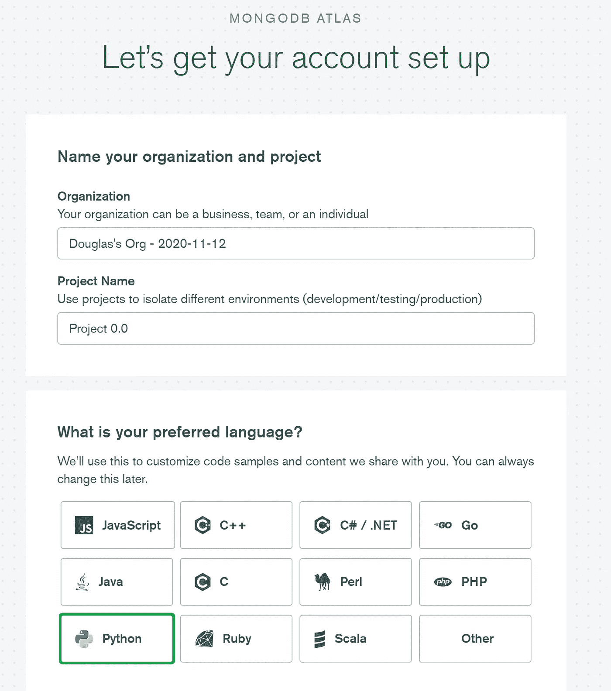
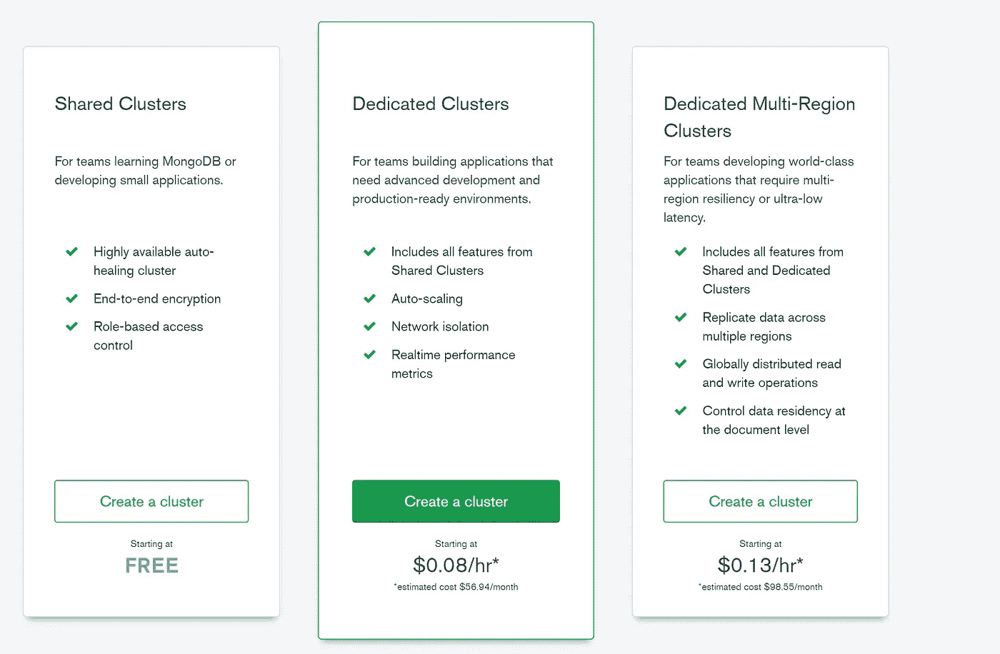
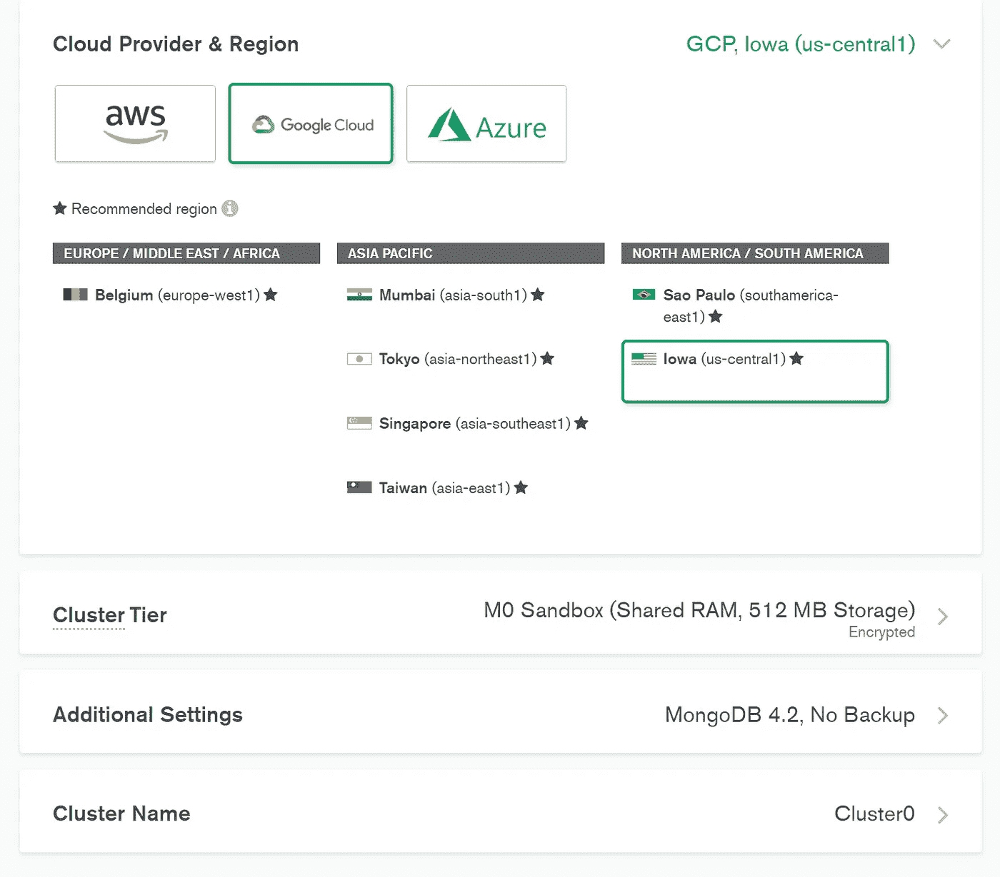
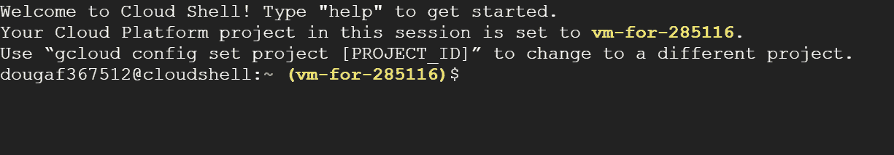
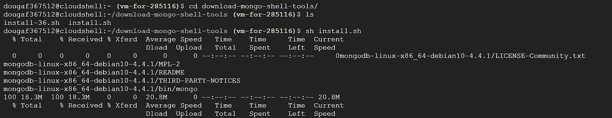
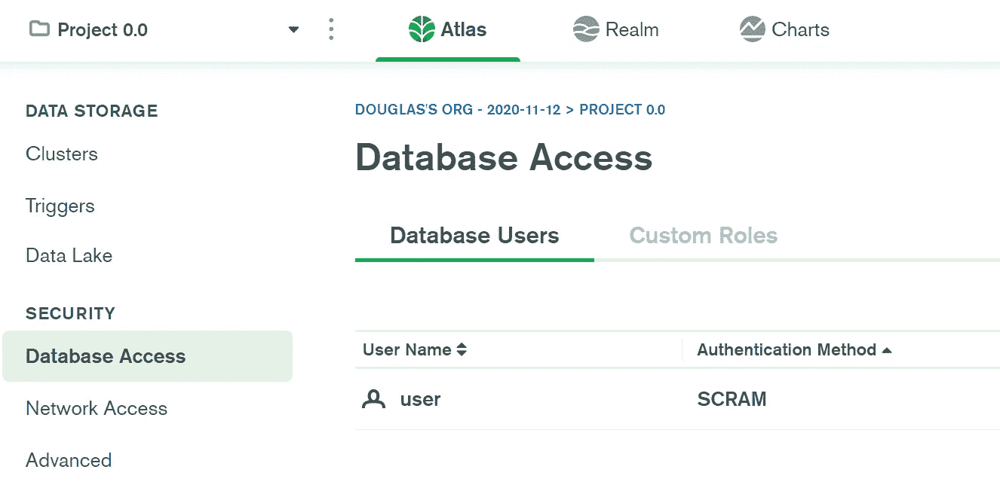
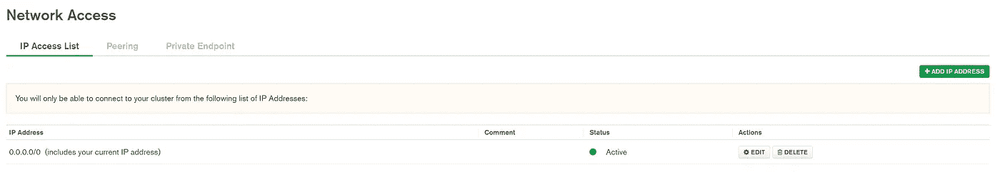
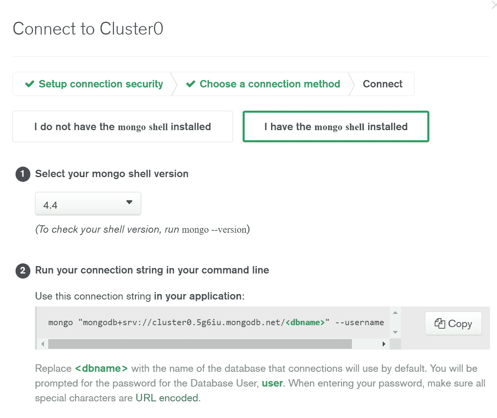
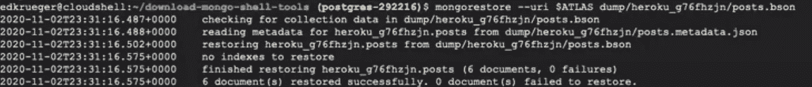
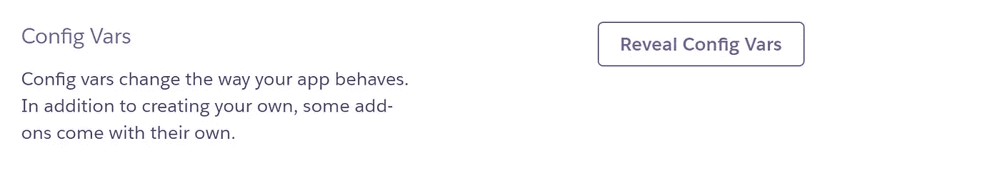

# MongoDB:从 mLab 迁移到 Atlas

> 原文：<https://towardsdatascience.com/mongodb-migrating-from-mlab-to-atlas-1070d06fddca?source=collection_archive---------44----------------------->

## 迁移您的 MongoDB 以保持 Heroku 应用程序正常工作

*由:* [*爱德华·克鲁格*](https://www.linkedin.com/in/edkrueger/) *和* [*道格拉斯·富兰克林*](https://www.linkedin.com/in/douglas-franklin-1a3a2aa3/) *。*


肯里克·米尔斯在 Unsplash 上拍摄的照片

在上一篇文章中，我们讨论了如何从 Heroku 部署中分离 mLab 数据库。我们这样做是为了给我们赢得一些时间，为我们的 MongoDB 应用程序开发一个更持久的解决方案。看看下面作品吧！希望你现在已经超脱了。如果你错过了最后期限，mongo 说你仍然可以重置密码。然而，我们没有这方面的运气，因为链接被打破了。

[](/keeping-your-mlab-mongodbs-detaching-from-heroku-173b5c97c715) [## 保持你的 mLab MongoDBs:脱离 Heroku

### 2020 年 11 月 10 日从 Heroku 分离 mLab 以保存您的数据不被删除的简要指南。

towardsdatascience.com](/keeping-your-mlab-mongodbs-detaching-from-heroku-173b5c97c715) 

MongoDB 在 2018 年收购了 mLab，并决定在 2020 年 11 月 10 日结束这项服务。这是一种让用户将数据库迁移到 MongoDB Atlas 的努力，我们将在这里讨论。

Mongo 在他们发给我们的邮件中提供了一个指南；然而，我们不会在本文中遵循它。我们这里的方法将为您提供更多的迁移选择。

我们将使用 Google Cloud shell 将一个数据库从 mLab 迁移到 Atlas。要开始使用本指南，我们需要一个免费的 GCP 帐户。使用云外壳将比在本地完成该过程更容易，但这不是必需的。

# 迁移指南

在我们开始之前，我们需要访问亚多拉斯的 MongoDB。

## 在 Mongo.com 上创建帐户以使用他们的免费服务。

[](https://www.mongodb.com/cloud/atlas/mongodb-google-cloud) [## 在谷歌云平台上运行 MongoDB 的最佳方式

### 福布斯美国首席技术官 Vadim Supitskiy:爱荷华州、俄勒冈州、N. Virginia、南卡罗来纳州、洛杉矶、Salt…

www.mongodb.com](https://www.mongodb.com/cloud/atlas/mongodb-google-cloud) 

*   创建帐户后，命名项目并选择语言首选项。



免费集群入门

*   对于这篇文章，我们将使用免费计划。



亚多拉斯集群层

*   选择您使用的云提供商和地区。无论选择什么，这都不会显示在您的项目中。您应该选择低延迟的云和区域。这些选择决定了您的 Atlas DB 将在哪里启动。



云提供商选择

*   最后，部署集群！

现在我们有一个 AtlasDB 实例可以使用了。

## **2。安装 Mongo 工具**

现在，我们将使用 Google Cloud shell 来设置一个 mongo 客户端和一些迁移所需的 mongo 工具。如果你还没有，你可能需要在他们那里建立一个免费账户。

[](https://cloud.google.com/shell) [## 云壳|谷歌云

### 从任何浏览器管理您的基础架构和开发您的应用程序。查看该产品的文档。云…

cloud.google.com](https://cloud.google.com/shell) 

我们已经编写了一个 shell 脚本来为您获取工具！请注意，这些都是针对 Debian 10 的版本。当我们需要使用 mongo shell 时，这个 shell 脚本可以很好地重用，因为它会将文件添加到一个不持久的位置。

这将在 Debian 9 和 10 上工作。如果你运行的是另一个版本的 Linux，你可以在[**Mongo 的安装说明**](https://docs.mongodb.com/manual/installation/) **中找到更多信息。**



云壳终端

*   打开终端后，使用以下命令克隆 repo。

```
git clone https://github.com/edkrueger/download-mongo-shell-tools.git
```

*   通过运行 shell 脚本安装 MongoDB 工具。

```
sh install.sh
```



这个下载获得了 mongo 客户端、`mongodump`和`mongorestore`以及其他一些我们不太关心的文件。

## **3。保存您的 mLab 连接字符串**

我们将把我们的连接字符串保存为环境变量，以使我们的生活变得更简单。

*   从 mLab 获取您的连接字符串 URI。这可能会在 Heroku 上作为你的`mongodb_uri`出现。
*   运行以下命令，确保用 MongoDB 连接字符串替换`<connection-string>`。这将保存该字符串供以后使用。

```
export MLAB=<connection-string>
```

*   通过以下方式连接到 mongo:

```
mongo $MLAB
```

*   在这里，您应该能够查看和查询您的收藏。

## **4。将用户添加到 Atlas 数据库**

现在我们需要添加一个用户到我们的亚多拉斯云数据库来连接它。

*   回到阿特拉斯。
*   单击数据库访问。



数据库访问面板

*   单击添加新数据库用户。
*   创建用户名和密码，然后单击添加用户。默认设置就可以了。

## **5。改变网络接入**

接下来，我们需要允许连接到 Atlas 数据库。

*   单击左侧的网络访问。
*   点按“添加”和“允许从任何地方访问”，这会将 0.0.0.0/0 添加为访问 IP。这使得我们的来源可以是任何 IP。



网络存取

请记住这里的安全风险，如果使用敏感数据，只添加您信任的 IP。

## 6。保存你的图集连接字符串

现在我们可以连接了，让我们从 Atlas 中获取连接字符串，并将其保存为环境变量。

*   选择左侧的群集。
*   单击`Cluster0`实例下面的连接。
*   点击“连接 Mongo Shell”，你会看到下面的屏幕。



MongoDB 连接字符串

*   复制连接字符串并插入您的`<dbname>`。
*   将 Atlas DB 连接字符串保存为环境变量。

```
export ATLAS=mongodb+srv://cluster0.5g6iu.mongodb.net/<dbname>
```

*   与`mongo $ATLAS`连接。
*   用`db.test.insertOne({"Hello": "World"})`测试。

## 7。使用 mongodump 和 mongorestore 迁移数据

现在我们可以从云 Shell 连接到两个数据库，并将连接字符串作为环境变量，我们已经为迁移做好了准备。我们将使用 shell 脚本中获得的工具来简化这个过程！

*   运行`mongodump --uri $MLAB`将旧数据库转储到一个. bson 文件中。
*   将路径复制到。以下命令的 bson 文件。
*   运行`mongorestore --uri $ATLAS dump/heroku_g76fhzjn/posts.bson`确保使用您的。bson 路径，不是我们的！您可能需要检查您的收藏名称；我们的默认是`heroku_g76fhz`。



mongorestore 向 Atlas 添加数据

## **8。验证迁移**

现在我们已经加载了新的数据库，让我们验证一下我们是否已经正确地完成了。

*   运行`mongo $ATLAS`连接到新加载的数据库。
*   在 mongo shell 中，运行`show collections`，然后运行`db.collection-name.find()`来查看您的数据，确保使用正确的集合名。同样，如果你的数据库包含大量信息，使用`findOne()`!

如果您看到您的数据，您就完成了迁移！现在让我们的应用程序运行。

## **9。重新部署 Heroku 应用程序**

我们必须添加`dnspython`到我们的应用程序正确连接的要求。这是为了适应新的 mongo srv 协议，您可以在我们的连接字符串中看到。

我们通过向 Github 提交一个具有这种依赖关系的新 Pipfile，然后运行`pipenv install dnspython`来确保它在 Pipfile.lock 中。

在您的环境包含`dnspython`之后:

*   在 Heroku 上添加 Atlas Connection URI。



显示配置变量以添加新的 URI

*   从所需的分支重新部署应用程序。

如果应用程序出现任何问题，请检查您的构建日志！这是我们被警告缺少依赖项的地方，`dnspython`。

## 包扎

这是一个将数据从 mLab 迁移到 Atlas 以保持 Heroku 应用程序运行的指南。

我们在 MongoDB 上做了一个免费的账户来使用 Atlas。然后配置了一个 google 云 shell 来运行 mongo shell 和工具。配置好外壳后，我们将旧的 URI 保存为`$MLAB`，新的 URI 保存为`$ATLAS`。完成所有这些设置后，我们可以使用`mongodump`和`mongorestore`轻松地将 mLab 数据库中的数据加载到 Atlas 数据库中。

一旦我们的数据成功转移，我们需要重新部署我们的应用程序。在我们的应用程序使用新的连接字符串运行之前，我们需要指示 Heroku 安装`dnspython`。

我们通过向 Pipfile 添加依赖项，运行 pipenv install，然后从 Heroku 上的主分支重新构建应用程序来实现这一点。

这就是我们通过将数据从 mLab 迁移到 Atlas 来保持 Heroku 应用程序运行的方式。我们的下一个指南将涵盖从 mLab 到 Azure Cosmos 的数据库迁移！

[](/mongodb-migrating-from-mlab-to-azure-cosmos-db-88c508f72d24) [## MongoDB:从 mLab 迁移到 Azure Cosmos DB

### 如何将您的 mLab 数据库迁移到 Azure Cosmos DB 以保持您的应用程序运行。

towardsdatascience.com](/mongodb-migrating-from-mlab-to-azure-cosmos-db-88c508f72d24) 

我们在这里发布了 mLab 到 Cosmos 的指南！