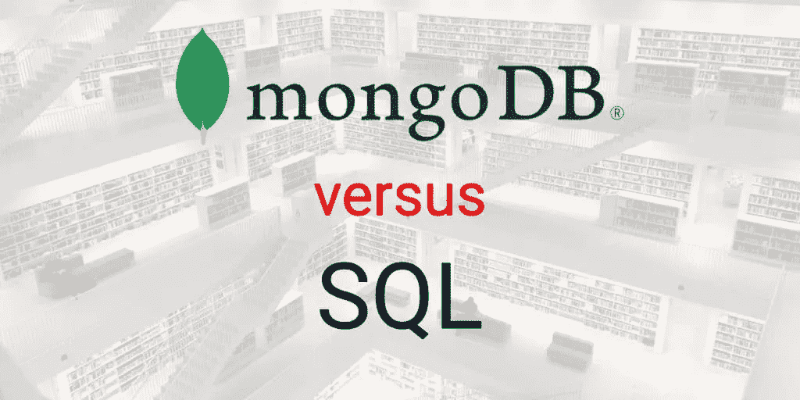
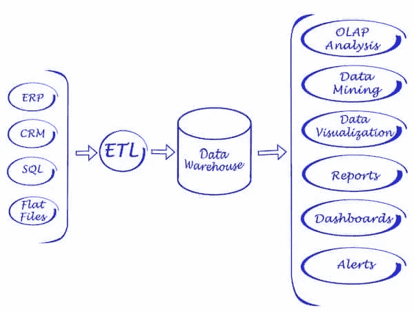
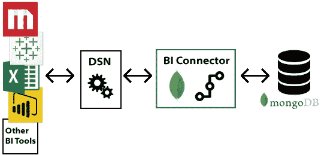
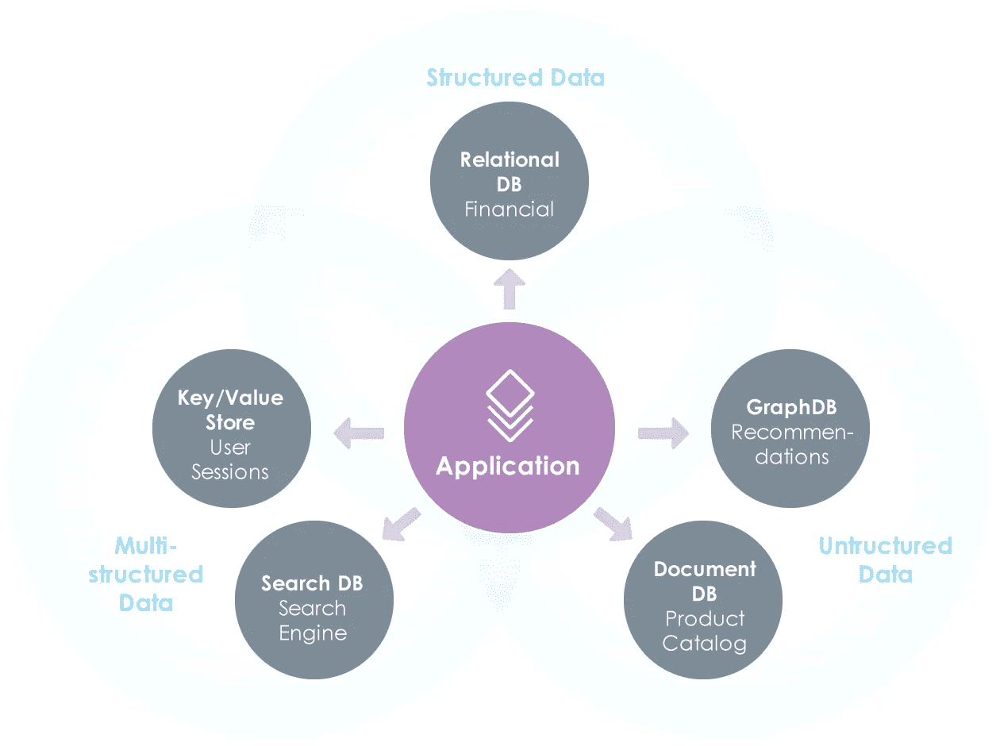

# MongoDB Vs SQL

> 原文：<https://towardsdatascience.com/mongodb-vs-sql-237535a3d51c?source=collection_archive---------79----------------------->

## 你应该选择哪个？

MongoDB vs. SQL(图片由作者提供)

MongoDB 和 SQL 数据库是后端世界中截然相反的两个方面。前者处理混乱的非结构化数据，后者处理有组织的结构化数据。两个世界都有各自的优点和缺点，适用于不同类型的用例。在本文中，我们将对 MongoDB 和 SQL 数据库(确切地说是 MySQL 数据库)进行深入的比较，并且还将触及一个重要的话题，即我们如何能够执行 MongoDB 分析，就像在 SQL 数据库上执行分析一样容易。

# MongoDB vs MySQL

正如我们所讨论的，我们将比较 MongoDB 和 MySQL，MySQL 是一个众所周知的 SQL 数据库，我们的大多数观众都能够与之相关。但它也可以是任何其他 SQL 数据库，如 Oracle、MS SQL Server、PostgreSQL 等，以便我们进行比较。

# 历史

MongoDB 属于 NoSQL 数据库家族，用于以 JSON 格式存储非结构化文档。该数据库于 2009 年首次推出，此后成为 NoSQL 空间的领先数据库之一。

MongoDB 总部(图片由作者授权)

MySQL 是一个开源的 SQL 关系数据库，用于以类似表格的格式存储结构化数据。它于 1995 年首次推出，现在由 Oracle 管理。因为它是免费的，所以它已经成为 SQL 数据库需求中非常受欢迎的选择。

# SQL vs NoSQL 的范例

SQL 数据库，也称为关系数据库，旨在存储具有结构化模式的数据。模式表示数据应该遵循的数据库的设计。在结构化模式中，数据以被称为*表*的行列格式保存，并且可以使用结构化查询语言(SQL)格式的查询来检索。

SQL 关系数据库是唯一可行的商业数据存储解决方案，直到 21 世纪初，互联网和 web 2.0 热潮开始产生大量非结构化数据。这种非结构化数据不能正确地映射到类似表的模式，因此需要不同种类的数据库来支持这种非结构化数据。

> 非结构化数据的积累是迈向大数据时代的一大步，但另一方面，由于存储的数据是非结构化的，因此无法使用 SQL 查询这些数据

这是 NoSQL 数据库开始出现的时候。这些新数据库需要支持这种不同类型的非结构化数据，并且不适合模式；像键值存储、文档、文本、图形和宽列这样的数据。例如，MongoDB 主要支持非结构化文档。

非结构化数据的积累是迈向大数据时代的一大步，但另一方面，由于存储的数据是非结构化的，因此无法使用 SQL 查询这些数据。到目前为止，SQL 一直是查询和分析的标准，并且为开发人员所熟知。我们以后会谈到这一点。

# 数据是如何存储的

在 MySQL 中，数据存储在*表*中，其中列表示属性，行表示特定的记录。这些表依次驻留在数据库中。在 MongoDB 中，数据存储在类似于 MySQL 表的*集合*中。一个集合可以由许多文档组成，文档中的数据以 JSON 格式的键值存储。MongoDB 数据库中可能有数百个这样的集合。

SQL 数据库有一个关系属性，其中不同的表通过外键、主键相互关联。例如， *EmployeeID* 列将作为 *Employee* 表的主键，在 *Payments* 表中作为*外键*出现，从而用引用属性连接两个表。这种关系确保了不存在其详细信息不在主*雇员*表中的雇员的付款条目。这就是为什么像 MySQL 这样的 SQL 数据库也被称为关系数据库的原因。

另一方面，在 MongoDB 中，我们不能在集合的非结构化数据之间建立这样的关系。因此，它被认为是非关系数据库。

像 MySQL 这样的 SQL 数据库的架构是由 ACID 属性的原则控制的。

酸代表原子性、一致性、隔离性和持久性。这些属性侧重于数据库中事务的一致性和可靠性。

MongoDB 建立在 CAP 定理的基础上，该定理关注一致性、可用性和分区。与 SQL 数据库的 ACID 属性不同，CAP 定理在 MongoDB 的情况下关注数据的可用性。

总之，SQL 数据库保证了事务的可靠性，而 MongoDB 确保了数据的高可用性。

# 可量测性

通常，MySQL 数据库或 SQL 数据库只能通过增加服务器的内存大小、磁盘空间或计算能力来进行纵向扩展。对于具有高查询量的大型数据库，垂直扩展的成本可能会很高，而且会快速增长。

> 对于 MongoDB，不是增加服务器配置来扩展，而是添加一个新的服务器

像 MongoDB 这样的 NoSQL 数据库支持水平伸缩，也称为分片。在这种情况下，不是增加服务器配置，而是添加一个新的服务器来实现可伸缩性。这种方法通常成本较低，因为一组低成本的商用硬件可以一起满足以经济高效的方式支持大量查询的要求。

# 可靠性和可用性

可靠性和可用性是衡量任何数据库系统健壮性的关键指标。大多数 SQL 数据库最初是为独立服务器设计的。为了降低失败的风险，他们的体系结构转向了分布式数据库，其中数据库在一个节点集群上运行，从而提高了弹性。即使集群中的一个节点关闭，数据库仍会在其他节点上正常运行。

像 MongoDB 这样的 NoSQL 数据库最初设计时就考虑到了弹性。它运行在一个商用硬件集群上，跨节点复制数据以实现高可靠性和可用性。与 SQL 数据库不同，可靠性和可用性是 MongoDB 架构不可或缺的特性，而不是事后才想到的。因此，与 MySQL 和其他 SQL 数据库相比，MongoDB 中的自动故障转移更快、更简单。

# (计划或理论的)纲要

与任何其他 SQL 数据库一样，MySQL 数据库有一个数据应该遵循的预定义模式。例如，在创建表时，必须定义表中的列数及其数据类型。保存在表中的任何数据都应该与表结构相匹配，否则将会出错。

> MongoDB 模式的动态特性非常有用，因为互联网应用程序和物联网设备生成的大部分数据都是非结构化的

另一方面，在 MongoDB 中，不需要预定义任何模式。集合可以毫无问题地存储不同类型的文档。没有什么可担心的，如果一个新类型的文件到达，它可以很容易地被保存。

MongoDB 模式的动态特性非常有用，因为互联网应用和物联网设备生成的大部分数据都是非结构化的，无法保存在传统的 SQL 数据库中。

此外，许多公司在知道以后如何使用数据之前会存储数据。这在存储日志数据和用户活动的移动应用中很常见。随着该公司的应用程序上市，他们收集数据没有最终目标。

> 很多公司会先存储数据，然后才知道以后会怎么用。这是因为大数据的好处必须通过自下而上的方法发现，而不是自上而下的方法。

稍后，他们可能会发现这些数据为他们提供了关于需要添加哪些功能的有价值的信息。对于非结构化数据库，更容易进行这种无计划的数据收集，因为不需要提前定义模式。

# 查询和分析

MySQL 数据库可以借助结构化查询语言或 SQL 进行查询。事实上，MySQL 遵循 ANSI SQL 标准，这是几乎所有关系数据库都采用的通用 SQL 标准，如 Oracle、PostgreSQL、Sybase 等。

SQL 查询对开发人员来说是友好的，并且是成熟的。SQL 还可以用于对数据执行高级分析功能，如过滤、连接、合并和聚合。这使得 SQL 成为执行高级分析的强大选项。

MongoDB 不像 MySQL 那样支持传统的 SQL 查询。然而，MongoDB 确实支持文档查询，但是这个特性还不完善，而且很有限——尤其是与 SQL 相比。一个例子是 MongoDB 查询不支持连接，而连接是从多个数据源获取信息的关键操作。

所以 MongoDB 对于存储非结构化数据是有用的，但是它没有提供一个成熟的查询语言来执行高级分析。这听起来像是许多商业用例的交易破坏者，但幸运的是，有一些选择。

# 我需要对 MongoDB 数据进行分析:我有哪些选择？

在 MongoDB 中存储大量非结构化文档数据的便利性是许多用例的一个重要因素。这就是为什么业界没有因为 MongoDB 有限的查询支持而忽视它，而是发展出多种解决方案来支持 MongoDB 上的高级分析。这里有几个不错的选择。

# 选项 1:将 MongoDB 数据导入 SQL 数据仓库

如果我们不能在 MongoDB 上执行分析，我们可以将数据加载到 SQL 数据仓库中，然后在那里运行熟悉的 SQL 查询进行分析。为此，我们可以[编写一个定制的批处理 ETL 过程](/python-etl-vs-etl-tools-9709171c9e58)或者使用 Panoply 或 Xplenty 之类的工具。

ETL 到数据仓库管道的图表(图片由作者授权)

这是一个强大的方法，对许多公司都很有效，但是它也有一些限制。尽管它服务于这个目的，但它带来了构建和维护数据仓库的额外开销，更不用说与 ETL 或 ELT 过程相关的成本了。

如果您的一些 MongoDB 数据不适合 SQL 模式，该怎么办？在许多情况下，这些数据会被丢弃(图片由作者提供)

对于大企业来说，数据仓库可能是一个好的解决方案，但是对于小公司或年轻的初创公司来说，您可能不喜欢投资数据仓库。即使数据仓库非常适合您公司的大部分数据，但您的一些数据有更严格的处理要求或受限制性法规的约束，因此可能有必要将其排除在数据仓库之外。另一个可能出现问题的地方是，如果您需要对外部数据集进行快速实验性分析，而您不能或不想将这些数据集移入您的数据仓库。

**要点:**数据仓库是一个很好的选择，但是会带来一些费用和限制。它们还会通过强制将数据分配到关系模式中来消除使用 NoSQL 数据库的好处。

# 选项 2: MongoDB BI 连接器

MongoDB 意识到，他们也必须为 MongoDB 分析提供一些选项。所以他们开发了 MongoDB BI 连接器，可以与流行的商业智能工具一起使用，比如 Tableau、Cognos、Qlik 等等。这个连接器充当 BI 工具和 MongoDB 之间的中间接口，它将 SQL 查询转换为 MongoDB 查询，并在将结果传递给 BI 工具时将其转换回 SQL 格式。

与我们讨论的列表中的其他选项相比，MongoDB BI 连接器确实使工作变得简单。使用 MongoDB BI 连接器节省了构建数据仓库或(我们将讨论)为 MongoDB 分析编写定制 Python 应用程序的开销。

使用 MongoDB BI 连接器连接传统商业智能工具的示意图(来源:mongodb.com)

这里仍然存在一个缺点，如果您想在 MongoDB 数据和 MySQL 数据或任何其他 SQL 数据之间进行连接，该怎么办。一种选择是将 MongoDB 数据导入 MySQL 数据库，然后在那里执行分析。但是这本质上将我们带回到我们已经在上面讨论过的数据仓库选项和开销。

**要点:**如果您想将您现有的 BI 工具与 MongoDB 连接起来，MongoDB BI connector 是一个不错的选择，但是它有一个缺点，即您不能连接来自多个异构数据源的数据。

# 选项 3:数据虚拟化

数据虚拟化是一个过程，在这个过程中，应用程序可以从多个来源访问数据，并通过抽象底层技术将其呈现给前端用户。这意味着用户将从多个来源获得一致的数据视图和无缝体验。

第三代商业智能平台之一 Knowi 在数据虚拟化上下了大赌注。他们的商业智能平台构建于数据虚拟化之上，用于本地连接到 NoSQL 数据源并构建可视化和仪表板。这使得它成为 MongoDB 分析的一个强大选项。这样做的好处是，用户可以获得在 MongoDB 数据上运行 SQL 查询的简化体验，就像他们在处理 SQL 数据库一样。

数据虚拟化平台如何与包括 MongoDB 在内的各种数据源直接连接的示意图(来源:knowi.com/why-knowi)

此外，它还可以无缝地连接来自多个异构数据源的数据。这意味着，如果我们想将 MongoDB 数据与 MySQL 数据连接起来，只需提供两个数据源和连接字段即可。另一个值得注意的特性是，MongoDB 查询可以在 Knowi 内部运行，也可以用它们的可视化查询构建器构建。它还具有整合基于搜索的分析的优势，这是一种新的数据分析方法，一些 BI 工具正在大力投资。

[Denodo](https://www.denodo.com/en/data-virtualization/overview) 是另一家在数据虚拟化上下大赌注的公司。虽然他们的平台纯粹是为了数据集成，没有 Knowi 提供的分析层。因此，如果你决定使用 Denodo，你仍然需要在此基础上添加一个分析平台。

**要点:**与列表中的其他选项相比，如果您正在寻找在 MongoDB 数据上执行高级分析的轻量级无缝体验，那么数据虚拟化是最佳选择。如果您有多个数据源，并且需要跨数据库连接，或者如果您只需要在扩展时维护一个灵活的数据基础设施，那么这是一个很好的选择。

# 选项 4:使用 Python 和 PyMongo 进行定制编码

另一种选择是构建一个定制的 Python 应用程序来连接到 MongoDB，从中获取数据并对其进行分析。PyMango 是 Python 的 MongoDB 驱动程序，可以实现这一点。事实上，使用 PyMongo 我们不仅可以获取 MongoDB 数据，还可以将数据写回 MongoDB。

与数据仓库相比，这可能是一个不错的选择，并且在探索性数据分析方面表现出色，但不一定总是适合商业应用程序。

**要点:**除非您特别需要一个轻量级的定制解决方案，并且可以轻松地用于探索性数据分析，否则您可能仍然希望考虑数据仓库或 BI 解决方案。

# 备选方案 5:翻译

最后一个选项是将 SQL 查询转换成 MongoDB 查询。这与 MongoDB 连接器非常相似，但它是作为第三方实现来完成的。Dremio 的团队做了很好的工作，构建了一个翻译引擎，试图解决这个问题。翻译系统让你写出 SQL 查询，解释它们，并把它们重新格式化成 NoSQL 查询。对于一些简单的用例来说，这是一个很好的选择，但是对于需要跨数据库连接的更复杂的应用程序来说，可能会遇到问题。它还会引入延迟，这会给高通量分析带来问题。然而，如果您的用例相当简单，并且您没有预见到它在未来会变得更加复杂，那么翻译可能是一个很好的选择。

**要点:**如果您需要在单个数据库源上处理简单的分析查询，这个选项很好。

# 结论

在这篇文章中，我们介绍了 MongoDB 与 SQL 数据库之间的全面比较，并看到了对 MongoDB 数据执行分析的各种选项。下面让我们总结一下我们的讨论。

*   SQL 数据库用于存储结构化数据，而像 MongoDB 这样的 NoSQL 数据库用于保存非结构化数据。
*   MongoDB 用于以 JSON 格式保存非结构化数据。
*   MongoDB 不支持 SQL 数据库支持的高级分析和连接。
*   有许多很好的解决方案可以支持 MongoDB 分析，包括:数据虚拟化、翻译、MongoDB 连接器和带有 ETL 或 ELT 过程的数据仓库。