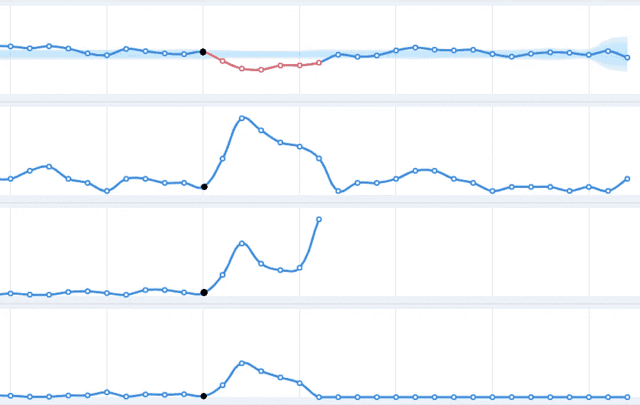

# 监控你的依赖！不要再做一个盲目的数据科学家。

> 原文：<https://towardsdatascience.com/monitor-your-dependencies-stop-being-a-blind-data-scientist-a3150bd64594?source=collection_archive---------31----------------------->

多米诺骨牌作为依赖关系的类比。

## 监控模型依赖关系的原因。

在我以前的文章《[班长！停止做一个盲目的数据科学家](/monitor-stop-being-a-blind-data-scientist-ac915286075f)，我提到了许多用例以及在我们的领域监控&警报的巨大重要性，特别是从数据科学研究者的角度。我查看了用例，并回顾了几家为这个巨大但奇怪的**未讨论的**问题提供不同解决方案的公司，即缺乏模型监控，这是 atm 超出我们行业的一个问题。

**更新:这篇文章现在已经作为第 49 篇文章发表在** [**奥赖利的书《每个云工程师都应该知道的 97 件事》**](https://www.oreilly.com/library/view/97-things-every/9781492076728/)

# 用例

在最初的文章中，我列出了数据监控和警报的几个用例，我确信还有其他用例，但是这些用例对数据科学家的影响最大。名单是按时间顺序写的。在本文中，我们将研究包的依赖版本，并探索几个可能直接影响您的客户端的事件。

1.  注释者表现
2.  注释分布
3.  数据完整性，即模式和测试驱动的数据分析。
4.  数据分布，即概念漂移
5.  **依赖版本，即你的包导入。**
6.  型号版本
7.  模型参数
8.  模型度量
9.  业务产品指标
10.  模拟软件和硬件性能

# 包依赖关系

算法依赖于不同的包，每个包在其生命周期中都有多个版本。以下是依赖关系破坏您的模型或部署的几种情况，当这种情况发生时，您会希望有某种机制来监控您的依赖关系。除了可以通知您问题发生的时间、内容和位置的警报之外。

1.  有时，您会有" *requirements.txt"* 环境之间的差异，例如，当涉及科学包时，您的研究环境总是最新的，更不用说您最近升级了 scikit-learn。但是，您的部署锁定了一个特定的版本。一旦新的代码或序列化的模型被上传到临时或生产环境，当反序列化使用旧的包版本序列化的模型时，诸如 pickle 或 joblib 之类的包将会中断。
2.  您可能正在使用一个将表情符号转换为文本的软件包，即，😃->快乐。你的 NLP 算法依赖于表情符号到文本的某种映射，并且是用特定的包版本来测量的。昨天发布了增加表情符号的新版本，现在它已经改变了许多表情符号到单词的映射。对于您的模型，这是一个关键的变化，可能会导致模型打破预期的分类，或者只是影响预测概率。
3.  团队之外的某个人调整了一个包，这是他们的责任，它可能发生在上游或下游，最终会改变或破坏模型的预期功能。如果它中断了，就要找出异常来自哪里，我们都知道当这种情况发生时，这是非常耗时的，尤其是当它在您的代码库之外时。另一方面，如果它一直在滴答作响，那么你不会意识到有问题，直到客户投诉。
4.  您的管道中最近引入了一个部署流程，但由于某种原因，它中断了，退回到几个月前已被否决的前一个流程，但仍然指向旧代码、旧依赖项和旧序列化模型。您的客户将获得基于陈旧数据的预测。新客户的数据在这些旧模型中是不存在的，你将面临一场小灾难。

在所有这些情况下，通过缩短检测时间、响应时间和解决时间，监控每个环境中的依赖关系将为您节省昂贵的工时，最重要的是，它将缩短您的客户受到这些事件严重影响的时间。

图 1:黑点代表一个依赖项或模型版本检查点，这个图是由 superwise.ai 在一个实际视图的顶部组成的。

我想象一个仪表板，在其中很容易识别这种事件。图 1 是一个建议图，其中模型版本在一个时间线上被跟踪，想象每一条从上到下的曲线，分别在训练、测试、试运行和生产环境中监控某种模型活动。

> *“如果您不能跟踪您的依赖版本，您就不能相信您的研究、模型性能或部署将是确定的”*

## 结论

为了保持确定性行为，我们必须记录每个环境中的所有依赖版本，如图 1 所示。当环境之间的依赖关系不匹配时，我们需要启用警报。

请记住，单元测试可能会通过，除非您密切监视您的模型性能，与您的客户交谈，或者某些东西完全崩溃，否则您不会发现这些类型的问题。

依赖-版本-历史应该映射到您的预测中，这样您就可以找出哪里出错了，什么时候出错了，哪里出错了，并快速轻松地处理它。

我要感谢谢伊·亚诺夫斯基的富有成效的谈话引发了这个问题。

Ori Cohen 博士拥有计算机科学博士学位，主要研究机器学习。他是 TLV 新遗迹公司的首席数据科学家，从事 AIOps 领域的机器和深度学习研究。