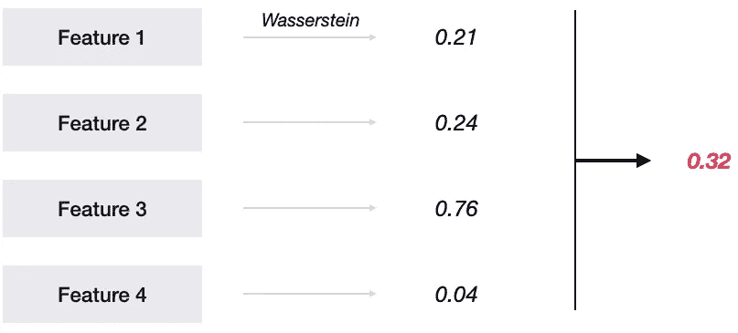
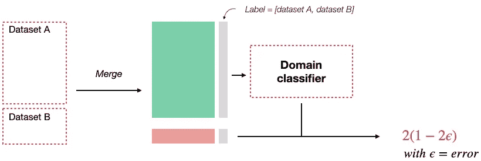
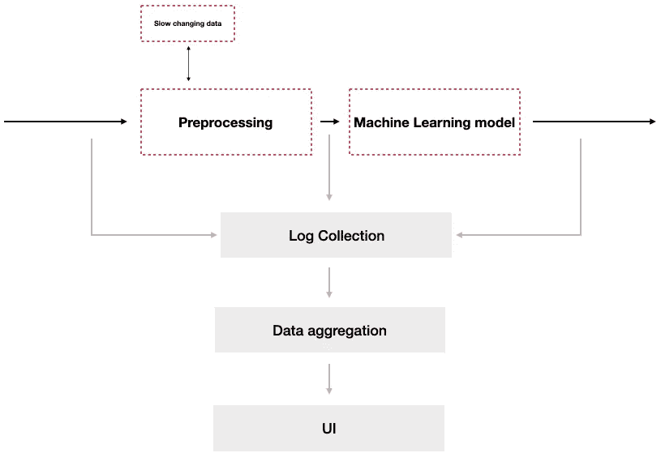

# 监控机器学习模型

> 原文：<https://towardsdatascience.com/monitoring-machine-learning-models-62d5833c7ecc?source=collection_archive---------19----------------------->

肖恩·奥尔登多夫在 [Unsplash](https://unsplash.com/s/photos/magnifying-glass?utm_source=unsplash&utm_medium=referral&utm_content=creditCopyText) 上拍摄的照片

机器学习模型概念漂移量化指南

机器学习模型越来越成为产品或产品功能的核心。因此，数据科学团队现在负责确保他们的模型在产品 3 年多的生命周期内按预期运行。

需要实时监控模型的性能，以检测任何会影响最终用户体验的性能问题。如果没有它，只有当问题已经开始影响底线或者用户开始抱怨时，问题才会被报告。

在本指南中，我们将阐述推动有效监控策略的关键原则:

*   为什么您不能使用准确性指标来跟踪绩效
*   机器学习模型的故障模式
*   使用统计模型或领域分类器量化模型漂移

# 准确性度量不能用于监控模型

监控机器学习模型的黄金标准是实时跟踪准确性。然而，在大多数情况下，这是不可能的，因为:

*   模型干预
*   预测和实际标签之间的等待时间长
*   人类标签的需求

> 对于大多数机器学习模型，准确性度量不能实时计算

## 模型干预

当模型做出预测时，通常会采取行动。例如，如果您预测客户流失，您会采取措施留住您认为可能流失的客户。几个月后，当你衡量“地面真相”标签时，如果一个客户没有翻盘，你不知道这是因为预测错了还是因为你采取了行动。

这可以通过运行模型但不根据预测采取行动的一小部分数据来缓解。虽然这将允许您计算准确性指标，但这是以降低用户体验或损失收入为代价的，并且在某些情况下是不可能的(例如在检测信用卡欺诈时)。

## 预测和现实之间的延迟

在一些应用中，在做出预测和地面实况标签可用之间存在延迟。例如，信用卡欺诈案件可以在交易完成后 90 天内上报。因此，在做出预测和获得实际情况之间有 3 个月的延迟。

如果准确性是用于跟踪模型性能的唯一指标，那么直到问题开始出现 3 个月后才能被发现。

## 人类标记

对于计算机视觉应用或自然语言处理模型，除非手动标记样本，否则基本事实标签通常不可用。

正如我们所见，实时测量准确性指标通常是不可能的。因此，我们需要一套不同的指标来跟踪机器学习模型的性能。

# 模型的故障模式

在我们开始定义一个监控系统之前，考虑一下模型性能随时间而降低的主要方式是很重要的。为了保持这篇文章的重点，我们将不考虑可以通过现有的监控解决方案跟踪的问题(内存、延迟等)。

> 生产几年后，所有型号都会损坏

潜在的故障模式可以分为两类:

*   **突发数据变化:**模型依赖于复杂的数据管道，其中一个管道内的微小变化都会导致模型性能的大幅下降。
*   **概念漂移:**建模数据的底层分布已经改变

通过区分这两种故障模式，我们可以定义一组需要跟踪的指标。

## 重大数据变更

重大数据变更通常会影响单个变量，并导致其分布发生巨大变化。因此，可以使用单变量指标来检测它们，例如:

*   缺少值的百分比
*   分类数
*   统计分布—最小值、最大值、平均值、分位数等
*   词汇表外单词的百分比

虽然这些单变量指标有些粗糙，但它们可以检测出数据收集过程中可能出现的大多数问题。

增强这种监控策略的有效方法是定义需要更密切监控的关键部分。通过定义关键部分并跟踪这些部分的指标，您可以发现仅影响客户子集的问题，这些问题可能会被您所跟踪的全局指标的噪音所淹没。例如，Slack 为其 10 个最大的客户定义了监控片，因为性能问题会首先影响这些客户[1]。

## 行为变化

行为变化可能更难检测，尤其是当地面真相标签不可用时。有两组指标可用于跟踪:

*   预测标签的百分比
*   概念漂移

预测标签分布的快速变化通常表明存在问题。如果被检测为欺诈的交易的基准比率是 2%，那么被标记为欺诈的交易的比率突然上升到 10%就需要进行更深入的调查。

虽然概念漂移经常被提及，但很少有资源详细说明如何量化它。

# 量化概念漂移

概念漂移度量的最终目标是检测多元分布的变化，并量化今天的输入与昨天的输入相比有何不同。

量化概念漂移不是一件容易的事情，仍然是一个非常开放的研究问题。现有技术可以分为两种主要方法:

*   基于距离的度量
*   领域分类器

基于距离的指标往往更易于近实时计算，因为它们不太耗费资源。另一方面，领域分类器需要更多的资源，因此更适合每天或每周测量概念漂移。

## 基于距离的度量

概念漂移可以从分布的角度来考虑，更具体地说，就是两个不同的分布有多么不同。

一个常用的度量标准是**瓦瑟斯坦度量标准**，也称为运土车距离或锦葵距离。虽然对于单变量分布计算起来非常有效[2]，但是对于多变量分布需要计算近似距离[3]。

在流式环境中，计算累积分布函数可能很棘手。您可以使用的最有效的算法之一是 T-Digest，它允许您计算数据流的分位数，而无需预先定义数据应该如何存储。

基于您可用的资源，您可以通过以下任一方式量化概念漂移:

*   计算每个变量的 Wasserstein 度量并汇总它们。
*   通过将输入变量视为来自单个多元分布来计算单个 Wasserstein 度量。

**聚合单变量 Wasserstein 度量:** 这是计算效率最高的方法，但代价是遗漏了变量间相关性的变化。

聚合单变量 Wasserstein 度量

虽然这种方法很容易实现，但也不是没有问题。主要的一个是关于如何聚集单变量指标。你取简单平均数还是用加权平均数？如果使用加权平均值，那么如何确定最佳权重？

虽然这些问题的答案将取决于您的用例，但在使用加权平均方法时，一个好的起点是使用特性重要性分数作为起点。

**多元 Wasserstein 度量:** 计算一个精确的多元 Wasserstein 度量是非常耗费资源的。然而，最近的进展使得近似的计算更加有效。参见[2]了解更多信息。

## 领域分类器

领域分类器是量化概念漂移的最流行的方法。从概念上讲，这种方法非常简单，如果可以训练一个分类器来准确区分两个数据集，那么概念漂移将会很高。

使用领域分类器量化概念漂移

更正式的说法是:

*   首先定义两个数据集，例如包含今天输入要素的数据集 A 和包含昨天数据的数据集 B
*   组合两个数据集，并创建一个列来标识一行属于哪个数据集
*   将数据集分为训练数据集和测试数据集
*   在定型数据集上定型一个分类器，该分类器将尝试区分一行属于哪个数据集
*   计算该模型在测试数据集上的误差，并使用公式:`concept drift = 2 * (1 — 2 * error)`

虽然这种方法允许您检测变量之间相关性的变化，但它也有一些缺点:

*   选择正确的域分类器取决于用例(梯度提升树、支持向量机、双向 LSTM 等)
*   计算成本高
*   用模型监控模型

# 高水平要求

一旦定义了需要跟踪的指标，我们就可以开始设计您的监控解决方案。第一步是定义和量化需求是什么。考虑以下几点是一个好的开始:

*   **延迟:**问题发生之间的延迟是多少？
*   **持续评估:**你会定期标记预测来计算准确性指标吗？
*   **概念漂移:**您将如何计算概念漂移？
*   **日志:**为了调试问题，您将如何访问日志？

监控解决方案的高级概述

一旦这些要求到位，您就可以开始构建您的监控系统了。

# 结论

在部署机器学习模型之前，定义一个监控策略非常重要。第一步是简单地跟踪输入和输出变量的分布，这可以用现有的软件监控框架来完成。

然而，有些情况下这是不够的或不可能的，CV 和 NLP 模型就是一个很好的例子。对于这些情况，领域分类器可以用来量化概念漂移。

**参考文献:**

[1] [仪器，机器学习模型的可观测性&监控](https://www.infoq.com/presentations/instrumentation-observability-monitoring-ml/)

[2] [切片 Wasserstein 自动编码器:一个令人尴尬的简单生成模型](https://arxiv.org/pdf/1804.01947.pdf)

[3] [广义切片 Wasserstein 距离](https://papers.nips.cc/paper/8319-generalized-sliced-wasserstein-distances.pdf)

*原载于 2020 年 5 月 27 日*[*www . sta kion . io*](https://stakion.io/blog)*。*