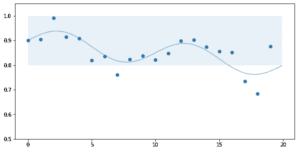
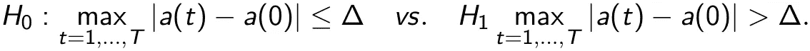
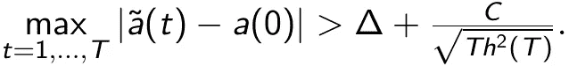

# 监控生产中的 ML 模型

> 原文：<https://towardsdatascience.com/monitoring-ml-models-in-production-768b6a74ee51?source=collection_archive---------31----------------------->

在 [Unsplash](https://unsplash.com?utm_source=medium&utm_medium=referral) 上由 [Carlos Muza](https://unsplash.com/@kmuza?utm_source=medium&utm_medium=referral) 拍摄的照片

传说在 2010 年代早期，数据科学家在他们的 Jupyter 笔记本上掌握熊猫和 Scikit-Learn 就足以在这一领域出类拔萃。如今，人们的期望越来越高，数据科学家通常需要在整个机器学习生命周期中导航。这包括监控生产中的 ML 模型。关于可以用来检查模型健康状况的不同度量标准，已经说了很多，也写了很多。然而，一个基本问题经常被搁置，即*何时干预*。

过晚修改故障模型会对业务产生灾难性的影响。然而，过早修改它会导致不必要的成本(时间和金钱)和过度拟合。为了在早期和晚期干预之间取得平衡，对于数据科学家来说，拥有一个关于何时介入的合理策略至关重要。

在本帖中，我们将基于时间序列分析的最新研究，探讨如何检测模型性能的实质性变化。

*注:所提出的方法受到“回顾性”变更点分析的启发(见[1])。这意味着，我们试图检测历史数据集中的变化(在这种情况下是模型的性能)。如果这种方法用于“在线”监控，可能会导致多次测试，因此需要进行相应的调整。对于在线监测，基于在线变化点检测的方法更适合。*

模型质量的下降可能有多种原因。例如，我们可能在新数据进来时更新它，但是进来的数据可能有偏差。或者我们不更新模型，但是底层数据生成过程的分布发生了变化。无论模型恶化的原因是什么，我们都希望检测到它并及时做出反应。

为了简单起见，让我们考虑一个分类器，并以准确度来衡量它的性能。我们可以训练模型，并在维持数据集上达到 90%的准确率。当将模型部署到生产中时，我们可以定义一个硬阈值，比如 80%，并在模型的准确性低于该阈值时做出反应。尽管这看起来是一种方便简单的方法，但它有一些根本性的缺点。

首先，我们不观察模型的真实(或*样本外*)精度，而是观察*样本内*精度。这两个概念之间的区别至关重要。样本外精度是模型对总体的(未知)精度。根据输入的数据，我们观察到的是样本内的准确性。样本内精度可以解释为样本外精度加上一些附加噪声。当样本内准确度超过 80%阈值时立即做出反应可能是反应过度。

第二，不清楚哪些数据用于精度评估。我们是基于所有未用于训练的数据来衡量模型的性能，还是应该只使用传入的数据？如果我们只使用输入的数据，我们应该回溯多远？我们应该使用昨天的数据还是考虑更长的时间框架？
我们使用的数据越多，我们发现模型性能变化的时间就越晚。我们使用的数据越少，精确度的方差就越高。特别是，硬阈值对异常值很敏感。

假设我们基于每天传入的数据来度量模型的准确性(如图 1 所示)。80%的硬阈值表明 7 天后已经进行了干预，这似乎是一种过度反应，因为真实(但未知)的准确性仍然高于阈值。

图 1:样本外准确度(线)和测量准确度(点)，x 轴:以天为单位的时间，y 轴:以百分比表示的准确度

为了避免偏差和方差之间的权衡以及关于异常值的稳健性问题，采用另一种观点可能是有用的。

比方说，我们希望从第 *t=1* 天开始，在 *T* 天内每天监控分类器的性能。更具体地说，设 *A(t)* 表示分类器对第 *t* 天的数据的样本内准确度。因此，我们有一个样本内精度的时间序列 *A(1)，…，A(T)* 。然后，我们可以将样本内精度分为确定性部分(样本外精度) *a* 和均值为 0 的随机部分 *ε* ，这是由于数据噪声而引入的。特别的，我们有 *A(t)= a(t) + ε(t)* 与 E[*ε(T)**= 0*，对于 *t=1，…，T* 。注意，随机误差 *ε* 可能是相关的。在这种情况下，我们希望确定与基于来自训练的维持数据集的精度相比，样本外精度的偏差是否很大。换句话说，我们想要检验这些假设

这里 *a(0)* 表示部署前的模型精度，δ是指定偏差是否相关的阈值。

图 2:测量的准确度(点)，准确度的平滑估计值(深蓝色)，样本外准确度(浅蓝色)，x 轴:以天为单位的时间，y 轴:以百分比为单位的准确度

在我们的示例中， *a(0) =* 90%，我们可能希望允许 10%的偏差，因此δ= 10%。由于 *a(t)* 未知，为了检验上述假设，我们必须对其进行估计(见图 2)。

有各种方法来估计 *a* ，如分位数回归或局部多项式估计。设*表示带宽为 *h(T)* 的 *a* 的局部线性估计量(见[2])，那么，无论何时我们都可以拒绝零假设*

渐进地，随着 *T* 增长到无穷大，检测到实际变化的概率收敛到 1，错误检测到变化的概率消失。换句话说，我们低概率“过早”介入，大概率在必要时介入。

*请注意，上述测试程序可以细化为定义渐近一致水平α测试(意味着非平凡收敛)。然而，在这种情况下，我们将需要估计某些参数并调整超参数，这在应用中是不实际的。*

如果零假设被拒绝，我们可以继续下去，估计模型的精度偏离初始精度 90%超过 10%的时间。这可能有助于获得关于为什么模型质量改变的额外见解。一个直接的估计是最早的时间 *s* 使得|*s*-90% |>10%。在图 2 的例子中，估计时间为 *s* =17，接近模型精度下降到 80%以下时的真实时间 *t* =16。

对于 Python 中监控过程的实现，可以使用 statsmodels 中的内核回归(参见下面的代码)。请注意，样本内精度将来自应用中的外部来源，仅用于展示该方法。第二个代码片段创建了一个类似于图 2 的图(没有未知的样本外精度)。

## 结论

监控生产中的 ML 模型可能不像从头开始训练新模型那样令人满意，但检测故障过程并确保高质量是非常重要的。

找到正确的行动时机对于防止不必要的成本、模型过度拟合和错误预测带来的灾难性后果至关重要。估计样本外精度可以通过局部线性估计来完成。用 Python 可以很容易地实现一个假设测试来检查相对于初始精度的相关偏差。

随着 ML 生命周期自动化的发展，我们需要确保在这个过程中包括监控部署的模型，以便将 ML 管道的质量提升到下一个水平。

[1] A. Bücher，H. Dette 和 F. Heinrichs，渐变均值中的偏差是否相关？基于超范数估计量的测试方法(2020)，arXiv 预印本 arXiv:2002.06143。

[2] H. Dette 和 W. Wu，检测非平稳过程均值的相关变化——一种质量过剩方法(2019)，统计年鉴，47(6)，3578–3608。