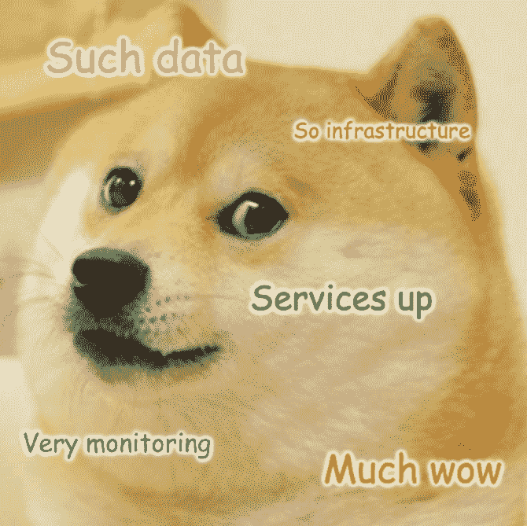

# 监控 ML 管道

> 原文：<https://towardsdatascience.com/monitoring-ml-pipelines-f1b9aba8a045?source=collection_archive---------24----------------------->

我在这个博客里讲了很多把机器学习代码带入生产的过程。然而，一旦模型投入生产，你还没有完成，你只是刚刚开始。该模型将不得不面对其最大的敌人:**现实世界！**

图片来源:[蒂姆·斯密特](https://www.behance.net/gallery/33584759/Robot-in-the-desert)

这篇文章关注的是，为了了解你的模型在现实世界中的表现，你可以实施什么样的监控。这既考虑了连续训练，也考虑了已训练模型的使用。它调查了:

*   监控您的基础设施
*   监控数据
*   监控培训
*   监控现实世界中的价值

# 监控您的基础设施

构建任何系统的工程师通常都会进行一些监控，以确保服务正常运行，基础设施未满负荷。这种监控对您的机器学习组件也很有用，因为它可以帮助您发现:

*   输入数据的频率和数量的变化。
*   我们的数据或处理可能依赖的第三方系统的变化和故障。
*   随着需求的增长，需要升级基础设施。
*   随着数据消耗的增加，需要优化/分发机器学习组件的代码。
*   当达到某些限制时，需要重新评估您选择的解决方案。

其中一些情况也可能对您的模型有某些不太明显的影响。例如，正在接收的数据的数量/频率的增加/减少可能表明现实世界中发生了一些事件(风暴、地震)，这可能反过来扭曲您的模型的结果。它也可能是安全漏洞之类的副作用，例如企图进行 DDoS 攻击，这反过来可能会对您的模型结果产生负面影响(例如，在推荐系统中)。

此类监控的一些流行工具包括但不限于:

*   [Datadog](https://www.datadoghq.com/) (这是我们倾向于使用的)
*   [新遗迹](https://newrelic.com/)
*   [天平架](https://www.librato.com/)
*   [Dynatrace](https://www.dynatrace.com/)

图像生成使用: [imgflip](https://imgflip.com/memegenerator/Doge)

# 监控数据

现实世界在变，你的数据也会变。由于这是训练和使用模型的最重要的组成部分，我们需要有一些东西来理解数据何时漂移，以便对其采取行动。

这可以通过跟踪数据的一些统计数据(中值、方差、标准差等)来实现。您可以为用于训练模型的数据计算这些值，并在每次新的训练运行时跟踪这些值。然后，您也可以以一定的频率对模型中用于推理的一批最新数据进行同样的操作。这两个图表将帮助您理解:

*   输入的训练数据是否随时间而改变，以及改变了多少。
*   数据更改的频率，以及您是否需要更频繁地训练模型。
*   选择用于训练的数据是否与用于推理的数据不同。这可能是训练不够频繁的症状，但它也可能是由训练数据的选择过程引起的，这可能是有偏见的。

数据发生变化的场景可能会导致您需要调查变化是什么以及是否需要对其采取行动。这种变化可能表明输入和输出之间的关系已经改变，或者现实世界中的某些事情已经以预期的方式(例如价格变化)或意外的方式(例如自然灾害)影响了数据。也可能是变化对结果没有任何影响，不需要进一步的行动。

除了这些统计度量之外，还可以实现一组验证，当数据与预期不符时，这些验证反过来会发出警报。例如，由某些特征的最小/最大 rages 被超过、丢失数据的可接受阈值被超过或者训练和推理数据的统计数据之间的差异大于阈值而触发的警报。

图片来源: [xkcd](https://xkcd.com/552/)

# 监控培训

你很可能是为了跟上世界的变化而以一定的频率训练你的模型。在这个培训过程中，你可以跟踪某些事情，这有助于发现变化和调查问题。其中包括:

*   在您使用的算法允许的情况下，跟踪特性的重要性。其中最重要的特征的变化可能指示数据中可能的漂移，或者输入和输出之间关系的变化。
*   跟踪模型质量度量(F1 分数、精确度等)。与旧版本相比，新型号的性能可能会突然显著下降。这可能表明数据发生了变化，使得当前的方法过时或不适用于正在解决的问题。
*   跟踪有关用于训练模型的输入数据的统计信息。这在前一节中已经提到。
*   跟踪任何其他可能指示产品中模型性能的模型 KPI(例如[用例验证](https://intothedepthsofdataengineering.wordpress.com/2019/07/18/testing-your-machine-learning-ml-pipelines/))

这些测量值的变化可能表明新输入数据中存在问题，可能是因为数据漂移，也可能是数据清理过程中存在问题。此外，它还可能表明需要一种不同的方法来处理新的数据状态。

# 监控现实世界中的价值

对于生产中的每个软件系统，我们需要了解用户是如何使用该软件的。我们通过分析来做到这一点，这涉及到收集关于最终用户在应用程序上做什么的数据，以便推断某些功能的价值。与基于规则的系统一样，分析可以帮助您了解机器学习组件对产品和用户的影响。

例如，用户在由机器学习驱动的功能上的行为变化可能表明新的模型版本不再为用户提供正价值。或者，这也可能意味着模型已经过时，因为现实世界已经发生了变化。

这种数据通常显示在一些交互式仪表板上，允许人们监控某些重要的 KPI，并为感兴趣的利益相关者生成报告。在某些系统中，该数据还用于通过基于这些 KPI 的变化提供警报来确定问题。可能受机器学习驱动的功能影响的 KPI 是您可以利用的 KPI。这些可以帮助您理解对这些功能的更改对真实世界中整体用户体验的影响。嗨，我再次检查并删除了不再符合许可证/不清晰的图像。所有其他的要么是我创作的，要么是有许可证允许在此环境下分享的。

如你所见，一旦机器学习组件进入野外，你有许多选择来监控它们。您不必实现所有这些。确定什么对您的团队有意义，您正在解决的问题，您预见的可能问题，您为解决方案选择的方法，以及产品的成熟度。

如果你为你的团队做了一些不同的工作，请在评论中分享🙂

现在去把一些漂亮的图表放在那个废弃的屏幕上！

*原载于 2020 年 2 月 13 日*[*【http://intothedepthsofdataengineering.wordpress.com】*](https://intothedepthsofdataengineering.wordpress.com/2020/02/13/monitoring-ml-pipelines/)*。*