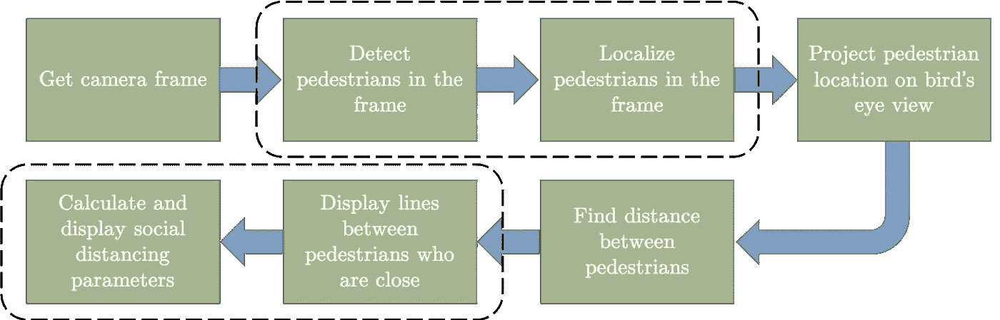

# 使用 Python 监控公共区域的社交距离

> 原文：<https://towardsdatascience.com/monitoring-social-distancing-using-ai-c5b81da44c9f?source=collection_archive---------10----------------------->


> 注:Idea 积分登陆 AI

社交距离是减缓传染病传播的重要方式。人们被要求限制彼此之间的互动，减少疾病通过身体接触或密切接触传播的机会。

在过去的十年里，AI/深度学习在几个日常生活问题中显示出了有希望的结果。在人工智能的帮助下，各种日常生活任务已经自动化。在本文中，我们将详细介绍如何使用 python 结合深度学习和计算机视觉来监控社交距离。带有安装说明的完整 python 代码可在 [GitHub](https://github.com/aqeelanwar/SocialDistancingAI) 上获得

在我们进入细节之前，让我们看看最终的输出。下面的视频是使用人工智能在已经可用的街道摄像头的公共区域监控社交距离的结果。

本文的其余部分将分为三个步骤

*   步骤 1 —安装项目
*   步骤 2—运行项目
*   步骤 3—代码的输入和输出
*   第 4 步——它是如何工作的？
*   步骤 5—建议的改进

# 步骤 1 —安装项目:

建议[为这个项目创建一个新的虚拟环境](/setting-up-python-platform-for-machine-learning-projects-cfd85682c54b)并安装依赖项。可以采取以下步骤下载并开始使用这些项目

1.  **克隆存储库:**包含代码的存储库可以使用

```
git clone [https://github.com/aqeelanwar/SocialDistancingAI.git](https://github.com/aqeelanwar/SocialDistancingAI.git)
```

2.**安装需要的包:**提供的 requirements.txt 文件可以用来安装所有需要的包。使用以下命令

```
cd SocialDistancingAI
pip install –r requirements.txt
```

这将在激活的 python 环境中安装所需的包。

# 步骤 2 —运行代码:

该代码将视频文件路径作为输入。以下命令可用于运行代码

```
cd SocialDistancingAI
python main.py --videopath "vid_short.mp4"
```

# 步骤 3 —代码的输入和输出:

## 标记必要的点:

运行 main.py 将打开视频中第一帧的窗口。此时，代码希望用户通过单击框架上的适当位置来标记 6 个点。这些点对于提供视频的用户视角是必要的。

## 输入:前 4 点:

6 个必需点中的前 4 个用于标记您想要监控的感兴趣区域(ROI)。此外，从上面看，这些点标记的线在现实世界中应该是平行的。例如，这些线可能是路缘。
这 4 个点需要按照预先定义的顺序提供，如下所示。

*   **点 1 (bl)** :左下角
*   **点 2 (br)** :右下角
*   **点 3 (tl)** :左上角
*   **点 4 (tr)** :右上

## 输入:最后两点:

最后两个点用于标记感兴趣区域中相距 6 英尺的两个点。例如，这可能是一个人的高度(更容易在框架上标记)

下面的 gif 将有助于更好地理解要点


代码输出

## 输出:在原始视频中检测到行人

代码的第一个输出是检测到行人的原始视频。行人被定位在紫色方框中。


## 输出:行人鸟瞰图

代码的第二个输出是用户标记的感兴趣区域中自上而下的局部行人视频(鸟瞰图)。


## 输出:社交距离参数

基于鸟瞰图和用户标记的 6 英尺距离点，该算法计算并报告以下参数。

**1。# 6 英尺违规:**行人违反 6 英尺安全距离阈值的次数

**2。居家指数:**量化了与正常的日常行人交通相比，有多少人待在家中。0%意味着行人流量与平时相比没有变化，50%意味着一半的人呆在家里

**3。社交距离指数:**量化保持的社交距离。50%意味着一半的互动违反了 6 英尺的安全距离标准。

# 第 4 步——它是如何工作的？

在没有任何额外信息的情况下，从单目图像中检测行人之间的距离是不可能的。一种方法(虽然不是很准确)是要求用户进行特定的输入，从而估计行人之间的距离。如果用户可以在帧上标记相距 6 英尺的两个点，使用外推法，可以找到帧上不同点之间的距离。如果摄像机与行人行走的平面上的所有点距离相等，这将是真实的。行人离摄像机越近，他们就越大。帧上的两个点(相距相同像素数)离相机越近，它们之间的实际距离就越小。

为了解决这个问题，代码接收用户输入的 4 个点来标记从上面看平行的两条线。由这 4 个点标记的区域被认为是 ROI(可以在上面的 gif 中以黄色看到)。这个多边形 ROI 然后被扭曲成一个矩形，成为鸟瞰图。这个鸟瞰图具有点的属性(这些点相隔相同的像素数)，无论它们在哪里都是等距的。它所需要的只是一个乘法器，将像素中的两点之间的距离映射到现实生活中的单位(如英尺或米)中的距离。这是最后两个用户输入点发挥作用的地方。

如上所述，深度学习用于检测和定位行人，然后将其映射到摄像机的鸟瞰投影。一旦我们有了鸟瞰视图中行人的坐标，社交距离参数就变得简单明了。

该算法的完整框图如下所示。



# 步骤 5 —建议的改进

该代码可以在几个方面进行大量改进。以下是一些建议

1.  一种更精确的将摄像机画面映射到鸟瞰图的方法
2.  该代码使用现有的多类分类器，该分类器在来自 COCO 数据集的 1000 个类上进行训练。代码可以使用专门为二元类(行人、非行人)训练的重新训练的分类器。
3.  可以引入计算社交距离参数的更精确的方法。

# 总结:

该算法可用于分析公共区域的社交距离，并采取必要的措施来更好地应对疫情。自动化的任务将导致在短时间内采取有效的行动，从而使我们更好地应对这种情况。完整的代码可以在 GitHub 这里[获得。可以随意修改完善。](https://github.com/aqeelanwar/SocialDistancingAI)

输入行人视频取自 https://www.youtube.com/watch?v=aUdKzb4LGJI

**如果这篇文章对你有帮助，欢迎鼓掌、分享和回复。如果你想了解更多关于机器学习和数据科学的知识，请关注我@**[**Aqeel an war**](https://medium.com/u/a7cc4f201fb5?source=post_page-----c5b81da44c9f--------------------------------)**或者在**[***LinkedIn***](https://www.linkedin.com/in/aqeelanwarmalik/)***上与我联系。***