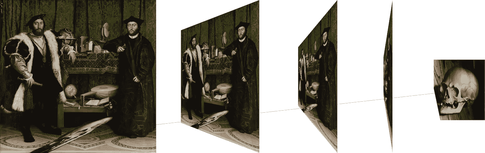
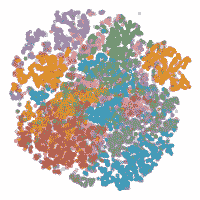
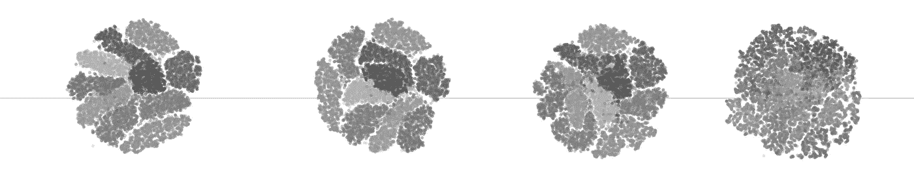
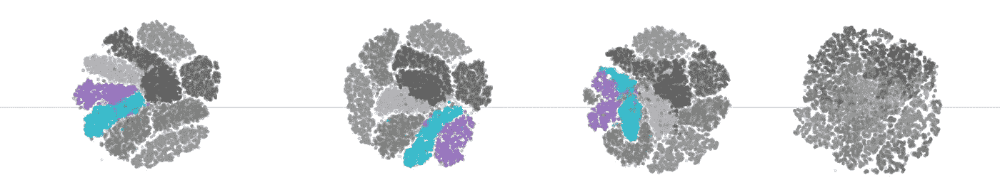
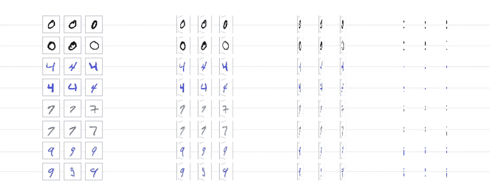

# 为什么模型停止工作了？

> 原文：<https://towardsdatascience.com/monitoring-the-health-of-your-deep-learning-application-460b81d04a65?source=collection_archive---------39----------------------->

## 我们能从 16 世纪的学者身上学到什么

视角就是一切。数据的取样位置会对数据的解释产生重大影响，有时还会影响数据的含义。比如小汉斯·霍尔拜因的经典画作)*。如果你直视它，有一部分看起来很奇怪。很难辨认。也许是个错误？但是，从侧面看，谜底揭开了:这是一个头骨，警告我们可能在我们不注意的地方潜伏着未知的危险。*

**

*在数据科学中，我们总是会遇到不同的观点，尽管我们经常意识不到这一点，尤其是在大型项目中。我们正在处理的数据是以某种方式收集的，有时会被恰当地描述。这意味着即使我们可以访问完整的数据集，我们可能也不知道它是如何产生的。尽管如此，我们的工作是分析它并提取洞察力。*

*一个这样的任务是根本原因分析，这在各行各业都存在，并且由于现代机器学习正在经历复兴。在更紧急的情况下，这句话通常显得不那么平淡无奇: *WTF 刚刚发生了？**

**

*起初，一切都是顺利和清晰的。使用 [t-SNE](https://en.wikipedia.org/wiki/T-distributed_stochastic_neighbor_embedding) 的多维数据分析包含明显可分的簇。然而，它不是一个静态的数据集，而是一个随时间演变的数据集。突然你注意到一些事情发生了变化。从一个时刻到下一个时刻，整个整洁的结构崩溃，所有的类都混在一起。*

**

**刚刚发生了什么 WTF？**

*让我们后退一步。要确定根本原因，首先需要描述发生了什么以及情况如何演变。*

## *观察 1:一个明显的普遍变化导致了所有阶级的崩溃*

*看看星团是如何随时间变化的，很明显坍缩是相当突然的。没有明显的迹象表明是从某一特定来源传播的。事实上，所有的东西都在同一时间倒塌，这表明，不管原因是什么，它影响了所有类别的物体。*

## *观察 2:在崩溃之前，较小的变化是可见的*

*第一个观察结果很清楚，让我们深入探讨。有即将崩溃的迹象吗？通过仔细观察时间上的分布，我们可以看到，在特定的时间点上，一些星团在 2。这意味着分类子集的识别准确性在崩溃之前开始恶化。*

**

*这些是你的金丝雀，➚*

*这一发现很有趣，因为当与崩溃相关时，这些效应可以作为预警指标。此外，这些类型的观察可以为访问原始数据的特定部分提供基本原理，并确定实际发生了什么。在查看数据之前进行统计分析的作用是识别可能相关的部分，对它们进行优先排序，从而可能更快。*

## *解开谜团:原始数据显示了什么*

*在关键时刻查看原始数据表明，原因很明显:数据被扭曲了，这种观点的改变影响了所有的阶层。*

**

*从左边开始的第一和第二组没有失真，并且形状为学习者提供了足够的信息来清楚地聚集每个数字。虽然最右边的第四个不包含可识别的信息，但是第三个更有趣。人眼很难分辨出那个。顶部的 0 受透视的影响较小，而 4、7 和 9 开始丢失部分。当要求识别这些数字时，准确率低于前两位。*

*现在，回到根本原因分析，假设这些数据哪里出错了。这种同质转换是数据传感器变化的典型标志。在这种情况下，可能是看数字的摄像机慢慢倾斜，改变了视角。原因可能是天气的机械作用或镜头变形。在任何情况下，这个假设提供了足够的理由来检查和可能更换相机。*

# *使用无监督学习自动排除有监督学习的故障*

*我们看到的是**通过使用无监督学习和可视化来监控深度学习应用程序健康状况的一种方式。**但是，我们如何实现自动化呢？观想是一种强大的技术，但需要专业的人眼。*

*做到这一点的一个方法是建立可视化的统计测量。换句话说，首先你找到适当的观想，然后你找到一个适当的方法来描述想要的状态。然后可以自动监控该测量。在我们的例子中，这样的度量可以是基于[剪影](https://en.wikipedia.org/wiki/Silhouette_(clustering))方法的距离度量。*

*这些方法有助于根本原因分析的典型 4 步中的前 2 步:*

1.  ***识别并清楚描述问题***
2.  ***描述从正常情况到问题发生的时间演变***
3.  *区分根本原因和其他因果因素*
4.  *在根本原因和问题之间建立因果图。*

*当处理数百万或数十亿个数据点时，即使看似很小的胜利在纠正和预防性维护中也是非常重要的。他们可以决定是否及时发现问题，以及是否能够避免影响许多用户的停机。*