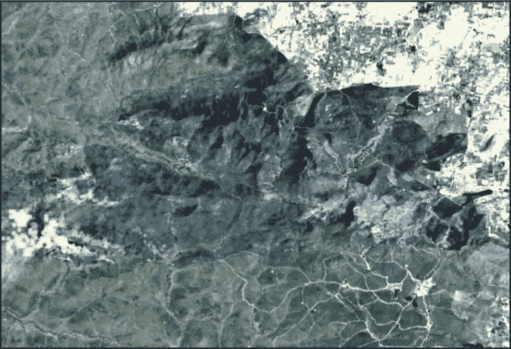
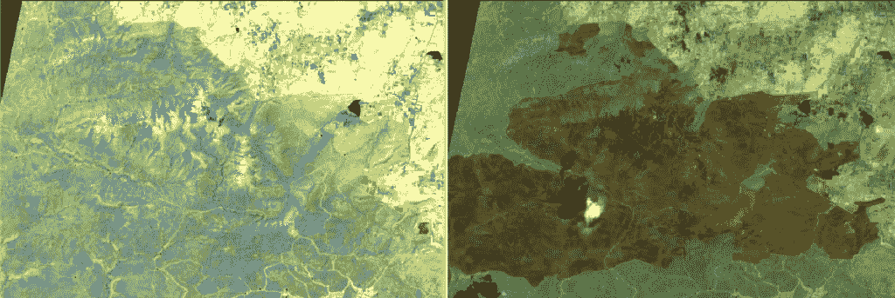
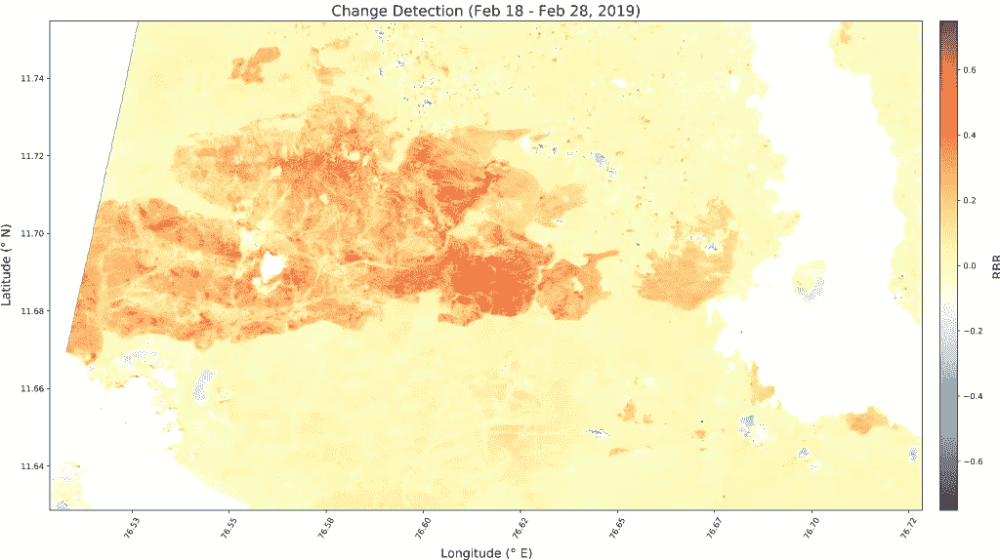
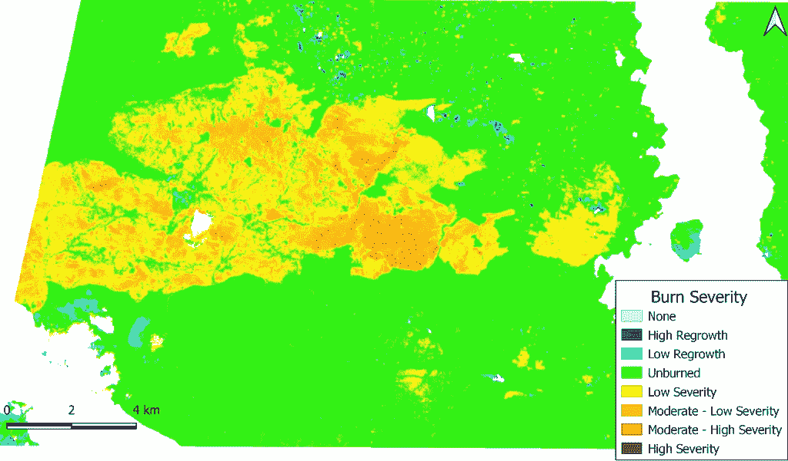

# 利用地球观测卫星监测野火

> 原文：<https://towardsdatascience.com/monitoring-wildfires-using-earth-observation-satellites-e3ee7113bae4?source=collection_archive---------23----------------------->

## 来自 Sentinel-2 任务的高分辨率光学卫星数据可以使用 SNAP 数据处理工具箱提供大规模野火评估

野火对森林的自然生态系统造成广泛破坏，导致生态、经济和社会退化。在印度，绝大多数(> 90%)野火源于人类活动，如木材采伐、土地转换、刀耕火种农业以及土地使用和财产权方面的社会经济冲突(Roy，2003)。然而，近年来，长期干旱、出于商业目的的过度开发和土地转作他用，导致野火规模、频率和相关环境影响大幅增加。政府当局报告的损失往往被低估。这些数据来自印度(FSI)森林调查局的地面调查研究和实地观察。由于缺乏关于森林火灾规模和总受灾面积的高质量统计数据，森林火灾造成的破坏程度无法准确估计。遥感技术的最新进展使得有可能通过提供关于森林生态系统反应动态的深层次见解，以具有成本效益的方式及时克服这些限制。因此，我们在全球、区域和地方范围内探测、监测、评估和预测火灾的能力有了显著提高。

2019 年 2 月，Bandipur 国家公园爆发了大规模的野火，烧毁了该地区数千英亩的林地(图 1)。2 月 21 日，在公园的昆达凯尔山脉报道了第一次野火，随后由于强风，野火迅速蔓延到附近的山脉。报告显示，持续五天的野火是由居住在国家公园附近的人类引发的。之前的干燥季风期在森林山脉的底层留下了大量易燃物质。虽然野火在 Bandipur 老虎保护区和国家公园并不罕见，但主要由入侵杂草马缨丹组成的灌木丛可能在加剧火势和速度方面发挥了作用。

图 1-Landsat 8 卫星图像显示了 2019 年 2 月 25 日发生的 Bandipur 火灾。

印度空间研究组织报告称，被烧毁的总面积为 10，920 公顷。然而，报道称，官员们错误地报告了估计值，以淡化火灾造成的损失。对于 2019 年 Bandipur 野火的准确损害评估，地球观测卫星可以提供关于火灾范围和严重程度的宝贵见解。本文报告了三个关键方面——a)火灾影响区域的识别，b)烧伤严重程度的分类，以及 c)使用 Sentinel 2 多光谱卫星数据对总火灾影响区域的估计。

# 背景

位于地球表面的特征所消耗的能量具有独特的特征。这些光谱特征使我们能够研究各种各样的地球过程。光学遥感工具利用位于高分辨率地球观测卫星上的可见光和红外传感器来研究森林火灾。近红外、中红外和热波段易受植被健康变化的影响。它们经常用于准确评估受火灾影响的地区和燃烧的严重程度，以支持森林管理活动。绿色健康的植被反射近红外(NIR)区域的辐射。它吸收电磁波谱中可见光部分的红光。同时，烧伤区域在可见光和短波红外(SWIR)区域消耗更多的能量，同时吸收近红外区域的能量(图 2)。

图 2——健康的植物品种在近红外光谱中反射更多的能量，但在 SWIR 中反射微弱。这种光谱特性有助于探测燃烧区域，如森林地面上的枯死土壤/植物材料。
资料来源:美国林务局。

**归一化燃烧比(NBR)** 是一项指标，用于通过区分野火事件后光谱特征发生显著变化的区域来衡量燃烧的严重程度。它是利用遥感卫星图像的近红外和 SWIR 波段的能量强度计算出来的。NBR 的公式与归一化差异植被指数(NDVI)相似，后者是基于近红外和红色波段的光强度。NBR 使用近红外波段和 SWIR 波段之间的比率。较高的 NBR 值反映了被健康植被覆盖的区域，而较低的值表示裸露的地面和最近被烧毁的区域。接近零的值表示不受火灾事件影响的区域。

Sentinel 2 数据的 NBR 计算如下:

**燃烧严重程度**是一个术语，用来表示生态系统受野火事件影响的程度。这是根据卫星图像得出的火灾前和火灾后 NBR 之间的差异估计的。为了识别最近燃烧的区域，并将它们与裸土和其他无植被区域区分开，经常使用火灾前和火灾后 NBR 之间的差异，也称为*δ归一化燃烧比(dNBR)* 指数。dNBR 值高的区域对应于更高程度的损伤或烧伤。相比之下，较低的 dNBR 值代表未受火灾影响的区域或在野火事件后通过植物物种的再生而反弹的区域。

为了监测火灾，需要同一地区，即感兴趣的区域的两幅卫星图像。在时间上最接近火灾事件采集的图像被称为*主图像*，最近的一个图像被称为*从图像*。通过计算主映像和后续从映像的 NBR，可以分析火灾的影响[ [2](http://xn--https-ix3b//www.geo.university/pages/how-to-detect-and-map-forest-fires-using-earth-observation-images) ]。基于主 NBR 图像和从 NBR 图像(dNBR)之间的差异，可以确定火灾事件的总燃烧面积，并且可以描绘受火灾严重影响的区域。每个随后的从属图像可用于根据第一张火灾地图(主图像)在不同时间点创建火灾后地图，并通过检查森林植被的反应来监测恢复进度。

# 卫星数据

Sentinel-2 是一项地球观测卫星任务，广泛应用于研究地球环境。它由两颗卫星组成，配备了最先进的多光谱成像仪(MSI)，通过全球范围内的 13 个光谱带提供高分辨率光学图像，重访频率高，使其成为土地利用土地覆盖监测、大气校正和云/雪分离的重要数据源( [ESA](https://sentinel.esa.int/web/sentinel/missions/sentinel-2) )。本次分析中使用的哨兵 2 级 2B (L2B)数据是从[哥白尼开放存取中心](https://scihub.copernicus.eu/dhus/#/home)获得的。为了绘制火灾后评估图，使用了 2019 年 2 月 18 日(即主图)和 2019 年 2 月 28 日(即从图)相隔 10 天获得的两幅图像(图 3)。这两张卫星图像已经使用 SNAP 桌面 GUI 进行了预处理，该 GUI 是在 [SNAP 引擎](https://github.com/senbox-org/snap-engine)之上开发的，并且基于 NetBeans 平台。SNAP 由欧洲航天局(欧空局)开发，是一个通用软件平台，用于科学开发哨兵-1、哨兵-2 和哨兵-3 任务。SNAP 的项目页面和各个工具箱可以在[http://step.esa.int](http://step.esa.int/)找到。

图 3-比较大气穿透 RGB 波段组合中 Bandipur 区域的主(左)和从(右)Sentinel 2 级 2B 卫星图像

# 数据预处理

大气校正是确定真实地表或大气底部(BOA)反射率值的重要预处理步骤。当分析涉及比较同一地区两个不同时间的卫星数据时，这一点尤其重要。自 2017 年 4 月起上市的所有 Sentinel 2 L2 产品已经应用了大气校正。L2B 产品包含矢量云和卷云遮罩，它们是作为大气校正的产品创建的，但是，将遮罩应用于所有波段和整个场景非常耗时。因此，我们对乘积进行子集化，但是向量乘积由于这种操作而丢失了。因此，在我们的例子中，为了保存信息，必须创建一个包含云掩膜的新波段。目前使用*批处理*方法无法做到这一点，因此我们需要在使用 GraphBuilder 工具进行预处理之前，分别为每个产品添加云遮罩带。

一个一个地处理数据将非常耗时且不方便。我们可以使用 SNAP 中可用的*批处理*工具同时处理所有图像。要使用该工具，我们首先需要定义我们想要应用的流程及其所有步骤。我们可以使用 GraphBuilder 工具来完成这项工作。GraphBuilder 中批处理的另一个优点是只有最终产品被物理保存，节省了宝贵的磁盘空间。GraphBuilder GUI 中预处理工作流程(图 4)的简要概述如下。

图 GraphBuilder 中的预处理概述

*   **读取**:从卫星图像中读取输入数据。这个初始步骤包括将获取的卫星图像加载到 GraphBuilder 工具中。
*   **重采样**:Sentinel-2 产品中的 13 个波段并不都具有相同的分辨率。许多运营商不支持具有不同大小波段的产品，因此首先我们需要对波段进行重新采样，以获得相同的分辨率。使用双线性重采样算法将所有 13 个波段重采样到 10 米的分辨率。
*   下一步是从卫星图像中选择要研究的区域。这需要使用来自几何图形选项的 *WKT 将输入图像子集化为感兴趣区域和选定波段(B3、B8、B12 和 cloud_mask ),以子集化原始图像的一部分，并将坐标复制到*地理坐标*选项中。为确保选择正确的区域，点击*更新*。*
*   一旦选择了合适的波段和感兴趣的区域，剩下的工作就是计算所选区域的 NBR。这可以使用 **BandMaths** 操作器来完成。该操作符允许我们通过在*表达式*选项卡中指定公式来创建 NBR 波段。一个**波段合并**操作符允许我们将多个波段叠加到一个文件中。然后，Subset 运算符和 BandMaths 运算符都连接到 BandMerge 运算符。
*   最后一步是将波段合并操作器连接到**写**操作器。该步骤将处理后的 2 级图像输出到指定的目录，然后可进一步用于描绘烧伤区域。

## 搭配和水/云遮蔽

一旦燃烧前和燃烧后的图像都经过预处理，我们将它们合并以形成包含燃烧前和燃烧后 NBR 带的新产品。使用 SNAP 中的*配置工具*将两幅空间重叠的图像并置的任务允许我们稍后容易地计算火灾前和火灾后 NBR 值的变化。然而，在检测到变化之前，我们需要从新创建的图像中屏蔽掉水体和云。

NBR 可以是描绘燃烧区域的一种强有力的方法。但是，该指数对水体很敏感，这可能会导致图像像素的错误分类。在某些情况下，湖泊和河流可能在 NBR 值上表现出类似的差异，并导致假阳性情况[ [3](http://•	https://www.earthdatascience.org/courses/earth-analytics/multispectral-remote-sensing-modis/normalized-burn-index-dNBR/) ]，即像素被分类为已燃烧，而实际上它们并未燃烧。因此，有必要屏蔽掉代表水体的像素，可以使用**归一化差异水体指数****【NDWI】**进行检测。为此，我们将创建一个单一的组合水和云的面具。NDWI 旨在最大化绿色波段水体的反射率，最小化近红外波段水体的反射率[McFeeters，1996]。

Sentinel 2 数据的 McFeeters NDWI 计算如下:

## 识别烧伤区域

此时，我们应该有两个 NBR 波段，分别对应于火灾前(2 月 18 日)和火灾后(2 月 28 日)。为了识别最近燃烧的区域，可以通过将火灾后的 NBR 与火灾前的 NBR 进行差分来计算 dNBR。然而，dNBR 是变化的一个绝对量度，这可能会在火灾前植被覆盖低的地区导致问题，在那里差异将是微不足道的。为了避免这样的问题，我们使用***【RBR】***:

RBR 是通过对火灾前的 NBR 做一个小的调整来计算的，以避免方程达到无穷大而失败(Parks *等人*)。, 2014).计算出 RBR 后，我们可以使用 *BandMaths* 工具通过创建一个新波段来识别最近被烧毁的区域，该波段只包含 RBR 值高于指定阈值的像素。我们可以看到 RBR 值的变化，正如我们已经确定的那样，这是用于烧伤面积评估的测量方法，通过使用类似 QGIS 的 GIS 软件绘制 RBR 带。在这里，我使用 Python 绘制了 RBR 值的地图(图 5 ),使用了合适的色图和基于 RBR 值范围的比例。直方图是评估大多数 RBR 值所在范围的快速方法。对于我们的数据集，RBR 值大多位于-0.25 和 0.6 之间，因此我使用了-0.75 和 0.75 之间的范围来创建变化检测图。

图 5 —变化检测显示了 Bandipur 地区受火灾影响的区域。

## 烧伤严重程度分类

第二个目标是根据火灾前和火灾后 RBR 值的变化程度对被烧毁的地区进行分类。烧伤严重程度的分类可以作为帮助急救工作和评估火灾后康复发展的重要工具。美国地质调查局(USGS)提出了一个分类表来解释烧伤的严重程度，如下表所示。

烧伤严重程度分类标准表(USGS)

在我们的数据中，最低值为-1.5，表示不属于森林生态系统的像素，对应于其他土地利用类型，如建成区或耕地。森林的某些区域具有与植物再生相对应的 RBR 值。数据集中的大多数像素具有接近 0 的值(平均值为 0.06)，这对应于未燃烧区域。显示受火灾影响区域的烧伤疤痕清晰可见(图 6 ),并由 RBR 值高于 0.1 的像素显示。在受影响的区域内，相当多的像素被归类为低严重度烧伤区。这可能是由于两幅图像之间的时间差造成的。一年中的这个时候相对干燥，一些植被可能已经退化，导致 RBR 值的变化幅度类似于轻度烧伤。

图 6-2019 年 Bandipur 野火的烧伤严重程度分类

## 估计总烧伤面积

在我们的分析中，RBR 波段可以进一步处理，以创建一个新的波段，其中包含与轻度烧伤或更严重烧伤相对应的像素(图 7)。基于该阈值，总烧伤面积可以简单地计算为所有像素占据的面积乘以水平(经度)和垂直(纬度)轴上的分辨率。为了计算我们研究区域的总烧伤面积，我们使用以下公式:

图 7——谷歌地球图片显示了 Bandipur 野火的受灾地区。亮色像素代表比周围深色像素燃烧强度更高的区域。

2019 年 2 月 18 日至 2 月 28 日期间，从哨兵 2 衍生的 RBR 估计的总燃烧面积为 17，501 英亩或约 71 平方英尺。公里。这里估计的面积大大高于 ISRO 报告的面积。它与其他独立权威机构和研究机构做出的估计[4](https://www.indiatimes.com/news/india/the-massive-wildfire-that-burnt-down-bandipur-tiger-reserve-was-ignited-by-shepherds-to-keep-tigers-away-363085.html)、[5](https://www.thehindu.com/news/national/karnataka/estimates-of-bandipur-fire-damage-vary/article26358924.ece)、[6](https://www.thehindu.com/news/national/karnataka/when-bandipur-burned/article26474683.ece)相比相当不错。

# 结论

野火会对森林生态系统造成严重破坏。卫星为监测大规模火灾提供了一种经济有效的方法。近年来，由于地球观测遥感任务提供的中高空间分辨率光学卫星数据越来越多，研究人员和火灾管理官员得以进行详细的火灾后评估。本文展示了归一化燃烧比(NBR)作为一个有用的指数的效用，用于使用来自哨兵 2 任务的数据描绘火灾影响区域和燃烧区域评估。总之，遥感和地理信息系统技术可以为了解野火对森林生态系统的影响提供重要的信息。这对全球大规模森林火灾的有效监测、规划和潜在预防管理具有重要意义。

# 承认

本分析中使用的预处理和图像采集技术改编自 RUS 哥白尼([https://rus-copernicus.eu/portal/](https://rus-copernicus.eu/portal/))培训材料(代码: [HAZA02](https://rus-copernicus.eu/portal/wp-content/uploads/library/education/training/HAZA02_BurnedArea_Portugal.pdf) )。

# 参考

*   Roy，P.S .，2003,《利用卫星遥感和地理信息系统进行森林火灾和退化评估》,卫星遥感和 GIS 在农业气象学中的应用，361–400。
*   McFeeters，s . k ,, 1996,“归一化差异水指数(NDWI)在开阔水域特征描述中的应用”,《国际遥感杂志》, 17:7，1425–1432。
*   巴夏礼，美国*等*。，2014，一种量化烧伤严重程度的新指标:相对烧伤率，遥感，6:3，1827–1844。