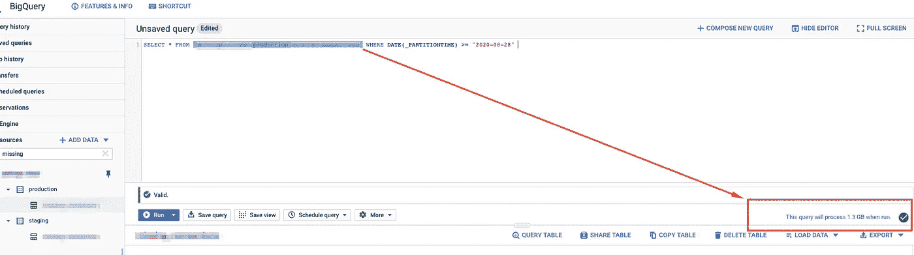

# 使用 Data Studio 监控您的 BigQuery 成本并报告使用情况

> 原文：<https://towardsdatascience.com/monitoring-your-bigquery-costs-and-reports-usage-with-data-studio-b77819ffd9fa?source=collection_archive---------3----------------------->

## 简单有效的仪表板。具有实际的报告名称、用户和标签。包含方便的模板


BigQuery 和 Data Studio 成本监控仪表板。(*图片作者*)

如果您是一个 BigQuery 用户，并且您使用 Data Studio 可视化您的数据，那么您可能想要回答以下**问题**:

*   昨天每个数据工作室报告的成本是多少？
*   每个查询/报告运行了多少次，由谁运行？
*   查询带有标签 X 的表、数据集(例如生产/暂存/分析)的成本是多少？
*   如果计费字节数突然激增，我能得到通知吗？

标准的谷歌计费仪表板不会回答这些问题。

> 根据谷歌官方文件，目前**你不能**为 BigQuery 工作使用标签。

在这里阅读更多:[https://cloud.google.com/bigquery/docs/filtering-labels](https://cloud.google.com/bigquery/docs/filtering-labels)

> 但是，如果我们想知道到底是谁运行了这个查询，以及它花费了我们多少钱呢？

在本文中，我将向您介绍设置 BigQuery 成本监控仪表板的完整过程。

我使用了谷歌数据工作室的标准谷歌广告模板。我觉得它看起来不错，我根据自己的需要稍微做了些改动。


(*图片作者*)

如果你愿意，你可以复制 [**模板**](https://datastudio.google.com/u/0/reporting/de01deda-04d8-4d74-a90e-5038e94ddd9c/page/FQ1YB/preview) ，包括所有相关的设置和部件。如下面的`bq_cost_analysis.sql`所示，只需调整每个小工具的数据源(创建自己的数据源)

**先决条件**:

*   [谷歌云平台](https://cloud.google.com/) (GCP)账号
*   BigQuery
*   数据工作室

在本文中，我将使用[云审计日志](https://cloud.google.com/logging/docs/audit/)进行 BigQuery。我们将使用这些事件数据，将其导出到 BigQuery 并进行分析。

> Google 推荐的最佳实践是使用**基于自定义日志的指标**。

转到 [**记录**](https://cloud.google.com/logging/docs/audit/) 并创建一个**接收器**。点击阅读更多关于创建水槽的信息[。](https://cloud.google.com/logging/docs/export/configure_export_v2)


(*图片作者*)

这将把来自**云审计日志**服务的所有 BigQuery `query_job_completed `日志事件输出到您的 BigQuery 表中。

通过这种方式，您可以导出任何日志以供进一步分析，我发现这非常有用。

请注意，只会导出新日志，但是您也可以在**日志控制台**中过滤和缩小您正在调查的日志:


json 输出。(*作者图片*)

因此，现在当我有 **BigQuery** 事件数据流入我的`logs`数据集时，我将基于我拥有的数据创建一个视图:


(*图片作者*)

这就是我们需要计算大查询成本(每个查询或作业)的地方:


TotalBilledBytes。(*图片作者*)

我们可以简单地乘以:`cost per TB processed` * `numbers of TB processed`。

## 数据源

这是一个自定义查询`bq_cost_analysis.sql:`

现在我们已经将`processedBytes`与相关的`cost per user`和`per query`很好地组合在一起:


BigQuery 结果。(*图片作者*)

你可能注意到我在`bq_cost_analysis.sql`中添加了一个**查询标签**

> 这是一个小技巧，将有助于**成本分组**，并让我们使用实际的标签(目前不支持)。

只需调整 SQL 并为您`tagged`查询添加一列。它可以是任何东西，数据工作室中的一个**报告**，表名**或者一个**预定查询**:**

```
**substr(**protopayload_auditlog.servicedata_v1_bigquery.jobCompletedEvent.job.jobConfiguration.query.query,0,30**) as report**
```

或者类似这样的事情可能会更好:

```
select REGEXP_EXTRACT(‘ --tag: some report — tag ends/’, r’--tag: (.*) - tag ends/’) **as report**
```


Data Studio / BigQuery 每个用户/报告的成本。(*图片作者*)

当然，您也可以通过查询来汇总成本。


Data Studio 中每次查询的成本。(*图片作者*)

如果您将底部的表格设置为每页只显示*一条记录* ( *一个查询*)，这将使查询成本分析变得非常简单。

> 添加小时和分钟的滑块也非常有用。

另一件有趣的事。**缓存**。如果您想省钱，您应该在 Data Studio 报告中启用**预取缓存**，您必须使用`owner's credentials`并启用缓存选项(数据新鲜度)。在这里阅读更多关于缓存的信息:[https://cloud.google.com/bigquery/docs/cached-results](https://cloud.google.com/bigquery/docs/cached-results)


Data Studio 预取缓存。(*图片作者*)

在这种情况下，如果您与任何其他用户共享对您的报告的访问权限，他们将使用您的凭据来访问数据，您将在您的成本报告中看到的只是您的帐户名称。

> 如果你想为你的成本报告启用其他用户，你应该使用`Viewer's credentials`并授予他们访问底层数据集的权限。

我发现这真的很烦人，但这就是 Data Studio 的工作方式。

在这里阅读更多谷歌官方文档:[https://developers . Google . com/data studio/solution/blocks/enforce-viewer-creds](https://developers.google.com/datastudio/solution/blocks/enforce-viewer-creds)。

## 为各个 Data Studio 用户创建角色

如果您在 Data Studio 中使用查看者凭据，您将需要它。

让我们转到 [IAM](https://console.cloud.google.com/iam-admin/iam) 角色，并创建名为 **Data Studio 用户的角色。为此，我们需要对数据集中的`view`和`list`表的权限。您可以简单地添加预定义的 **BigQuery 数据查看器**角色。**

对于来自 ***Data Studio*** 的`run`报告，我们还需要添加 **bigquery.jobs.create** 权限的 **BigQuery 作业用户**角色。
在这里阅读更多关于预定义角色的信息:[https://cloud.google.com/bigquery/docs/access-control](https://cloud.google.com/bigquery/docs/access-control)


创建 Data Studio 用户角色。(*图片作者*)

现在您可以将这个角色分配给任何用户，让他们在 **Data Studio** 中使用**查看者的凭证**。只需点击数据集名称，然后点击**共享数据集。当只授予最小范围的权限时，这符合 Google 最佳安全实践。**


授予权限。(*图片作者*)

# 创建计费预警

我还希望在计费字节数突然激增时得到通知。

要创建此`Alert`，首先进入[仪表盘](https://console.cloud.google.com/monitoring/dashboards)，点击**添加图表**并选择**扫描字节计费**:


正在为 BilledBytes 创建 BigQuery 使用率警报。(*图片作者*)

选择*聚合器*和*对准器*到**求和**。一个**聚合器**描述了如何在多个时间序列上聚合数据点**，以及在**分组中使用标签的情况下使用**。**对齐器**描述如何将每个单独时间序列中的数据点放入相等的时间段。阅读更多关于[校准器](https://cloud.google.com/monitoring/api/ref_v3/rest/v3/projects.alertPolicies?_ga=2.148405559.-181916626.1572688026#Aligner)的信息。**


设置对准器和协议器。(*作者图片*)

# 创建警报策略

现在让我们转到 Google [警报](https://console.cloud.google.com/monitoring/alerting)并创建一个策略:


设置警报策略。(*图片作者*)

我们称之为**“过去 15 分钟计费字节数超过 1Gb”**，这样，在任何 15 分钟窗口内，每当计费字节总数超过 1Gb 时，我们都会收到警报:


警报策略。(*图片作者*)

现在，如果我们运行任何查询(包括 Data Studio 报告),并且在过去 15 分钟内**总计费字节数**的总和超过阈值，系统将会通知我们。

让我们运行一个超过这个阈值的查询，看看是否可行:



测试。(*图片作者*)

您应该会收到一封电子邮件提醒。成功了:


谷歌快讯。(*图片作者*)

例如，您也可以以类似的方式为正在使用的**插槽数量**和**查询执行**时间设置警报。

在这里阅读更多:[https://cloud . Google . com/monitoring/alerts/using-alerting-ui # create-policy](https://cloud.google.com/monitoring/alerts/using-alerting-ui#create-policy)

# 就是这样！

现在，您有了一个漂亮的成本监控仪表板，可以在其中看到与每个 Data Studio 报告相关联的 BigQuery 成本，使您可以在 Google Cloud Billing 中更深入地了解基本数据集级别的报告。

感谢您的阅读，如果您有任何问题，请告诉我。

# 推荐阅读:

*   [https://cloud . Google . com/blog/products/data-analytics/taking-a-a-practical-approach-to-big query-cost-monitoring](https://cloud.google.com/blog/products/data-analytics/taking-a-practical-approach-to-bigquery-cost-monitoring)
*   [https://cloud.google.com/bigquery/docs/access-control?_ga=2.51607977。-1819168026](https://cloud.google.com/bigquery/docs/access-control?_ga=2.51607977.-181916626.1572688026)
*   [https://cloud.google.com/logging/docs/export](https://cloud.google.com/logging/docs/export)
*   https://cloud.google.com/bigquery/docs/monitoring
*   【https://cloud.google.com/bigquery/docs/controlling-costs 
*   [https://cloud.google.com/bigquery/docs/best-practices-costs](https://cloud.google.com/bigquery/docs/best-practices-costs)
*   [https://medium . com/Google-cloud/visualize-GCP-billing-using-big query-and-data-studio-d3e 695 f 90 c 08](https://medium.com/google-cloud/visualize-gcp-billing-using-bigquery-and-data-studio-d3e695f90c08)
*   [https://support.google.com/cloud/answer/7233314?hl=en](https://support.google.com/cloud/answer/7233314?hl=en)
*   [https://cloud . Google . com/billing/docs/how-to/export-data-big query-setup？hl=en](https://cloud.google.com/billing/docs/how-to/export-data-bigquery-setup?hl=en)
*   [https://cloud.google.com/bigquery/docs/cached-results](https://cloud.google.com/bigquery/docs/cached-results)