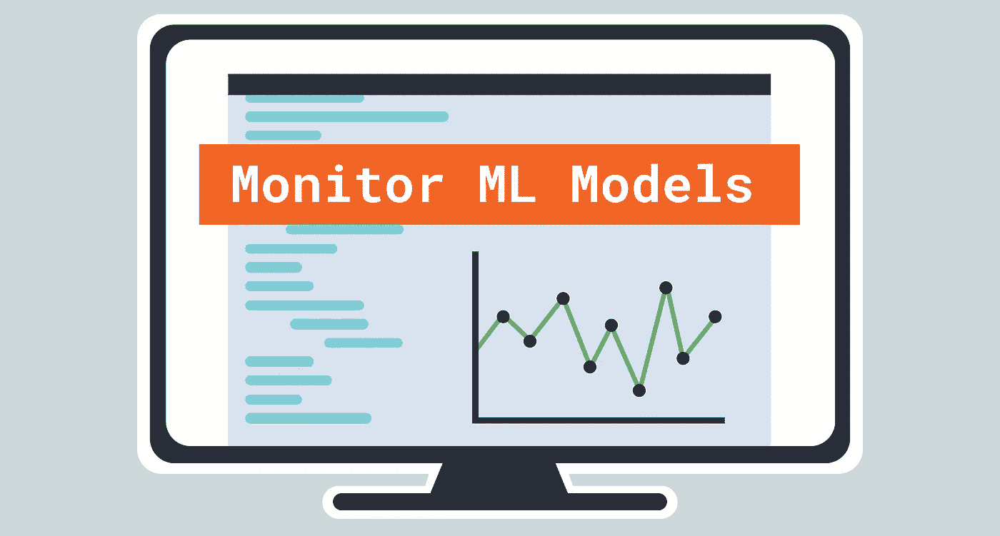
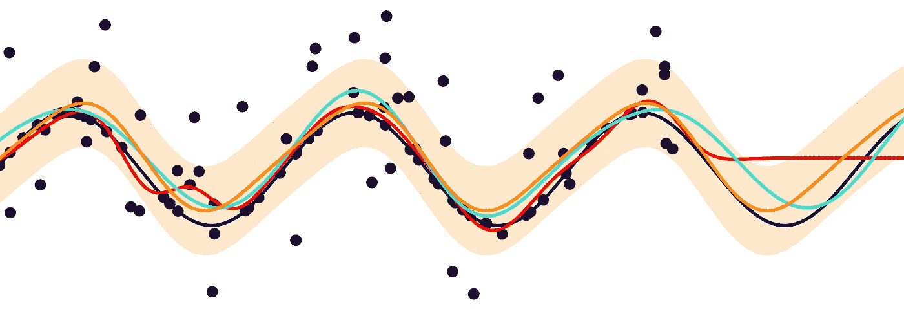
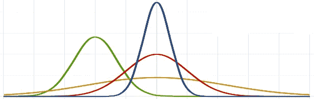

# 监控你的机器学习模型

> 原文：<https://towardsdatascience.com/monitoring-your-machine-learning-model-6cf98c106e99?source=collection_archive---------22----------------------->

*作者图片*

## MLOps

## 部署您的 ML 模型时需要注意什么

在过去的几年里，机器学习和人工智能已经越来越成为利用数据的组织的主要内容。随着这种成熟，出现了需要克服的新挑战，例如**部署**和**监控**机器学习模型。

尽管部署和监控软件一直是一种久经考验的实践，但对于机器学习模型来说，这样做却有很大不同。监控您的模型可以帮助您了解随着时间的推移您的预测有多准确。

> 通过监控模型来防止错误的预测

从个人经验来看，似乎有许多组织，主要是中小企业，现在正面临着机器学习的这个**生产**阶段的挑战。

本文将重点关注**在生产中监控**你的机器学习模型。然而，如果您不熟悉**部署**您的模型，我建议您看看下面的文章，让您快速上手:

 [## 如何部署机器学习模型

### 用 FastAPI+uvicon 创建生产就绪的 API

towardsdatascience.com](/how-to-deploy-a-machine-learning-model-dc51200fe8cf) 

**注意:**没有一种正确的方法可以监控你的模型。本文仅作为设计监控框架时的参考。您的里数可能因您正在使用的解决方案而异。

# 1.为什么要监控你的模型？

所有生产软件都容易出故障，每个软件公司都知道监控其性能以防止问题的发生是很重要的。通常，我们*监控* ***软件*** 本身的质量，而在机器学习的环境中，人们可能更关注*监控* ***预测*** 的质量。

> 并非所有数据都是平等的

您希望监控您的模型有几个原因:

*   模型和输入数据之间的关系会发生变化
*   数据的分布发生了变化，使得模型的代表性降低
*   衡量标准和/或用户群的变化改变了变量的潜在含义

## **漂移**

根据以上原因，通常可以在**漂移**中找到原因。从本质上来说，**漂移**是数据的统计属性发生变化的现象，这种现象会导致您的预测随着时间的推移而下降。换句话说，由于数据总是在变化，漂移自然会发生。

由 [Unsplash](https://unsplash.com/s/photos/drift?utm_source=unsplash&utm_medium=referral&utm_content=creditCopyText) 上的[罗兰兹·瓦斯伯格](https://unsplash.com/@rolandsvarsbergs?utm_source=unsplash&utm_medium=referral&utm_content=creditCopyText)拍摄的照片

以网上商店的顾客数据为例。预测模型可以使用诸如他们的个人信息、购买行为和花在广告上的钱等特征。随着时间的推移，这些特征可能不能代表它们最初被训练时的特征。

> 漂移通常被称为概念漂移、模型漂移或数据漂移

监控您的模型以确保输入的数据与训练时使用的数据相似是很重要的。

## 为什么不重新训练你的模特呢？

虽然重新训练一个模型听起来总是一个好主意，但它可能比这更微妙！

如果你没有及时的标签怎么办？如果你的预测是几个星期后的事，那么在实践中验证你的模型将会很困难，因为你需要等待几个星期才能得到事实真相。

或者…如果您自动重新训练您的模型，只是让它运行 10 个小时，然后在第二天重新训练它，会怎么样？这可能会花费组织大量的计算时间，但却有一点积极的影响。

或者…如果您以在线方式重新训练一个模型，但由于只关注新添加的数据而导致其性能下降，该怎么办？

盲目地重新训练一个模型会导致更多的成本，时间的浪费，甚至是一个更差的模型。通过监控你的模型，你可以更精确地决定再培训的最佳方法和时间。

# 2.监视

监控您部署的模型的方法有很多种。实际上，这主要取决于您的应用程序、模型类型、性能度量和数据分布。但是，在监控模型时，有几件事是您最常看到的。

## 监控预测

从[这里检索](https://en.wikipedia.org/wiki/Gaussian_process)。

如果你幸运的话，在你的预测和你的目标预测之间几乎没有时间。换句话说，在做了一个预测之后，你很快就会有真正的标签。在这种情况下，只需监控标准绩效指标，如准确性、F1 评分和 ROC AUC。

但是，当您没有及时的标签时，就不能使用性能测量(例如，疾病预测)，您必须寻找其他方法:

*   **预测分布***
    您可以使用回归和分类任务中预测的分布和频率来跟踪新的预测集是否与训练数据具有相似的分布。显著的偏差可能表明性能下降。
*   **预测概率** 很多机器学习模型都可以输出分类概率。这些表明一个模型有多“确定”这是正确的预测。如果这些概率相对较低，那么该模型可能会在部署中遇到困难。

***注意**:如果你想比较分布，那么我们通常会关注统计测试，比如[学生 t 检验](https://en.wikipedia.org/wiki/Student%27s_t-test)或非参数 [Kolmogorov Smirnov](https://en.wikipedia.org/wiki/Kolmogorov%E2%80%93Smirnov_test) 。[这个](https://stats.idre.ucla.edu/other/mult-pkg/whatstat/)可能会帮助你为你的数据选择正确的统计检验。

## 监控输入

从这里的[检索](https://commons.wikimedia.org/wiki/File:Normal_Distribution_PDF.svg)。

如果您有及时的标签或者没有，那么监视您的模型的输入通常是一个好的实践。这有助于您了解通常输入到模型中的内容，并帮助您跟踪预测的恶化情况。

方法包括:

**特征分布** 与预测一样，您可以使用分布输入数据来跟踪它是否具有与训练数据相似的分布。如果您发现显著差异，这可能表明您的培训数据并不代表您在生产中发现的数据。

**异常值检测** 根据您的预处理步骤，您通常不允许在预测模型中使用某些值。变量中类别的数量可能会随着时间的推移而增加，这是您的模型所没有预料到的。

## 人工监控

此处检索到。

在自动化时代，我为什么要建议人工监控呢？尤其是当人类的行为对错误极其敏感的时候？

嗯……虽然人工监控应该是最后的手段，但在某些情况下，让人类看一看模型生成的预测是有益的。如果一个被监控的预测即使有超过 90%的概率也是不准确的，那么如果这些异常能被人看到就好了。

当你在实践中没有预测的基础事实标签时，人类的监控甚至可能是必要的。

# 3.阴影模式

每当您想要部署一个重新训练的模型时，您可能想要推迟将其部署到生产环境中。相反，以影子模式部署它可能更好。**影子模式**是一种通过新训练的模型运行生产数据的技术，无需将预测反馈给用户。

由[林奈](https://www.publicdomainpictures.net/en/view-image.php?image=215394&picture=woman-in-hat-shadow)创作

**阴影模式**允许您同时运行两个模型，同时在生产环境中测试新模型的性能。在实际部署到生产环境之前，您可以存储其预测以监控其行为。

此外，您可以使用此模式来检查模型是否按预期工作，而无需模拟生产环境，因为它在技术上是生产环境的副本。

# 感谢您的阅读！

如果你和我一样，对人工智能、数据科学或心理学充满热情，请随时在 [LinkedIn](https://www.linkedin.com/in/mgrootendorst/) 上添加我，或者在 [Twitter](https://twitter.com/MaartenGr) 上关注我。

有关生产中的机器学习的更多信息，请单击以下帖子之一:

 [## 如何部署机器学习模型

### 用 FastAPI+uvicon 创建生产就绪的 API

towardsdatascience.com](/how-to-deploy-a-machine-learning-model-dc51200fe8cf)  [## 借助 Streamlit 快速构建和部署应用

### 将您的 Streamlit 应用程序部署到 Heroku，展示您的数据解决方案

towardsdatascience.com](/quickly-build-and-deploy-an-application-with-streamlit-988ca08c7e83)  [## 数据科学家的单元测试

### 使用 Pytest 提高管道的稳定性

towardsdatascience.com](/unit-testing-for-data-scientists-dc5e0cd397fb)