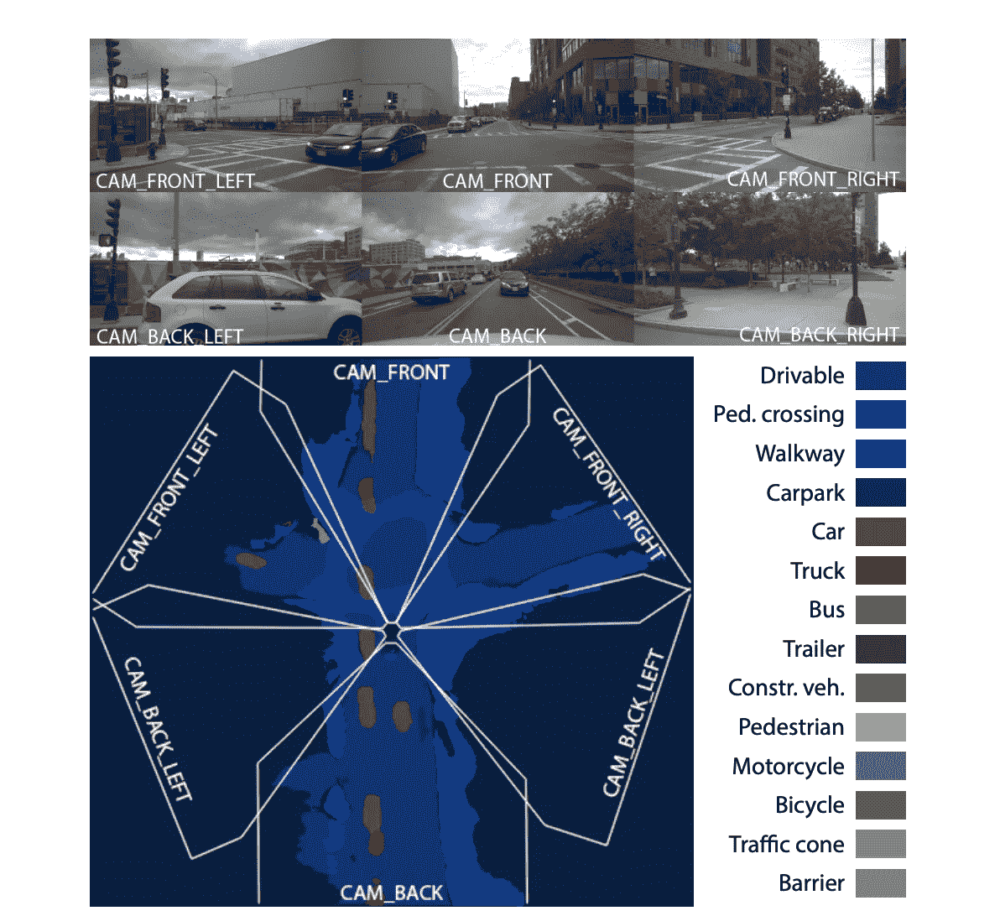
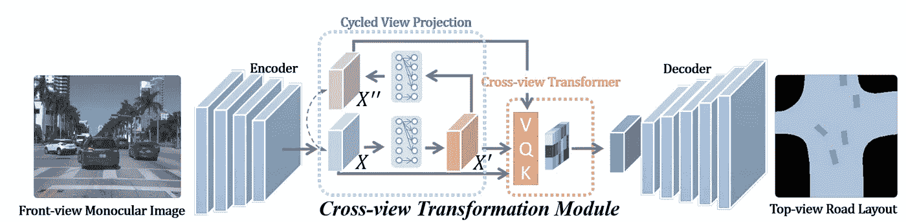

# 面向自动驾驶的单目鸟瞰语义分割

> 原文：<https://towardsdatascience.com/monocular-birds-eye-view-semantic-segmentation-for-autonomous-driving-ee2f771afb59?source=collection_archive---------2----------------------->

## 2020 年 BEV 语义分割综述

更新:

*   添加 BEV feat 缝线，2021/01/31
*   添加 PYVA，2021/10/01
*   添加全景 BEV，2021/10/04
*   TODO:添加 [**BEV-Seg**](https://arxiv.org/abs/2006.11436) ， [**CaDDN**](https://arxiv.org/abs/2103.01100) ， [**FIERY**](https://arxiv.org/abs/2104.10490) ，[**HDPE pnet**](https://arxiv.org/abs/2107.06307)**。**

我还写了一篇关于 BEV 物体检测的[更新博文](/monocular-bev-perception-with-transformers-in-autonomous-driving-c41e4a893944)，尤其是关于变形金刚。

 [## 自动驾驶中使用变压器的单目 BEV 感知

### 截至 2021 年末的学术文献和行业实践综述

towardsdatascience.com](/monocular-bev-perception-with-transformers-in-autonomous-driving-c41e4a893944) 

自动驾驶需要自我车辆周围环境的准确表示。环境包括静态元素，如道路布局和车道结构，也包括动态元素，如其他汽车、行人和其他类型的道路使用者。**静态**元素可由包含车道等级信息的高清地图捕捉。

有两种类型的映射方法，离线和在线。离线映射以及深度学习在离线映射中的应用，请参考[我之前的帖子](/deep-learning-in-mapping-for-autonomous-driving-9e33ee951a44)。在没有地图支持或无人驾驶汽车从未去过的地方，在线地图会很有用。对于在线绘图，一种传统的方法是 SLAM(同步定位和绘图),它依赖于对一系列图像的几何特征的检测和匹配，或者利用物体的[附加概念的变形。](/monocular-dynamic-object-slam-in-autonomous-driving-f12249052bf1)

 [## 自动驾驶地图中的深度学习

### 截至 2020 年的文献综述

towardsdatascience.com](/deep-learning-in-mapping-for-autonomous-driving-9e33ee951a44) 

这篇文章将关注另一种在线制图的方式——鸟瞰(BEV)语义分割。与 SLAM 相比，SLAM 需要来自同一移动摄像机的一系列图像，BEV 语义分割基于多个摄像机同时观察车辆的不同方向捕获的图像。因此，与 SLAM 相比，它能够从一次性收集的数据中生成更多有用的信息。此外，当 ego 汽车静止或缓慢移动时，BEV 语义分割仍将工作，而 SLAM 将表现不佳或失败。

BEV 语义分段与 SLAM 的输入差异(*图片由本文作者*提供)

# 为什么选择 BEV 语义地图？

在一个典型的自动驾驶堆栈中，**行为预测和规划**通常以这种**自上而下的视图(或鸟瞰图，BEV)** 完成，因为高度信息不太重要，自动驾驶汽车需要的大部分信息可以方便地用 BEV 表示。这个 BEV 空间可以被不严格地称为 3D 空间。(例如，BEV 空间中的对象检测通常被称为 3D 定位，以区别于成熟的 3D 对象检测。)

因此，标准做法是将高清地图光栅化为 BEV 图像，并在行为预测规划中与动态对象检测相结合。最近探索这一策略的研究包括 [IntentNet](http://www.cs.toronto.edu/~wenjie/papers/intentnet_corl18.pdf) (优步·ATG，2018 年)[司机网](https://arxiv.org/pdf/1812.03079.pdf) (Waymo，2019 年)[交通规则](https://arxiv.org/abs/1906.08945) (Zoox，2019 年) [Lyft 预测数据集](https://arxiv.org/abs/2006.14480) (Lyft，2020 年)，等等。

最近的研究将高清地图渲染为 BEV 语义地图(*图片由本文作者编辑，*来源于参考出版物)

诸如对象检测和语义分割的传统计算机视觉任务涉及在与输入图像相同的坐标框架中进行估计。因此，自动驾驶的**感知**堆栈通常发生在与车载摄像头图像相同的空间——透视视图空间**。**

感知发生在图像空间(左: [SegNet](https://arxiv.org/abs/1511.00561) )而规划发生在 BEV 空间(右: [NMP](http://www.cs.toronto.edu/~wenjie/papers/cvpr19/nmp.pdf) ) ( [来源](https://arxiv.org/abs/2008.05711))

感知中使用的表示与预测和规划等下游任务之间的差距通常在**传感器融合**堆栈中弥合，该堆栈通常在雷达或激光雷达等主动传感器的帮助下，将透视空间中的 2D 观测提升到 3D 或 BEV。也就是说，使用 BEV 表示对跨模态感知是有益的。首先，它是可解释的，并有助于调试每种传感模态的固有故障模式。它也很容易扩展到其他新的形式，并简化了后期融合的任务。此外，如上所述，这种表示中的感知结果可以很容易地被预测和计划堆栈使用。

# 将透视 RGB 图像提升到 BEV

来自主动传感器(如雷达或激光雷达)的数据有助于 BEV 表示，因为测量在 3D 中是固有的度量。然而，由于全景相机传感器的普遍存在和低成本，具有语义意义的 BEV 图像的生成最近吸引了很多关注。

在这篇文章的标题中，“单目”是指管道的输入是从单目 RGB 相机获得的图像，没有显式的深度信息。自主车辆上捕获的单目 RGB 图像是 3D 空间的透视投影，将 2D 透视观察提升到 3D 的逆问题是固有的不适定问题。

## 挑战，IPM 及其他

BEV 语义分割的一个明显挑战是**视图转换**。为了正确地恢复 3D 空间的 BEV 表示，该算法必须利用硬的(但可能有噪声的)几何先验，例如相机的内在和外在先验，以及软的先验，例如道路布局的知识集和常识(车辆在 BEV 中不重叠，等等)。传统上，[逆透视映射(IPM)](https://csyhhu.github.io/2015/07/09/IPM/) 一直是该任务的常用方法，假设平地假设和固定摄像机外部。但是，当相机外部条件变化时，这项任务不适用于不平坦的表面或崎岖不平的道路。

IPM 会在汽车等 3D 物体周围产生伪像([来源](https://csyhhu.github.io/2015/07/09/IPM/))

另一个挑战在于为这样的任务收集**数据和注释**。一种方法是让无人机一直跟随自动驾驶汽车(类似于 [MobileEye 的 CES 2020 talk](https://www.youtube.com/watch?v=HPWGFzqd7pI) )，然后要求人类标注语义分段。这种方法显然不具有实用性和可扩展性。许多研究依赖于合成数据或不成对的地图数据来训练提升算法。

在接下来的会议中，我将回顾该领域的最新进展，并强调其共性。根据使用的监控信号，这些研究可以大致分为两种类型。第一类研究借助模拟进行间接监管，第二类研究直接利用最近发布的多模态数据集进行直接监管。

# 模拟和语义分割

该领域的开创性研究使用模拟来生成必要的数据和注释，以将透视图像提升到 BEV 中。为了弥合模拟到现实(sim2real)领域的差距，许多人使用语义分割作为中间表示。

## VPN(查看解析器网络，RAL 2020)

[VPN(用于感知周围环境的跨视角语义分割)](https://arxiv.org/abs/1906.03560)是最早探索 BEV 语义分割的作品之一，并将其称为“跨视角语义分割”。视图解析网络(VPN)使用视图转换器模块来模拟从透视图到 BEV 的转换。这个模块被实现为一个多层感知器(MLP ),它将 2D 物理范围扩展到一个 1D 向量，然后在其上执行完全连接的操作。换句话说，它忽略了强几何先验，而是纯粹采用数据驱动的方法来学习透视到 BEV 扭曲。这种扭曲是特定于摄像机的，每个摄像机必须学习一个网络。

视图解析网络的整体管道([来源](https://arxiv.org/abs/1906.03560)

VPN 使用合成数据(用 [CARLA](https://carla.org/) 生成)和对抗性损失进行训练期间的域适应。此外，它使用语义遮罩作为中间表示，没有照片级的纹理间隙。

> 视图转换器模块的输入和输出具有相同的大小。该论文提到，这使得它很容易插入到其他架构中。在我看来，这实际上是完全没有必要的，因为透视图和 BEV 本质上是不同的空间，因此不需要强制相同的像素格式，甚至输入和输出之间的纵横比也不需要。代码可在 [github](https://view-parsing-network.github.io/) 上获得。

## 渔网(CVPR 2020)

[渔网](https://arxiv.org/abs/2006.09917)将激光雷达、雷达和相机融合转换成 BEV 空间中的单一统一表示。这种表示使得跨不同模态执行后期融合更加容易。视图转换模块(视觉路径中的紫色块)类似于基于 MLP 的 VPN。视图变换网络的输入是一系列图像，但它们只是在通道维度上连接起来并馈入网络，而不是利用 RNN 结构。

渔网使用 BEV 表示来促进跨传感器模态的后期融合([来源](https://arxiv.org/abs/2006.09917)

地面实况生成使用激光雷达中的 3D 注记，主要关注动态对象，如车辆和 VRU(易受影响的道路使用者，如行人和骑自行车的人)。其余的都由一个背景类表示。

> BEV 语义网格的分辨率为 10 厘米和 20 厘米/像素。这比[离线映射](/deep-learning-in-mapping-for-autonomous-driving-9e33ee951a44)中使用的典型值 4 或 5 厘米/像素要粗糙得多。遵循 [VPN](https://arxiv.org/abs/1906.03560) 的惯例，图像的尺寸与 192 x 320 的输出分辨率相匹配。CVPR 2020 的演讲可以在 Youtube 上找到。

## ICRA 2019 年奥运会

[VED(具有卷积变分编码器-解码器网络的单目语义占据网格映射](https://arxiv.org/abs/1804.02176))开发了用于语义占据网格映射预测的变分编码器-解码器(VED)架构。它对驾驶场景的前视视觉信息进行编码，并随后将其解码为 BEV 语义占用网格。

用于 VED 中视图变换的可变编码器-解码器网络([来源](https://arxiv.org/abs/1804.02176)

此地面实况是使用城市景观数据集中立体匹配的视差图生成的。这个过程可能会有噪声，这实际上促使使用 VED 和从潜在空间采样，以使模型对不完美的 GT 具有鲁棒性。然而，由于是 VAE，它通常不会产生尖锐的边缘，这可能是由于高斯先验和均方误差。

> 输入图像和输出图像分别为 256×512 和 64×64。 [VED](https://arxiv.org/abs/1804.02176) 利用了 vanilla SegNet(传统语义分割的相对强大的基线)的架构，并引入了一个 1 x2 池层，以适应输入和输出的不同纵横比。

## 学习观察周围的物体(ECCV 2018)

[**学习环视物体**寻找室外场景的俯视图表示](https://arxiv.org/abs/1803.10870)在 BEV 中产生遮挡区域的幻觉，并利用模拟和地图数据来帮助。

> 我个人认为，这是 BEV 语义分割领域的一篇开创性论文，但它似乎没有受到太多关注。也许它需要一个朗朗上口的名字？

学习环视物体的整体流程([来源](https://arxiv.org/abs/1803.10870)

通过逐像素深度预测和投影到 BEV 来完成视图变换。这部分克服了 BEV 空间中缺乏训练数据的问题。这也在后面的工作中完成，如下面审查的[提升、拍打、射击(ECCV 2020)](https://arxiv.org/abs/2008.05711) 。

论文用来学习幻觉(预测遮挡部分)的技巧相当惊人。对于 GT 深度很难找到的动态对象，我们过滤掉损失。随机屏蔽图像块，并要求模型产生幻觉。用亏损作为监督信号。

忽略动态区域，但明确删除静态区域以直接监控幻觉([源](https://arxiv.org/abs/1803.10870))

由于在 BEV 空间中很难获得显式成对的监督，因此本文使用对抗性损失来指导具有模拟和 [OpenStreetMap](https://www.openstreetmap.org/about) 数据的学习，以确保生成的道路布局看起来像真实的道路布局。这个技巧也用在后面的作品中，如[monola layout(WACV 2020)](https://arxiv.org/abs/2002.08394)。

它在图像空间中使用一个 CNN 进行深度和语义预测，将预测提升到 3D 空间并在 BEV 中渲染，最后在 BEV 空间中使用另一个 CNN 进行细化。BEV 中的这个细化模块还被用在很多其他作品中，如 Cam2BEV (ITSC 2020)和 [Lift，Splat，Shoot (ECCV 2020)](https://arxiv.org/abs/2008.05711) 。

## Cam2BEV (ITSC 2020)

在 Cam2BEV 中输入语义分割图像和预测的 BEV 图([来源](https://github.com/ika-rwth-aachen/Cam2BEV)

[**Cam2BEV** (一种 Sim2Real 深度学习方法，用于将来自多个车载摄像头的图像转换为鸟瞰图中语义分割的图像)](https://arxiv.org/abs/2005.04078)使用具有 IPM 的空间转换器模块将透视特征转换到 BEV 空间。神经网络架构接收由不同摄像机捕获的四幅图像，并在将它们连接在一起之前对每幅图像应用 IPM 变换。

Cam2BEV 使用确定性 IPM 来转换中间特征图([来源](https://arxiv.org/abs/2005.04078))

Cam2BEV 使用从 [VTD](https://www.mscsoftware.com/product/virtual-test-drive) (虚拟试驾)模拟环境生成的合成数据。它采用了四个语义分割图像，重点放在提升过程中，避免了处理 sim2real 域的空白。

Cam2BEV 具有相当集中的范围和许多设计选择，这使得它非常实用。首先，它只在语义空间起作用，因此避免了 sim2real domain gap 的问题。它有一个预处理阶段，故意掩盖遮挡区域，以避免对遮挡进行推理，并可以使问题更容易处理。为了简化提升过程，它还将“单应图像”作为输入，该单应图像由语义分割结果的 IPM 生成并连接成 360 deg 图像。因此，Cam2BEV 的主要目标是推理 BEV 中 3D 对象的物理范围，其在单应图像中可能被拉长。

预处理后的单应图像和目标 GT 供神经网络在 Cam2BEV 中预测([来源](https://arxiv.org/abs/2005.04078))

> Cam2BEV 的目标是校正 IPM，但在某种意义上，IPM 会扭曲 3D 对象，如不在路面上的汽车。然而，它仍然不能处理不平坦的路面或行驶过程中的倾斜度变化。Cam2BEV 的输入输出都是 256x512 像素。代码可在 [github](https://github.com/ika-rwth-aachen/Cam2BEV) 中获得。它还提供了一个很好的 IPM 基线实现。

# 你所需要的是(多模态)数据集

最近发布的许多多模态数据集( [Lyft](https://self-driving.lyft.com/level5/data/) 、 [Nuscenes](https://www.nuscenes.org/) 、 [Argoverse](https://www.argoverse.org/) 等)使得直接监督单目 BEV 语义分割任务成为可能。这些数据集不仅提供 3D 对象检测信息，还提供高清地图以及定位信息，以在高清地图上的每个时间戳精确定位 ego 车辆。

BEV 分割任务有两个部分，即(动态)对象分割任务和(静态)道路布局分割任务。对于对象分割，3D 边界框被光栅化到 BEV 图像中以生成注释。对于静态道路布局，基于所提供的定位结果将地图转换到 ego 车辆框架中，并光栅化为 BEV 注释。

## 单层布局(WACV 2020)

[**monola layout**:单幅图像的 Amodal 场景布局](https://arxiv.org/abs/2002.08394)重点是将单个摄像机提升到语义 BEV 空间。本文的重点是研究造成遮挡区域的模型完成情况。似乎受到了[学习观察周围物体的严重影响(ECCV 2018)](https://arxiv.org/abs/1803.10870) **。**

MonoLayout 在 KITTI(左)和 [Argoverse](https://www.argoverse.org/) (右)的闭塞区域产生幻觉([来源](https://arxiv.org/abs/2002.08394)

视图变换通过编码器-解码器结构来执行，并且潜在特征被称为“共享上下文”。两个解码器用于分别解码静态和动态类。作者还报告了在消融研究中使用组合解码器处理静态和动态对象的负面结果。

MonoLayout 的编解码设计([来源](https://arxiv.org/abs/2002.08394)

虽然高清地图 groundtruth 在 [Argoverse](https://www.argoverse.org/) 数据集中可用，但 MonoLayout 选择仅将其用于评估，而不是用于训练(事后诸葛亮还是有意的设计选择？).对于训练，MonoLayout 使用**时间传感器融合**过程，通过将整个视频中的 2D 语义分割结果与定位信息聚合来生成弱背景真相。它使用 monodepth2 将 RGB 像素提升为点云。它还会丢弃距离自我车 5 米远的任何东西，因为它们可能会很吵。为了鼓励网络输出可以想象的场景布局，MonoLayout 使用了对抗性特征学习(类似于在 [**学习环视物体**](https://arxiv.org/abs/1803.10870) 中使用的)。先验数据分布从 OpenStreetMap 获得。

> MonoLayout 的空间分辨率为 30 厘米/像素，因此 128 x 128 的输出相当于 BEV 空间中的 40 米 x 40 米。代码可在 [github](https://github.com/hbutsuak95/monolayout) 中获得。

## PyrOccNet (CVPR 2020)

[**PyrOccNet** :使用金字塔占据网络从图像预测语义图表示](https://arxiv.org/abs/2003.13402)从单目图像预测 BEV 语义图，并使用贝叶斯过滤将它们融合成连贯视图。

PyrOccNet 在 NuScenes 数据集上的演示结果([来源](https://arxiv.org/abs/2003.13402))

PyrOccNet 中视图转换的核心组件是通过**密集转换器**模块执行的(*注意，该转换器不是基于注意力的！*)。它似乎受到了来自同一作者的 [OFT (BMVC 2019)](https://arxiv.org/abs/1811.08188) 的极大启发。OFT 沿着投射回 3D 空间的光线在像素位置均匀地涂抹特征，这非常类似于[计算断层摄影](https://en.wikipedia.org/wiki/Tomographic_reconstruction)中使用的背投算法。PyrOccNet 中的密集变压器模块通过使用 FC 层沿深度轴扩展而更进一步。实际上，在 BEV 空间中，有多个密集的变压器以不同的比例工作，集中在不同的距离范围。

> 密集的变压器层的灵感来自于这样的观察:虽然网络需要大量的垂直上下文来将特征映射到鸟瞰图(由于遮挡、缺乏深度信息和未知的地面拓扑)，但是在水平方向上，BEV 位置和图像位置之间的关系可以使用简单的相机几何结构来建立。—来自 [PyrOccNet](https://arxiv.org/abs/2003.13402) paper

密集变压器的 PyrOccNet 架构图([来源](https://arxiv.org/abs/2003.13402)

训练数据来自于 [Argoverse 数据集](https://www.argoverse.org/)和 [nuScenes 数据集](https://www.nuscenes.org/)的多模态数据集，其中既有地图数据，也有 3D 物体检测地面真实

PyrOccNet 使用贝叶斯过滤以连贯的方式融合跨多个摄像机和跨时间的信息。它从[二元贝叶斯占用网格](https://en.wikipedia.org/wiki/Occupancy_grid_mapping)的旧思想中汲取灵感，并增强网络输出的可解释性。时间融合结果非常类似于映射过程，并且非常类似于[monola layout](https://arxiv.org/abs/2002.08394)中用于生成弱 GT 的“时间传感器融合”过程。

仅静态类的 PyrOccNet 的时间融合结果([来源](https://arxiv.org/abs/2003.13402))

> PyrOccNet 的空间分辨率为 25 厘米/像素，因此 200 x 200 的输出相当于 BEV 空间中的 50 米 x 50 米。代码将在 [github](https://github.com/tom-roddick/mono-semantic-maps) 中提供。

## 举起，拍打，射击(ECCV 2020)

nuScenes 数据集上的演示([来源](https://nv-tlabs.github.io/lift-splat-shoot/))

[**提升、拍打、拍摄**:通过隐式反投影到 3D 对来自任意相机装备的图像进行编码](https://arxiv.org/abs/2008.05711)为视图变换执行密集的逐像素深度估计。它首先使用每个摄像机的 CNN 来执行概率性的像素深度预测，以将每个透视图像提升到 3D 点云中，然后使用摄像机 extrinsics 来绘制 BEV。最后，使用 BEV CNN 来改进预测。“拍摄”部分意味着路径规划，将被跳过，因为它超出了本文的范围。

提升和飞溅管道(左)和概率深度预测(右)([来源](https://arxiv.org/abs/2008.05711)

通过预测 RGB 图像中像素的深度分布，提出了概率 3D 提升。某种程度上统一了[伪激光雷达](https://arxiv.org/abs/1812.07179) (CVPR 2019)的一热提升和 [OFT](https://arxiv.org/abs/1811.08188) (BMVC 2019)的统一提升。其实这种“软”预测是 [**可微分渲染**](https://arxiv.org/abs/2006.12057) 中常用的一招。[伪激光雷达 v3](https://arxiv.org/abs/2004.03080) (CVPR 2020)的并发工作也使用了这种软光栅化技巧，使深度提升和投影变得可区分。

训练数据来自于 [Lyft 数据集](https://self-driving.lyft.com/level5/data/)和 [nuScenes 数据集](https://www.nuscenes.org/)的多模态数据集，其中既有地图数据，也有 3D 物体检测地面真实。

> [Lift-Splat-Shoot](https://arxiv.org/abs/2008.05711) 输入分辨率为 128x352，BEV 网格为 200x200，分辨率为 0.5 m/pixel = 100m x 100m。代码可在 [github](https://github.com/nv-tlabs/lift-splat-shoot) 中找到。

## BEV 特征拼接

PyrOccNet 和[Lift-Splat-shot](https://arxiv.org/abs/2008.05711)都专注于将来自多个相机的同步图像拼接成一个连贯的 360 度视图。 **BEV 特征拼接** ( [使用机载单目摄像机理解鸟瞰语义高清地图](https://arxiv.org/abs/2012.03040))将单目视频(具有估计的自我姿态)融合成连贯的前视。

[BEV 特征拼接](https://arxiv.org/abs/2012.03040)使用 BEV 时间聚合将单目视频转换成 BEV 图

[BEV 特征拼接](https://arxiv.org/abs/2012.03040)取单目视频(一系列图像)作为模型的输入。为了融合来自多个帧的信息，它引入了 BEV 时间聚合模块。该模块首先投影中间特征图，然后将具有自我姿态(从里程计管道估计)的特征图聚集到连贯和扩展的 BEV 空间中。此外，每个图像帧的中间特征在摄像机空间中用重新投影的 BEV 地面真实来监督。

> [BEV 特征拼接](https://arxiv.org/abs/2012.03040)具有 200x200 像素的 BEV 网格，分辨率为 0.25 m/pixel = 50m x 50m。

## **PYVA** :用心投射你的观点(CVPR 2021)

由于卷积层的局部受限感受野，CNN 很难直接拟合视图投影模型。因此，大多数基于 CNN 的方法明确地将视图变换编码到 CNN 架构中(具有相机外切的特征地图的单应变换等)。

另一方面，由于全局注意机制，变形金刚更适合做这项工作。 **PYVA (**

在 [VPN](https://arxiv.org/abs/1906.03560) 之后，PYVA 使用 MLP 将投影图像特征提升到 BEV 中。然后，它使用交叉注意力转换器来进一步细化提升。提升后的 BEV 特征 X’用作查询，图像特征 X(或循环重投影的图像特征 X”)用作键和值。

使用交叉注意力转换器模块背后的思想是直观的:*对于查询中的每个像素(BEV 特征)，网络应该关注键(图像特征)中的哪个像素*？不幸的是，本文没有展示 transformer 模块内部的一些注意力地图的例子，这些例子可以很好地说明这种直觉。

[PYVA](https://openaccess.thecvf.com/content/CVPR2021/papers/Yang_Projecting_Your_View_Attentively_Monocular_Road_Scene_Layout_Estimation_via_CVPR_2021_paper.pdf) 使用交叉视图转换器模块将前视图提升到 BEV 中

PYVA 遵循[monola layout](https://arxiv.org/abs/2002.08394)的思想，利用对抗性训练损失，促使解码器输出更合理的道路布局和车辆位置。PYVA 更进一步，不仅鼓励网络输出合理的车辆位置，还输出道路和车辆之间合理的**关系**，因为道路布局在预测车辆位置和方向之前提供了有用的信息(例如，汽车更有可能停在路边)。

## 全景 BEV

全景 BEV ( [使用单目正视图图像的鸟瞰全景分割](https://arxiv.org/abs/2108.03227))正确地指出实例的概念对下游是至关重要的。 **FIERY** 将语义分割思想扩展到实例分割，**全景 BEV** 更进一步，在 BEV 空间进行全景分割。

Panoptic BEV 使用带有 BiFPN(如 EfficientDet)颈部的 ResNet 主干。在每个级别(P2-P5)，图像特征通过密集转换器模块被投射到 BEV 中(*注意，这个转换器不是基于注意力的！*)。

全景 BEV 的网络架构(transformer her 不是基于注意力的)

在每个密集变压器中，有一个明显的垂直变压器和一个平面变压器。首先，输入图像被二进制语义分割成垂直掩码和水平掩码。被垂直屏蔽屏蔽的图像被馈送到垂直变换器。**垂直**转换器使用体积晶格来模拟中间 3D 空间，然后将其展平以生成垂直 BEV 特征。这种立式变压器与[升降拍击](https://arxiv.org/abs/2008.05711)的变压器非常相似。**扁平**变压器使用 IPM，后接误差校正模块(ECM ),以产生扁平 BEV 特征。这很大程度上遵循了 [PyrOccNet](https://arxiv.org/abs/2003.13402) 的思路。

密集变压器提升图像到 BEV，并有一个垂直变压器和平面变压器

通过将 IPM 的先验信息注入到总升降管道中，整个设计似乎是建立在[升降拍击](https://arxiv.org/abs/2008.05711)和 [PyrOccNet](https://arxiv.org/abs/2003.13402) 之上。模块设计看起来确实很合理，但它们感觉太手工制作和复杂，一旦模型可以访问足够的数据，可能不会导致最佳性能。

> 从将视图转换模块命名为“密集转换器”和引用“垂直特征”来看， [PyrOccNet](https://arxiv.org/abs/2003.13402) 的影响也很明显。从演示视频看，结果很有希望。将在 [Github](https://github.com/robot-learning-freiburg/PanopticBEV) 上发布的代码。

# 局限性和未来方向

尽管在 BEV 语义分割方面已经取得了很大进展，但是在它被广泛部署到生产系统之前，我认为还存在几个关键的差距。

首先，对于动态参与者来说，还没有**实例**的概念。这使得在行为预测中很难利用动态对象的先验知识。例如，汽车遵循某种运动模型(如自行车模型)，未来轨迹的模式有限，而行人往往具有更多随机运动。许多现有的方法倾向于在语义分割结果中将多个汽车连接成一个连续的区域。

动态语义类不能被重用，并且在很大程度上是“一次性的”信息，而 BEV 图像中的静态语义类(例如道路布局和道路上的标记)可以被视为“**在线地图**，并且应该被收获和回收。如何聚合多个时间戳上的 BEV 语义分段来估计一个**更好的映射**是另一个需要回答的关键问题。[monola layout](https://arxiv.org/abs/2002.08394)和 [PyrOccNet](https://arxiv.org/abs/2003.13402) 中的时间传感器融合方法可能有用，但需要针对 SLAM 等传统方法进行基准测试。

如何将线上的逐像素语义图转换成**轻量级结构化图**以备将来重用。为了不浪费宝贵的车载地图周期，在线地图必须转换成某种格式，以便 ego 汽车或其他汽车在未来可以有效地利用。

# 外卖食品

*   **视图变换**:现有的许多工作忽略了相机外部的强几何先验信息。应该避免这种情况。 [PyrOccNet](https://arxiv.org/abs/2003.13402) 和 Lift-Splat-shot 看起来方向正确。
*   **数据和监管:**2020 年之前的大部分研究都是基于仿真数据，并使用语义分割作为中间表示，以弥合 sim2real 领域的差距。最近的工作利用多模态数据集对任务进行直接监督，取得了非常有希望的结果。
*   我确实觉得 BEV 空间中的感知是感知的未来，尤其是借助**可微分渲染**，可以将视图变换实现为可微分模块，并插入端到端模型，直接将透视图像提升到 BEV 空间中。

# 参考

*   [**VPN** :感知周围环境的跨视角语义分割](https://arxiv.org/abs/1906.03560)，RAL 2020
*   [**VED** :卷积变分编解码网络的单目语义占据网格映射](https://arxiv.org/abs/1804.02176)，ICRA 2019
*   [**Cam2BEV** :一种模拟现实深度学习方法，用于将来自多个车载摄像头的图像转换为鸟瞰图中的语义分割图像](https://arxiv.org/abs/2005.04078)，ITSC 2020
*   [**BEV-Seg** :利用几何和语义点云进行鸟瞰语义分割](https://arxiv.org/abs/2006.11436)，CVPR 2020 研讨会
*   [**学习环视物体**寻找户外场景的俯视图](https://arxiv.org/abs/1803.10870)，ECCV 2018
*   [**渔网**:网格中语义热图的未来推断](https://arxiv.org/abs/2006.09917)，CVPR 2020
*   [**monola layout**:单幅图像的模拟场景布局](https://arxiv.org/abs/2002.08394)，WACV 2020
*   

*   **[https://www . Reddit . com/r/self driving cars/comments/gxq56t/recreating _ the _ Tesla _ autopilots _ birds _ eye _ view/](https://www.reddit.com/r/SelfDrivingCars/comments/gxq56t/recreating_the_tesla_autopilots_birds_eye_view/)和 github 上的[代码](https://github.com/MankaranSingh/Auto-Birds-Eye)**
*   **[https://medium . com/asap-report/from-semantic-segmentation-to-semantic-birds-eye-view-in-the-the-Carla-simulator-1e 636741 af 3f](https://medium.com/asap-report/from-semantic-segmentation-to-semantic-birds-eye-view-in-the-carla-simulator-1e636741af3f)**
*   **[**一千零一个小时**:自驾运动预测数据集](https://arxiv.org/abs/2006.14480)，Lyft 预测数据集**
*   **[**司机网**:模仿最好综合最差](https://arxiv.org/pdf/1812.03079.pdf)学车，RSS 2019**
*   **[**道路规则**:用语义交互卷积模型预测驾驶行为](https://arxiv.org/abs/1906.08945)，CVPR 2019**
*   **[**IntentNet** :学习从原始传感器数据预测意图](http://www.cs.toronto.edu/~wenjie/papers/intentnet_corl18.pdf)，CoRL 2018**
*   **[**OFT** :单目三维物体检测的正交特征变换](https://arxiv.org/abs/1811.08188)，BMVC 2019**
*   **[**来自视觉深度估计的伪激光雷达**:填补自动驾驶 3D 物体检测的空白](https://arxiv.org/abs/1812.07179)，CVPR 2019**
*   **[**伪激光雷达 v3** :基于图像的三维目标探测端到端伪激光雷达](https://arxiv.org/abs/2004.03080)，CVPR 2020**
*   **[**BEV-Feat-Stitching**:使用机载单目摄像机理解鸟瞰语义高清地图](https://arxiv.org/abs/2012.03040)，Arxiv 2021/01**
*   **[**PYVA** :用心投射你的视角:通过交叉视角变换的单目道路场景布局估计](https://openaccess.thecvf.com/content/CVPR2021/papers/Yang_Projecting_Your_View_Attentively_Monocular_Road_Scene_Layout_Estimation_via_CVPR_2021_paper.pdf)，CVPR 2021**
*   **[**:使用单目正视图图像的鸟瞰全景分割**](https://arxiv.org/abs/2108.03227)**，Arxiv 2021/08****
*   ****[**CaDDN** :单目 3D 物体检测的分类深度分布网络](https://arxiv.org/abs/2103.01100)，CVPR 2021 口述****
*   ****[**火热**:从环绕单目摄像机鸟瞰未来实例预测](https://arxiv.org/abs/2104.10490)，ICCV 2021****
*   ****[**BEV-Seg** :利用几何和语义点云进行鸟瞰语义分割](https://arxiv.org/abs/2006.11436)，CVPR 2020 研讨会****
*   ****[**高清地图网**:在线高清地图构建与评估框架](https://arxiv.org/abs/2107.06307)，CVPR 2021 研讨会****