# 自主驾驶中的单目动态物体 SLAM

> 原文：<https://towardsdatascience.com/monocular-dynamic-object-slam-in-autonomous-driving-f12249052bf1?source=collection_archive---------18----------------------->

## 截至 2020 年的 monoDOS 回顾

更新:

*   2020 年 7 月 11 日，添加来自 S3DOT 作者的 [ST3D](https://arxiv.org/pdf/2004.09305.pdf) (CVPR 2020)。

传统的 SLAM(同步定位和绘图)算法通常有一个**静态**世界假设。即使对于能够在动态环境中运行的实际 SLAM 系统，它们通常也将动态对象视为异常值，并试图在应用常规 SLAM 流水线之前将其过滤掉以获得静态环境。这严重限制了其在自动驾驶中的在线应用，其中动态对象的显式处理至关重要。

**单目动态物体 SLAM (MonoDOS)** 以两种方式扩展了传统的 SLAM 方法。它是**对象**感知的，因为它不仅检测和跟踪关键点，还检测和跟踪具有更高级语义含义的对象。它也是动态的，因为它可以处理带有动态对象的场景，并跟踪这些对象的运动。

> 最好记住，不是所有的对象 SLAM 系统都是动态的，也不是所有的动态 SLAM 系统都是对象感知的。物体 SLAM 的开创性工作是[SLAM++](https://www.doc.ic.ac.uk/~ajd/Publications/salas-moreno_etal_cvpr2013.pdf)**(CVPR 2013)**但是它仍然需要一个有静态物体的静态场景。[一些动态 SLAM 系统](https://natanaso.github.io/rcw-icra18/assets/ref/ICRA-MRP18_paper_13.pdf)改进了基于刚体和恒定速度约束的姿态估计，但是没有对象的明确概念。****

****这篇文章回顾了动态对象 SLAM 领域的几篇最新论文。它主要关注单目方法，以及一些可以修改为单目设置的立体方法。这绝不是一个详尽的综述，如果你推荐其他相关的研究，请告诉我。****

# ****动态对象 SLAM 的要素****

****动态对象 SLAM 系统引入了对象的概念，这有几个含义。首先，它需要有一个来自单个帧的**对象提议阶段**，就像传统 SLAM 系统中的关键点提议阶段(如 ORB-SLAM 中的 ORB)。该阶段将给出 2D 或 3D 物体检测结果。单目 3D 物体检测的最新进展将在这里大放异彩。第二，它有一个更复杂的**数据关联。**静态 SLAM 只关心关键点，数据关联只是指用特征向量进行跨帧的关键点匹配。现在我们引入了对象的概念，我们还必须在每一帧中的关键点和对象之间以及跨帧的对象之间执行数据关联。第三，作为对传统 SLAM 中的**束调整**的自然扩展，现在我们必须添加被跟踪的对象(轨迹线)和这些对象上的动态关键点，可选地具有来自假定运动模型的速度约束。****

****我制作了下面的图表来捕捉动态对象 SLAM 的三个基本元素。绿色块表示数据关联过程，蓝色块表示光束法平差过程，红色方块表示光束法平差的[因子图表示](http://www.cs.cmu.edu/~kaess/pub/Dellaert17fnt.pdf)中需要优化的因子。****

****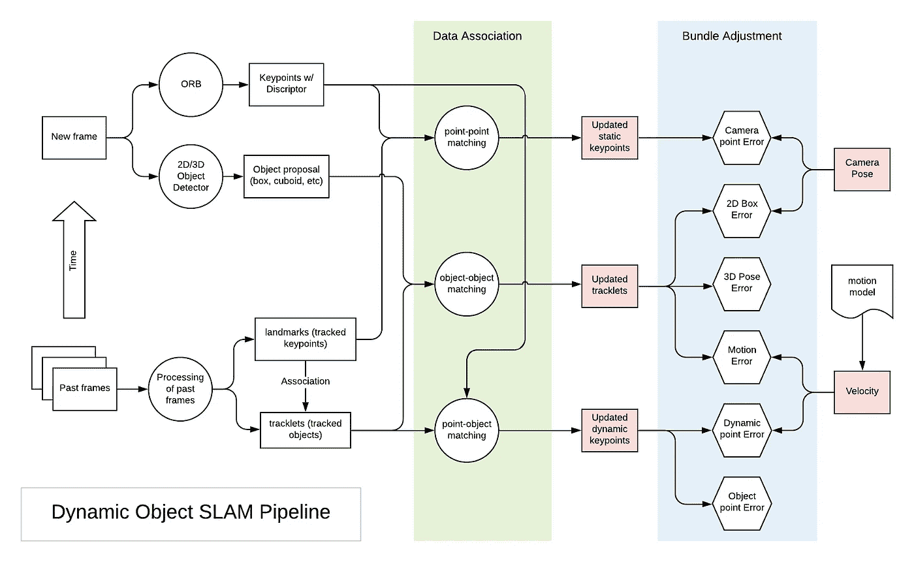****

****典型动态对象 SLAM 的流水线和元素****

> ******为什么对象？******
> 
> ****记住这三个基本元素，我们可以问这样一个问题:为什么在 SLAM 中引入动态对象会有效？首先，假设物体是刚体，随着时间的推移，形状**和大小**固定。还假设对象具有简单且物理上合理的运动模型，该模型鼓励**随着时间的推移而平滑地改变**姿势。因此，物体的大小和姿态变化都可以用少量的参数来描述。另一方面，对象的引入可以在束平差阶段制定更大数量的约束。在 N 帧中引入 M 个对象很大程度上增加了 O(M)个未知数和 O(MN)个约束。这使得 SLAM 问题更加健壮。****

****在接下来的每篇论文的回顾环节中，我将对每篇作品中的上述三个基本要素进行梳理。****

# ****[立方体 SLAM:单目 3D 物体 SLAM (TRO 2019)](https://arxiv.org/abs/1806.00557)****

****这可能是动态对象 SLAM 中最全面的作品。cubeSLAM 的一个主要贡献是它以优雅的方式将长方体的大小和位置集成到因子图优化中。它还使用一个运动模型来约束长方体可能的运动，从而优化物体的速度。在这个公式下，3D 对象检测和 SLAM 可以相互受益。对象为 BA 和深度初始化提供几何和比例约束。它还可以增加泛化能力，让 orb slam 在低纹理环境中工作。mono3D 结果使用 BA 和运动模型的约束进行优化。****

## ****目标提议****

****利用 2D 物体检测和低层图像特征进行三维长方体提案的生成和评分。这个看似天真的方法对椅子和汽车都非常有效。但是我确信[基于深度学习的方法](/monocular-3d-object-detection-in-autonomous-driving-2476a3c7f57e)会在这个领域产生更好的结果。****

****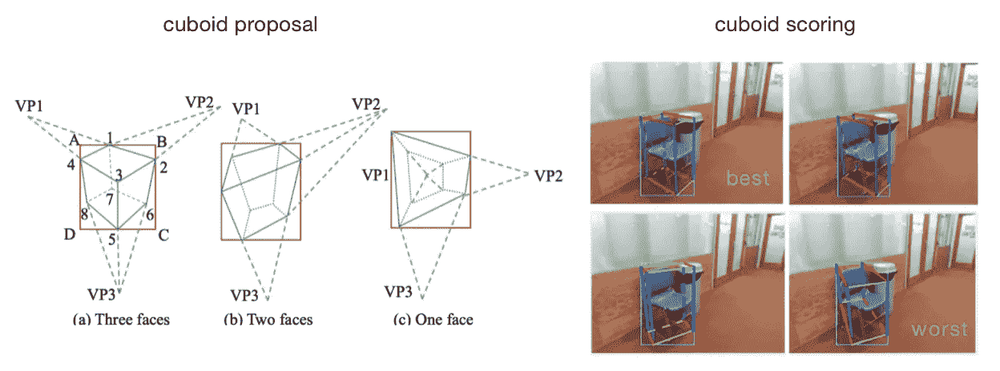****

****长方体提案生成与评分([来源](https://arxiv.org/pdf/1806.00557.pdf)****

## ****数据关联****

****正如概述中提到的，数据关联必须在多个级别上执行，包括点-点、点-对象和对象-对象。****

*   ******点对点匹配**:首先，按照标准 orb-SLAM 的方式，基于 ORB 特征进行关键点匹配。对于不满足极线约束的匹配关键点，它们属于动态对象。对于**动态**关键点，按特征匹配可能会失败，直接用稀疏光流(KLT 光流)跟踪。在跟踪之后，动态关键点的 3D 位置将被三角测量。****
*   ******点-对象匹配**:对于**静态**关键点，如果它们属于同一个包围盒，那么它与那个对象相关联。这里使用了许多试探法来确保稳健的性能。例如，点必须在 2 帧的同一个 bbox 内，并且距离长方体中心小于 1 米。框之间重叠区域中的特征点被忽略。****
*   ******物体-物体匹配**:物体匹配通过匹配的关键点间接完成。如果连续帧中的两个对象共享最多的特征点(并且超过 10 个)，则它们作为同一对象被跟踪。在基于特征的匹配或 KLT 跟踪失败的情况下，在边界框级别上使用视觉对象跟踪方法来完成动态对象跟踪。****

## ****目标感知光束法平差****

****静态关键点与相机姿态联合优化，具有与 ORB-SLAM 相同的**相机点误差**或重新投影误差。在从每个帧获得最佳 3D 建议后，我们可以将其视为 9DoF 3D“测量”,并公式化光束法平差问题。对于静态对象，我们有以下错误术语。****

*   ******3D 摄像机-物体误差:**被跟踪的地标物体具有 6 自由度姿态+3 自由度长方体尺寸，这可以与 9 自由度 3D 测量进行比较，并形成第一误差项。****
*   ******2D 相机-物体误差**:从 3D 测量我们可以投射 8 个角到相机图像中。8 个点的最小边界框应该与每帧的 2d 检测 bbox 一致。****

> ****请注意，这种 2D-3D 一致性假设并不总是正确的，但对于自动驾驶中车载摄像头的典型视点(水平或稍微向下看)来说，大多数时间都足够接近。****

*   ******物点误差**:对于与 bbox 关联的点，根据长方体的中心和大小，它应该位于长方体内。****

****对于动态对象，cube SLAM 假设动态对象是遵循物理上可行的运动模型的刚体。这引入了两个额外的误差项。****

*   ******运动误差**:从 t 帧的一个物体开始，根据分段匀速运动模型，演化状态为 t+1。那么应该和 t+1 时的观测一致。请注意，这涉及到每个动态对象的新状态速度。****
*   ******动态点误差**:如果一个点在动态对象上，那么它与动态对象的相对位置是固定的。换句话说，动态点被锚定到相关联的对象。****

****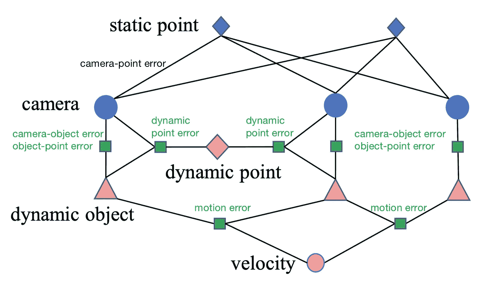****

****立方体的因子图。绿色方块是与动态对象相关的因素。为了清楚起见，博客作者添加了绿色/黑色的小文本。([来源](https://arxiv.org/abs/1806.00557))****

## ****裁决****

****CubeSLAM 可以生成一些令人印象深刻的演示，在 KITTI 中使用时间一致的长方体检测和跟踪动态场景中的 3D 对象。然而 SLAM 的结果可能并不总是优于单眼提议。它还可以估计动态对象的速度轮廓，大约在 1 米/秒以内，即使是在分段恒定运动的假设下。请注意，计算里程计(相机姿态)时会考虑对象约束。****

****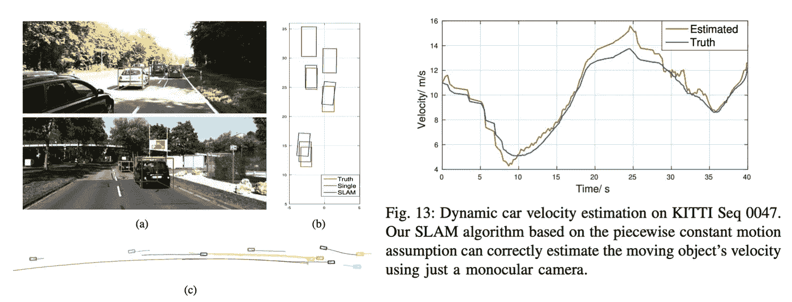****

****SLAM 的 3D 对象检测及其跟踪轨迹、速度估计([来源](https://arxiv.org/abs/1806.00557))****

# ****[**S3DOT** :基于立体视觉的语义三维物体和自主驾驶的自我运动跟踪(ECCV 2018)](https://arxiv.org/abs/1807.02062)****

****这项研究是基于立体视频流，但该框架可以扩展到单目 SLAM。本文的主要贡献是展示了使用视频检测和跟踪截断的 3D 对象的能力，否则很难在单个图像上检测到这些对象。****

****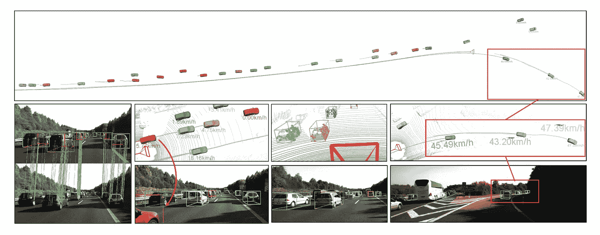****

****S3DOT 能够预测极端截断汽车的姿态，预测一致的轨迹，并估计被跟踪汽车的速度([来源](https://arxiv.org/pdf/1807.02062.pdf)****

## ****目标提议****

****该管道的灵感来自 Deep3DBox (CVPR 2017，详细配方见[我的评论帖](/geometric-reasoning-based-cuboid-generation-in-monocular-3d-object-detection-5ee2996270d1))。它使用 2D 包围盒从对象检测和 8 视点分类。它在推断物距之前使用形状尺寸。这使得管道足够通用，可以用在单目设置中。****

****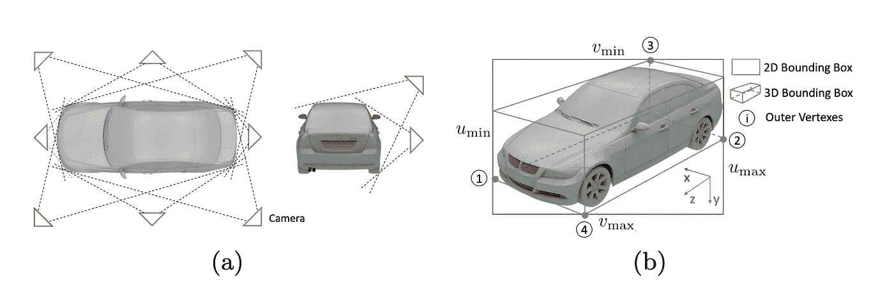****

****2D 盒子+视点= 3D 包围盒([来源](https://arxiv.org/pdf/1807.02062.pdf))****

## ****数据关联****

*   ******对象-对象匹配:**通过相似性得分投票来匹配跨帧的 2D 包围盒。在补偿相机旋转之后，相似性分数考虑了边界框形状相似性和中心距离。****
*   ******点-点匹配**:与匹配的边界框或物体轮廓(2D 图像中 8 个投影角对着的凸包)内的圆形特征进行关键点匹配，用于静态背景。****
*   ******点-对象匹配:**没有明确说明，但是当一个点在该对象的对象轮廓内时，该点应该与该对象相关联。这种简单的关联策略是由于高效的 3D 提议导致了多边形 2D 对象轮廓，其非常类似于对象实例遮罩。****

## ****目标感知光束法平差****

****对象轮廓外的关键点被计为静态关键点。静态关键点和相机姿态通过**相机点误差**以与 ORB-SLAM 相同的方式联合优化。在相机姿态(或自我运动)被求解之后，物体姿态被求解。动态对象 BA 有四个误差项。****

*   ******动态点误差**(稀疏特征观察):刚性物体上的特征点在物体坐标系中有固定的坐标。****
*   ******2D 相机-物体误差**(语义 3D 物体测量):3D 被跟踪物体的投影应适合 2D 测量。****
*   ****对象尺寸一致性:对象形状在帧之间保持一致。这是 cubeSLAM 中 **3D** **相机-物体**错误的一部分。****
*   ******运动误差**:时间预测姿态应与单帧 3D 建议一致。确保一致的方向和运动估计的运动学运动模型。它包括车辆亮度、速度、转向角。****
*   ****动态点云对齐:在最小化上述误差之后，我们获得基于尺寸先验的物体姿态的 MPA 估计。为了纠正这个先验中的任何偏差，S3DOT 执行一个名为*的动态点云对齐*的步骤，以将 3D 长方体与跟踪的点云对齐。这实质上是 cubeSLAM 中的**物点误差**。****

## ****裁决****

****S3DOT 展示了在 KITTI 中检测和跟踪动态场景中的 3D 对象的令人印象深刻的结果。请注意，在计算里程计(相机姿态)时，不考虑对象约束。****

****S3DOT 的作者在 CVPR 2020 发布了另一个作品， [**ST3D:** 立体 3D 物体跟踪的时空联合优化](https://arxiv.org/abs/2004.09305)。这项工作主要利用深度学习进行 3D 检测，然后执行联合时空优化。****

****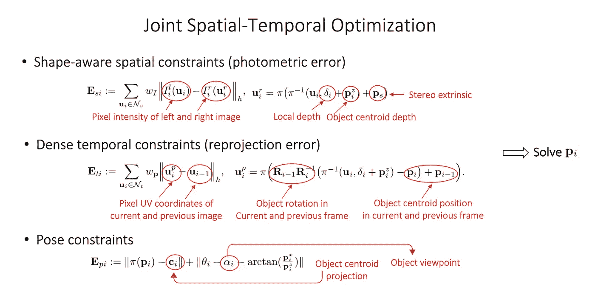****

# ****[**ClusterVO** :对移动实例进行聚类，并为自己和周围环境估计视觉里程表(CVPR 2020)](https://arxiv.org/abs/2003.12980)****

****ClusterVO 提出了一种更通用的动态 SLAM 方法，通过将对象表示为被跟踪的关键点(或本文中的*点界标*)的集群。****

****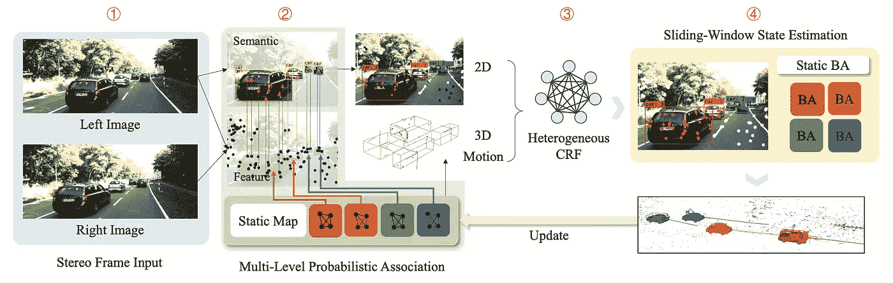****

****ClusterVO 的整体管道([来源](https://arxiv.org/abs/1807.02062))****

## ****目标提议****

****ClusterVO 使用 YOLOv3 作为 2D 对象检测器，为每一帧中的对象提出语义 2D 边界框。它并没有假设物体可以用立方体来描述，比如 cubeSLAM 或者 S3DOT。因此不存在长方体生成阶段。****

## ****数据关联****

****ClusterVO 执行一个非常复杂的数据关联方案。它可以被视为两步过程，将观察到的关键点与被跟踪的界标相关联并将边界框与被跟踪的聚类相关联的多级概率关联，随后是将被跟踪的界标与被跟踪的聚类相关联的异构 CRF。****

*   ******点对点匹配**:这属于多级概率关联。最近邻和描述符匹配对于静态关键点可能工作得很好，但是对于动态点则不行。因此，首先预测每个集群的位置及其速度(只有线性，没有旋转)。如果观察值 k 在运动预测标志点 *i* 的投影附近，则将关键点观察值 *k* 关联到标志点 *i* 的概率与描述符相似度成比例。****
*   ******物物匹配**:这也属于多级概率关联。如果边界框 *m* 包含来自一个簇的最多数量的投影点，那么它与该簇 *q* (对象)相关联。****
*   ******点目标匹配**:这是最复杂的部分，使用了一个异质条件随机场(CRF)。它确定界标 *i* 是否与群集 *q* 相关联。它有多个能量项。一元能量项包括 **2D 能量**(如果一个点在与一个簇相关联的边界框内，那么它很有可能与该簇相关联。如果它在多个边界框内，则它可以被分配给多个簇)、一个 **3D 能量**(如果一个点靠近簇的中心，则它具有与簇相关联的更高概率，由簇的大小来调制)和一个**运动能量**(地标的投影可以由簇的运动来解释)。成对的**标签平滑能量**项惩罚邻近的界标，如果它们与不同的聚类相关联的话。****

## ****目标感知光束法平差****

****在概率数据关联之后，我们可以为静态场景和动态集群制定 BA。它使用滑动窗口和专门设计的双轨帧管理来管理关键帧。****

*   ******相机点误差**:对于**静态**场景，clusterVO 联合优化相机姿态和静态关键点的位置，类似于 ORB-SLAM。当 clusterVO 选择滑动窗口状态估计方法时，它还通过附加的*边缘化*项来增强。这个边缘化术语捕获了由于滑动窗口的有限宽度而被移除的来自观察的贡献。****
*   ******运动误差**:时间预测的姿态应该与从单个帧推断的 3D 测量一致。采用具有从高斯过程采样的加速度的运动模型。ClusterVO 只考虑**平移**部分。****
*   ******动态点误差** : clusterVO 也有这个动态点误差，类似于 cubeSLAM 和 S3DOT。如果一个点在动态对象上，那么它与动态对象的相对位置是固定的。****

## ****裁决****

****ClusterVO 是一种更通用的动态对象 SLAM 方法。从 KITTI 动态场景的结果来看，长方体的质量并不像在地标聚类的后处理步骤中估计的那样好。对于自动驾驶，CubeSLAM 和 S3DOT 似乎更实用。请注意，优化里程计(相机姿态)时会考虑对象约束。****

# ****[**MoMoSLAM:** 用于动态环境的多目标单目 SLAM(IV 2020)](https://arxiv.org/abs/2002.03528)****

****“多体单声道 SLAM”的概念似乎来自于“[多体 SfM](https://ethz.ch/content/dam/ethz/special-interest/baug/igp/photogrammetry-remote-sensing-dam/documents/pdf/ozden10pami.pdf) ”，但它本质上与动态对象 SLAM 具有相同的含义。****

## ****目标提议****

****MoMoSLAM 使用了一个相当笨重但精确的 3D 对象提议管道。它使用形状先验和关键点将 2D 检测提升到 3D 形状。它首先检测车辆可区分特征上的 k=36 个有序关键点，以及一系列基本形状的变形系数。然后通过最小化重投影误差将 2D 检测提升到三维，得到 6 自由度的姿态和形状参数。这是作者在以前的出版物[**(IROS 2018)**](https://arxiv.org/abs/1803.02057)**中使用的，与[**RoI-10D**](https://github.com/patrick-llgc/Learning-Deep-Learning/blob/master/paper_notes/roi10d.md)(CVPR 2019)非常相似。******

****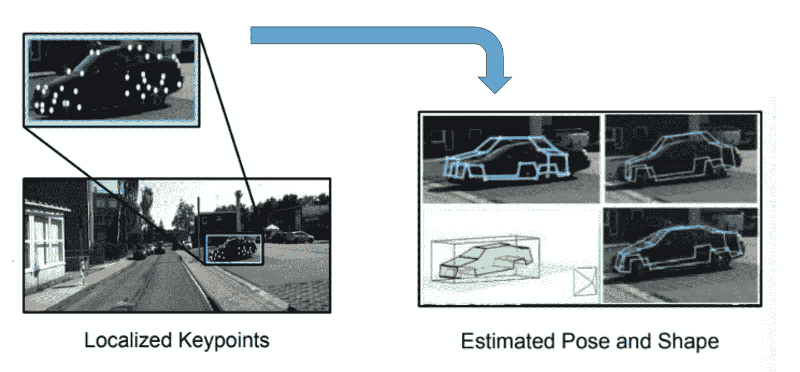****

****从 2D 关键点到 3D 形状(来源:[地球不是平的](https://arxiv.org/abs/1803.02057)，IROS 2018)****

## ****数据关联****

*   ******点对点匹配**:基于描述符特征的关键点匹配，类似于 ORB-SLAM。****
*   ******对象-对象匹配**:这在论文中没有明确提到，但是这是肯定需要的。任何 2D 物体追踪方法都可以。****
*   ******点物匹配**:未使用。这是通过检测每一帧中每个对象的语义关键点来隐式地和部分地完成的。****

## ****目标感知光束法平差****

****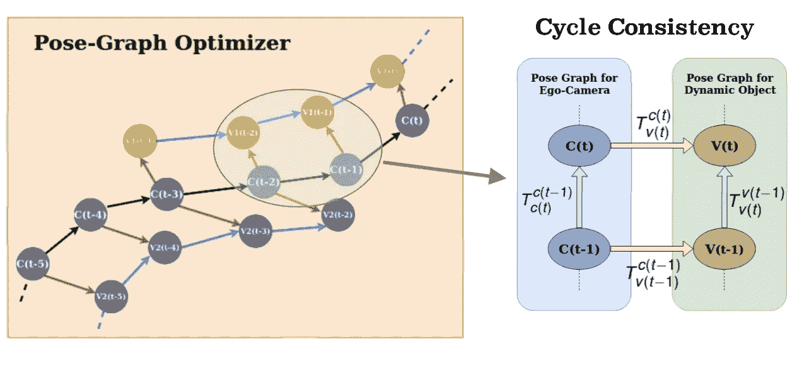****

****摄像机-物体姿态图和循环一致性([来源](https://arxiv.org/abs/2002.03528))****

****MoMoSLAM 使用不同的优化公式。如上所示，MoMoSLAM 不会指定每个错误项并将其最小化，而是会强制在姿势图中创建的每个循环保持一致。但本质上，这应该等同于最小二乘误差的最小化。****

*   ******相机点错误**:与 ORB-SLAM 相同。由于单目图像中的比例模糊，这种里程计是按比例的。然后，使用逆透视映射(IPM)将地面区域的语义分割和该区域中的点匹配用于估计 3D 深度。这固定了比例因子，并导致公制比例的里程表。****

****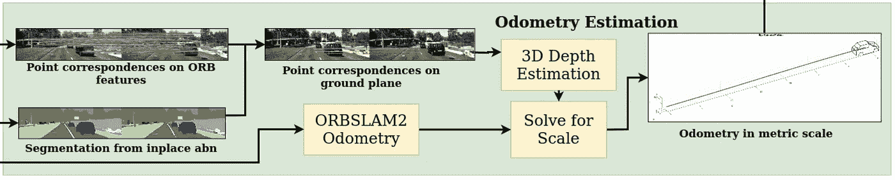****

****MoMoSLAM 的公制里程计估算([来源](https://arxiv.org/abs/2002.03528)****

*   ****多物体姿态图中的循环一致性:姿态图中的节点是*估计*，姿态图中的边是*测量。* **摄像机-摄像机边缘**通过公制比例里程计进行约束。**摄像机-车辆边缘**通过单帧 2D 限制为 3D 提升。**车辆-车辆边缘**通过两种不同的 3D 深度估计方法进行约束(IPM vs 2D-3D 提升)。注意，没有明确的运动模型。****

> ****我觉得循环一致性有点做作，尤其是车-车边缘。为 IPM 和 2D 到三维提升之间的距离估计的一致性增加一个足够的误差项会更直接。****

## ******判决******

****MoMoSLAM 用于固定单目设置的度量比例的方法非常有用。请注意，在计算里程计(相机姿态)时，不考虑对象约束。****

****[https://www.bilibili.com/video/av90800325/](https://www.bilibili.com/video/av90800325/)****

# ****外卖食品****

*   ****动态对象 SLAM 在 SLAM 的 3D 中加入了对象检测和提升，在后端优化中加入了对象的姿态和大小。****
*   ****CubeSLAM 和 ClusterVO 联合优化相机姿态和对象姿态。恒定对象大小和刚体运动的附加约束可用于约束因子图优化。这将有助于在提取的关键点稀疏的挑战性场景中计算相机姿态。相比之下，S3DOT 和 MoMoSLAM 将在 ORB-SLAM 失败时失败，因为它们依赖于 ORB-SLAM 进行相机姿态计算。****
*   ****CubeSLAM 和 S3DOT 将物体视为长方体，在自动驾驶中更加实用。虽然 ClusterVO 非常通用，但它没有在自动驾驶中纳入许多有用的先验知识，因此缺乏在 3D 对象检测中实现 SOTA 性能的潜力。****
*   ****当无法获得全球位置信息时，CubeSLAM 似乎是在自动驾驶中执行 VIO 的一个很好的候选框架。****

# ****参考****

*   ******S3DOT** : [基于立体视觉的语义三维物体和自主驾驶的自我运动跟踪](https://arxiv.org/abs/1807.02062)，ECCV 2018****
*   ****[**立方体猛击**:单目 3D 物体猛击](https://arxiv.org/abs/1806.00557)，TRO 2019****
*   ****[**ClusterVO** :对移动实例进行聚类并为自己和周围环境估计视觉里程表](https://arxiv.org/abs/2003.12980)，CVPR 2020****
*   ******MoMoSLAM** : [用于动态环境的多目标单目 SLAM](https://arxiv.org/abs/2002.03528)，IV 2020****
*   ****[**SLAM++:** 在对象层次上同时定位和绘图](https://www.doc.ic.ac.uk/~ajd/Publications/salas-moreno_etal_cvpr2013.pdf)，CVPR 2013****
*   ****[**M3D-RPN** :用于物体检测的单目 3D 区域提议网络](https://arxiv.org/abs/1907.06038)，ICCV 2019****
*   ****[利用刚体运动实现动态环境下的 SLAM](https://natanaso.github.io/rcw-icra18/assets/ref/ICRA-MRP18_paper_13.pdf)，ICRA 2018****
*   ******ST3D:** [立体三维目标跟踪的时空联合优化](https://arxiv.org/abs/2004.09305)，CVPR 2020****