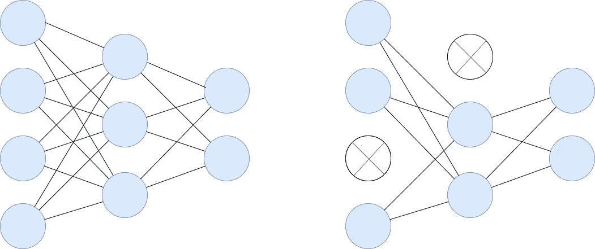
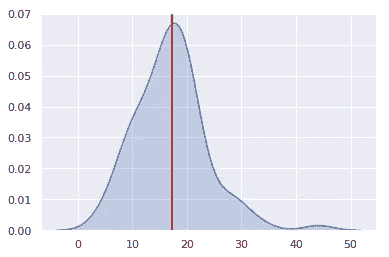

# 蒙特卡洛辍学

> 原文：<https://towardsdatascience.com/monte-carlo-dropout-7fd52f8b6571?source=collection_archive---------1----------------------->

## 用一个小技巧免费改善你的神经网络，获得模型不确定性估计作为奖励。

世上没有免费的午餐，至少根据流行的谚语是这样的。嗯，不再是了！也就是说，涉及到神经网络时就不是了。请继续阅读，看看如何用一个简单而巧妙的叫做蒙特卡洛辍学的技巧来提高网络性能。

## 拒绝传统社会的人

我们将要介绍的魔术只有在你的神经网络有漏层时才有效，所以让我们先简单介绍一下这些。辍学可以归结为在每个训练步骤中简单地关闭一些神经元。在每一步，一组不同的神经元被关闭。从数学上来说，每个神经元都有某种被忽略的概率 *p* ，称为*辍学率。*退出率通常设置在 0(无退出)和 0.5(大约 50%的神经元将被关闭)之间。确切的值取决于网络类型、图层大小以及网络过拟合训练数据的程度。

一个完整的网络(左)和在特定训练步骤中有两个神经元退出的同一个网络(右)。

但是为什么要这样做呢？放弃是一种正则化技术，也就是说，它有助于防止过度拟合。在数据很少和/或网络很复杂的情况下，模型可能会记住训练数据，因此，在训练期间看到的数据上效果很好，但在新的、看不见的数据上效果很差。这被称为过度适应，辍学寻求缓解。

怎么会？有两种方法可以理解为什么关闭模型的某些部分可能是有益的。首先，信息在网络中传播得更加均匀。想想网络中某处的单个神经元。有几个其他的神经元为它提供输入。使用 dropout，这些输入源中的每一个都可能在训练期间的任何时候消失。因此，我们的神经元不能只依赖一个或两个输入，它必须分散其权重，并注意所有的输入。因此，它对输入变化变得不太敏感，这导致模型更好地泛化。

从我们蒙特卡罗方法的角度来看，辍学效果的另一个解释甚至更重要。因为在每一次训练迭代中，你随机地对每一层中要被丢弃的神经元进行采样(根据该层的丢弃率)，所以每次都有一组不同的神经元被丢弃。因此，每次模型的架构都略有不同，您可以将结果视为许多不同神经网络的平均集合，每个神经网络仅针对一批数据进行训练。

最后一个细节:辍学仅用于培训期间。在推理时，也就是当我们用我们的网络进行预测时，我们通常不会应用任何丢弃——我们希望使用所有训练过的神经元和连接。

## 蒙特卡洛

现在我们已经解决了辍学问题，蒙特卡洛是什么？如果你正在考虑摩纳哥的一个街区，你是对的！但是还有更多。

摩纳哥蒙特卡洛。Geoff Brooks 在 [Unsplash](https://unsplash.com?utm_source=medium&utm_medium=referral) 拍摄的照片

在统计学中，蒙特卡罗指的是一类计算算法，它依靠重复的随机抽样来获得某个数字量的[分布](/6-useful-probability-distributions-with-applications-to-data-science-problems-2c0bee7cef28)。

## 蒙特卡洛退出:模型准确性

Monte Carlo Dropout 是由 [Gal & Ghahramani (2016)](https://arxiv.org/abs/1506.02142) 提出的，它巧妙的实现了常规 Dropout 的使用可以被解释为一个众所周知的概率模型:高斯过程的[贝叶斯](/the-gentlest-of-introductions-to-bayesian-data-analysis-74df448da25)近似。我们可以将许多不同的网络(剔除了不同的神经元)视为来自所有可用模型空间的蒙特卡罗样本。这为推理模型的不确定性提供了数学基础，事实证明，这通常会提高模型的性能。

它是如何工作的？我们只是在测试时应用 dropout，仅此而已！然后，不是一个预测，我们得到许多，每个模型一个。然后我们可以对它们进行平均或分析它们的分布。最好的部分是:它不需要模型架构的任何改变。我们甚至可以在已经训练好的模型上使用这个技巧！为了看到它在实践中的工作，让我们训练一个简单的网络来识别 MNIST 数据集中的数字。

经过 30 个时期的训练，该模型在测试集上取得了 96.7%的准确率。要在预测时打开 dropout，我们只需设置`training=True`来确保类似训练的行为，即丢弃一些神经元。这样，每个预测都会略有不同，我们可以生成尽可能多的预测。

让我们创建两个有用的函数:`predict_proba()`生成所需数量的`num_samples`预测，并对 MNIST 数据集中 10 位数字中的每一位的预测类概率进行平均，而`predict_class()`只是选择最高的预测概率来挑选最可能的类。这个和下面的一些代码片段是受 Geron (2019)的启发。该书附有一套优秀的 [jupyter 笔记本](https://github.com/ageron/handson-ml2)。

现在，让我们在测试集上进行 100 次预测并评估准确性。

这产生了 97.2%的准确度。**与之前的结果相比，我们将错误率从 3.3%降低到了 2.8%，降低了 15%，完全没有改变或重新训练模型！**

## 蒙特卡洛退出:预测不确定性

让我们来看看预测不确定性。在分类任务中，从 softmax 输出中获得的类概率经常被错误地解释为模型置信度。然而，[Gal&Ghahramani(2016)](https://arxiv.org/abs/1506.02142)表明，即使 softmax 输出很高，模型的预测也可能不确定。我们也可以在 MNIST 预测中看到这一点。让我们比较一下 softmax 输出和蒙特卡洛预测的单个测试示例的退出概率。

soft max _ output:`[0\. 0\. 1\. 0\. 0\. 0\. 0\. 0\. 0\. 0.]`
MC _ pred _ proba:`[0\. 0\. 0.989 0.008 0.001 0\. 0\. 0.001 0.001 0\. ]`

双方都同意测试示例最有可能来自第三类。然而，soft max 100%确定是这种情况，这应该已经提醒您有些事情不对劲了。0%或 100%的概率估计通常是危险的。蒙特卡洛辍学为我们提供了更多关于预测不确定性的信息:最有可能是第 3 类，但也有小概率是第 4 类，例如，第 5 类虽然不太可能，但仍然比第 1 类更有可能。

## 蒙特卡洛辍学:回归问题

到目前为止，我们已经讨论了一个分类任务。现在让我们来看一个回归问题，看看蒙特卡洛退出是如何为我们提供预测不确定性的。让我们使用波士顿住房数据集拟合一个回归模型来预测房价。

对于分类任务，我们定义了函数来预测类别概率和最可能的类别。同样，对于回归问题，我们需要函数来获得预测分布和点估计(让我们使用平均值)。

让我们再次对一个测试示例进行 100 次预测，并绘制它们的分布，标记其平均值，这是我们的点估计，或最佳猜测。

来自波士顿住房数据的一个测试示例的预测价格分布。红线表示平均值。

对于这个特定的测试示例，预测分布的平均值为 18，但是我们可以看到，其他值也不是不可能的—该模型对其预测不是很确定。

## 蒙特卡洛辍学:一个实施细节

最后一点:在本文中，我们一直通过将模型的`training`模式设置为`true`来实现蒙特卡洛脱离。这很有效，但是它可能会影响模型的其他部分，这些部分在训练和推断时表现不同，例如批处理规范化。为了确保我们只打开 Dropout 而不影响其他任何东西，我们应该创建一个自定义的 MonteCarloDropout 层，该层从常规 dropout 继承，并在默认情况下将其`training`参数设置为`true`(以下代码改编自 Geron (2019))。

## 结论

*   蒙特卡洛退出归结为用常规退出训练神经网络，并在推理时保持其开启。这样，我们可以为每个实例生成多个不同的预测。
*   对于分类任务，我们可以平均每个类的 softmax 输出。这往往会导致更准确的预测，从而更恰当地表达模型的不确定性。
*   对于回归任务，我们可以分析预测分布，以检查哪些值是可能的，或者使用其平均值或中值对其进行汇总。
*   Monte Carlo Dropout 很容易在 TensorFlow 中实现:它只需要在进行预测之前将模型的`training`模式设置为`true`。最安全的方法是编写一个自定义的三行类，继承常规 Dropout。

## 来源

*   Gal Y. & Ghahramani Z .，2016 年，辍学作为贝叶斯近似:表示深度学习中的模型不确定性，第 33 届机器学习国际会议论文集
*   Geron A .，2019，第二版，使用 Scikit-Learn 和 TensorFlow 进行机器学习:构建智能系统的概念、工具和技术

感谢阅读！

如果你喜欢这篇文章，为什么不订阅电子邮件更新我的新文章呢？并且通过 [**成为媒介会员**](https://michaloleszak.medium.com/membership) ，可以支持我的写作，获得其他作者和我自己的所有故事的无限访问权限。

需要咨询？你可以问我任何事情，也可以在这里 为我预约 1:1 [**。**](http://hiretheauthor.com/michal)

你也可以试试我的另外一篇文章**。不能选择？从这些中选择一个:**

** [## SVM 内核:他们实际上做什么？

### 直观的视觉解释

towardsdatascience.com](/svm-kernels-what-do-they-actually-do-56ce36f4f7b8)  [## 校准分类器

### 你确定你的模型返回概率吗？🎲

towardsdatascience.com](/calibrating-classifiers-559abc30711a)  [## 线性回归中收缩法和选择法的比较

### 详细介绍 7 种流行的收缩和选择方法。

towardsdatascience.com](/a-comparison-of-shrinkage-and-selection-methods-for-linear-regression-ee4dd3a71f16)**