# 蒙特卡罗积分和抽样方法

> 原文：<https://towardsdatascience.com/monte-carlo-integration-and-sampling-methods-25d5af53e1?source=collection_archive---------15----------------------->

## 积分近似和随机数发生器

积分是解决问题时经常使用的关键计算。对于概率任务，连续随机变量 x 的期望值由以下积分定义，其中 p(x)是 x 的概率密度函数。

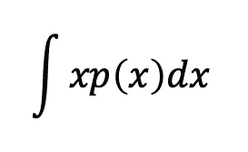

然而，用计算机计算这个值并不容易。为了有效地定义这个积分，使用了数值近似方法。在这里，我将介绍一个简单的近似方法，蒙特卡罗积分

# 蒙特卡罗积分

蒙特卡罗积分是一种数值积分计算方法，使用随机数来近似积分值。考虑下面 f(x)的期望值的计算。这里，p(x)是 x 的概率密度函数。

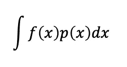

在这种方法中，我们从概率恒等函数 p(x)中选择 n 个独立同分布的样本{x_i} (i=1，2，…，n)。对于所有样本 x，积分值近似为 f(x)的平均值。

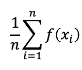

根据大数定律，当 n →∞收敛于 f(x)的期望值时，蒙特卡罗积分的一个极限。

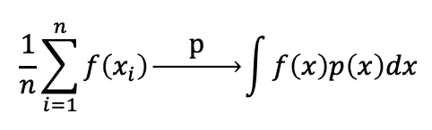

让我们用蒙特卡洛积分法计算一个***【π】***的近似值。考虑一个边长为 1 的正方形和一个单位圆，如下图所示。

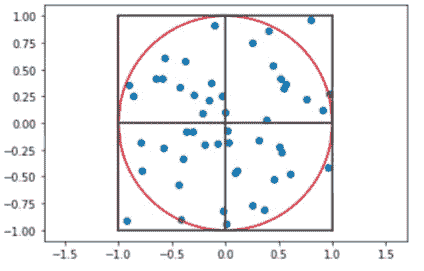

圆的面积是 ***π。现在假设 f(x，y)是一个函数，当(x，y)位于圆内时输出 1，否则输出 0。设 p(x，y)是[-1，1]上的均匀分布。在这种情况下，单位圆 ***π*** 的面积可以写成***

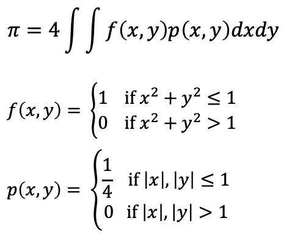

用蒙特卡罗积分，这个积分( ***π*** )可以用 p(x，y)的 i.i.d 样本来近似。n(in circle)是位于单位圆内的样本数。

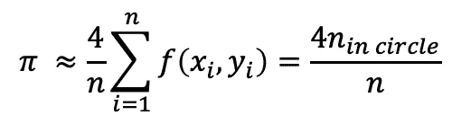

下图显示了 n 足够大时蒙特卡罗积分的收敛性。

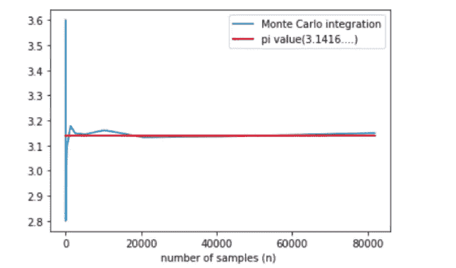

有了蒙特卡罗积分，我们可以简单地用随机数计算积分值。但是，问题是“*如何生成随机数？”*当然，如果概率分布是众所周知的，例如均匀分布、高斯分布，我们可以很容易地用一些库实现随机数生成器。如果我们必须从任何库中都没有实现的分布密度函数中生成随机数，那该怎么办？为了解决这个问题，使用了抽样方法。

# 重要性抽样

一种常用的方法是重要性抽样。在这种方法中，引入了一种代理分布来从任意分布中抽取随机数。在大多数情况下，我们选择众所周知的分布如高斯分布、均匀分布作为代理分布。这个方法的主要概念可以简单地写成下面的形式，其中 q(x)是一个代理分布。

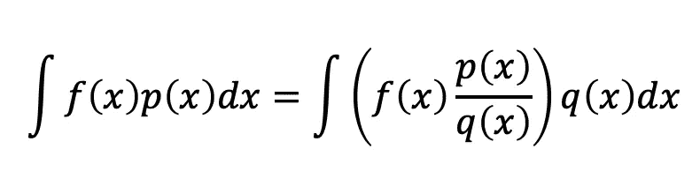

利用重要性采样，我们从代理分布 q(x)中选择 i.i.d .样本{x'_i} (i=1，2，…，n ),而不是从 p(x)中生成随机数，并通过以下计算来近似积分值。这里，p(x)/q(x)被称为抽样的*。*

*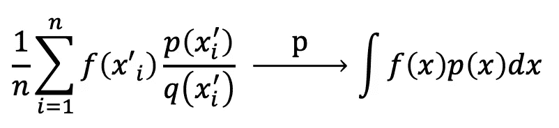*

*现在，让我们以拉普拉斯分布的方差计算为例。
考虑 f(x)=x 和一个概率密度函数 p(x)=1/2 Exp(-|x|)。具有类似 p(x)的密度函数的分布称为拉普拉斯分布。
如果我们选择均匀分布作为代理分布，拉普拉斯分布的方差可以近似计算为*

*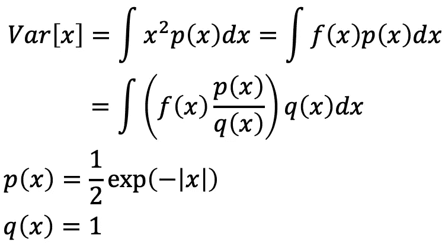**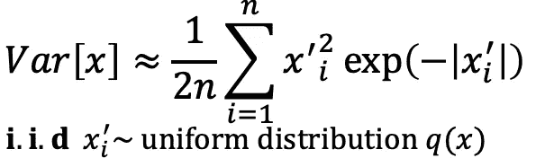*

*有了纸和铅笔，我们可以很容易地计算 Var[x]。这个计算的值是 2。现在，让我们确认重要性抽样方法的结果。*

*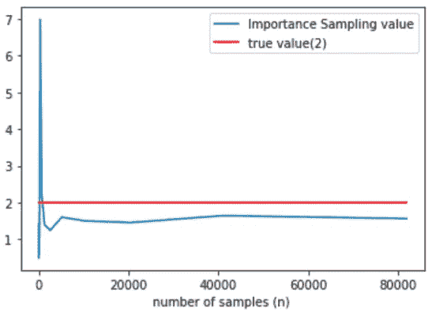*

*在重要性抽样中，我们使用从代理分布生成的随机数(样本)来近似积分值。为了从具有任何概率密度函数的分布中直接生成样本，我介绍了以下采样方法。*

# *逆变换采样*

*在逆变换采样法中，我们用一个由 1 维均匀分布生成的随机数 u 来生成任意 1 维概率密度函数 p(x)的随机数 x。在这种情况下，我们使用 p(x)的累积分布函数的反函数。如果 P(x)的累积分布函数是 p(x)，那么 u=P(x)的反函数是 x =P^-1 (u)。现在，x = P^-1 (u)有 p(x)作为[0，1]上的概率密度函数。因此，对于[0，1] {u_i} (i=1，2，…，n)上均匀分布的 n 个样本，我们可以通过计算 x_i = P^-1(u_i).来生成 p(x)分布{x_i} (i=1，2，…，n)的 n 个样本*

*再次，让我们考虑拉普拉斯分布的方差计算作为一个例子。这一次，我们使用逆变换采样方法，从拉普拉斯分布的概率密度函数直接生成随机数(样本)。有了这些随机数，我们将再次重新计算 Var[x]的近似值。*

*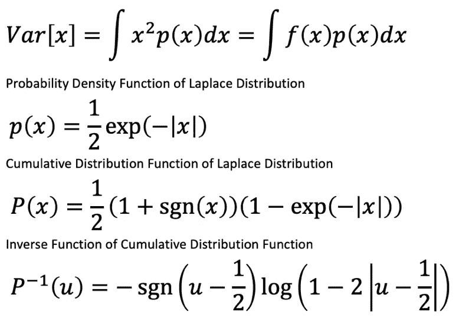*

*让我们检查这个方法的结果。*

*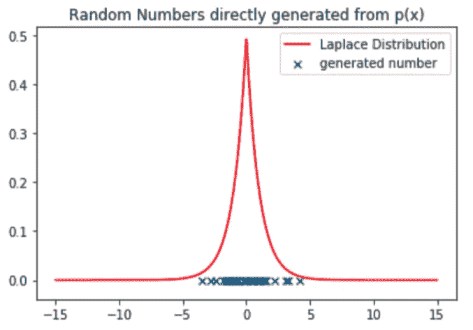*

*下图显示了使用逆变换采样方法的拉普拉斯分布方差 V[x]的近似值。*

*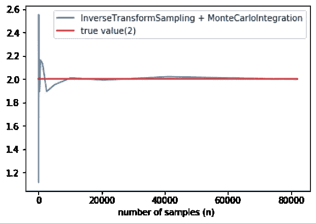*

*从这个结果可以直接看出，与代理分布的情况相比，使用从分布中直接生成的随机数提供了更好的近似。然而，利用逆变换采样方法，不可能仅从 2 维或更高维分布直接生成随机数。为此，使用了拒绝抽样方法。*

# *拒绝抽样*

*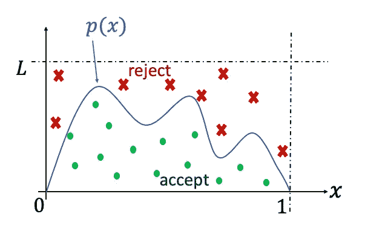*

*拒绝抽样的概念*

*拒绝抽样的思想是使用代理分布(高斯或均匀分布等。)调用 q(x)生成一个随机数并使用另一个均匀分布来评估生成的样本是否接受它为从 p(x)生成的样本。通过这种方法，我们还可以从更高维度的分布中生成随机数。*

*作为用这种方法生成随机数的准备，我们需要知道 L 的一个有限值，其中 max[p(x)/q(x)] < L. Here, q(x) is a proxy distribution.*

*   *First, we generate a random number x’ from a proxy distribution q(x). This x’ is called a ***建议点*** 。*
*   *接下来，从[0，1]上的均匀分布生成随机数 v。这个 v 将用于评估建议点，考虑从 p(x)中生成是否是好的。*
*   *如果 v ≤ p(x')/q(x ')，则 x '被接受为 p(x)生成的随机数，否则，x '被拒绝。*

*用拒绝抽样产生 *n* 随机数的算法是*

*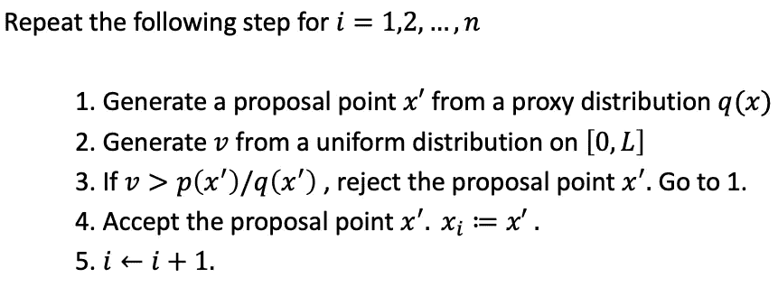*

*随机数生成和拉普拉斯分布方差计算的结果(代理分布:高斯分布)*

*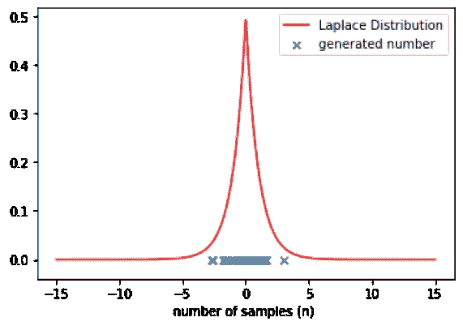**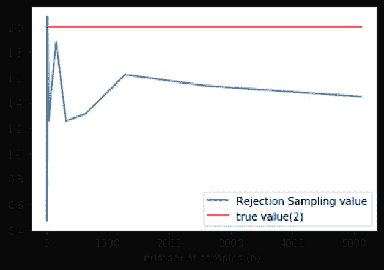*

# *马尔可夫链蒙特卡罗方法*

*在拒绝采样方法中，当不知道上边界 L 时，不可能产生随机数。MCMC 方法是解决这一问题的有效方法。MCMC 方法使用随机过程的概念(在这种情况下是马尔可夫链)。在这种情况下，第 I 个样本 x_i 的生成依赖于前一个样本 x_(i-1)。x1，x2，…，xn 用这个概念叫做马尔可夫链。这里，我介绍一种 MCMC 方法，Metropolis-Hastings 方法。*

*这种方法的过程类似于拒绝抽样。但是在这里，代理分布密度函数由条件概率 q(x|x_i)表示，并且评价指标 v 由[0，1]上的均匀分布生成。*

*   *首先，我们从代理分布 q(x|x_i)生成一个随机数 x’。这个 x '叫做一个 ***建议点*** 。*
*   *接下来，从**【0，1】**上的均匀分布生成随机数 v。这个 v 将用于评估建议点，考虑从 p(x)中生成是否是好的。*
*   *如果 v≤p(x ')q(x _ I | x ')/(p(x _ I)q(x ' | x _ I))，则 x '被接受为 p(x)生成的随机数，否则，x '被拒绝。*

*用拒绝抽样产生 *n* 个随机数的算法是*

*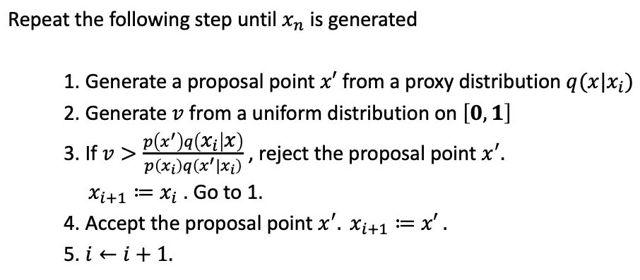*

*随机数生成和拉普拉斯分布方差计算的结果(代理分布:高斯分布)*

*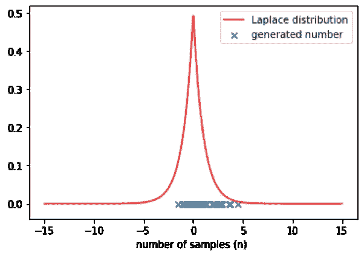**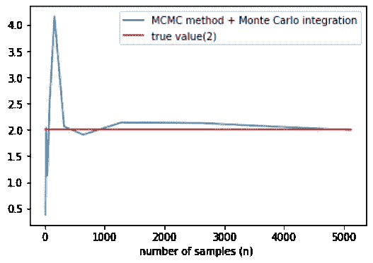*

*拉普拉斯分布的方差近似*

# *示例代码*

```
*import random
import numpy as np
from scipy.stats import norm*
```

## *用蒙特卡罗积分计算 Pi(模拟参数 n:样本数)*

```
*def f(x,y):
    if (x*x+y*y<=1):
        return 1
    else:
        return 0n = 10
N = []
P = []
while n <= 100000:
    s = np.random.uniform(-1,1,(n,2))
    nn = 0
    for x in s:
        nn+=f(x[0],x[1])

    pi = 4*nn/n
    N.append(n)
    P.append(pi)
    n = n*2*
```

## *拉普拉斯分布方差的重要抽样计算(模拟参数 n:样本数)*

```
 *def f(x):
    return x*x
def p_pdf(x):
    return 0.5*np.exp(-abs(x))
def imp_pdf(x):
    return norm.pdf(x)n = 10
N = []
P = []
while n <= 100000:
    s = np.random.normal(0,1,n)
    nn = 0
    for x in s:
        nn+=f(x)*p_pdf(x)/imp_pdf(x)

    p = nn/n
    N.append(n)
    P.append(p)
    n = n*2*
```

## *逆变换采样(随机数生成器和积分近似计算)*

```
*def sgn(x):
    if x>0:
        return 1
    elif x==0:
        return 0
    else:
        return -1

def p_laplace(x):
    return 0.5*np.exp(-abs(x))#def P_laplace_cum(x):
    #return 0.5*((1+sgn(x))(1-np.exp(-abs(x))))def P_laplace_inv(u):
    k = 1-2*abs(u-0.5)
    return -1*sgn(u-0.5)*np.log(k)# random number generatordef reverse_generator(X):
    res = []
    for u in X:
        res.append(P_laplace_inv(u))
    return res n_sample = 50
s = np.random.uniform(0,1,n_sample)
theta = reverse_generator(s)

print("n_sample = ",n_sample)
gen_xx =random.sample(theta,n_sample)
plt.scatter(gen_xx,[0]*n_sample,marker='x')
xx=np.linspace(-15,15,1000)
plt.plot(xx,[p_laplace(i) for i in xx],c='red')
plt.legend(['Laplace Distribution','generated number'])
plt.title("Random Numbers directly generated from p(x)")
plt.show()# Laplace distribution variance calculationN = []
P = []
n= 10
while n <= 100000:
    s = np.random.uniform(0,1,n)
    theta = reverse_generator(s)
    p = 0
    for x in theta:
        p += x*x
    N.append(n)
    P.append(p/n)
    n = n*2

P_r = [2]*len(N)
plt.plot(N,P)
plt.plot(N,P_r,c='red')
plt.legend(["Inverse Transform Sampling value","true value(2)"])
plt.xlabel("number of samples (n) ")
plt.show()*
```

## *拒绝采样(随机数生成器和积分近似计算)*

```
*def p_laplace(x):
    return 0.5*np.exp(-abs(x))def p_proxy(x):
    return norm.pdf(x)# random number generatordef rejection_generator(n):
    xx = np.linspace(0,1,100)
    K = max(p_laplace(xx)/p_proxy(xx))+1
    random_samples = []
    while len(random_samples) < n:
        proposal = np.random.randn()
        v = np.random.uniform(0,K)
        if v <= (p_laplace(proposal)/p_proxy(proposal)):
            random_samples.append(proposal)
    return random_samplesprint("generating...")
random_samples = rejection_generator(n=50)
print("n_sample = ",len(random_samples))
plt.scatter(random_samples,[0]*len(random_samples),marker='x')
xx=np.linspace(-15,15,1000)
plt.plot(xx,[p_laplace(i) for i in xx],c='red')
plt.legend(['true','gen'])
plt.show()# Laplace distribution variance calculationN = []
P = []
n= 10
while n <= 100000:
    theta = rejection_generator(n)
    p = 0
    for x in theta:
        p += x*x
    N.append(n)
    P.append(p/n)
    n = n*2

P_r = [2]*len(N)
plt.plot(N,P)
plt.plot(N,P_r,c='red')
plt.legend(["Rejection Sampling value","true value(2)"])
plt.xlabel("number of samples (n) ")
plt.show()*
```

## *MCMC 方法(随机数生成器和积分近似计算)*

```
*def p_laplace(x):
    return 0.5*np.exp(-abs(x))def p_proxy(x,theta,sigma):
    return norm.pdf(x,theta,sigma)def MCMC_generator(n):
    random_samples = []
    theta_i = 0
    while len(random_samples) < n:
        proposal = np.random.normal(loc=theta_i,scale=1)
        v = np.random.uniform(0,1)
        a = p_laplace(proposal)*p_proxy(theta_i,proposal,1)
        b = p_laplace(theta_i)*p_proxy(proposal,theta_i,1)
        if v <= (a/b):
            random_samples.append(proposal)
            theta_i = proposal
    return random_samplesn = 50
random_samples = MCMC_generator(n)
print("n_sample = ",n)
plt.scatter(random_samples,[0]*n,marker='x')
xx=np.linspace(-15,15,1000)
plt.plot(xx,[p_laplace(i) for i in xx],c='red')
plt.legend(['true','gen'])
plt.show()N = []
P = []
n= 10
while n <= 10000:
    theta = MCMC_generator(n=n)
    p = 0
    for x in theta:
        p += x*x
    N.append(n)
    P.append(p/n)
    n = n*2

P_r = [2]*len(N)
plt.plot(N,P)
plt.plot(N,P_r,c='red')
plt.legend(["Rejection Sampling value","true value(2)"])
plt.xlabel("number of samples (n) ")
plt.show()*
```

# *参考*

1.  *M.Yamasugi. *统计机器学习-基于生成模型的模式识别-。*2019 年，日本奥姆沙*