# 蒙特卡罗积分

> 原文：<https://towardsdatascience.com/monte-carlo-integration-db86b8d7beb3?source=collection_archive---------25----------------------->

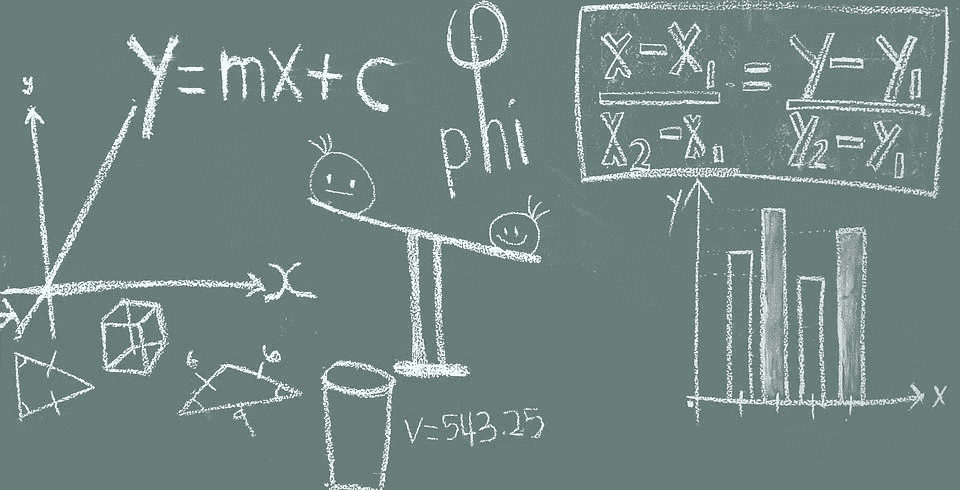

Pixabay 上由 [Pixapopz](https://pixabay.com/users/pixapopz-2873171/) 拍摄的照片

很多时候，我们不能解析地求解积分，必须求助于数值方法。其中包括蒙特卡罗积分。你可能还记得，函数的积分可以解释为函数曲线下的面积。蒙特卡罗积分的工作原理是在 a 和 b 之间的不同随机点计算一个函数，将矩形的面积相加，取和的平均值。随着点数的增加，结果越来越接近积分的实际解。

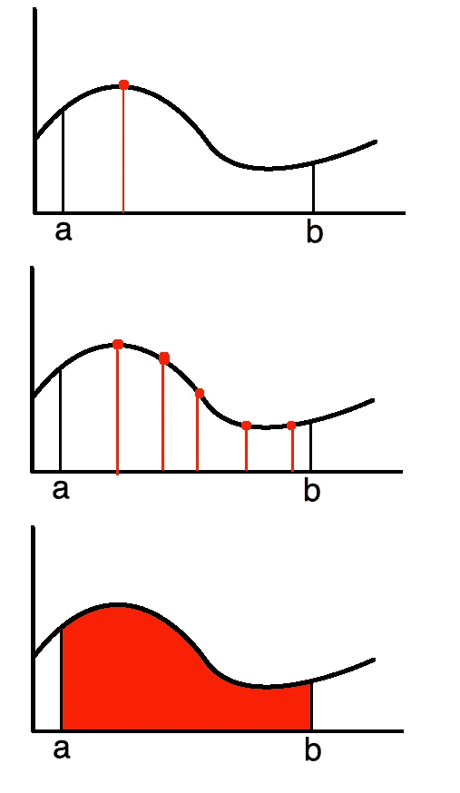

用代数表示的蒙特卡罗积分:

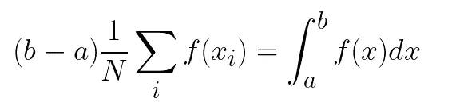

与其他数值方法相比，蒙特卡罗积分特别适合计算奇数形状的面积。

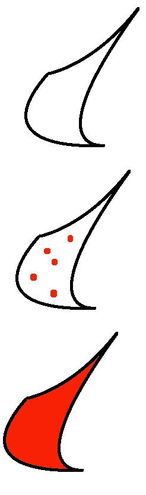

在下一节中，我们将看到当我们知道先验和似然性，但缺少归一化常数时，如何使用蒙特卡罗积分来确定后验概率。

# 简而言之贝叶斯统计

后验概率指的是贝叶公式中的一个特定项。

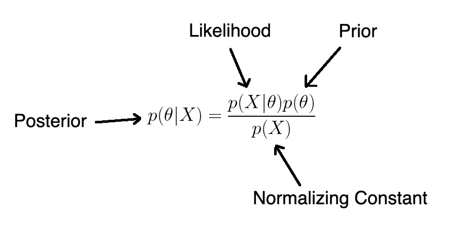

Baye 定理可以用来计算一个在特定疾病的筛选测试中测试呈阳性的人实际上患有该疾病的概率。

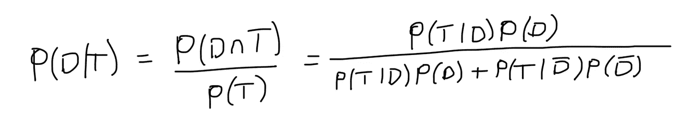

如果我们已经知道 P(A)，P(B)和 P(B|A ),但还想知道 P(A|B ),我们可以使用这个公式。例如，假设我们正在测试一种罕见的疾病，这种疾病会感染 1%的人口。医学专家已经开发了一种高度敏感和特异的测试，但还不十分完善。

*   99%的病人测试呈阳性
*   99%的健康患者测试呈阴性

贝叶斯定理告诉我们:

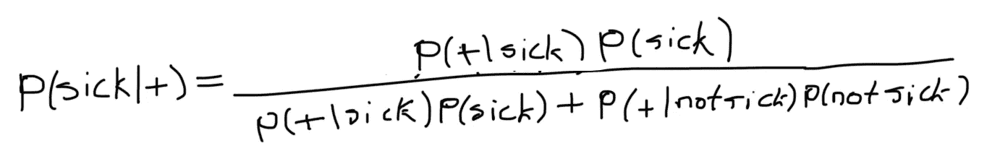

假设我们有 10，000 人，100 人生病，9，900 人健康。此外，在对所有人进行测试后，我们会让 99 名病人进行测试，但也让 99 名健康人进行测试。因此，我们会以下面的概率结束。

**p(生病)= 0.01**

**p(未患病)= 1–0.01 = 0.99**

**p(+|有病)= 0.99**

**p(+|未患病)= 0.01**

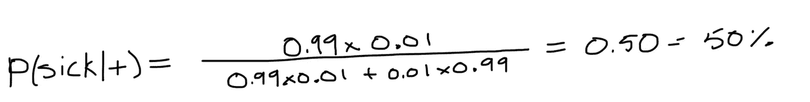

## 贝叶斯定理在概率分布中的应用

在前面的例子中，我们假设一个人生病的先验概率是一个精确到. 001 的已知量。然而，在现实世界中，认为. 001 的概率实际上如此精确是不合理的。一个特定的人生病的概率会根据他们的年龄、性别、体重等有很大的不同。一般来说，我们对给定先验概率的了解远非完美，因为它是从以前的样本中获得的(这意味着不同的总体可能给出不同的先验概率估计)。在贝叶斯统计中，我们可以用先验概率的分布来代替这个值 0.001，该分布捕获了我们对其真实值的先验不确定性。包含一个先验概率分布最终产生一个后验概率，它也不再是一个单一的量；相反，后验概率也变成了概率分布。这与传统观点相反，传统观点认为参数是固定的量。

# 归一化常数

正如我们在关于[吉布斯采样](/gibbs-sampling-8e4844560ae5)和 [Metropolis-Hasting](/monte-carlo-markov-chain-89cb7e844c75) 的文章中所看到的，当归一化常数未知时，蒙特卡罗方法可用于计算后验概率分布。

让我们首先探究一下为什么我们需要一个归一化常数。在概率论中，归一化常数是一个函数必须乘以的常数，因此其图形下的面积为 1。还不清楚？让我们看一个例子。

回想一下，正态分布的函数可以写成:

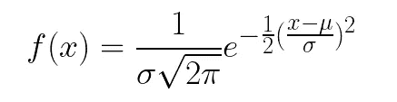

两个圆周率的平方根是归一化常数。

让我们检查一下我们是如何决定它的。我们从以下函数开始(假设均值为 0，方差为 1):

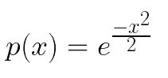

如果我们把它画出来，它会形成一个钟形曲线。

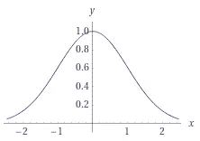

问题在于，如果我们取曲线下的面积，它就不等于 1，这是概率密度函数所要求的。因此，我们将函数除以积分结果(归一化常数)。

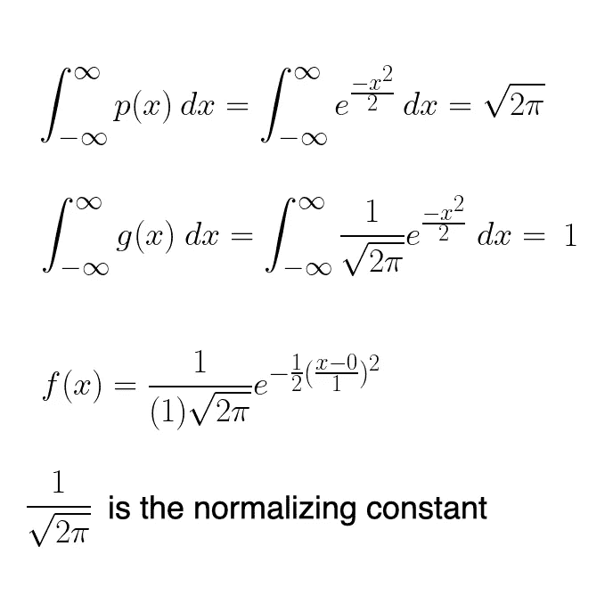

回到手头的问题，即如何在没有归一化常数的情况下计算后验概率…事实证明，对于连续的样本空间，归一化常数可以改写为:

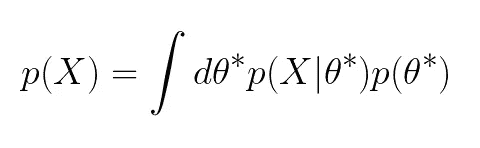

在这一点上，你应该考虑蒙特卡罗积分！

# Python 代码

让我们看看如何通过在 Python 中执行蒙特卡罗积分来确定后验概率。我们首先导入所需的库，并设置随机种子以确保结果是可重复的。

```
import os
import sys
import matplotlib.pyplot as plt
import numpy as np
import pandas as pd
import scipy.stats as stnp.random.seed(42)
```

然后，我们设置贝塔分布和二项式分布的参数值。

```
a, b = 10, 10
n = 100
h = 59
thetas = np.linspace(0, 1, 200)
```

概率密度函数的范围从 0 到 1。因此，我们可以简化方程。

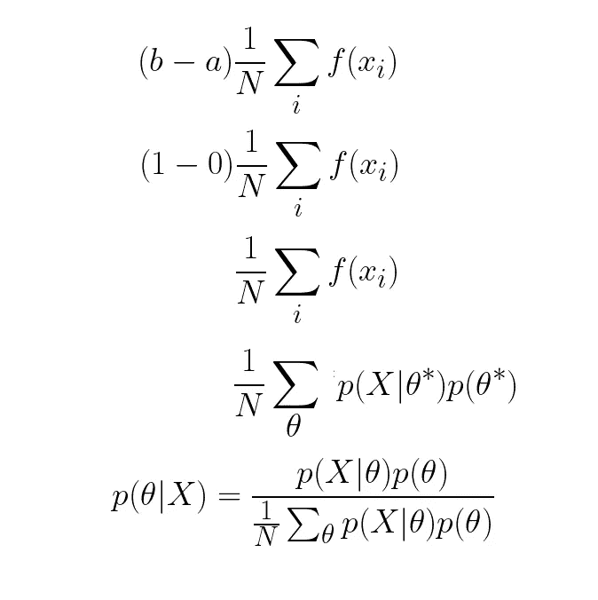

在代码中，前面的等式如下所示:

```
prior = st.beta(a, b).pdf(thetas)
likelihood = st.binom(n, thetas).pmf(h)
post = prior * likelihood
post /= (post.sum() / len(thetas))
```

最后，我们可视化的概率密度函数的先验，后验，和可能性。

```
plt.figure(figsize=(12, 9))
plt.plot(thetas, prior, label='Prior', c='blue')
plt.plot(thetas, n*likelihood, label='Likelihood', c='green')
plt.plot(thetas, post, label='Posterior', c='red')
plt.xlim([0, 1])
plt.xlabel(r'$\theta$', fontsize=14)
plt.ylabel('PDF', fontsize=16)
plt.legend();
```

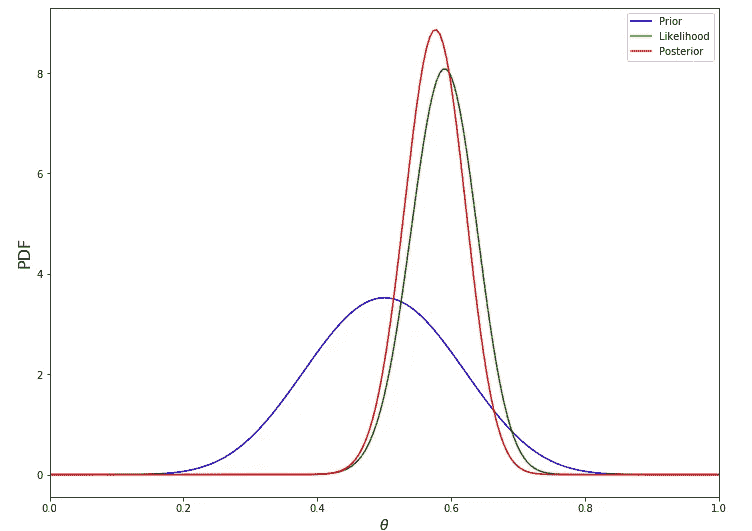

# 结论

蒙特卡罗积分是一种求解积分的数值方法。它的工作原理是在随机点评估一个函数，将这些值相加，然后计算它们的平均值。