# Python 中的蒙特卡罗集成

> 原文：<https://towardsdatascience.com/monte-carlo-integration-in-python-a71a209d277e?source=collection_archive---------6----------------------->

## 一个著名的赌场启发的数据科学，统计和所有科学的把戏。用 Python 怎么做？

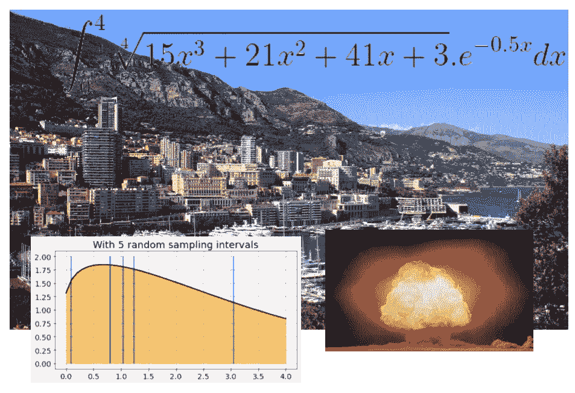

图片来源:维基百科(免费)和作者制作的拼贴画

**免责声明**:本文灵感来源于 [**佐治亚理工学院在线分析硕士(OMSA)**](https://www.gatech.edu/academics/degrees/masters/analytics-online-degree-oms-analytics) 项目学习资料。我很自豪能继续这个优秀的在线硕士项目。你也可以[在这里查看详情。](http://catalog.gatech.edu/programs/analytics-ms/#onlinetext)

# 什么是蒙特卡罗积分？

蒙特卡洛，实际上是世界著名的赌场的名字，位于摩纳哥城邦(也叫公国)的同名区，在世界著名的法国里维埃拉。

事实证明，赌场启发了著名科学家的思维，设计出一种有趣的数学技术，用于解决统计、数值计算和系统模拟中的复杂问题。

图片来源:[维基百科](https://en.wikipedia.org/wiki/Monte_Carlo#/media/File:Monaco_Monte_Carlo_1.jpg)

这项技术最早也是最著名的应用之一是在曼哈顿计划期间，当时高浓缩铀的链式反应动力学向科学家们展示了一个难以想象的复杂理论计算。即使是像约翰·冯·诺依曼、斯坦尼斯劳·乌拉姆、尼古拉斯·大都会这样的天才头脑也无法用传统的方式解决它。因此，他们转向了奇妙的随机数世界，让这些概率量驯服原本难以处理的计算。

三位一体测试:(图片来源:[维基百科](https://en.wikipedia.org/wiki/Nuclear_weapon#/media/File:Trinity_Detonation_T&B.jpg))

令人惊讶的是，这些随机变量可以解决计算问题，这阻碍了稳健的确定性方法。不确定因素实际上赢了。

就像蒙特卡洛游戏世界中的不确定性和随机性规则一样。这就是这个特殊名字的灵感来源。

图片来源: [Pixabay](https://pixabay.com/illustrations/cube-random-luck-eye-numbers-1655118/)

今天，这是一种广泛应用于各个领域的技术——

*   [金融工程风险分析](https://en.wikipedia.org/wiki/Monte_Carlo_methods_in_finance)，
*   供应链物流，
*   [医疗保健研究](https://www.beckershospitalreview.com/healthcare-information-technology/a-million-trials-in-5-minutes-how-monte-carlo-simulations-could-revolutionize-healthcare.html)，药物开发
*   统计学习和建模，
*   [计算机图形学](https://link.springer.com/chapter/10.1007/978-3-540-74496-2_8)，图像处理，[游戏设计](https://beej.us/blog/data/monte-carlo-method-game-ai/)，
*   大型系统模拟，
*   [计算物理](https://en.wikipedia.org/wiki/Monte_Carlo_method_in_statistical_physics)，天文学等。

尽管它获得了成功和名声，但它的基本思想看似简单，却很容易演示。在本文中，我们用一组简单的 Python 代码来演示它。

> 这项技术最早也是最著名的应用之一是在曼哈顿计划中

# 这个想法

## 复杂的积分

虽然一般的蒙特卡罗模拟技术在范围上要广泛得多，但我们在这里特别关注蒙特卡罗积分技术。

它只不过是一种计算复杂定积分的数值方法，缺乏封闭形式的解析解。

比方说，我们想计算，

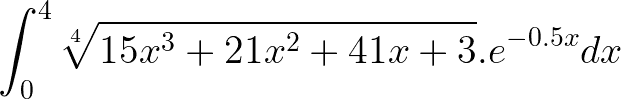

要得到这个不定形式积分的封闭解并不容易，或者完全不可能。但是**数值逼近总能给我们定积分作为和**。

这是函数的曲线。

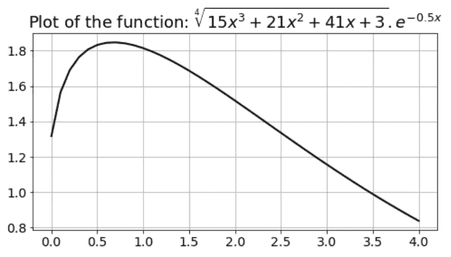

## 黎曼和

在 [**黎曼求和**](https://en.wikipedia.org/wiki/Riemann_sum) 的大类下有很多这样的技巧。这个想法只是将曲线下的区域分成小的矩形或梯形块，通过简单的几何计算来近似它们，然后将这些分量相加。

为了简单说明，我展示了这样一个只有 5 个等间距间隔的方案。

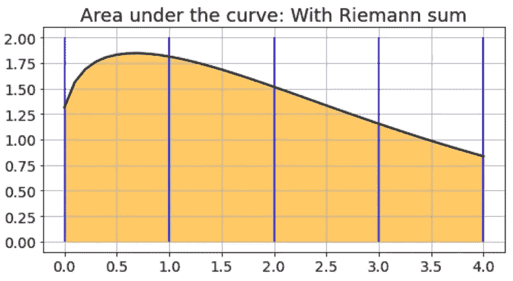

对于程序员朋友来说，其实 Scipy 包里有现成的[函数可以快速准确的做这个计算。](https://docs.scipy.org/doc/scipy/reference/generated/scipy.integrate.quad.html#scipy.integrate.quad)

## 如果我随机选择呢？

如果我告诉你，我不需要如此一致地选择区间，事实上，我可以完全随机地选择 100%的随机区间来计算相同的积分，会怎么样？

疯话？我选择的样本可能看起来像这样…

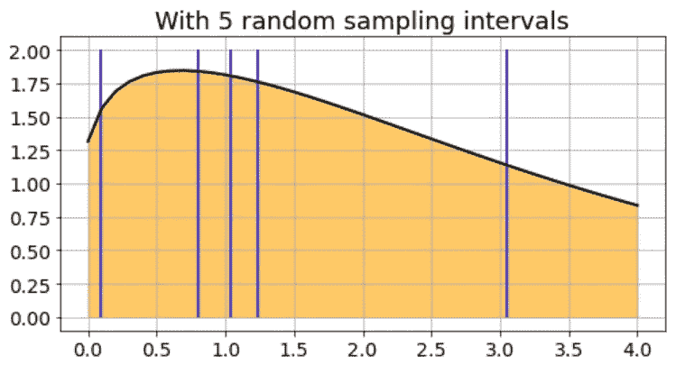

或者，这个…

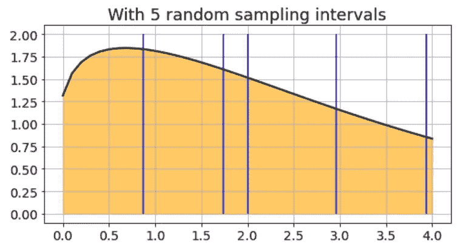

我们没有时间或范围来证明其背后的理论，但可以证明的是**通过合理的大量随机采样，我们实际上可以以足够高的精度计算积分**！

我们只需选择随机数(在两个极限之间)，在这些点上评估函数，将它们相加，然后用一个已知的因子缩放。我们完了。

好的。我们还在等什么？让我们用一些简单的 Python 代码来演示这种说法。

> 尽管它获得了成功和名声，但它的基本思想看似简单，却很容易演示。

# Python 代码

## 用简单的平均法代替复杂的数学运算

如果我们试图计算下面形式的积分——任何积分，

我们只是用下面的平均值代替积分的“估计值”,

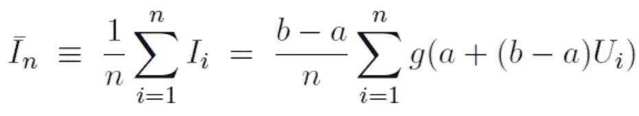

其中*表示 0 到 1 之间的均匀随机数。请注意，我们如何通过简单地将一堆数字相加并取其平均值来代替复杂的积分过程。*

*在任何现代计算系统、编程语言，甚至像 Excel 这样的商业软件包中，您都可以使用这个统一随机数生成器。查看我关于这个主题的文章，*

* [## 如何从头开始生成随机变量(不使用库)

### 我们通过一个简单的伪随机生成器算法，并显示如何使用它来生成重要的随机…

towardsdatascience.com](/how-to-generate-random-variables-from-scratch-no-library-used-4b71eb3c8dc7) 

> 我们只需选择随机数(在两个极限之间)，在这些点上评估函数，将它们相加，然后用一个已知的因子缩放。我们完了。

## 该功能

下面是一个 Python 函数，它接受另一个函数作为第一个参数、两个积分限制和一个可选整数来计算参数函数所表示的定积分。

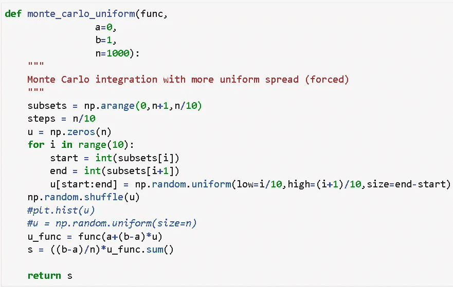

代码看起来可能与上面的等式略有不同(或者您可能在教科书中看到的另一个版本)。这是因为**我通过在 10 个时间间隔内分配随机样本来使计算更加精确**。

对于我们的具体例子，自变量函数看起来像，

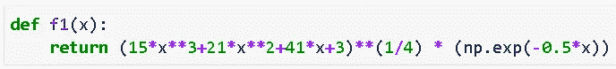

我们可以通过简单地将它传递给`monte_carlo_uniform()`函数来计算积分，

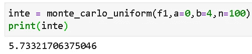

在这里，如你所见，我们在积分限值 ***a*** = 0 和 ***b*** = 4 之间随机抽取了 100 个样本。

## 计算到底有多好？

这个积分不能用解析方法计算。因此，无论如何，我们需要将蒙特卡罗方法的精度与另一种数值积分技术进行对比。我们为此选择了 Scipy `integrate.quad()`函数。

现在，您可能也在想— **随着采样密度的变化，精度会发生什么变化**。这种选择显然会影响计算速度——如果我们选择降低采样密度，我们需要增加更少的数量。

因此，我们针对一系列采样密度模拟了相同的积分，并将结果绘制在黄金标准之上——下图中以水平线表示的 Scipy 函数。

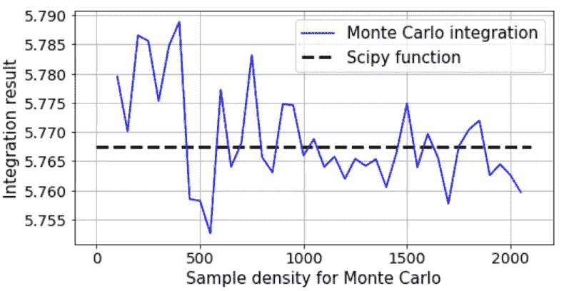

因此，我们在低样品密度阶段观察到一些小的扰动，但随着样品密度的增加，这些扰动会很好地消除。无论如何，与 Scipy 函数返回的值相比，绝对误差非常小，大约为 0.02%。

蒙特卡洛魔术非常有效！

图片来源: [Pixabay](https://pixabay.com/illustrations/gambling-roulette-game-bank-2001033/)

## 速度呢？

但是它和 Scipy 方法一样快吗？好些了吗？更糟？

我们试图通过运行 100 次循环(总共 10，000 次运行)并获得汇总统计数据来找出答案。

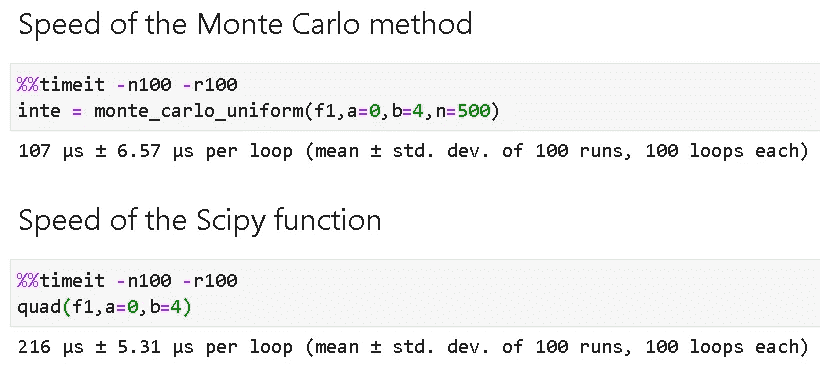

在这个特殊的例子中，蒙特卡罗计算的运行速度是 Scipy 积分方法的两倍！

虽然这种速度优势取决于许多因素，但我们可以肯定的是，在计算效率方面，**蒙特卡罗技术并不逊色。**

> 我们在低样品密度阶段观察到一些小的扰动，但随着样品密度的增加，这些扰动会很好地消除

## 冲洗，重复，冲洗，重复…

对于像蒙特卡罗积分这样的概率技术，不用说，数学家和科学家几乎从来不会只运行一次就停下来，而是多次重复计算并取平均值。

这是一个 10，000 次实验的分布图。

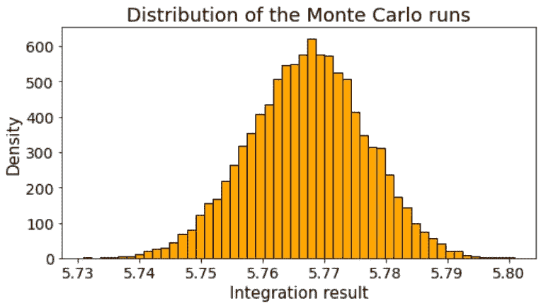

如您所见，该图几乎类似于[高斯正态分布](https://en.wikipedia.org/wiki/Normal_distribution)，这一事实不仅可以用来获得平均值，还可以围绕该结果构建 [**置信区间**](https://www.mathsisfun.com/data/confidence-interval.html) 。

 [## 置信区间

### 4±2 的区间置信区间是一个我们相当确定自己真正价值所在的数值范围…

www.mathsisfun.com](https://www.mathsisfun.com/data/confidence-interval.html) 

## 特别适用于高维积分

虽然对于我们的简单说明(以及教学目的)，我们坚持单变量积分，同样的想法可以很容易地扩展到具有多个变量的高维积分。

与基于黎曼和的方法相比，蒙特卡罗方法在这个更高的维度上表现尤为突出。可以以对蒙特卡罗方法更有利的方式优化样本密度，以使其更快，而不损害精度。

在数学上，该方法的收敛速度与维数无关。用机器学习的话来说，**蒙特卡罗方法是你在复杂的积分计算中战胜维数灾难的最好朋友**。

阅读这篇文章可以获得很好的介绍，

 [## 实践中的蒙特卡罗方法(蒙特卡罗积分)

### 蒙特卡洛方法在实践中，如果你了解和知道最重要的概率和…

www.scratchapixel.com](https://www.scratchapixel.com/lessons/mathematics-physics-for-computer-graphics/monte-carlo-methods-in-practice/monte-carlo-integration) 

> 与基于黎曼和的方法相比，蒙特卡罗方法在这个更高的维度上表现尤为突出。

# 摘要

我们介绍了蒙特卡罗积分的概念，并说明了它与传统的数值积分方法的不同。我们还展示了一组简单的 Python 代码来评估一维函数，并评估这些技术的准确性和速度。

更广泛的一类[蒙特卡罗模拟技术](https://en.wikipedia.org/wiki/Monte_Carlo_method)更令人兴奋，并且在与人工智能、数据科学和统计建模相关的领域中以无处不在的方式使用。

例如，DeepMind 的著名 Alpha Go 程序使用了蒙特卡罗搜索技术，在围棋的高维空间中计算效率高。实践中可以找到许多这样的例子。

 [## 蒙特卡洛树搜索简介:deep mind alpha go 背后的游戏规则改变算法

### 一场五局三胜的系列赛，100 万美元的奖金——一场高赌注的枪战。2016 年 3 月 9 日至 15 日之间…

www.analyticsvidhya.com](https://www.analyticsvidhya.com/blog/2019/01/monte-carlo-tree-search-introduction-algorithm-deepmind-alphago/) 

## 如果你喜欢它…

如果您喜欢这篇文章，您可能也会喜欢我关于类似主题的其他文章，

 [## 如何从头开始生成随机变量(不使用库)

### 我们通过一个简单的伪随机生成器算法，并显示如何使用它来生成重要的随机…

towardsdatascience.com](/how-to-generate-random-variables-from-scratch-no-library-used-4b71eb3c8dc7)  [## 数学编程——数据科学进步的关键习惯

### 我们展示了建立数学编程习惯的一小步，这是一个崭露头角的人的关键技能

towardsdatascience.com](/mathematical-programming-a-key-habit-to-built-up-for-advancing-in-data-science-c6d5c29533be)  [## 用 Python 实现布朗运动

### 我们展示了如何模拟布朗运动，在广泛的应用中使用的最著名的随机过程，使用…

towardsdatascience.com](/brownian-motion-with-python-9083ebc46ff0) 

*喜欢这篇文章吗？成为* [***中等成员***](https://medium.com/@tirthajyoti/membership) *继续* ***无限制学习*** *。如果你使用下面的链接，我会收到你的一部分会员费，* ***而不需要你额外付费*** *。*

 [## 通过我的推荐链接加入媒体

### 作为一个媒体会员，你的会员费的一部分会给你阅读的作家，你可以完全接触到每一个故事…

medium.com](https://medium.com/@tirthajyoti/membership)*