# 蒙特卡罗马尔可夫链

> 原文：<https://towardsdatascience.com/monte-carlo-markov-chain-89cb7e844c75?source=collection_archive---------16----------------------->


希瑟·吉尔在 [Unsplash](https://unsplash.com?utm_source=medium&utm_medium=referral) 上拍摄的照片

一个**蒙特卡罗马尔可夫链** ( **MCMC** )是一个描述一系列可能事件的模型，其中每个事件的概率只取决于前一个事件达到的状态。MCMC 有广泛的应用，其中最常见的是概率分布的近似。

让我们看一个蒙特卡罗马尔可夫链的例子。假设我们想确定晴天和雨天的概率。

我们得到了以下条件概率:

*   如果今天下雨，明天有 50%的可能是晴天。
*   如果今天下雨，明天有 50%的可能会下雨。
*   如果今天是晴天，明天有 90%的可能是晴天。
*   如果今天是晴天，明天有 10%的可能会下雨。

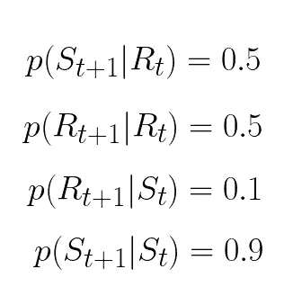

假设我们从阳光充足的州开始。然后我们进行蒙特卡罗模拟。也就是说，我们生成一个 0 到 1 之间的随机数，如果刚好在 0.9 以下，明天就是晴天，否则就是阴雨。我们又做了一次蒙特卡洛模拟，这一次，明天会下雨。我们重复该过程进行 ***n*** 次迭代。

下面的序列被称为马尔可夫链。

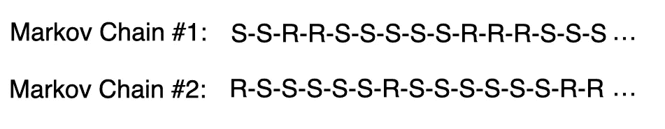

我们数出晴天的天数，除以总天数，来确定天气晴朗的概率。如果马尔可夫链足够长，即使初始状态可能不同，我们也会得到相同的边际概率。这种情况下，天晴的概率是 83.3%，下雨的概率是 16.7%。

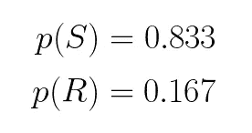

让我们看看如何用 Python 实现蒙特卡罗马尔可夫链。

我们从导入以下库开始:

```
import numpy as np
from matplotlib import pyplot as plt
import seaborn as sns
sns.set()
```

我们可以使用状态机和相应的矩阵来表达上一个例子中的条件概率。

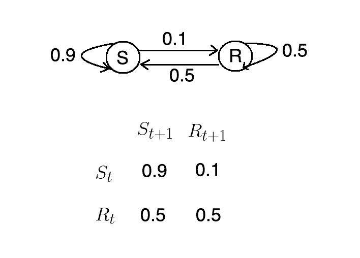

我们做一些线性代数。

```
T = np.array([[0.9, 0.1],[0.5, 0.5]])p = np.random.uniform(low=0, high=1, size=2)
p = p/np.sum(p)
q=np.zeros((100,2))for i in np.arange(0,100):
    q[i, :] = np.dot(p,np.linalg.matrix_power(T, i))
```

最后，我们绘制结果。

```
plt.plot(q)
plt.xlabel('i')
plt.legend(('S', 'R'))
```

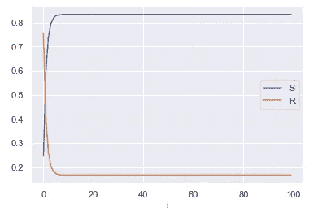

正如我们所见，天气晴朗的概率约为 0.833。同样，多雨的概率也趋向于 0.167。

# 贝叶斯公式

很多时候，我们想知道某个事件发生的概率，假设另一个事件已经发生。这可以象征性地表示为 ***p(B|A)*** 。如果两个事件不是独立的，那么这两个事件发生的概率由下面的公式表示。

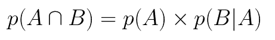

例如，假设我们从一副标准的 52 张牌中抽取两张牌。这副牌中一半是红色的，一半是黑色的。这些事件不是独立的，因为第二次抽签的概率取决于第一次。

P(A) = P(第一次抽黑牌)= 25/52 = 0.5

P(B|A) = P(第二次抽黑牌|第一次抽黑牌)= 25/51 = 0.49

利用这些信息，我们可以计算连续抽两张黑牌的概率，如下所示:

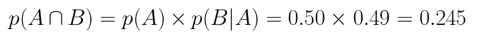

现在，让我们假设，我们想要开发一个垃圾邮件过滤器，它将根据某个单词的出现与否来将一封电子邮件分类为垃圾邮件。例如，如果一封电子邮件包含单词 ***【伟哥】*** ，我们将其归类为垃圾邮件。另一方面，如果一封电子邮件包含单词 money，那么它有 80%的可能是垃圾邮件。

根据贝叶斯定理，给定包含给定单词的电子邮件是垃圾邮件的概率为:

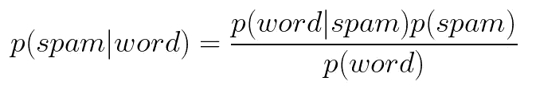

我们可能知道一封电子邮件是垃圾邮件的概率，以及一个单词包含在被分类为垃圾邮件的电子邮件中的概率。**然而，我们不知道给定的单词在电子邮件中出现的概率。这就是 Metropolis-Hastings 算法发挥作用的地方。**

# 大都会黑斯廷斯算法

Metropolis-Hasting 算法使我们能够在不知道归一化常数的情况下确定后验概率。在高层次上，Metropolis-Hasting 算法的工作方式如下:

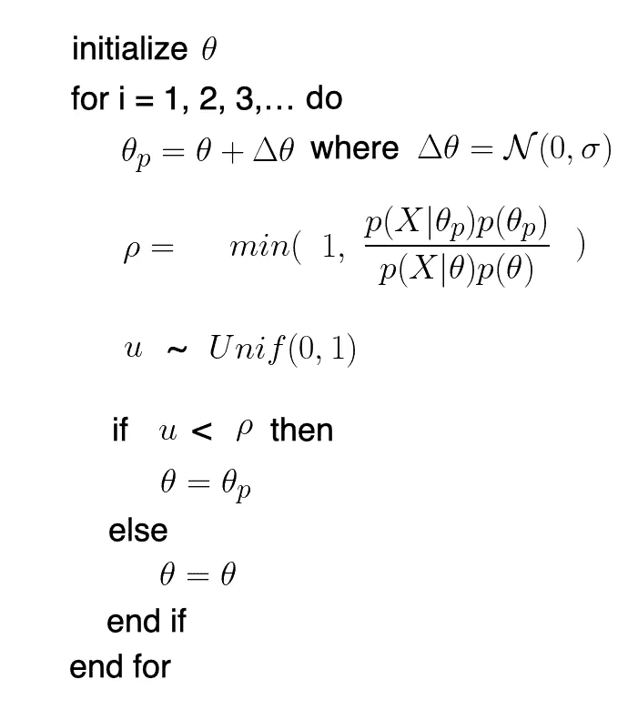

验收标准只考虑目标分布的比率，因此分母抵消。

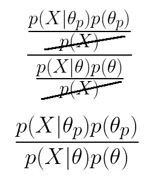

对于视觉学习者来说，让我们用一个例子来说明这个算法是如何工作的。

我们首先为θ选择一个随机的初始值。

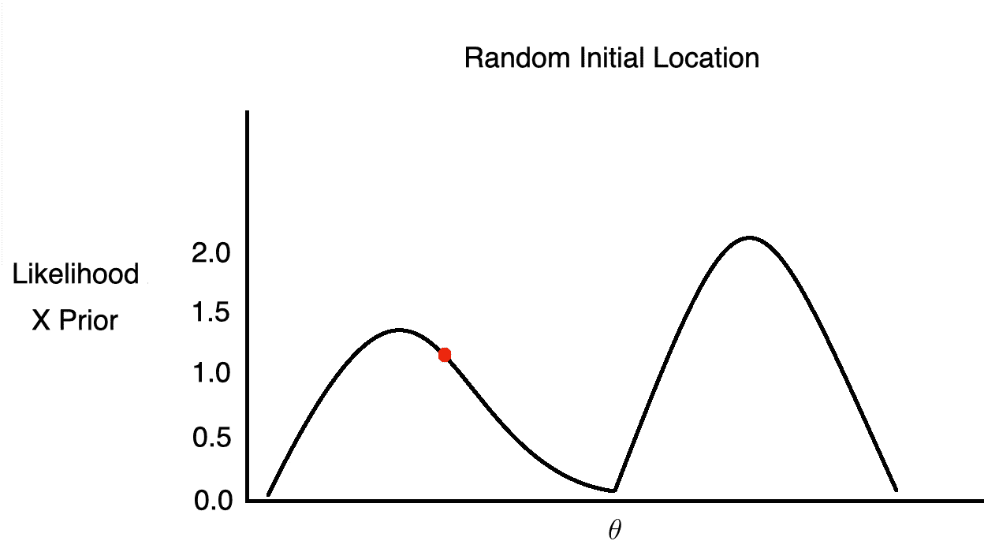

然后，我们提出一个新的θ值。

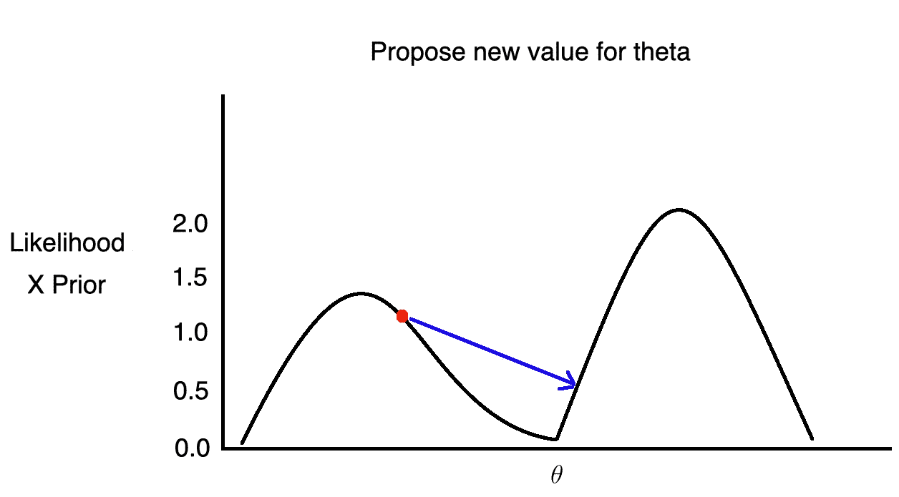

我们计算当前θ值的 PDF 和建议θ值的 PDF 之比。

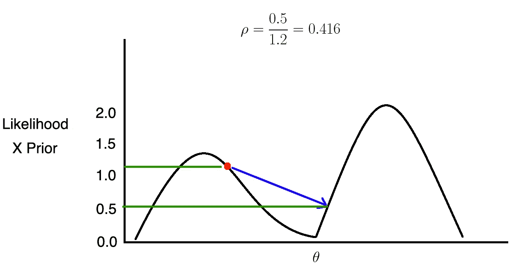

如果 rho 小于 1，那么我们以概率 ***p*** *将 theta 设置为新值。*我们通过将 rho 与从均匀分布中抽取的样本*进行比较。如果 rho 大于 ***u*** 则我们接受建议值，否则，我们拒绝它。*

*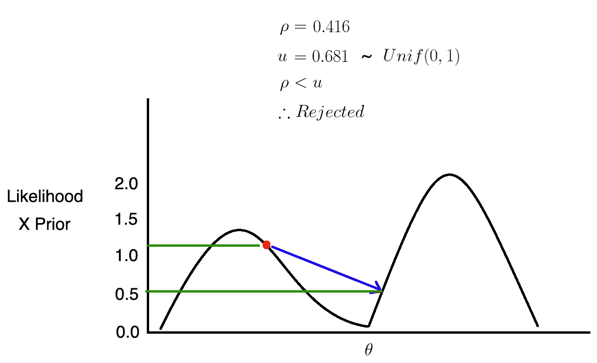*

*我们尝试不同的θ值。*

*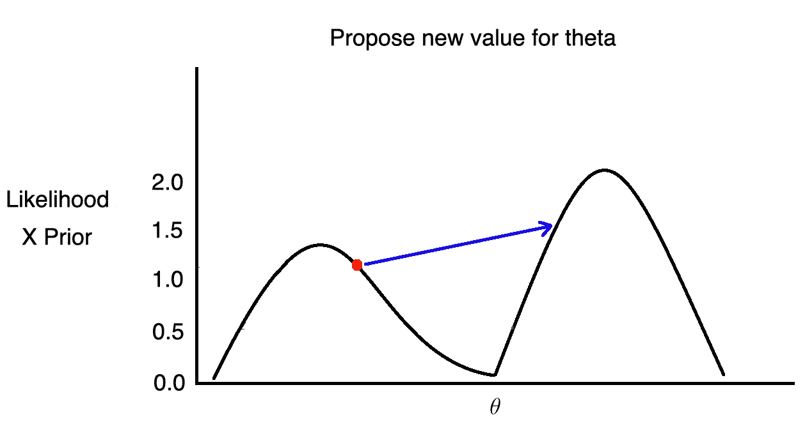*

*如果ρ大于 1，它将总是大于或等于从均匀分布中抽取的样本。因此，我们接受θ新值的建议。*

*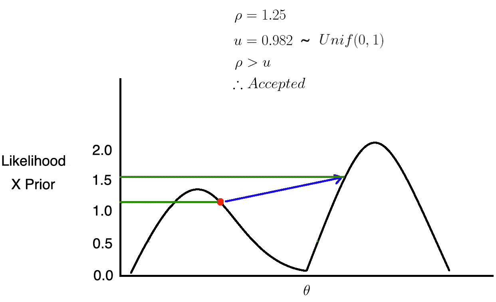**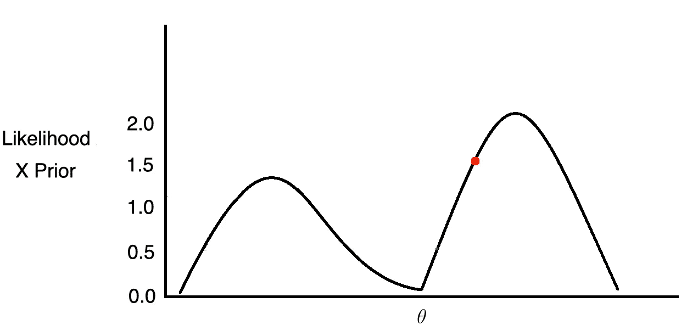*

*我们重复这个过程 ***n 次*** 次迭代。*

*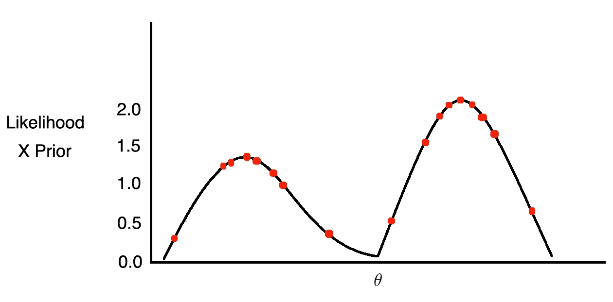*

*因为当目标分布大于当前位置时，我们自动接受提议的移动，所以θ将倾向于在目标分布更密集的地方。然而，如果我们只接受比当前位置大的值，我们会卡在其中一个峰值上。因此，我们偶尔会接受向低密度区域转移。这样，θ将被期望以这样的方式反弹，以接近后验分布的密度。*

*这些步骤实际上是一个马尔可夫链。*

*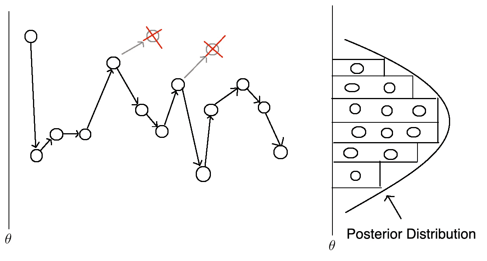*

*让我们看一下如何用 Python 实现 Metropolis-Hasting 算法，但是首先，这里有一个不同类型的发行版的快速复习。*

## *正态分布*

*在自然界中，随机现象(如智商、身高)往往遵循正态分布。正态分布有两个参数μ和适马。改变μ会移动钟形曲线，而改变适马会改变钟形曲线的宽度。*

*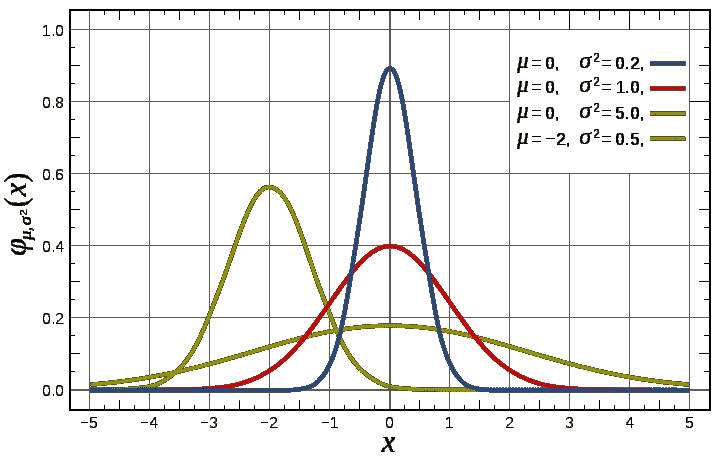*

*[https://commons . wikimedia . org/wiki/File:Normal _ Distribution _ pdf . SVG](https://commons.wikimedia.org/wiki/File:Normal_Distribution_PDF.svg)*

## *贝塔分布*

*像正态分布一样，贝塔分布有两个参数。然而，与正态分布不同，β分布的形状会根据其参数α和β的值而显著变化。*

*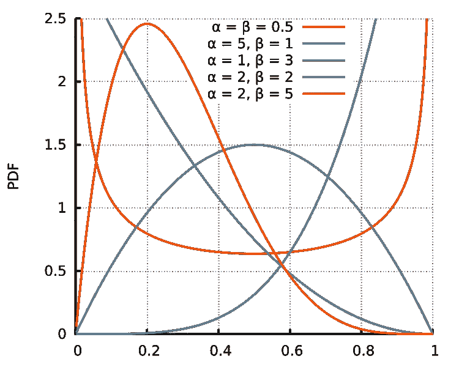*

*[https://commons . wikimedia . org/wiki/File:Beta _ distribution _ pdf . SVG](https://commons.wikimedia.org/wiki/File:Beta_distribution_pdf.svg)*

## *二项分布*

*与以高度为定义域的正态分布不同，二项式分布的定义域始终是离散事件的数量。*

*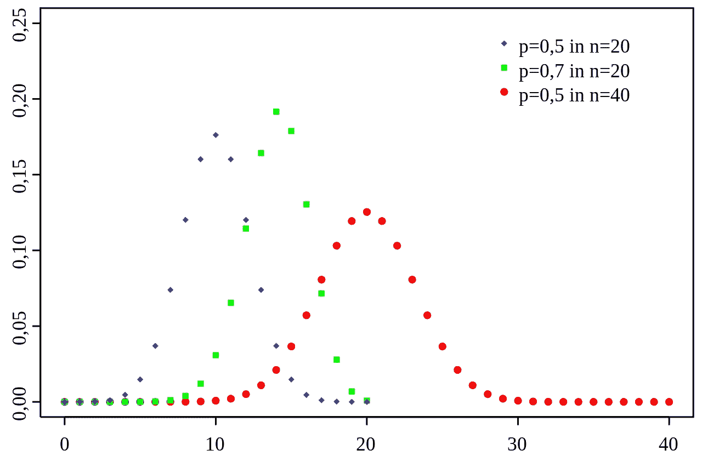*

*[https://commons . wikimedia . org/wiki/File:Binomial _ distribution _ PMF _ sl . SVG](https://commons.wikimedia.org/wiki/File:Binomial_distribution_pmf_sl.svg)*

*现在我们已经熟悉了这些概念，我们准备深入研究代码。我们从初始化超参数开始。*

```
*n = 100
h = 59
a = 10
b = 10
sigma = 0.3
theta = 0.1
niters = 10000
thetas = np.linspace(0, 1, 200)
samples = np.zeros(niters+1)
samples[0] = theta*
```

*接下来，我们定义一个函数，对于给定的θ值，该函数将返回似然和先验的乘积。*

```
*def prob(theta):
    if theta < 0 or theta > 1:
        return 0
    else:
        prior = st.beta(a, b).pdf(theta)
        likelihood = st.binom(n, theta).pmf(h)
        return likelihood * prior*
```

*我们逐步执行算法，根据前面描述的条件更新θ值。*

```
*for i in range(niters):
    theta_p = theta + st.norm(0, sigma).rvs()
    rho = min(1, prob(theta_p) / prob(theta))
    u = np.random.uniform()
    if u < rho:
        # Accept proposal
        theta = theta_p
    else:
        # Reject proposal
        pass
    samples[i+1] = theta*
```

*我们定义了可能性，以及先验和后验概率分布。*

```
*prior = st.beta(a, b).pdf(thetas)
post = st.beta(h+a, n-h+b).pdf(thetas)
likelihood = st.binom(n, thetas).pmf(h)*
```

*我们将使用 Metropolis-Hastings 算法获得的后验分布可视化。*

```
*plt.figure(figsize=(12, 9))
plt.hist(samples[len(samples)//2:], 40, histtype='step', normed=True, linewidth=1, label='Predicted Posterior');
plt.plot(thetas, n*likelihood, label='Likelihood', c='green')
plt.plot(thetas, prior, label='Prior', c='blue')
plt.plot(thetas, post, c='red', linestyle='--', alpha=0.5, label='True Posterior')
plt.xlim([0,1]);
plt.legend(loc='best');*
```

*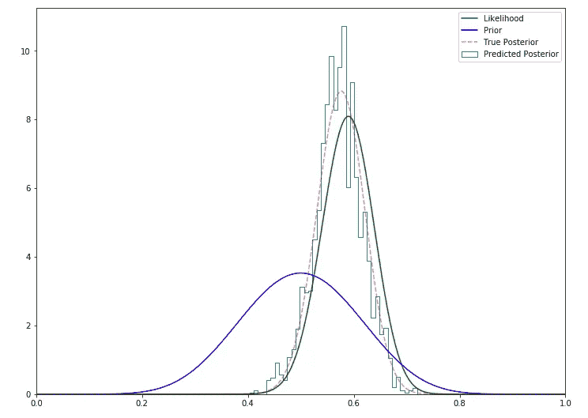*

*正如我们所看到的，Metropolis Hasting 方法在逼近实际后验分布方面做得很好。*

# *结论*

*蒙特卡洛马尔可夫链是从一组概率分布中提取的一系列事件，这些概率分布可以用来近似另一个分布。Metropolis-Hasting 算法在我们知道似然和先验，但不知道归一化常数的情况下，利用蒙特卡罗马尔可夫链来近似后验分布。*