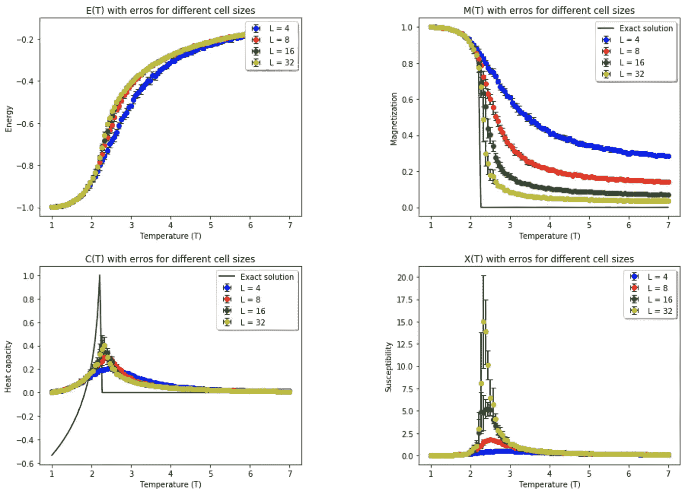

# 基于 Python 语言伊辛模型的蒙特卡罗方法在 2D 二元合金中的应用

> 原文：<https://towardsdatascience.com/monte-carlo-method-applied-on-a-2d-binary-alloy-using-an-ising-model-on-python-70afa03b172b?source=collection_archive---------6----------------------->


来源:2018 年影响因子，[高级科学新闻](https://www.advancedsciencenews.com/2018-journal-impact-factor-materials-science/)

## 使用 Python 中的蒙特卡罗方法，使用 Ising 模型评估材料的属性

诸如一片金属或玻璃样品的材料具有诸如导电性、磁化率、导热性和许多其他的物理性质。对于工业应用，必须了解这些特性，以便选择满足称重传感器要求的最佳材料或合金。例如，汽车的车身必须重量轻、承重大、耐腐蚀。为了满足所有这些需求，使用的三种主要材料是:金属、聚合物和铝合金。**但是你如何确定一个物体的属性呢？一个由几十亿几十亿个微观状态组成的物质，怎么可能计算出它的性质？**

严格来说，我们需要知道每个微观状态的能量，以便计算一种材料的性质。在本文中，我将重点介绍四个物理量:能量、磁化率、磁化强度和热容量。这些量是相互联系的，并且很好地定义了一个系统，因为它们是基本的物理属性，尽管能量是我们下面定义的所有关系的基础。但是还有一个问题:**如何模拟一种材料的行为来计算它的性质？**

由于我们受到计算机能力的限制，我们无法模拟硬件的完整行为，因为这将花费我们太多的时间，并导致我们提出一个新的问题:系统的大小应该如何接近现实？

为了回答这些问题，我将考虑 2D 二元合金作为我要研究的材料。对于我感兴趣的所有属性，我将比较不同系统大小的理论值和实验值(由模拟给出的值)。

但首先，我们将看看数学和物理学，它们为我们想要评估的不同属性建立了关系。

> 发现具有能量 E 的处于特定微观状态的系统的概率由正则分布给出:


> 𝛃 = 1/kT，k 定义为玻尔兹曼常数，t 定义为温度。z 被称为再分配函数，由下式给出:


有了这两个方程，我们可以测量任何实验参数，但一般来说，求和是不能进行的。幸运的是，发现处于能量 E 的微观状态的系统的概率 P(E)是能量 E 的精确函数。因此，我们可以得到在计算物理性质时要考虑的微观状态数的近似值。在本文中，我将展示系统的大小对物理性质计算的准确性的影响。

我之前说过，我们只对能量，磁化率，磁化强度，热容量感兴趣。有多种方法可以模拟这些性质，如*密度泛函理论(最准确的一种)、机器学习或蒙特卡罗方法。*

在这篇文章中，我决定建立一个 H=0 的伊辛 2D 模型的蒙特卡罗模拟。使用这个模型，**我能够计算 L=4、8、16 和 32 的 L×L 自旋系统的自旋磁化强度绝对值的期望值，作为温度的函数**(伊辛模型是自旋在图上的表示)。蒙特卡洛方法基于随机采样的重复(将旋转从-1 改变为 1，反之亦然)来获得新的能量值。如果总能量的值减少，我们接受新的情况，因为这意味着我们越来越接近能量最小的平衡状态。
因为用无量纲单位工作更方便，所以我用 J 单位计算了所有的能量。所有温度均以 J/k 为单位测量。

> 总系统能量的表达式为:


> 其中𝛔是自旋，可以等于-1 或 1。此外，我计算了每个温度下每个𝜒站点的磁化率。


> 这里 M 是系统的总磁化强度，T 是温度。每个位置的磁化强度由下式给出:


> 最后，每次旋转的热容 C 如下:


> 用 Tc 定义的临界温度 **ln(1 + √2) = (2J)/(k*Tc)。可以看出，热容量在临界温度下呈对数发散。这种发散在有限大小的系统中是不可见的。此外，我没有磁化率的解析解，所以我没有将模拟结果与精确结果进行比较。**

现在，数学已经完成，我们可以进入计算部分。

使用 Python，我建立了 H=0 的 2D 伊辛模型的蒙特卡罗模拟，并包含了每个物理属性的不确定性。

```
**def** init(L):
        state = 2 * np.random.randint(2, size=(L,L)) - 1
        **return** state

**def** E_dimensionless(config,L):
    total_energy = 0
    **for** i **in** range(len(config)):
        **for** j **in** range(len(config)):
            S = config[i,j]
            nb = config[(i+1)%L, j] + config[i, (j+1)%L] + config[(i-1)%L, j] + config[i, (j-1)%L]
            total_energy += -nb * S
    **return** (total_energy/4)

**def** magnetization(config):
    Mag = np.sum(config)

    **return** Mag
```

我首先初始化了我的系统，它是 LxL 自旋的平方，可以取值-1 或 1。我创建了一个计算能量的函数和另一个计算磁化强度的函数。

```
**def** MC_step(config, beta):
    *'''Monte Carlo move using Metropolis algorithm '''*
    L = len(config)
    **for** i **in** range(L):
        **for** j **in** range(L):
            a = np.random.randint(0, L) *# looping over i & j therefore use a & b*
            b = np.random.randint(0, L)
            sigma =  config[a, b]
            neighbors = config[(a+1)%L, b] + config[a, (b+1)%L] + config[(a-1)%L, b] + config[a, (b-1)%L]
            del_E = 2*sigma*neighbors
            **if** del_E < 0:
                sigma *= -1
            **elif** rand() < np.exp(-del_E*beta):
                sigma *= -1
            config[a, b] = sigma
    **return** config
```

然后我用 Metropolis 算法进行蒙特卡罗模拟。基于一个随机的初始配置，我执行了一个随机的自旋变化，并重新计算了能量。如果系统的能量减少，当我们接近平衡时，新的构型被接受。否则，如果新系统具有更高的能量，则配置以 exp()βδE 给出的概率被接受。

```
**def** calcul_energy_mag_C_X(config, L, eqSteps, err_runs):

    *# L is the length of the lattice*

    nt      = 100         *#  number of temperature points*
    mcSteps = 1000

    T_c = 2/math.log(1 + math.sqrt(2))

    *# the number of MC sweeps for equilibrium should be at least equal to the number of MC sweeps for equilibrium*

    *# initialization of all variables*
    T = np.linspace(1., 7., nt); 
    E,M,C,X = np.zeros(nt), np.zeros(nt), np.zeros(nt), np.zeros(nt)
    C_theoric, M_theoric = np.zeros(nt), np.zeros(nt)
    delta_E,delta_M, delta_C, delta_X = np.zeros(nt), np.zeros(nt), np.zeros(nt), np.zeros(nt) n1 = 1.0/(mcSteps*L*L)
    n2 = 1.0/(mcSteps*mcSteps*L*L)    *# n1 and n2 will be use to compute the mean value and the # by sites*
        *# of E and E^2*

    Energies = []
    Magnetizations = []
    SpecificHeats = []
    Susceptibilities = []
    delEnergies = []
    delMagnetizations = []
    delSpecificHeats = []
    delSusceptibilities = []

    **for** t **in** range(nt):
        *# initialize total energy and mag*
        beta = 1./T[t]
        *# evolve the system to equilibrium*
        **for** i **in** range(eqSteps):
            MC_step(config, beta)
        *# list of ten macroscopic properties*
        Ez = [], Cz = [], Mz = [], Xz = [] 

        **for** j **in** range(err_runs):
            E = E_squared = M = M_squared = 0
            **for** i **in** range(mcSteps):
                MC_step(config, beta)           
                energy = E_dimensionless(config,L) *# calculate the energy at time stamp*
                mag = abs(magnetization(config)) *# calculate the abs total mag. at time stamp*

                *# sum up total energy and mag after each time steps*

                E += energy
                E_squared += energy**2
                M += mag
                M_squared += mag**2

            *# mean (divide by total time steps)*

            E_mean = E/mcSteps
            E_squared_mean = E_squared/mcSteps
            M_mean = M/mcSteps
            M_squared_mean = M_squared/mcSteps

            *# calculate macroscopic properties (divide by # sites) and append*

            Energy = E_mean/(L**2)
            SpecificHeat = beta**2 * (E_squared_mean - E_mean**2)/L**2
            Magnetization = M_mean/L**2
            Susceptibility = beta * (M_squared_mean - M_mean**2)/(L**2)

            Ez.append(Energy); Cz.append(SpecificHeat); Mz.append(Magnetization); Xz.append(Susceptibility);

        Energy = np.mean(Ez)
        Energies.append(Energy)
        delEnergy = np.std(Ez)
        delEnergies.append(float(delEnergy))

        Magnetization = np.mean(Mz)
        Magnetizations.append(Magnetization)
        delMagnetization = np.std(Mz)
        delMagnetizations.append(delMagnetization)

        SpecificHeat = np.mean(Cz)
        SpecificHeats.append(SpecificHeat)
        delSpecificHeat = np.std(Cz)
        delSpecificHeats.append(delSpecificHeat)

        Susceptibility = np.mean(Xz)
        delSusceptibility = np.std(Xz)        
        Susceptibilities.append(Susceptibility)
        delSusceptibilities.append(delSusceptibility)

        **if** T[t] - T_c >= 0:
            C_theoric[t] = 0
        **else**:
            M_theoric[t] = pow(1 - pow(np.sinh(2*beta), -4),1/8)

        coeff = math.log(1 + math.sqrt(2))
        **if** T[t] - T_c >= 0:
            C_theoric[t] = 0
        **else**: 
            C_theoric[t] = (2.0/np.pi) * (coeff**2) * (-math.log(1-T[t]/T_c) + math.log(1.0/coeff) - (1 + np.pi/4)) 

    **return** (T,Energies,Magnetizations,SpecificHeats,Susceptibilities, delEnergies, delMagnetizations,M_theoric, 
            C_theoric, delSpecificHeats, delSusceptibilities)
```

对于每个系统尺寸(4x4、8x8、16x16、32x32)，我计算了能量、磁化强度、比热和磁化率。每个图形对应一个属性。磁化强度和比热的黑线是精确解，并且对于每种性质，已经考虑了误差估计。

执行上面的脚本后，我得到了以下结果:



# 评论

模拟说明了有限规模的概念。使用已知的𝑇𝑐和临界指数的精确结果，我们可以检查大系统的模拟结果是否实际上向热力学极限行为收敛。临界现象理论最基本的概念是关联长度，它是一个典型系统长度尺度的量度。相关长度可以根据相关函数来定义，在伊辛模型的情况下，相关函数由下式给出。相关函数在长距离上呈指数下降，由所谓的 Ornstein-Zernicke 形式给出:

**𝐶(𝑟⃗)=𝑒xp(−𝑟/𝜉)/r^(d-2/2)**

其中𝜉是相关长度。这个表达式只有当*𝑟>t13】𝜉*时才有效。相关长度𝜉对应于系统中有序畴的典型尺寸。在𝑇𝑐上方的伊辛模型中，自旋向上和自旋向下的有序畴的数量平均相等(材料失去了所有，它们的典型尺寸对应于关联长度)。在 Tc 以下，相关长度对应于相反方向自旋的有序背景中自旋畴的典型尺寸。

当接近临界点(连续相变)时，相关长度在热力学极限内根据幂律发散:**【𝜉∼𝑡^(−𝜈】**其中 t 是测量离临界点距离的降低温度:𝑡=|𝑇−𝑇𝑐|和𝜈是临界指数的一个例子。另一个重要的临界指数是决定临界点处有序开始的指数，即磁化强度。序参量在𝑇𝑐以上为零，在𝑇𝑐以下出现为: **< 𝑚 > =(𝑇𝑐−𝑇)^𝛽** 。

对于热容量，关系由下面的公式给出 **𝐶=𝑡^(−𝛼).当 t 接近𝑇𝑐.时，热容量出现一个奇点**

对于易感性，关系如下: **𝜒=𝑡^(−𝛾).随着 t 接近𝑇𝑐.，𝜒似乎出现了一个奇点因此，当 t 接近𝑇𝑐.时，系统对磁场 h 变得无限敏感**

不同系统的𝜈,𝛼,𝛽,𝛾指数集属于普适类。属于同一普适类的系统具有相同的指数。普遍性类别不依赖于与系统成分及其相互作用相关的微观细节(只要相互作用是短程的；长程相互作用可以改变普适类)，只是在系统的维数和序参量的性质上。在我们的例子中，系统的大小因此是 l。这就是为什么磁化曲线、热容和温度磁化率随着系统大小的变化而彼此不同。有限尺寸标度的基础是，当相关长度𝜒变得与系统长度 l 相当时，就会出现与无限尺寸临界行为的偏差。这些有限尺寸偏差影响其他量的方式可以通过使用相关长度作为变量来表达它们的温度依赖性来进行研究。由此， **𝑡∼𝜉^(−1/𝜈)**

例如，在磁化强度的渐近幂律形式中**<𝑚>=𝑇c^𝛽𝑡^𝛽=𝑇c^𝛽𝜉^(−𝛽/𝜈).**对于给定的系统尺寸 l，磁化强度的最大值应为 **< 𝑚 > =𝑇c^𝛽 L^(−𝛽/𝜈).**磁化强度向零的收敛取决于系统 l 的维数大小。在 2D 伊辛模型中，我们还具有以下关系 *𝛽/𝜈=1/8* 。

基于下面的表达式𝜒=𝑡^(−𝛾)，在磁化率的渐近幂律形式中，t 的替换给出了 **𝜒=𝜉^(𝛾/𝜈).**给定系统尺寸 l 的磁化率最大值应为 **𝜒=L^(𝛾/𝜈).**通过该表达式，我们可以看到𝜒的峰值随 l 快速增长，并解释了不同系统尺寸的磁化率曲线的差异。对于二维伊辛模型，我们有 *𝛾/𝜈=7/4*

关于热容量，关系非常相似，它是下面的一个 **𝐶=𝜉^(𝛼/𝜈)** 并且对于给定的系统尺寸 l，热容量的最大值应该是 **𝐶=𝜉^(𝛼/𝜈).**因此，就磁化率而言，C 的峰值随 L 快速增长，这解释了不同系统尺寸的热容图中剖面的差异。

从更定性的角度来看，我们注意到能量分布的𝑇=𝑇𝑐有一个拐点，但是磁化强度、热容量和磁化率从这个温度下降到零。这意味着系统行为的改变，这对应于临界温度的定义。事实上，临界温度是我们情况下的居里温度，居里温度是材料失去所有永久磁性的温度，这预示着材料行为的变化。永久磁性是由磁矩的排列引起的。因此，在𝑇𝑐上方，平均有相等数量的有序的向上和向下自旋的畴，这可以通过磁矩、比热和磁化率向零的收敛来说明。

因此，**结果的准确性和系统的大小之间的关系取决于我们正在检查的相关性**。但是系统规模越大，计算成本越高。因此，由于时间成本非常重要，我们需要考虑权衡:时间/成本/精度。这就是为什么我想知道每个属性对系统大小的依赖性。我所理解的是，对于能量，我们可以用最小的系统规模来执行我们的模拟，并且结果将是可用的，因为能量对系统规模的依赖是指数的。对于系统规模越大、结果越精确的其他属性，这一点不再适用。尽管如此，我们仍然可以通过增加 32×32 系统大小达到平衡所需的步骤数来改进我们的结果。

如果你喜欢阅读这样的故事，并想支持我成为一名作家，考虑注册成为一名灵媒成员。每月 5 美元，你可以无限制地阅读媒体上的故事。如果你使用[我的链接](http://If you enjoy reading stories like these and want to support me as a writer consider signing up to become a Medium member. It's $5 a month, giving you unlimited access to stories on Medium. If you sign up using my link, I will earn a small commission and you will still pay $5\. Thank you !! https://medium.com/@jonathan_leban/membership)注册，我将赚取一小笔佣金，你仍需支付 5 美元。谢谢大家！！

[](https://medium.com/@jonathan_leban/membership) [## 通过我的推荐链接加入媒体-乔纳森·莱班

### 阅读乔纳森·莱班的每一个故事(以及媒体上成千上万的其他作家)。您的会员费直接支持…

medium.com](https://medium.com/@jonathan_leban/membership) 

*PS:我现在是柏克莱大学的工程硕士，如果你想讨论这个话题，请随时联系我。* [*这里的*](http://jonathan_leban@berkeley.edu) *是我的邮箱。*